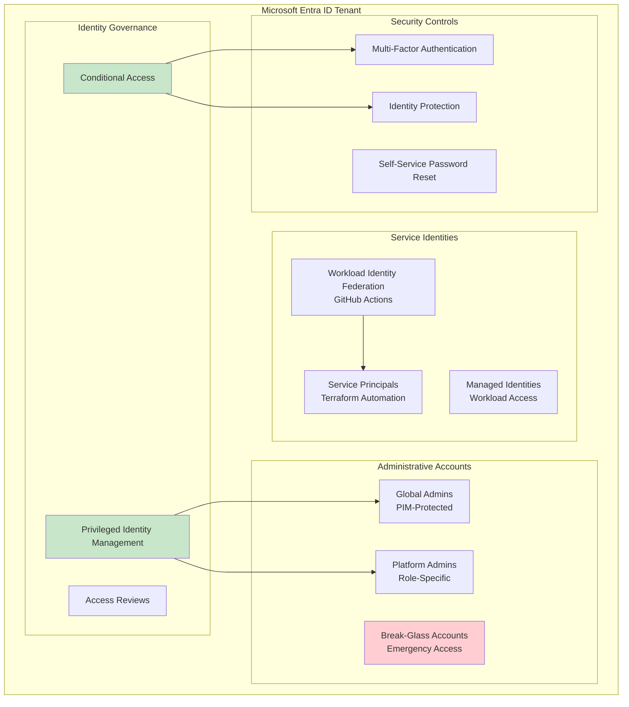
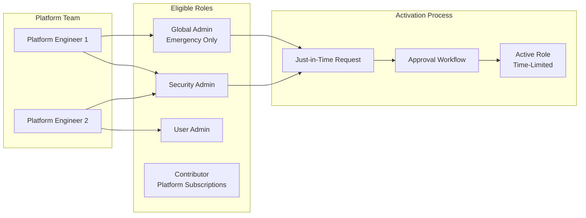
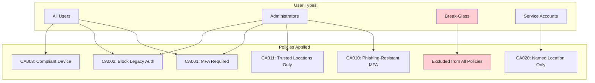
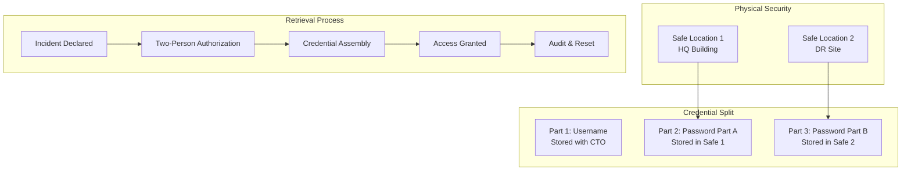
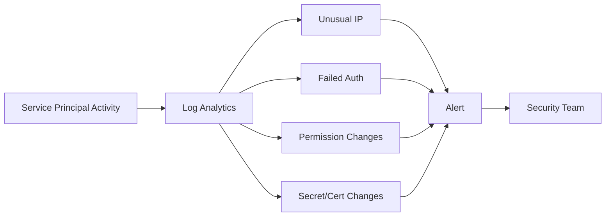

# Identity Landing Zone

> **Related:** [README](./README.md) | [Management Landing Zone](./02-management-landing-zone.md) | [Compliance Baseline](./08-compliance-baseline.md)

## Table of Contents

1. [Overview](#overview)
2. [Architecture](#architecture)
3. [Microsoft Entra ID Tenant Configuration](#microsoft-entra-id-tenant-configuration)
4. [Privileged Identity Management (PIM)](#privileged-identity-management-pim)
5. [Conditional Access Policies](#conditional-access-policies)
6. [Break-Glass Emergency Access Accounts](#break-glass-emergency-access-accounts)
7. [Service Principal Governance](#service-principal-governance)
8. [Access Reviews](#access-reviews)
9. [Identity Diagnostic Settings](#identity-diagnostic-settings)
10. [Compliance Mapping](#compliance-mapping)
11. [References](#references)

---

## Overview

The Identity Landing Zone establishes the security foundation for your Azure tenant. This document covers Microsoft Entra ID configuration, privileged access management, and identity governance aligned with SOC 2 Type II and ISO 27001 requirements.

## Architecture



## Microsoft Entra ID Tenant Configuration

### Tenant Setup Checklist

| Task | Priority | SOC 2 Control | Notes |
|------|----------|---------------|-------|
| Enable Security Defaults or Conditional Access | Day 1 | CC6.1 | Disable Security Defaults if using CA |
| Configure company branding | Day 1 | — | Professional login experience |
| Enable self-service password reset | Day 1 | CC6.1 | Reduce helpdesk burden |
| Configure password protection | Day 1 | CC6.1 | Ban common passwords |
| Enable Entra ID Identity Protection | Day 1 | CC6.1, CC6.8 | Risk-based policies |
| Configure diagnostic settings | Day 1 | CC7.2 | Send logs to Log Analytics |

### Tenant Settings Specification

```yaml
# Illustrative configuration - not executable
tenant_settings:
  authentication:
    password_protection:
      mode: "Enforced"
      enable_on_premises: false  # Cloud-only tenant
      banned_password_list:
        - "CompanyName123"
        - "Password123"
        - "Welcome1"
    
    self_service_password_reset:
      enabled: true
      authentication_methods: 2
      methods_available:
        - "mobilePhone"
        - "email"
        - "microsoftAuthenticator"
    
    mfa_registration:
      enabled: true
      target_groups: "All Users"
      
  security:
    identity_protection:
      user_risk_policy:
        enabled: true
        risk_level: "medium"
        action: "require_password_change"
      sign_in_risk_policy:
        enabled: true
        risk_level: "medium"
        action: "require_mfa"
```

## Privileged Identity Management (PIM)

PIM provides just-in-time (JIT) access to administrative roles, reducing the attack surface by eliminating standing privileged access.

### PIM-Protected Roles

| Role | Max Duration | Require Approval | Require Justification | MFA on Activation |
|------|--------------|------------------|----------------------|-------------------|
| Global Administrator | 2 hours | Yes | Yes | Yes |
| Privileged Role Administrator | 4 hours | Yes | Yes | Yes |
| Security Administrator | 8 hours | No | Yes | Yes |
| User Administrator | 8 hours | No | Yes | Yes |
| Billing Administrator | 4 hours | Yes | Yes | Yes |
| Application Administrator | 8 hours | No | Yes | Yes |

### PIM Configuration

```yaml
# Illustrative PIM settings
pim_role_settings:
  global_administrator:
    activation:
      max_duration_hours: 2
      require_mfa: true
      require_justification: true
      require_ticket_info: true
      require_approval: true
      approvers:
        - group: "PIM-Approvers-GlobalAdmin"
    assignment:
      allow_permanent_eligible: false
      expire_eligible_after_days: 90
      allow_permanent_active: false  # No standing access
    notification:
      notify_on_activation: true
      notify_on_assignment: true
      recipients:
        - "security-team@company.com"
        
  security_administrator:
    activation:
      max_duration_hours: 8
      require_mfa: true
      require_justification: true
      require_approval: false  # Self-service for SecOps
    assignment:
      allow_permanent_eligible: true
      expire_eligible_after_days: 180
```

### PIM Assignment Strategy



## Conditional Access Policies

### Policy Framework

Conditional Access policies are organized into tiers based on risk and user population:

| Tier | Scope | Purpose |
|------|-------|---------|
| **Foundation** | All users | Baseline security controls |
| **Identity Protection** | All users | Risk-based controls |
| **Privileged Access** | Admins only | Enhanced controls for admins |
| **Application-Specific** | Specific apps | Granular app controls |

### Foundation Policies

#### CA001: Require MFA for All Users

| Setting | Value |
|---------|-------|
| **Name** | CA001-Foundation-RequireMFA-AllUsers |
| **State** | On |
| **Users** | All users |
| **Exclude** | Break-glass accounts, Service accounts group |
| **Cloud Apps** | All cloud apps |
| **Conditions** | None |
| **Grant** | Require multifactor authentication |

#### CA002: Block Legacy Authentication

| Setting | Value |
|---------|-------|
| **Name** | CA002-Foundation-BlockLegacyAuth |
| **State** | On |
| **Users** | All users |
| **Exclude** | None |
| **Cloud Apps** | All cloud apps |
| **Conditions** | Client apps = Exchange ActiveSync, Other clients |
| **Grant** | Block access |

#### CA003: Require Compliant Device for Office 365

| Setting | Value |
|---------|-------|
| **Name** | CA003-Foundation-RequireCompliantDevice-O365 |
| **State** | On (Day 2) |
| **Users** | All users |
| **Exclude** | Break-glass accounts |
| **Cloud Apps** | Office 365 |
| **Conditions** | Device platforms = Windows, macOS, iOS, Android |
| **Grant** | Require device to be marked as compliant |

### Privileged Access Policies

#### CA010: Require Phishing-Resistant MFA for Admins

| Setting | Value |
|---------|-------|
| **Name** | CA010-Admins-RequirePhishingResistantMFA |
| **State** | On |
| **Users** | Directory roles (all admin roles) |
| **Exclude** | Break-glass accounts |
| **Cloud Apps** | All cloud apps |
| **Grant** | Require authentication strength = Phishing-resistant MFA |

#### CA011: Block Admin Access from Untrusted Locations

| Setting | Value |
|---------|-------|
| **Name** | CA011-Admins-BlockUntrustedLocations |
| **State** | On |
| **Users** | Directory roles (all admin roles) |
| **Exclude** | Break-glass accounts |
| **Cloud Apps** | All cloud apps |
| **Conditions** | Locations = All locations EXCEPT trusted |
| **Grant** | Block access |

### Named Locations

| Name | Type | Configuration |
|------|------|---------------|
| Corporate Office | IP ranges | Office IP addresses |
| Trusted Countries | Countries | Countries where employees work |
| Azure Datacenter IPs | IP ranges | Azure service IPs (for automation) |

### Conditional Access Policy Matrix



## Break-Glass Emergency Access Accounts

Break-glass accounts provide emergency access when all other authentication methods fail. These accounts must be carefully protected and monitored.

### Account Configuration

| Attribute | Account 1 | Account 2 |
|-----------|-----------|-----------|
| **UPN** | `emergency-bg1@tenant.onmicrosoft.com` | `emergency-bg2@tenant.onmicrosoft.com` |
| **Display Name** | Emergency Access 1 | Emergency Access 2 |
| **Account Type** | Cloud-only | Cloud-only |
| **Role** | Global Administrator (permanent) | Global Administrator (permanent) |
| **MFA** | Excluded from CA | FIDO2 key (optional) |
| **Password** | 32+ characters, randomly generated | 32+ characters, randomly generated |
| **Password Expiry** | Never | Never |

### Credential Storage



### Monitoring and Alerting

Break-glass account usage must trigger immediate alerts:

```yaml
# Log Analytics alert query
break_glass_alert:
  query: |
    SignInLogs
    | where UserPrincipalName startswith "emergency-bg"
    | project TimeGenerated, UserPrincipalName, IPAddress, 
              Location, ResultType, AppDisplayName
  frequency: "5 minutes"
  severity: "Critical"
  action_group: "SecurityIncident"
  notifications:
    - email: "security-team@company.com"
    - sms: "+1-555-0100"
    - teams_channel: "Security Incidents"
```

### Testing Procedure

| Frequency | Test Activity | Owner |
|-----------|--------------|-------|
| Quarterly | Verify account can sign in | Security Team |
| Quarterly | Verify alerts trigger | Security Team |
| Annually | Full DR scenario test | Platform Team |
| On change | Verify after any CA policy change | Platform Team |

## Service Principal Governance

### Service Principal Strategy

| Purpose | Identity Type | Authentication | Lifetime |
|---------|--------------|----------------|----------|
| Terraform automation | App Registration | Workload Identity Federation | Permanent |
| GitHub Actions | App Registration | Workload Identity Federation | Permanent |
| Application workloads | Managed Identity | Azure-managed | Resource lifecycle |
| Third-party integrations | App Registration | Client Secret | 1 year max |

### Terraform Automation Service Principal

```yaml
# Service Principal configuration
terraform_service_principal:
  display_name: "sp-terraform-platform"
  
  roles:
    tenant_level:
      - role: "Management Group Contributor"
        scope: "/providers/Microsoft.Management/managementGroups/company-root"
    subscription_level:
      - role: "Owner"
        scope: "/subscriptions/{platform-connectivity-sub}"
      - role: "Owner"
        scope: "/subscriptions/{platform-management-sub}"
      - role: "Owner"
        scope: "/subscriptions/{platform-identity-sub}"
  
  workload_identity_federation:
    - name: "github-actions-main"
      issuer: "https://token.actions.githubusercontent.com"
      subject: "repo:company/platform-landing-zones:ref:refs/heads/main"
      audiences: ["api://AzureADTokenExchange"]
    - name: "github-actions-pr"
      issuer: "https://token.actions.githubusercontent.com"
      subject: "repo:company/platform-landing-zones:pull_request"
      audiences: ["api://AzureADTokenExchange"]
```

### Service Principal Monitoring



## Access Reviews

### Review Configuration

| Review Type | Scope | Frequency | Reviewers | Auto-Apply |
|-------------|-------|-----------|-----------|------------|
| PIM Role Eligibility | All PIM roles | Quarterly | Role owners | No |
| Guest Users | All guests | Monthly | Sponsors | Yes (remove) |
| Application Access | Critical apps | Quarterly | App owners | No |
| Group Membership | Security groups | Quarterly | Group owners | No |

## Identity Diagnostic Settings

All Entra ID logs must be sent to the central Log Analytics workspace:

| Log Type | Destination | Retention |
|----------|-------------|-----------|
| Sign-in logs | Log Analytics + Storage | 2 years |
| Audit logs | Log Analytics + Storage | 2 years |
| Provisioning logs | Log Analytics | 90 days |
| Risky users | Log Analytics | 90 days |
| Risk detections | Log Analytics | 90 days |

## Compliance Mapping

| Control | SOC 2 | ISO 27001 | Implementation |
|---------|-------|-----------|----------------|
| Unique user identification | CC6.1 | A.9.2.1 | Entra ID user accounts |
| MFA enforcement | CC6.1 | A.9.4.2 | Conditional Access policies |
| Privileged access management | CC6.2 | A.9.2.3 | PIM configuration |
| Emergency access | CC6.1 | A.9.2.3 | Break-glass accounts |
| Access reviews | CC6.2 | A.9.2.5 | Entra ID Access Reviews |
| Audit logging | CC7.2 | A.12.4.1 | Diagnostic settings |

## References

- [Microsoft Entra ID documentation](https://learn.microsoft.com/entra/identity/)
- [Privileged Identity Management](https://learn.microsoft.com/entra/id-governance/privileged-identity-management/)
- [Conditional Access policies](https://learn.microsoft.com/entra/identity/conditional-access/)
- [Emergency access accounts](https://learn.microsoft.com/entra/identity/role-based-access-control/security-emergency-access)
- [Workload identity federation](https://learn.microsoft.com/entra/workload-id/workload-identity-federation)

---

**Next:** [02 - Management Landing Zone](./02-management-landing-zone.md) | **Related:** [08 - Compliance Baseline](./08-compliance-baseline.md)
