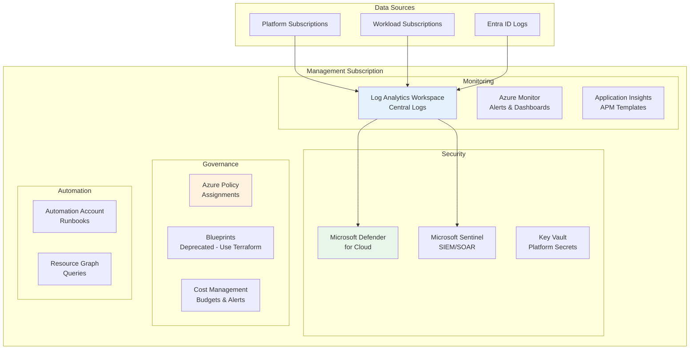
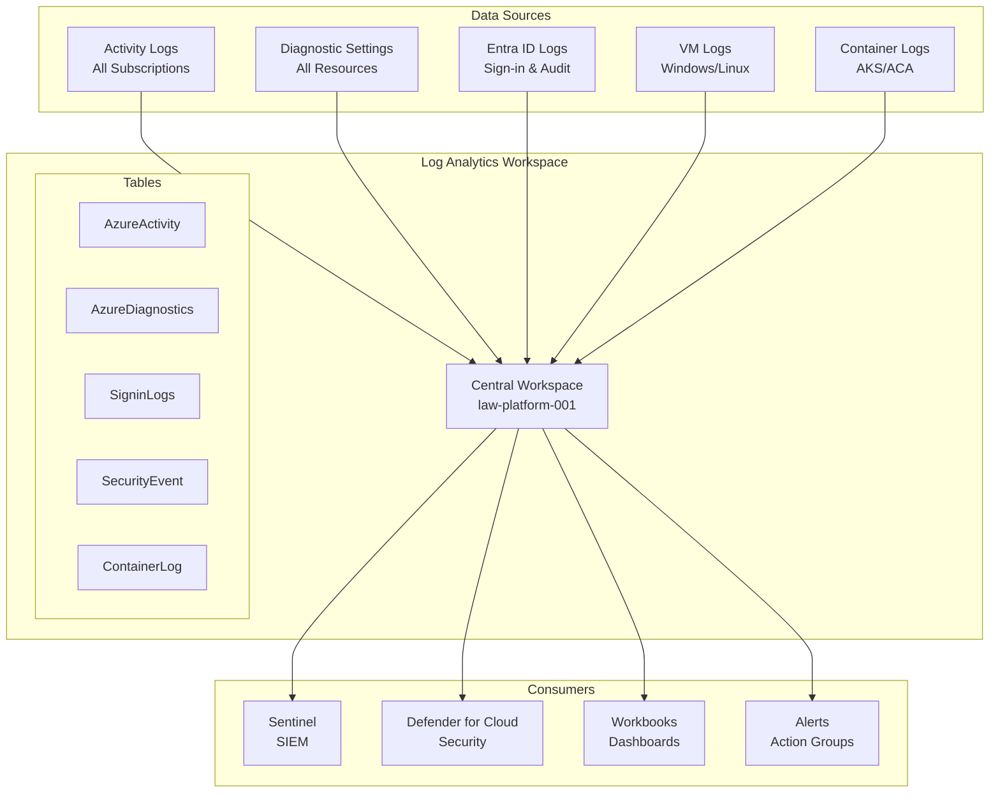
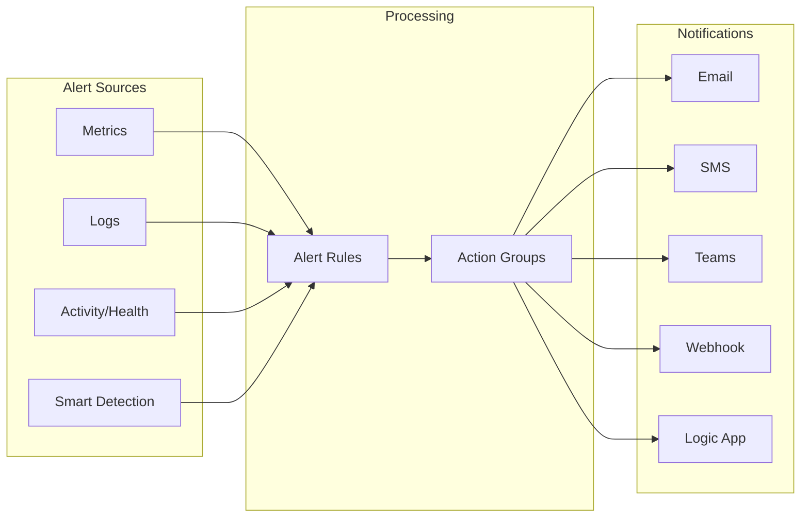
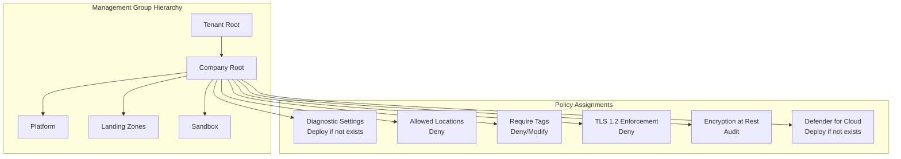
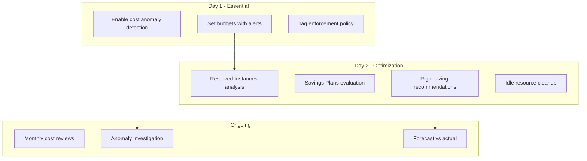

# Management Landing Zone

> **Related:** [README](./README.md) | [Identity Landing Zone](./01-identity-landing-zone.md) | [Compliance Baseline](./08-compliance-baseline.md)

## Table of Contents

1. [Overview](#overview)
2. [Architecture](#architecture)
3. [Resource Group Structure](#resource-group-structure)
4. [Log Analytics Workspace](#log-analytics-workspace)
5. [Microsoft Defender for Cloud](#microsoft-defender-for-cloud)
6. [Azure Monitor](#azure-monitor)
7. [Azure Policy](#azure-policy)
8. [Cost Management](#cost-management)
9. [Microsoft Sentinel (SIEM)](#microsoft-sentinel-siem)
10. [Automation Account](#automation-account)
11. [Resource Tagging](#resource-tagging)
12. [References](#references)

---

## Overview

The Management Landing Zone provides centralized monitoring, security, governance, and cost management for the entire Azure environment. This subscription hosts shared platform services that support all workloads.

## Architecture



## Resource Group Structure

| Resource Group | Purpose | Resources |
|----------------|---------|-----------|
| `rg-management-monitoring-{region}` | Centralized monitoring | Log Analytics, Azure Monitor resources |
| `rg-management-security-{region}` | Security services | Sentinel, Key Vault |
| `rg-management-automation-{region}` | Automation resources | Automation Account, Runbooks |
| `rg-management-governance-{region}` | Governance resources | Policy assignments metadata |

## Log Analytics Workspace

### Workspace Configuration

```yaml
# Illustrative Log Analytics configuration
log_analytics_workspace:
  name: "law-platform-{region}-001"
  resource_group: "rg-management-monitoring-{region}"
  location: "{primary-region}"
  sku: "PerGB2018"
  retention_days: 90  # SOC 2 minimum
  
  # Enable for compliance
  features:
    enable_data_export: true
    immediate_data_purge_on_30_days: false
    
  # Daily cap to control costs (adjust based on usage)
  daily_quota_gb: 10  # Day 1 - monitor and adjust
  
  # Solutions
  solutions:
    - name: "SecurityInsights"  # Required for Sentinel
    - name: "VMInsights"
    - name: "ContainerInsights"
    - name: "AzureActivity"
```

### Data Collection Rules

| Source | Tables | Retention | Notes |
|--------|--------|-----------|-------|
| Azure Activity Logs | AzureActivity | 90 days | All subscriptions |
| Entra ID Sign-in | SigninLogs | 730 days | Extended for compliance |
| Entra ID Audit | AuditLogs | 730 days | Extended for compliance |
| Resource Diagnostics | Various | 90 days | Per resource type |
| Security Events | SecurityEvent | 90 days | VMs only |
| Container Logs | ContainerLog | 30 days | Cost optimization |

### Log Analytics Architecture



### Long-Term Retention Strategy

For compliance requirements (SOC 2, ISO 27001), certain logs need extended retention:

| Log Type | Hot Storage (LA) | Archive Storage | Total Retention |
|----------|------------------|-----------------|-----------------|
| Security logs | 90 days | Storage Account | 2 years |
| Audit logs | 90 days | Storage Account | 7 years |
| Sign-in logs | 90 days | Storage Account | 2 years |
| Activity logs | 90 days | Storage Account | 2 years |

```yaml
# Data export rule for long-term retention
data_export_rule:
  name: "export-security-logs"
  destination:
    type: "storage_account"
    name: "stplatformauditlogs{region}"
    container: "security-logs"
  tables:
    - "SecurityEvent"
    - "SigninLogs"
    - "AuditLogs"
    - "AzureActivity"
```

## Microsoft Defender for Cloud

### Defender Plans

| Plan | Day 1 | Day 2 | Rationale |
|------|-------|-------|-----------|
| **Foundational CSPM** | ✅ Free | ✅ Free | Always enable |
| **Defender CSPM** | ⚠️ Evaluate | ✅ Enable | Attack path analysis, cloud security graph |
| **Defender for Servers** | ✅ P1 | ✅ P2 | P1 for basic, P2 for VA and FIM |
| **Defender for Containers** | ✅ Enable | ✅ Enable | Required for AKS/ACA |
| **Defender for App Service** | ✅ Enable | ✅ Enable | Web app protection |
| **Defender for Storage** | ⚠️ Per-transaction | ✅ Enable | Malware scanning |
| **Defender for Key Vault** | ✅ Enable | ✅ Enable | Secret access monitoring |
| **Defender for SQL** | ✅ Enable | ✅ Enable | SQL threat protection |
| **Defender for ARM** | ✅ Enable | ✅ Enable | Control plane protection |
| **Defender for DNS** | ✅ Enable | ✅ Enable | DNS threat detection |

### Security Posture Configuration

```yaml
defender_for_cloud:
  # Enable across all subscriptions via Azure Policy
  auto_provisioning:
    log_analytics_agent: true  # Deprecated - use AMA
    azure_monitoring_agent: true
    vulnerability_assessment: "Microsoft Defender"
    
  # Continuous export to Log Analytics
  continuous_export:
    enabled: true
    destination: "law-platform-{region}-001"
    export_types:
      - "Security recommendations"
      - "Security alerts"
      - "Secure score"
      - "Regulatory compliance"
      
  # Email notifications
  security_contacts:
    emails:
      - "security-team@company.com"
    alert_notifications: true
    alerts_to_admins: true
    min_severity: "Medium"
```

### Regulatory Compliance

Enable compliance standards in Defender for Cloud:

| Standard | Day 1 | Notes |
|----------|-------|-------|
| Azure Security Benchmark | ✅ | Default, always enabled |
| SOC 2 Type 2 | ✅ | Compliance requirement |
| ISO 27001:2013 | ✅ | Compliance requirement |
| NIST SP 800-53 | ⚠️ | Optional, good baseline |
| CIS Azure Benchmark | ⚠️ | Optional, detailed controls |

## Azure Monitor

### Alert Strategy



### Action Groups

| Action Group | Purpose | Channels | Targets |
|--------------|---------|----------|---------|
| `ag-security-critical` | Security incidents | Email, SMS, Teams | Security Team |
| `ag-platform-critical` | Platform issues | Email, SMS, Teams | Platform Team |
| `ag-cost-alerts` | Budget alerts | Email | Finance, Platform Team |
| `ag-availability` | Service health | Email, Teams | Platform Team, SRE |

### Platform Alert Rules

| Alert Name | Type | Condition | Severity | Action Group |
|------------|------|-----------|----------|--------------|
| Break-glass account sign-in | Log | `SigninLogs \| where UPN startswith "emergency"` | Sev 0 | ag-security-critical |
| High Defender alert | Log | `SecurityAlert \| where Severity == "High"` | Sev 1 | ag-security-critical |
| Subscription Activity | Activity | Administrative operations | Sev 2 | ag-platform-critical |
| Service Health | Resource Health | Service issues | Sev 1 | ag-availability |
| Budget threshold 80% | Budget | 80% consumed | Sev 2 | ag-cost-alerts |
| Budget threshold 100% | Budget | 100% consumed | Sev 1 | ag-cost-alerts |

### Sample Alert Rule - Break-Glass Sign-in

```yaml
# Log query alert for break-glass accounts
break_glass_alert:
  name: "alert-breakglass-signin"
  resource_group: "rg-management-monitoring-{region}"
  location: "{region}"
  
  criteria:
    query: |
      SigninLogs
      | where UserPrincipalName startswith "emergency-bg"
      | project TimeGenerated, UserPrincipalName, IPAddress, 
                Location, ResultType, AppDisplayName, 
                DeviceDetail, RiskState
    frequency_minutes: 5
    time_window_minutes: 5
    threshold: 0
    operator: "GreaterThan"
    
  severity: 0  # Critical
  action_groups:
    - "/subscriptions/{sub}/resourceGroups/{rg}/providers/Microsoft.Insights/actionGroups/ag-security-critical"
    
  description: "Emergency break-glass account sign-in detected. Immediate investigation required."
```

## Azure Policy

### Policy Assignment Strategy

Policies are assigned at management group level for inheritance. See [04 - EA & Subscription Architecture](./04-ea-subscription-architecture.md) for the management group hierarchy.



### Policy Initiatives (Policy Sets)

| Initiative | Scope | Purpose |
|------------|-------|---------|
| SOC 2 Type 2 | Company Root | Regulatory compliance |
| ISO 27001:2013 | Company Root | Regulatory compliance |
| Azure Security Benchmark | Company Root | Security baseline |
| Platform Baseline | Company Root | Custom platform policies |
| Cost Governance | Landing Zones | Cost control policies |

### Custom Platform Policies

#### Policy: Require Diagnostic Settings

```yaml
policy_definition:
  name: "policy-require-diagnostic-settings"
  display_name: "Deploy diagnostic settings to Log Analytics"
  mode: "Indexed"
  
  parameters:
    logAnalytics:
      type: "String"
      metadata:
        displayName: "Log Analytics workspace"
        description: "Central Log Analytics workspace ID"
    
  policy_rule:
    if:
      field: "type"
      in:
        - "Microsoft.KeyVault/vaults"
        - "Microsoft.Storage/storageAccounts"
        - "Microsoft.Sql/servers"
        - "Microsoft.Web/sites"
        # Add other resource types
    then:
      effect: "DeployIfNotExists"
      details:
        type: "Microsoft.Insights/diagnosticSettings"
        existenceCondition:
          field: "Microsoft.Insights/diagnosticSettings/workspaceId"
          equals: "[parameters('logAnalytics')]"
```

#### Policy: Enforce TLS 1.2+

```yaml
policy_definition:
  name: "policy-enforce-tls12"
  display_name: "Enforce minimum TLS version 1.2"
  mode: "Indexed"
  
  policy_rule:
    if:
      allOf:
        - field: "type"
          equals: "Microsoft.Storage/storageAccounts"
        - field: "Microsoft.Storage/storageAccounts/minimumTlsVersion"
          notEquals: "TLS1_2"
    then:
      effect: "Deny"
```

#### Policy: Require Encryption at Rest

```yaml
policy_definition:
  name: "policy-require-encryption"
  display_name: "Require encryption at rest"
  mode: "All"
  
  # Uses built-in policies for different resource types
  policy_set:
    - displayName: "Storage accounts should use customer-managed key"
      policyDefinitionId: "/providers/Microsoft.Authorization/policyDefinitions/..."
    - displayName: "SQL databases should use TDE"
      policyDefinitionId: "/providers/Microsoft.Authorization/policyDefinitions/..."
```

### Policy Assignment Matrix

| Policy/Initiative | Company Root | Platform | Landing Zones | Sandbox |
|-------------------|--------------|----------|---------------|---------|
| SOC 2 Type 2 | ✅ Audit | Inherited | Inherited | ❌ Exempt |
| ISO 27001 | ✅ Audit | Inherited | Inherited | ❌ Exempt |
| Diagnostic Settings | ✅ DINE | Inherited | Inherited | Inherited |
| Allowed Locations | ✅ Deny | Inherited | Inherited | ❌ Exempt |
| Require Tags | ✅ Modify | Inherited | Inherited | ❌ Exempt |
| TLS 1.2+ | ✅ Deny | Inherited | Inherited | ⚠️ Audit |
| Defender for Cloud | ✅ DINE | Inherited | Inherited | Inherited |

> **Legend:** DINE = DeployIfNotExists, ✅ = Enabled, ❌ = Disabled/Exempt, ⚠️ = Audit only

## Cost Management

### Budget Configuration

| Budget | Scope | Amount | Alert Thresholds |
|--------|-------|--------|------------------|
| Platform-Monthly | Platform MG | $10,000 | 50%, 80%, 100%, 120% |
| Production-Monthly | Production MG | $25,000 | 50%, 80%, 100%, 120% |
| NonProd-Monthly | Non-Production MG | $5,000 | 80%, 100% |
| Sandbox-Monthly | Sandbox MG | $1,000 | 80%, 100% |

### Cost Allocation Tags

| Tag | Required | Purpose | Example |
|-----|----------|---------|---------|
| `CostCenter` | Yes | Billing allocation | `CC-1234` |
| `Environment` | Yes | Environment type | `Production`, `Development` |
| `Application` | Yes | Application name | `saas-api` |
| `Owner` | Yes | Team/owner | `platform-team` |
| `Project` | No | Project tracking | `MVP-Launch` |

### Cost Optimization Recommendations



## Microsoft Sentinel (SIEM)

### Day 2 Deployment

Microsoft Sentinel is recommended for Day 2 after initial platform stabilization.

```yaml
sentinel_configuration:
  workspace: "law-platform-{region}-001"  # Same as Log Analytics
  
  data_connectors:
    # Free tier connectors
    - name: "Azure Activity"
      kind: "AzureActivity"
    - name: "Microsoft Entra ID"
      kind: "AzureActiveDirectory"
    - name: "Microsoft Defender for Cloud"
      kind: "AzureSecurityCenter"
      
    # Paid connectors (evaluate cost)
    - name: "Microsoft 365 Defender"
      kind: "Microsoft365Defender"
    - name: "Office 365"
      kind: "Office365"
      
  analytics_rules:
    # Enable built-in rules for:
    - "Brute force attacks"
    - "Impossible travel"
    - "Privileged account activity"
    - "Mass file downloads"
    
  automation:
    # Playbooks for common responses
    - "Isolate compromised user"
    - "Block IP address"
    - "Create ServiceNow ticket"
```

### Sentinel Cost Considerations

| Cost Factor | Recommendation |
|-------------|----------------|
| Data ingestion | Monitor daily GB ingestion, set caps |
| Retention | Use basic logs for high-volume, low-value data |
| Analytics rules | Start with built-in rules, customize gradually |
| Playbooks | Use consumption-based Logic Apps |

## Automation Account

### Runbook Library

| Runbook | Purpose | Schedule |
|---------|---------|----------|
| `Start-CostReport` | Generate weekly cost report | Weekly, Monday 8 AM |
| `Get-ComplianceStatus` | Export compliance status | Daily, 6 AM |
| `Remove-StaleResources` | Clean up orphaned resources | Weekly, Sunday 2 AM |
| `Update-TagCompliance` | Report tag compliance | Daily, 7 AM |

### Automation Account Configuration

```yaml
automation_account:
  name: "aa-platform-{region}-001"
  resource_group: "rg-management-automation-{region}"
  location: "{region}"
  
  identity:
    type: "SystemAssigned"
    # Assign Reader role at Company Root MG
    
  modules:
    - "Az.Accounts"
    - "Az.Resources"
    - "Az.Monitor"
    - "Az.CostManagement"
```

## Resource Tagging

See [04 - EA & Subscription Architecture](./04-ea-subscription-architecture.md#tagging-standards) for complete tagging standards.

## References

- [Azure Monitor documentation](https://learn.microsoft.com/azure/azure-monitor/)
- [Microsoft Defender for Cloud](https://learn.microsoft.com/azure/defender-for-cloud/)
- [Microsoft Sentinel](https://learn.microsoft.com/azure/sentinel/)
- [Azure Policy](https://learn.microsoft.com/azure/governance/policy/)
- [Cost Management + Billing](https://learn.microsoft.com/azure/cost-management-billing/)
- [Log Analytics workspace](https://learn.microsoft.com/azure/azure-monitor/logs/log-analytics-workspace-overview)

---

**Previous:** [01 - Identity Landing Zone](./01-identity-landing-zone.md) | **Next:** [03 - Connectivity Landing Zone](./03-connectivity-landing-zone.md)
