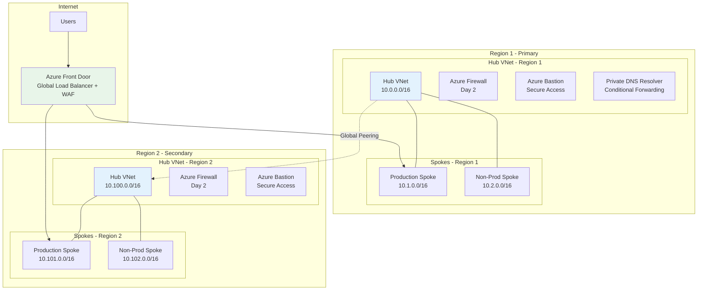
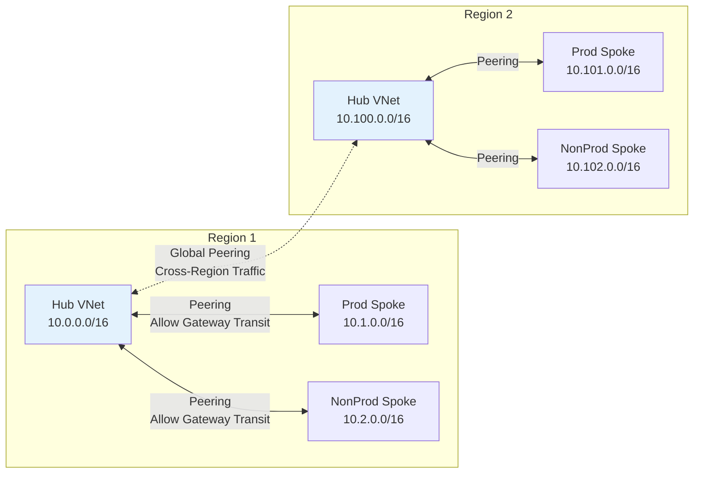
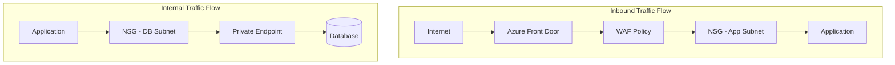
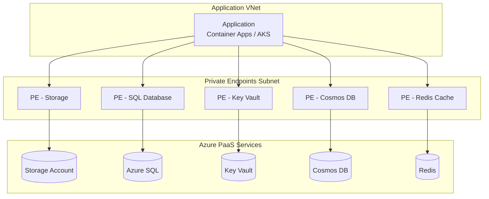
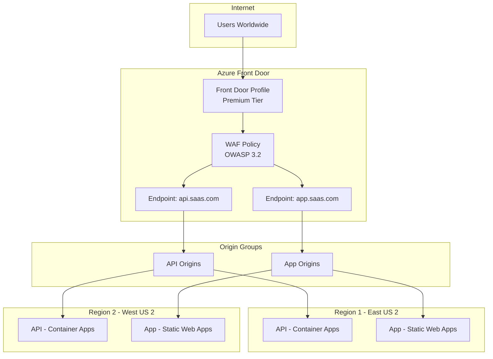
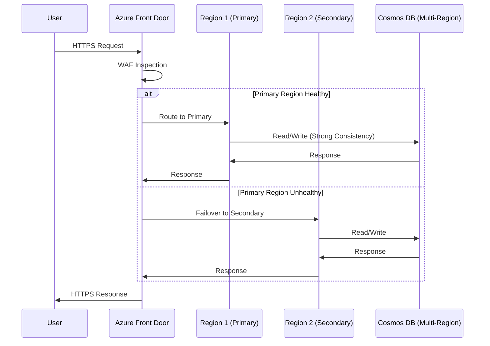

# Connectivity Landing Zone

> **Related:** [README](./README.md) | [Management Landing Zone](./02-management-landing-zone.md) | [Application Landing Zone](./07-application-landing-zone.md)

## Overview

The Connectivity Landing Zone provides the network foundation for the entire Azure environment. For a cloud-only SaaS startup, this is a simplified hub-spoke topology optimized for cost and operational efficiency.

## Architecture



## Network Topology Decision

### Cloud-Only Considerations

Since this is a cloud-only SaaS deployment with no on-premises connectivity:

| Requirement | Traditional Enterprise | Cloud-Only SaaS (Our Choice) |
|-------------|------------------------|------------------------------|
| ExpressRoute/VPN | Required | Not needed |
| Virtual Network Gateway | Required | Not needed |
| Hub complexity | High | Simplified |
| Firewall requirement | Day 1 | Day 2 (cost optimization) |
| DNS resolution | Hybrid DNS | Azure DNS Private Zones |

### Topology Options Comparison

| Option | Day 1 Cost | Complexity | Scalability | Recommendation |
|--------|------------|------------|-------------|----------------|
| Hub-Spoke with Azure Firewall | High (~$900/mo/region) | Medium | High | Day 2 |
| Hub-Spoke with NSGs only | Low | Low | Medium | **Day 1** |
| Azure Virtual WAN | Very High (~$1,500/mo) | Low | Very High | Not for startup |
| Flat network (no hub) | Lowest | Very Low | Low | Not recommended |

## IP Address Planning

### Address Space Allocation

```yaml
ip_address_plan:
  # Region 1 (Primary)
  region_1:
    name: "eastus2"
    hub:
      address_space: "10.0.0.0/16"
      subnets:
        AzureFirewallSubnet: "10.0.0.0/26"      # Required name
        AzureBastionSubnet: "10.0.1.0/26"       # Required name
        GatewaySubnet: "10.0.2.0/26"            # Reserved for future
        PrivateEndpoints: "10.0.10.0/24"
        DnsResolverInbound: "10.0.20.0/28"
        DnsResolverOutbound: "10.0.20.16/28"
        Management: "10.0.100.0/24"
    spokes:
      production:
        address_space: "10.1.0.0/16"
        subnets:
          AppService: "10.1.0.0/24"
          ContainerApps: "10.1.1.0/23"
          PrivateEndpoints: "10.1.10.0/24"
          AKS: "10.1.16.0/20"
      non_production:
        address_space: "10.2.0.0/16"
        subnets:
          AppService: "10.2.0.0/24"
          ContainerApps: "10.2.1.0/23"
          PrivateEndpoints: "10.2.10.0/24"
          
  # Region 2 (Secondary)
  region_2:
    name: "westus2"
    hub:
      address_space: "10.100.0.0/16"
      subnets:
        AzureFirewallSubnet: "10.100.0.0/26"
        AzureBastionSubnet: "10.100.1.0/26"
        GatewaySubnet: "10.100.2.0/26"
        PrivateEndpoints: "10.100.10.0/24"
        Management: "10.100.100.0/24"
    spokes:
      production:
        address_space: "10.101.0.0/16"
      non_production:
        address_space: "10.102.0.0/16"
```

### Subnet Sizing Guidelines

| Workload Type | Minimum Size | Recommended | Notes |
|---------------|--------------|-------------|-------|
| Azure Firewall | /26 | /26 | Fixed requirement |
| Azure Bastion | /26 | /26 | Fixed requirement |
| AKS Node Pool | /24 | /20 | ~250 nodes per /20 |
| Container Apps | /23 | /23 | Environment requirement |
| App Service VNet Integration | /28 | /24 | Per plan, allow growth |
| Private Endpoints | /26 | /24 | ~250 endpoints per /24 |
| DNS Resolver | /28 | /28 | Per direction |

## Hub Virtual Network

### Hub Network Configuration

```yaml
hub_virtual_network:
  name: "vnet-hub-{region}-001"
  resource_group: "rg-connectivity-hub-{region}"
  location: "{region}"
  address_space:
    - "10.0.0.0/16"  # Region 1
    # - "10.100.0.0/16"  # Region 2
    
  dns_servers: []  # Use Azure-provided DNS
  
  subnets:
    - name: "AzureFirewallSubnet"
      address_prefix: "10.0.0.0/26"
      # No NSG - managed by Azure Firewall
      
    - name: "AzureBastionSubnet"
      address_prefix: "10.0.1.0/26"
      # No NSG - managed by Azure Bastion
      
    - name: "snet-privateendpoints"
      address_prefix: "10.0.10.0/24"
      network_security_group: "nsg-hub-privateendpoints-{region}"
      private_endpoint_network_policies: "Disabled"
      
    - name: "snet-management"
      address_prefix: "10.0.100.0/24"
      network_security_group: "nsg-hub-management-{region}"
```

### Hub Peering Strategy



### VNet Peering Configuration

```yaml
vnet_peering:
  # Hub to Spoke peering (same region)
  hub_to_spoke:
    name: "peer-hub-to-{spoke-name}"
    allow_virtual_network_access: true
    allow_forwarded_traffic: true
    allow_gateway_transit: true  # For future gateway
    use_remote_gateways: false
    
  # Spoke to Hub peering
  spoke_to_hub:
    name: "peer-{spoke-name}-to-hub"
    allow_virtual_network_access: true
    allow_forwarded_traffic: true
    allow_gateway_transit: false
    use_remote_gateways: false  # True when gateway deployed
    
  # Hub to Hub (cross-region)
  hub_to_hub:
    name: "peer-hub-{region1}-to-hub-{region2}"
    allow_virtual_network_access: true
    allow_forwarded_traffic: true
    allow_gateway_transit: false
```

## Network Security

### Day 1: NSG-Based Security

Network Security Groups provide the primary network security layer for Day 1.



### NSG Rule Templates

#### Application Subnet NSG

```yaml
nsg_rules:
  application_subnet:
    inbound_rules:
      - name: "Allow-FrontDoor"
        priority: 100
        direction: "Inbound"
        access: "Allow"
        protocol: "Tcp"
        source_address_prefix: "AzureFrontDoor.Backend"
        source_port_range: "*"
        destination_address_prefix: "VirtualNetwork"
        destination_port_ranges:
          - "443"
          - "80"
          
      - name: "Allow-LoadBalancer"
        priority: 110
        direction: "Inbound"
        access: "Allow"
        protocol: "*"
        source_address_prefix: "AzureLoadBalancer"
        source_port_range: "*"
        destination_address_prefix: "*"
        destination_port_range: "*"
        
      - name: "Deny-All-Inbound"
        priority: 4096
        direction: "Inbound"
        access: "Deny"
        protocol: "*"
        source_address_prefix: "*"
        source_port_range: "*"
        destination_address_prefix: "*"
        destination_port_range: "*"
        
    outbound_rules:
      - name: "Allow-HTTPS-Outbound"
        priority: 100
        direction: "Outbound"
        access: "Allow"
        protocol: "Tcp"
        source_address_prefix: "VirtualNetwork"
        source_port_range: "*"
        destination_address_prefix: "Internet"
        destination_port_range: "443"
        
      - name: "Allow-AzureServices"
        priority: 200
        direction: "Outbound"
        access: "Allow"
        protocol: "Tcp"
        source_address_prefix: "VirtualNetwork"
        source_port_range: "*"
        destination_address_prefix: "AzureCloud"
        destination_port_ranges:
          - "443"
          - "1433"  # SQL
          - "5432"  # PostgreSQL
```

#### Private Endpoint Subnet NSG

```yaml
nsg_rules:
  private_endpoint_subnet:
    inbound_rules:
      - name: "Allow-VNet-Inbound"
        priority: 100
        direction: "Inbound"
        access: "Allow"
        protocol: "Tcp"
        source_address_prefix: "VirtualNetwork"
        source_port_range: "*"
        destination_address_prefix: "VirtualNetwork"
        destination_port_ranges:
          - "443"
          - "1433"
          - "5432"
          - "6379"  # Redis
          
      - name: "Deny-All-Inbound"
        priority: 4096
        direction: "Inbound"
        access: "Deny"
        protocol: "*"
        source_address_prefix: "*"
        source_port_range: "*"
        destination_address_prefix: "*"
        destination_port_range: "*"
```

### Day 2: Azure Firewall

Azure Firewall provides centralized network security with FQDN filtering, threat intelligence, and TLS inspection.

```yaml
azure_firewall:
  name: "afw-hub-{region}-001"
  resource_group: "rg-connectivity-hub-{region}"
  location: "{region}"
  sku:
    name: "AZFW_VNet"
    tier: "Standard"  # or "Premium" for TLS inspection
    
  threat_intel_mode: "Alert"  # Start with Alert, move to Deny
  
  ip_configuration:
    name: "ipconfig-fw"
    subnet_id: "/subscriptions/.../AzureFirewallSubnet"
    public_ip_address_id: "/subscriptions/.../pip-afw-{region}"
    
  # Firewall Policy (managed separately)
  firewall_policy_id: "/subscriptions/.../afwp-platform-{region}"
```

#### Firewall Policy

```yaml
firewall_policy:
  name: "afwp-platform-{region}"
  sku: "Standard"
  
  rule_collection_groups:
    - name: "rcg-platform-rules"
      priority: 100
      
      application_rule_collections:
        - name: "arc-allow-microsoft"
          priority: 100
          action: "Allow"
          rules:
            - name: "Allow-WindowsUpdate"
              source_addresses: ["10.0.0.0/8"]
              protocols:
                - type: "Https"
                  port: 443
              target_fqdns:
                - "*.windowsupdate.com"
                - "*.microsoft.com"
                - "*.azure.com"
                
            - name: "Allow-AzureMonitor"
              source_addresses: ["10.0.0.0/8"]
              protocols:
                - type: "Https"
                  port: 443
              target_fqdns:
                - "*.ods.opinsights.azure.com"
                - "*.oms.opinsights.azure.com"
                - "*.monitoring.azure.com"
                
      network_rule_collections:
        - name: "nrc-allow-dns"
          priority: 200
          action: "Allow"
          rules:
            - name: "Allow-DNS"
              source_addresses: ["10.0.0.0/8"]
              destination_addresses: ["168.63.129.16"]
              destination_ports: ["53"]
              protocols: ["UDP", "TCP"]
```

## DDoS Protection

### DDoS Protection Plan

```yaml
ddos_protection_plan:
  name: "ddos-platform-001"
  resource_group: "rg-connectivity-shared"
  location: "eastus2"  # Region doesn't matter for DDoS
  
  # Associate with all production VNets
  associated_vnets:
    - "vnet-hub-eastus2-001"
    - "vnet-hub-westus2-001"
    - "vnet-spoke-prod-eastus2-001"
    - "vnet-spoke-prod-westus2-001"
```

### DDoS Cost Consideration

> **Note:** Azure DDoS Protection Standard costs ~$2,944/month per plan (covers up to 100 public IPs). For a startup, consider:
> 
> 1. **Day 1:** Use Azure Front Door's built-in DDoS protection (free)
> 2. **Day 2:** Add DDoS Protection Standard when handling sensitive/high-value traffic

## Private Endpoints

### Private Endpoint Strategy



### Private Endpoint Configuration

```yaml
private_endpoint:
  naming_convention: "pe-{service-name}-{resource-type}-{region}"
  
  examples:
    - name: "pe-saasdb-sql-eastus2"
      resource_group: "rg-app-saas-prod-eastus2"
      location: "eastus2"
      subnet_id: "/subscriptions/.../snet-privateendpoints"
      
      private_service_connection:
        name: "psc-saasdb-sql"
        private_connection_resource_id: "/subscriptions/.../servers/sql-saas-prod"
        subresource_names: ["sqlServer"]
        is_manual_connection: false
        
      private_dns_zone_group:
        name: "pdzg-sql"
        private_dns_zone_ids:
          - "/subscriptions/.../privateDnsZones/privatelink.database.windows.net"
```

### Private DNS Zones

| Service | Private DNS Zone | Linked VNets |
|---------|-----------------|--------------|
| Storage Blob | `privatelink.blob.core.windows.net` | All hubs and spokes |
| Storage File | `privatelink.file.core.windows.net` | All hubs and spokes |
| Azure SQL | `privatelink.database.windows.net` | All hubs and spokes |
| Cosmos DB | `privatelink.documents.azure.com` | All hubs and spokes |
| Key Vault | `privatelink.vaultcore.azure.net` | All hubs and spokes |
| ACR | `privatelink.azurecr.io` | All hubs and spokes |
| Redis | `privatelink.redis.cache.windows.net` | All hubs and spokes |
| Event Hubs | `privatelink.servicebus.windows.net` | All hubs and spokes |
| Service Bus | `privatelink.servicebus.windows.net` | All hubs and spokes |

### Private DNS Zone Configuration

```yaml
private_dns_zone:
  name: "privatelink.database.windows.net"
  resource_group: "rg-connectivity-dns-{region}"
  
  virtual_network_links:
    - name: "link-hub-eastus2"
      virtual_network_id: "/subscriptions/.../vnet-hub-eastus2-001"
      registration_enabled: false
      
    - name: "link-spoke-prod-eastus2"
      virtual_network_id: "/subscriptions/.../vnet-spoke-prod-eastus2-001"
      registration_enabled: false
```

## Azure DNS Private Resolver

> **Deep dive:** See [Private DNS Zones and Azure DNS Private Resolver](./connectivity-dns-private-zones-resolver.md) for a detailed explanation of centralized vs. distributed DNS patterns, name collision resolution, and the role of each component in enterprise hub-spoke topologies.

For complex DNS scenarios and conditional forwarding:

```yaml
dns_private_resolver:
  name: "dnspr-hub-{region}-001"
  resource_group: "rg-connectivity-dns-{region}"
  location: "{region}"
  virtual_network_id: "/subscriptions/.../vnet-hub-{region}-001"
  
  inbound_endpoints:
    - name: "inbound-endpoint"
      subnet_id: "/subscriptions/.../snet-dnsresolver-inbound"
      private_ip_allocation: "Dynamic"
      
  outbound_endpoints:
    - name: "outbound-endpoint"
      subnet_id: "/subscriptions/.../snet-dnsresolver-outbound"
      
  # Forwarding rules (if needed for external DNS)
  forwarding_rulesets:
    - name: "ruleset-external"
      rules:
        - name: "forward-partner-domain"
          domain_name: "partner.example.com."
          target_dns_servers:
            - ip_address: "203.0.113.53"
              port: 53
```

## Azure Front Door

### Global Load Balancing Architecture



### Front Door Configuration

```yaml
azure_front_door:
  name: "afd-saas-global-001"
  resource_group: "rg-connectivity-frontdoor"
  sku: "Premium_AzureFrontDoor"  # Required for Private Link origins
  
  endpoints:
    - name: "ep-api"
      enabled: true
      custom_domains:
        - host_name: "api.saas.com"
          certificate_type: "ManagedCertificate"
      routes:
        - name: "route-api"
          patterns_to_match: ["/*"]
          origin_group: "og-api"
          forwarding_protocol: "HttpsOnly"
          https_redirect: true
          
    - name: "ep-app"
      enabled: true
      custom_domains:
        - host_name: "app.saas.com"
          certificate_type: "ManagedCertificate"
          
  origin_groups:
    - name: "og-api"
      load_balancing:
        sample_size: 4
        successful_samples_required: 3
        additional_latency_in_milliseconds: 50
      health_probe:
        path: "/health"
        protocol: "Https"
        interval_in_seconds: 30
      origins:
        - name: "api-eastus2"
          host_name: "api-eastus2.internal.saas.com"
          http_port: 80
          https_port: 443
          priority: 1
          weight: 1000
          enabled: true
          private_link:
            private_link_target_id: "/subscriptions/.../containerApps/..."
            location: "eastus2"
            
        - name: "api-westus2"
          host_name: "api-westus2.internal.saas.com"
          priority: 2  # Failover
          weight: 1000
          enabled: true
```

### WAF Policy

```yaml
waf_policy:
  name: "wafp-saas-global"
  resource_group: "rg-connectivity-frontdoor"
  sku: "Premium_AzureFrontDoor"
  
  policy_settings:
    enabled: true
    mode: "Prevention"  # Start with "Detection" and move to "Prevention"
    
  managed_rules:
    - type: "Microsoft_DefaultRuleSet"
      version: "2.1"
      
    - type: "Microsoft_BotManagerRuleSet"
      version: "1.0"
      
  custom_rules:
    - name: "RateLimitByIP"
      priority: 1
      rate_limit_duration_in_minutes: 1
      rate_limit_threshold: 1000
      action: "Block"
      match_conditions:
        - match_variable: "RemoteAddr"
          operator: "IPMatch"
          negation: false
          match_values: ["0.0.0.0/0"]
```

## Azure Bastion

Secure administrative access without exposing VMs to the internet:

```yaml
azure_bastion:
  name: "bas-hub-{region}-001"
  resource_group: "rg-connectivity-hub-{region}"
  location: "{region}"
  sku: "Standard"  # For native client support, IP-based connections
  
  ip_configuration:
    name: "ipconfig-bastion"
    subnet_id: "/subscriptions/.../AzureBastionSubnet"
    public_ip_address_id: "/subscriptions/.../pip-bastion-{region}"
    
  features:
    copy_paste: true
    file_copy: true
    ip_connect: true  # Connect by IP address
    shareable_link: false  # Disable for security
    tunneling: true  # Native client support
```

## Cross-Region Connectivity

### Multi-Region Traffic Flow



### Cross-Region Database Replication

For multi-region SaaS, use Azure services with built-in replication:

| Service | Replication Method | Consistency | RTO | RPO |
|---------|-------------------|-------------|-----|-----|
| Cosmos DB | Active-Active | Configurable | <1 min | 0-5 min |
| Azure SQL | Failover Groups | Strong | <30 sec | <5 sec |
| Redis Cache | Geo-Replication | Eventual | Minutes | Seconds |
| Storage | GRS/GZRS | Eventual | Hours | <15 min |

## Network Monitoring

### Network Watcher Configuration

```yaml
network_watcher:
  # Auto-created per region when needed
  
  flow_logs:
    - name: "flowlog-nsg-hub-{region}"
      network_security_group_id: "/subscriptions/.../nsg-hub-{region}"
      storage_account_id: "/subscriptions/.../stflowlogs{region}"
      enabled: true
      retention_days: 90
      
      traffic_analytics:
        enabled: true
        workspace_id: "/subscriptions/.../law-platform-{region}"
        interval_in_minutes: 10
        
  connection_monitors:
    - name: "cm-crossregion-connectivity"
      location: "eastus2"
      endpoints:
        - name: "hub-eastus2"
          type: "AzureVM"
          resource_id: "/subscriptions/.../vm-jumpbox-eastus2"
        - name: "hub-westus2"
          type: "AzureVM"
          resource_id: "/subscriptions/.../vm-jumpbox-westus2"
      test_configurations:
        - name: "tcp-443"
          protocol: "TCP"
          tcp_configuration:
            port: 443
```

## Implementation Checklist

### Day 1 - MVP Connectivity

- [ ] Create hub VNets in each region
- [ ] Configure VNet peering (hub-spoke, hub-hub)
- [ ] Deploy NSGs with baseline rules
- [ ] Set up Private DNS Zones
- [ ] Deploy Azure Bastion (one region minimum)
- [ ] Configure Azure Front Door with WAF
- [ ] Enable DDoS at Front Door level

### Day 2 - Enhanced Security

- [ ] Deploy Azure Firewall
- [ ] Migrate from NSG-only to Firewall-based security
- [ ] Enable DDoS Protection Standard
- [ ] Configure DNS Private Resolver
- [ ] Enable Network Watcher flow logs
- [ ] Set up Traffic Analytics

## References

- [Hub-spoke network topology](https://learn.microsoft.com/azure/architecture/reference-architectures/hybrid-networking/hub-spoke)
- [Azure Virtual Network](https://learn.microsoft.com/azure/virtual-network/)
- [Azure Front Door](https://learn.microsoft.com/azure/frontdoor/)
- [Azure Private Link](https://learn.microsoft.com/azure/private-link/)
- [Azure DDoS Protection](https://learn.microsoft.com/azure/ddos-protection/)
- [Azure Firewall](https://learn.microsoft.com/azure/firewall/)
- [Azure DNS Private Zones](https://learn.microsoft.com/azure/dns/private-dns-overview)

---

**Previous:** [02 - Management Landing Zone](./02-management-landing-zone.md) | **Next:** [04 - EA & Subscription Architecture](./04-ea-subscription-architecture.md)
