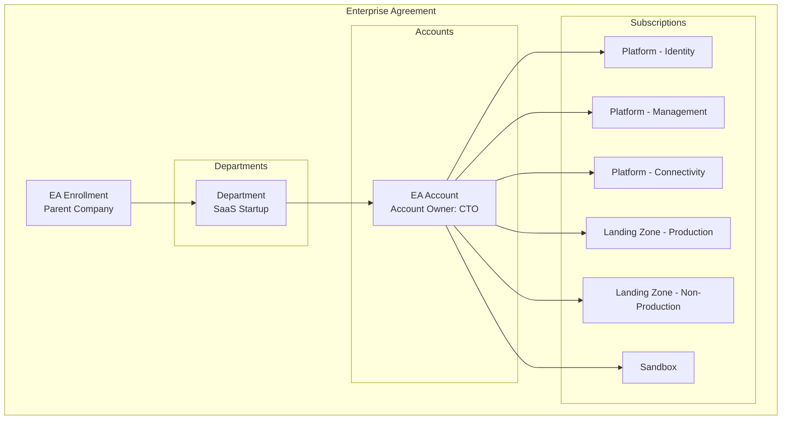
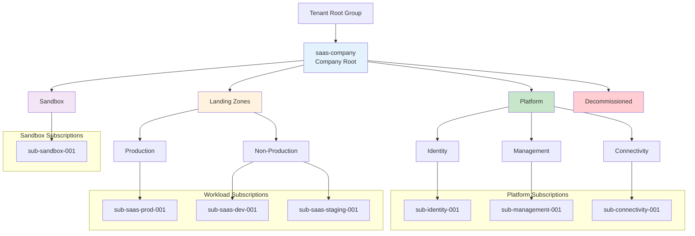
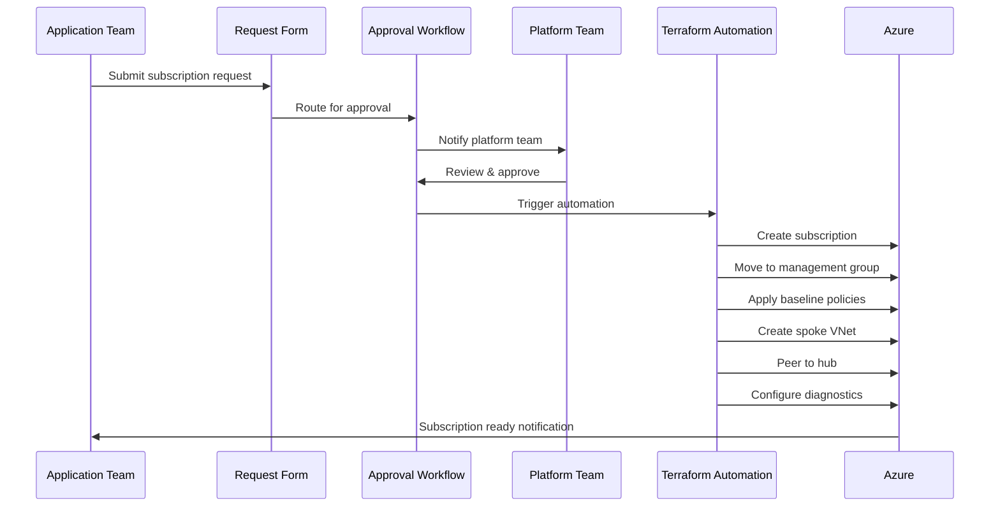
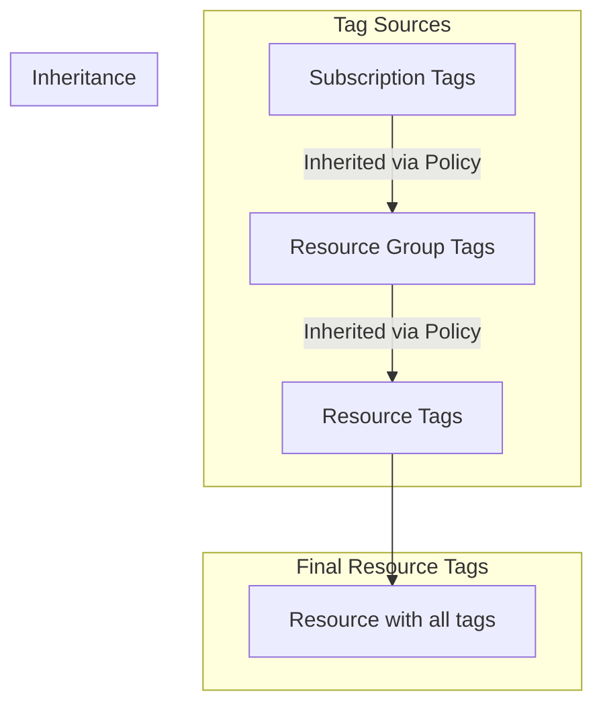
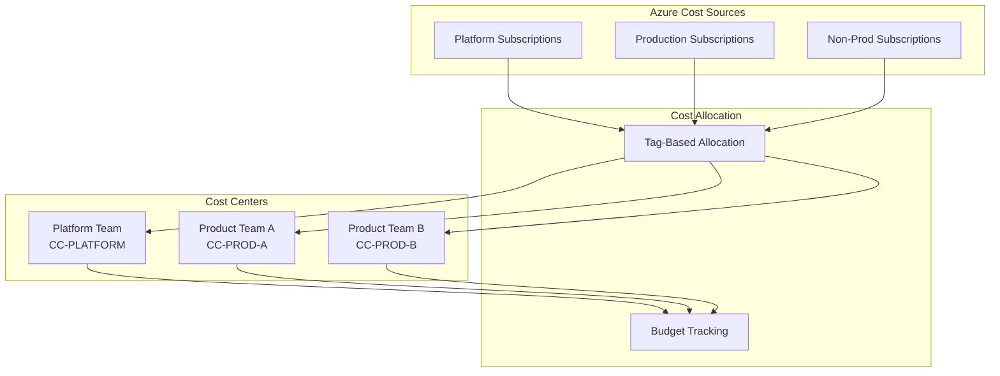
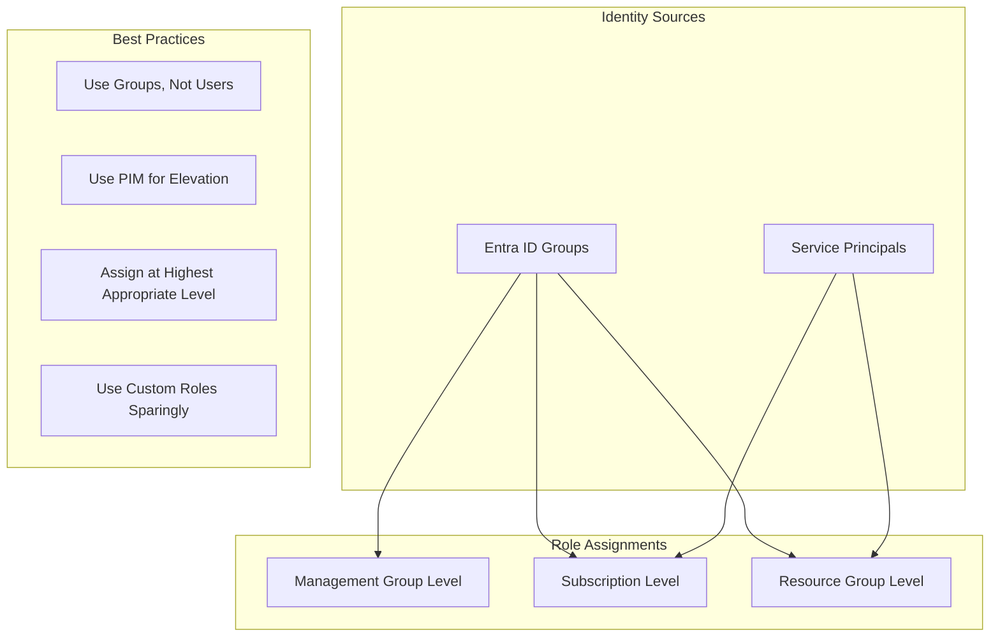

# EA & Subscription Architecture

> **Related:** [README](./README.md) | [Terraform Implementation](./05-terraform-implementation.md) | [Application Landing Zone](./07-application-landing-zone.md)

## Overview

This document describes the Enterprise Agreement (EA) enrollment integration, management group hierarchy, subscription strategy, and tagging standards for the Azure tenant.

## Enterprise Agreement Integration

### EA Enrollment Structure



### EA Enrollment Steps

| Step | Action | Owner | Notes |
|------|--------|-------|-------|
| 1 | Create Department in EA portal | EA Admin (Parent) | Department: "SaaS Startup" |
| 2 | Assign Department Admin | EA Admin (Parent) | Usually the CTO or Platform Lead |
| 3 | Create EA Account | Department Admin | Account Owner: CTO email |
| 4 | Link Account to Entra ID tenant | Account Owner | Associate with new tenant |
| 5 | Create initial subscriptions | Account Owner | Via EA portal or API |
| 6 | Transfer to management groups | Platform Team | Terraform automation |

### EA Portal Configuration

```yaml
ea_enrollment:
  department:
    name: "SaaS Startup"
    cost_center: "CC-SAAS-001"
    
  account:
    name: "SaaS Platform Account"
    owner: "cto@company.com"
    
  enrollment_settings:
    # Department Admin settings
    da_view_charges: true
    ao_view_charges: true
    
    # Account Owner settings
    ao_create_subscriptions: true
```

## Management Group Hierarchy

### CAF-Aligned Structure



### Management Group Specifications

| Management Group | ID | Purpose | Policy Assignments |
|------------------|----|---------|--------------------|
| **Company Root** | `saas-company` | Top-level governance | Baseline security, compliance |
| **Platform** | `saas-platform` | Shared platform services | Platform-specific policies |
| **Identity** | `saas-platform-identity` | Identity subscription | N/A (inherits from Platform) |
| **Management** | `saas-platform-management` | Monitoring, security | N/A (inherits from Platform) |
| **Connectivity** | `saas-platform-connectivity` | Networking | N/A (inherits from Platform) |
| **Landing Zones** | `saas-landingzones` | Application workloads | Workload security policies |
| **Production** | `saas-landingzones-prod` | Production apps | Production guardrails |
| **Non-Production** | `saas-landingzones-nonprod` | Dev/Test/Staging | Relaxed policies |
| **Sandbox** | `saas-sandbox` | Experimentation | Minimal policies, budget limits |
| **Decommissioned** | `saas-decommissioned` | Retired subscriptions | Deny all deployments |

### Management Group Configuration

```yaml
management_groups:
  - id: "saas-company"
    display_name: "SaaS Company"
    parent_id: null  # Tenant Root
    
  - id: "saas-platform"
    display_name: "Platform"
    parent_id: "saas-company"
    
  - id: "saas-platform-identity"
    display_name: "Identity"
    parent_id: "saas-platform"
    
  - id: "saas-platform-management"
    display_name: "Management"
    parent_id: "saas-platform"
    
  - id: "saas-platform-connectivity"
    display_name: "Connectivity"
    parent_id: "saas-platform"
    
  - id: "saas-landingzones"
    display_name: "Landing Zones"
    parent_id: "saas-company"
    
  - id: "saas-landingzones-prod"
    display_name: "Production"
    parent_id: "saas-landingzones"
    
  - id: "saas-landingzones-nonprod"
    display_name: "Non-Production"
    parent_id: "saas-landingzones"
    
  - id: "saas-sandbox"
    display_name: "Sandbox"
    parent_id: "saas-company"
    
  - id: "saas-decommissioned"
    display_name: "Decommissioned"
    parent_id: "saas-company"
```

## Subscription Strategy

### Platform Subscriptions

| Subscription | Management Group | Purpose | Budget |
|--------------|------------------|---------|--------|
| `sub-identity-001` | Identity | Entra ID DS (if needed), identity-related resources | $500/mo |
| `sub-management-001` | Management | Log Analytics, Defender, Automation | $2,000/mo |
| `sub-connectivity-001` | Connectivity | Hub VNets, Firewall, DNS, Front Door | $3,000/mo |

### Application Landing Zone Subscriptions

| Subscription | Management Group | Purpose | Budget |
|--------------|------------------|---------|--------|
| `sub-saas-prod-001` | Production | Production SaaS workloads | $15,000/mo |
| `sub-saas-dev-001` | Non-Production | Development environment | $2,000/mo |
| `sub-saas-staging-001` | Non-Production | Staging/UAT environment | $3,000/mo |
| `sub-sandbox-001` | Sandbox | Developer experimentation | $500/mo |

### Subscription Naming Convention

```
sub-{workload}-{environment}-{sequence}

Examples:
- sub-saas-prod-001
- sub-saas-dev-001
- sub-dataplatform-prod-001
```

## Subscription Vending

### Vending Process Flow



### Subscription Request Template

```yaml
subscription_request:
  # Requester Information
  requester:
    name: "John Doe"
    email: "john.doe@company.com"
    team: "Product Engineering"
    
  # Subscription Details
  subscription:
    workload_name: "payments-service"
    environment: "production"  # production, development, staging, sandbox
    description: "Payment processing microservice"
    
  # Business Justification
  business:
    cost_center: "CC-PROD-001"
    project_code: "PRJ-PAYMENTS"
    budget_monthly: 5000
    owner: "jane.smith@company.com"
    
  # Technical Requirements
  technical:
    regions:
      - "eastus2"
      - "westus2"
    data_classification: "confidential"
    compliance_requirements:
      - "SOC2"
      - "PCI-DSS"
    vnet_required: true
    vnet_address_space: "10.10.0.0/16"
    
  # Approval
  approvals:
    - role: "Engineering Manager"
      approver: "manager@company.com"
    - role: "Platform Team"
      approver: "platform@company.com"
    - role: "Finance"
      approver: "finance@company.com"
```

### Subscription Baseline

When a subscription is vended, the following is automatically provisioned:

```yaml
subscription_baseline:
  management_group_placement:
    environment_mapping:
      production: "saas-landingzones-prod"
      development: "saas-landingzones-nonprod"
      staging: "saas-landingzones-nonprod"
      sandbox: "saas-sandbox"
      
  required_tags:
    - "Environment"
    - "CostCenter"
    - "Owner"
    - "Application"
    - "DataClassification"
    
  resource_groups:
    - name: "rg-{workload}-network-{region}"
      purpose: "Networking resources"
    - name: "rg-{workload}-shared-{region}"
      purpose: "Shared resources (Key Vault, etc.)"
      
  networking:
    spoke_vnet:
      create: true
      peer_to_hub: true
      
  diagnostics:
    activity_logs:
      destination: "law-platform-{region}-001"
      
  budget:
    create: true
    alert_thresholds: [50, 80, 100]
```

## Tagging Standards

### Required Tags

| Tag Name | Description | Example Values | Enforced |
|----------|-------------|----------------|----------|
| `Environment` | Deployment environment | `Production`, `Development`, `Staging`, `Sandbox` | Yes - Deny |
| `CostCenter` | Cost allocation code | `CC-PROD-001`, `CC-DEV-001` | Yes - Deny |
| `Owner` | Team or individual owner | `platform-team`, `john.doe@company.com` | Yes - Deny |
| `Application` | Application or workload name | `saas-api`, `saas-web` | Yes - Deny |
| `DataClassification` | Data sensitivity level | `Public`, `Internal`, `Confidential`, `Restricted` | Yes - Deny |

### Recommended Tags

| Tag Name | Description | Example Values | Enforced |
|----------|-------------|----------------|----------|
| `Project` | Project code | `PRJ-MVP`, `PRJ-PHASE2` | No |
| `CreatedBy` | Creator identity | `terraform`, `john.doe@company.com` | No - Auto |
| `CreatedDate` | Creation timestamp | `2026-01-13` | No - Auto |
| `ExpirationDate` | Resource expiration | `2026-06-01` | No |
| `SupportTier` | Support level | `Critical`, `Standard`, `BestEffort` | No |

### Tag Inheritance



### Tag Policy Configuration

```yaml
tag_policies:
  # Require Environment tag
  - name: "Require-Environment-Tag"
    effect: "Deny"
    condition:
      field: "tags['Environment']"
      exists: "false"
    scope: "saas-landingzones"
    
  # Inherit CostCenter from resource group
  - name: "Inherit-CostCenter-Tag"
    effect: "Modify"
    action: "addOrReplace"
    field: "tags['CostCenter']"
    value: "[resourceGroup().tags['CostCenter']]"
    scope: "saas-company"
    
  # Auto-add CreatedDate
  - name: "Add-CreatedDate-Tag"
    effect: "Modify"
    action: "add"
    field: "tags['CreatedDate']"
    value: "[utcNow('yyyy-MM-dd')]"
    condition:
      field: "tags['CreatedDate']"
      exists: "false"
```

## Naming Conventions

### General Pattern

```
{resource-type}-{workload}-{environment}-{region}-{instance}

Examples:
- rg-saas-prod-eastus2-001
- vnet-hub-prod-eastus2-001
- kv-saas-prod-eus2-001
- st-saaslogs-prod-eus2-001
```

### Resource Type Abbreviations

| Resource Type | Abbreviation | Example |
|---------------|--------------|---------|
| Resource Group | `rg` | `rg-saas-prod-eastus2-001` |
| Virtual Network | `vnet` | `vnet-hub-prod-eastus2-001` |
| Subnet | `snet` | `snet-app-prod-001` |
| Network Security Group | `nsg` | `nsg-app-prod-eastus2-001` |
| Storage Account | `st` | `stsaaslogs001` (no hyphens) |
| Key Vault | `kv` | `kv-saas-prod-eus2-001` |
| Log Analytics | `law` | `law-platform-eastus2-001` |
| Application Insights | `appi` | `appi-saas-prod-eastus2-001` |
| Azure SQL Server | `sql` | `sql-saas-prod-eastus2-001` |
| Container Apps Environment | `cae` | `cae-saas-prod-eastus2-001` |
| Container App | `ca` | `ca-api-prod-eastus2-001` |
| Azure Front Door | `afd` | `afd-saas-global-001` |
| Azure Firewall | `afw` | `afw-hub-eastus2-001` |

### Region Abbreviations

| Region | Abbreviation |
|--------|--------------|
| East US 2 | `eastus2` or `eus2` |
| West US 2 | `westus2` or `wus2` |
| Central US | `centralus` or `cus` |
| West Europe | `westeurope` or `weu` |
| North Europe | `northeurope` or `neu` |

### Environment Abbreviations

| Environment | Full Name | Abbreviation |
|-------------|-----------|--------------|
| Production | `prod` | `p` |
| Staging | `staging` | `s` |
| Development | `dev` | `d` |
| Test | `test` | `t` |
| Sandbox | `sandbox` | `sb` |

## Cost Allocation

### Cost Allocation Model



### Budget Hierarchy

| Scope | Budget Owner | Alert Recipients |
|-------|--------------|------------------|
| EA Department | Finance | CFO, CTO |
| Platform MG | Platform Team | Platform Lead |
| Production MG | Engineering | Engineering Lead, Finance |
| Non-Production MG | Engineering | Engineering Lead |
| Sandbox MG | Platform Team | Platform Lead |
| Individual Subscription | Subscription Owner | Owner, Manager |

## RBAC Strategy

### Management Group RBAC

| Role | Scope | Principals | Purpose |
|------|-------|------------|---------|
| Owner | Company Root | PIM-eligible Platform Admins | Full control (emergency) |
| Contributor | Platform MG | Platform Team | Manage platform resources |
| Reader | Company Root | Security Team | Security monitoring |
| Security Reader | Company Root | Compliance Team | Compliance auditing |
| Cost Management Reader | Company Root | Finance Team | Cost visibility |

### Subscription RBAC

| Role | Scope | Principals | Purpose |
|------|-------|------------|---------|
| Owner | Production Subs | PIM-eligible Platform Admins | Emergency access |
| Contributor | Production Subs | Application Teams (PIM) | Deploy workloads |
| Reader | All Subs | Security Team | Monitoring |
| Key Vault Administrator | Application Subs | Application Teams | Secret management |

### Role Assignment Strategy



## References

- [Azure Management Groups](https://learn.microsoft.com/azure/governance/management-groups/)
- [EA Portal enrollment](https://learn.microsoft.com/azure/cost-management-billing/manage/ea-portal-enrollment-invoices)
- [Subscription vending](https://learn.microsoft.com/azure/cloud-adoption-framework/ready/landing-zone/design-area/subscription-vending)
- [Resource naming conventions](https://learn.microsoft.com/azure/cloud-adoption-framework/ready/azure-best-practices/resource-naming)
- [Tagging strategy](https://learn.microsoft.com/azure/cloud-adoption-framework/ready/azure-best-practices/resource-tagging)

---

**Previous:** [03 - Connectivity Landing Zone](./03-connectivity-landing-zone.md) | **Next:** [05 - Terraform Implementation Guide](./05-terraform-implementation.md)
