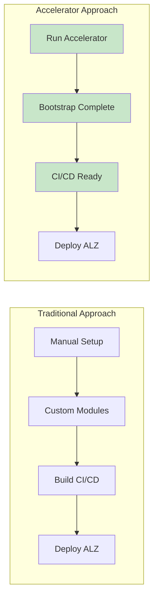
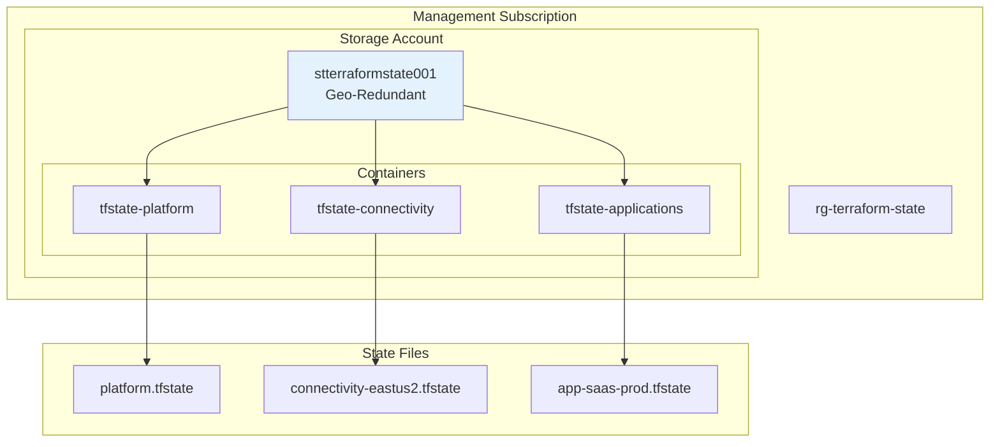

# Terraform Implementation Guide

> **Related:** [README](./README.md) | [GitHub Actions CI/CD](./06-github-actions-cicd.md) | [EA & Subscription Architecture](./04-ea-subscription-architecture.md)

## Overview

This guide describes the Terraform implementation strategy for deploying Azure Landing Zones using the Azure Verified Modules and ALZ Terraform Accelerator. The implementation is optimized for a startup platform team managing a multi-region SaaS application.

## Implementation Approach

### Azure Landing Zones Terraform Options

| Option | Description | Recommendation |
|--------|-------------|----------------|
| [ALZ Terraform Accelerator](https://aka.ms/alz/accelerator) | Automated bootstrap with CI/CD setup | **Recommended for Day 1** |
| [Azure Verified Modules](https://registry.terraform.io/modules/Azure/avm-ptn-alz/azurerm/latest) | Modular approach for customization | Use after initial setup |
| Legacy CAF Module | Older enterprise-scale module | Not recommended for new deployments |

### Why ALZ Terraform Accelerator?



The accelerator provides:
- Pre-configured GitHub Actions workflows
- OIDC/Workload Identity Federation setup
- Terraform state backend configuration
- Management group and policy deployment
- Reduced time-to-value for platform teams

## Repository Structure

### Recommended Directory Layout

```
platform-landing-zones/
├── .github/
│   └── workflows/
│       ├── terraform-plan.yml
│       ├── terraform-apply.yml
│       └── terraform-drift.yml
├── bootstrap/
│   └── README.md                    # Accelerator bootstrap docs
├── platform/
│   ├── main.tf
│   ├── variables.tf
│   ├── outputs.tf
│   ├── providers.tf
│   ├── terraform.tf
│   ├── locals.tf
│   └── config/
│       ├── management_groups.yaml
│       ├── policy_assignments.yaml
│       └── connectivity.yaml
├── modules/
│   └── subscription-vending/
│       ├── main.tf
│       ├── variables.tf
│       └── outputs.tf
├── environments/
│   ├── prod.tfvars
│   └── dev.tfvars
└── README.md
```

### Multi-Region vs. Single Deployment

| Approach | Pros | Cons | Recommendation |
|----------|------|------|----------------|
| **Single deployment** | Simpler state, easier correlation | Blast radius, slower applies | Startup scale |
| **Per-region deployment** | Isolation, parallel execution | Complex orchestration | Enterprise scale |
| **Per-component deployment** | Maximum isolation | Dependency management | Not recommended |

**Recommendation:** Start with a single deployment for the platform landing zones, with regional resources managed within the same state. As scale increases, consider splitting.

## Terraform State Management

### State Backend Configuration

```hcl
# terraform.tf
terraform {
  required_version = ">= 1.5.0"
  
  required_providers {
    azurerm = {
      source  = "hashicorp/azurerm"
      version = "~> 4.0"
    }
    azuread = {
      source  = "hashicorp/azuread"
      version = "~> 3.0"
    }
  }
  
  backend "azurerm" {
    # Values provided via -backend-config or environment variables
    # resource_group_name  = "rg-terraform-state"
    # storage_account_name = "stterraformstate001"
    # container_name       = "tfstate"
    # key                  = "platform.tfstate"
    use_oidc             = true
    use_azuread_auth     = true
  }
}
```

### State Storage Architecture



### State Backend Storage Account

```yaml
state_storage_account:
  name: "stterraformstate001"
  resource_group: "rg-terraform-state"
  location: "eastus2"
  
  account_tier: "Standard"
  account_replication_type: "GRS"  # Geo-redundant
  
  # Security settings
  public_network_access_enabled: false  # Private endpoint only
  allow_nested_items_to_be_public: false
  shared_access_key_enabled: false  # Use Entra ID auth
  
  # Enable versioning for state recovery
  blob_properties:
    versioning_enabled: true
    delete_retention_policy:
      days: 30
      
  # Network rules (after private endpoint setup)
  network_rules:
    default_action: "Deny"
    bypass: ["AzureServices"]
    ip_rules: []  # No public access
    virtual_network_subnet_ids: []
    
  # Private endpoint
  private_endpoint:
    name: "pe-tfstate-blob"
    subnet_id: "/subscriptions/.../snet-privateendpoints"
    private_dns_zone_ids:
      - "/subscriptions/.../privateDnsZones/privatelink.blob.core.windows.net"
```

### State Locking

State locking is automatic with Azure Blob Storage backend. The lease mechanism prevents concurrent modifications.

```yaml
state_locking:
  mechanism: "Azure Blob Lease"
  timeout: "Infinite until released"
  
  troubleshooting:
    # If state is locked after failed run
    command: "terraform force-unlock LOCK_ID"
    warning: "Only use if you're certain no other operation is running"
```

## ALZ Module Configuration

### Platform Landing Zone Module

```hcl
# platform/main.tf

module "alz" {
  source  = "Azure/avm-ptn-alz/azurerm"
  version = "~> 0.10"  # Use latest stable version
  
  # Management group configuration
  architecture_name = "saas"
  location          = var.primary_location
  
  # Management group hierarchy
  management_group_hierarchy = {
    id          = "saas-company"
    displayName = "SaaS Company"
    children = [
      {
        id          = "saas-platform"
        displayName = "Platform"
        children = [
          { id = "saas-platform-identity", displayName = "Identity" },
          { id = "saas-platform-management", displayName = "Management" },
          { id = "saas-platform-connectivity", displayName = "Connectivity" }
        ]
      },
      {
        id          = "saas-landingzones"
        displayName = "Landing Zones"
        children = [
          { id = "saas-landingzones-prod", displayName = "Production" },
          { id = "saas-landingzones-nonprod", displayName = "Non-Production" }
        ]
      },
      { id = "saas-sandbox", displayName = "Sandbox" },
      { id = "saas-decommissioned", displayName = "Decommissioned" }
    ]
  }
  
  # Policy configuration
  policy_default_values = {
    ama_change_tracking_data_collection_rule_id = ""
    ama_mdfc_sql_data_collection_rule_id        = ""
    ama_vm_insights_data_collection_rule_id     = ""
    log_analytics_workspace_id                   = module.management.log_analytics_workspace_id
  }
  
  # Tags
  default_tags = var.default_tags
}
```

### Management Resources Module

```hcl
# platform/management.tf

module "management" {
  source = "./modules/management"
  
  location            = var.primary_location
  resource_group_name = "rg-management-monitoring-${var.primary_location}"
  
  log_analytics_workspace = {
    name               = "law-platform-${var.primary_location}-001"
    sku                = "PerGB2018"
    retention_in_days  = 90
    daily_quota_gb     = 10
  }
  
  defender_for_cloud = {
    tier = "Standard"
    plans = [
      "AppServices",
      "ContainerRegistry",
      "Containers",
      "KeyVaults",
      "SqlServers",
      "SqlServerVirtualMachines",
      "StorageAccounts",
      "VirtualMachines",
      "Arm",
      "Dns"
    ]
  }
  
  tags = var.default_tags
}
```

### Connectivity Resources Module

```hcl
# platform/connectivity.tf

module "connectivity" {
  source = "./modules/connectivity"
  
  for_each = var.regions
  
  location            = each.value.location
  resource_group_name = "rg-connectivity-hub-${each.value.location}"
  
  hub_network = {
    name          = "vnet-hub-${each.value.location}-001"
    address_space = each.value.hub_address_space
    
    subnets = {
      AzureFirewallSubnet = {
        address_prefix = cidrsubnet(each.value.hub_address_space[0], 10, 0)
      }
      AzureBastionSubnet = {
        address_prefix = cidrsubnet(each.value.hub_address_space[0], 10, 1)
      }
      private_endpoints = {
        address_prefix                    = cidrsubnet(each.value.hub_address_space[0], 8, 10)
        private_endpoint_network_policies = "Disabled"
      }
    }
  }
  
  # Day 2: Azure Firewall
  deploy_firewall = var.deploy_firewall
  firewall_sku    = "Standard"
  
  # Azure Bastion
  deploy_bastion  = true
  bastion_sku     = "Standard"
  
  # Private DNS Zones
  private_dns_zones = [
    "privatelink.blob.core.windows.net",
    "privatelink.database.windows.net",
    "privatelink.vaultcore.azure.net",
    "privatelink.azurecr.io",
    "privatelink.documents.azure.com"
  ]
  
  tags = var.default_tags
}
```

## Variables Configuration

### Input Variables

```hcl
# platform/variables.tf

variable "primary_location" {
  description = "Primary Azure region"
  type        = string
  default     = "eastus2"
}

variable "secondary_location" {
  description = "Secondary Azure region for DR"
  type        = string
  default     = "westus2"
}

variable "regions" {
  description = "Map of regions for multi-region deployment"
  type = map(object({
    location          = string
    hub_address_space = list(string)
    is_primary        = bool
  }))
  default = {
    eastus2 = {
      location          = "eastus2"
      hub_address_space = ["10.0.0.0/16"]
      is_primary        = true
    }
    westus2 = {
      location          = "westus2"
      hub_address_space = ["10.100.0.0/16"]
      is_primary        = false
    }
  }
}

variable "deploy_firewall" {
  description = "Deploy Azure Firewall (Day 2)"
  type        = bool
  default     = false
}

variable "default_tags" {
  description = "Default tags for all resources"
  type        = map(string)
  default = {
    Environment     = "Platform"
    ManagedBy       = "Terraform"
    CostCenter      = "CC-PLATFORM"
    DataClassification = "Internal"
  }
}

variable "subscription_ids" {
  description = "Subscription IDs for platform landing zones"
  type = object({
    identity     = string
    management   = string
    connectivity = string
  })
}
```

### Environment-Specific Values

```hcl
# environments/prod.tfvars

primary_location   = "eastus2"
secondary_location = "westus2"

deploy_firewall = true  # Day 2 feature

subscription_ids = {
  identity     = "00000000-0000-0000-0000-000000000001"
  management   = "00000000-0000-0000-0000-000000000002"
  connectivity = "00000000-0000-0000-0000-000000000003"
}

default_tags = {
  Environment        = "Platform"
  ManagedBy          = "Terraform"
  CostCenter         = "CC-PLATFORM"
  DataClassification = "Internal"
  Owner              = "platform-team"
}
```

## Provider Configuration

### Multi-Provider Setup

```hcl
# platform/providers.tf

provider "azurerm" {
  features {
    resource_group {
      prevent_deletion_if_contains_resources = true
    }
    key_vault {
      purge_soft_delete_on_destroy = false
      recover_soft_deleted_key_vaults = true
    }
  }
  
  # OIDC authentication (no secrets)
  use_oidc = true
  
  # Default subscription
  subscription_id = var.subscription_ids.management
  
  # Skip provider registration if needed
  skip_provider_registration = false
}

# Provider alias for connectivity subscription
provider "azurerm" {
  alias           = "connectivity"
  subscription_id = var.subscription_ids.connectivity
  use_oidc        = true
  
  features {}
}

# Provider alias for identity subscription
provider "azurerm" {
  alias           = "identity"
  subscription_id = var.subscription_ids.identity
  use_oidc        = true
  
  features {}
}

# Azure AD provider for identity resources
provider "azuread" {
  use_oidc = true
}
```

## Subscription Vending Module

### Module Structure

```hcl
# modules/subscription-vending/main.tf

terraform {
  required_providers {
    azurerm = {
      source  = "hashicorp/azurerm"
      version = "~> 4.0"
    }
  }
}

variable "subscription_id" {
  description = "Subscription ID to configure"
  type        = string
}

variable "management_group_id" {
  description = "Target management group ID"
  type        = string
}

variable "workload_name" {
  description = "Name of the workload"
  type        = string
}

variable "environment" {
  description = "Environment (production, development, staging)"
  type        = string
}

variable "regions" {
  description = "Regions to deploy spoke VNets"
  type        = list(string)
}

variable "hub_vnet_ids" {
  description = "Map of region to hub VNet ID for peering"
  type        = map(string)
}

variable "spoke_address_spaces" {
  description = "Map of region to spoke address space"
  type        = map(list(string))
}

variable "tags" {
  description = "Tags for resources"
  type        = map(string)
}

# Move subscription to management group
resource "azurerm_management_group_subscription_association" "this" {
  management_group_id = var.management_group_id
  subscription_id     = "/subscriptions/${var.subscription_id}"
}

# Create spoke VNets
resource "azurerm_resource_group" "network" {
  for_each = toset(var.regions)
  
  name     = "rg-${var.workload_name}-network-${each.value}"
  location = each.value
  tags     = var.tags
}

resource "azurerm_virtual_network" "spoke" {
  for_each = toset(var.regions)
  
  name                = "vnet-spoke-${var.workload_name}-${each.value}-001"
  location            = each.value
  resource_group_name = azurerm_resource_group.network[each.value].name
  address_space       = var.spoke_address_spaces[each.value]
  tags                = var.tags
}

# Peer to hub
resource "azurerm_virtual_network_peering" "spoke_to_hub" {
  for_each = toset(var.regions)
  
  name                      = "peer-to-hub-${each.value}"
  resource_group_name       = azurerm_resource_group.network[each.value].name
  virtual_network_name      = azurerm_virtual_network.spoke[each.value].name
  remote_virtual_network_id = var.hub_vnet_ids[each.value]
  
  allow_virtual_network_access = true
  allow_forwarded_traffic      = true
  use_remote_gateways          = false
}

# Configure diagnostic settings
resource "azurerm_monitor_diagnostic_setting" "activity_logs" {
  name                       = "diag-activity-logs"
  target_resource_id         = "/subscriptions/${var.subscription_id}"
  log_analytics_workspace_id = var.log_analytics_workspace_id
  
  enabled_log {
    category = "Administrative"
  }
  enabled_log {
    category = "Security"
  }
  enabled_log {
    category = "Alert"
  }
}

output "spoke_vnet_ids" {
  value = { for k, v in azurerm_virtual_network.spoke : k => v.id }
}
```

## Local Development

### Prerequisites

```bash
# Install Terraform
# macOS
brew install terraform

# Windows (via Chocolatey)
choco install terraform

# Verify installation
terraform --version
```

### Authentication for Local Development

```bash
# Option 1: Azure CLI authentication
az login
az account set --subscription "sub-management-001"

# Option 2: Service Principal (for testing)
export ARM_CLIENT_ID="..."
export ARM_CLIENT_SECRET="..."  # Only for local testing
export ARM_TENANT_ID="..."
export ARM_SUBSCRIPTION_ID="..."
```

### Running Terraform Locally

```bash
# Initialize
terraform init \
  -backend-config="resource_group_name=rg-terraform-state" \
  -backend-config="storage_account_name=stterraformstate001" \
  -backend-config="container_name=tfstate-platform" \
  -backend-config="key=platform.tfstate"

# Plan
terraform plan -var-file="environments/prod.tfvars" -out=tfplan

# Apply (only in emergency - prefer CI/CD)
terraform apply tfplan
```

## Import Existing Resources

If resources were created manually or via portal:

```bash
# Import management group
terraform import 'module.alz.azurerm_management_group.this["saas-company"]' "/providers/Microsoft.Management/managementGroups/saas-company"

# Import subscription association
terraform import 'azurerm_management_group_subscription_association.this' "/providers/Microsoft.Management/managementGroups/saas-platform-management/subscriptions/00000000-0000-0000-0000-000000000002"

# Import resource group
terraform import 'azurerm_resource_group.this' "/subscriptions/00000000-0000-0000-0000-000000000002/resourceGroups/rg-management-monitoring-eastus2"
```

## Best Practices

### Code Quality

| Practice | Description |
|----------|-------------|
| **Use `terraform fmt`** | Consistent formatting |
| **Use `terraform validate`** | Syntax validation |
| **Use `tflint`** | Linting for best practices |
| **Use `checkov`** | Security scanning |
| **Pin provider versions** | Prevent breaking changes |
| **Pin module versions** | Reproducible deployments |

### State Management

| Practice | Description |
|----------|-------------|
| **Remote state** | Always use remote backend |
| **State locking** | Automatic with Azure Blob |
| **State encryption** | Azure handles at rest |
| **State backup** | Enable versioning on storage |
| **Limit state access** | RBAC on storage account |

### Security

| Practice | Description |
|----------|-------------|
| **No secrets in code** | Use OIDC or Key Vault |
| **No secrets in state** | Use `sensitive = true` |
| **Review plans** | Always review before apply |
| **Use OIDC** | No stored credentials |
| **Audit access** | Monitor state file access |

## References

- [Azure Landing Zones Terraform Accelerator](https://aka.ms/alz/accelerator)
- [Azure Verified Modules](https://azure.github.io/Azure-Verified-Modules/)
- [Terraform AzureRM Provider](https://registry.terraform.io/providers/hashicorp/azurerm/latest/docs)
- [Terraform Backend Configuration](https://developer.hashicorp.com/terraform/language/settings/backends/azurerm)
- [Azure Landing Zones CAF Enterprise Scale](https://github.com/Azure/terraform-azurerm-caf-enterprise-scale)

---

**Previous:** [04 - EA & Subscription Architecture](./04-ea-subscription-architecture.md) | **Next:** [06 - GitHub Actions CI/CD](./06-github-actions-cicd.md)
