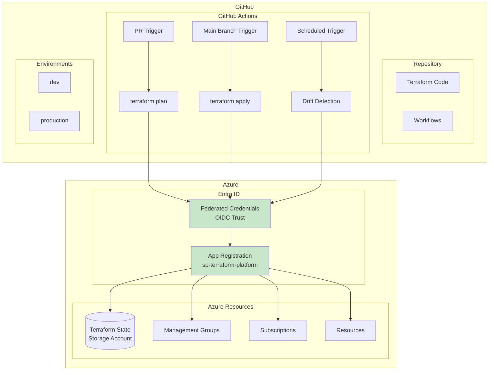
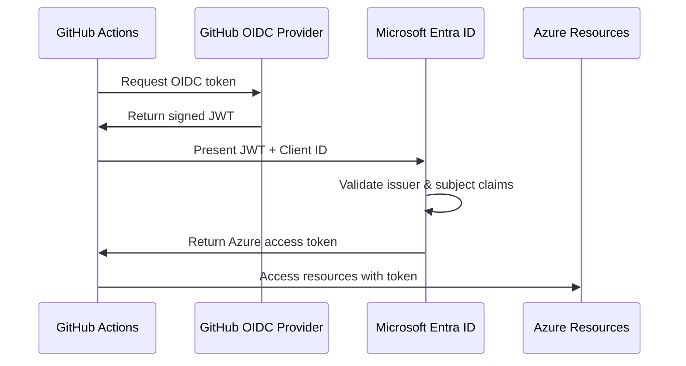

# GitHub Actions CI/CD Pipeline

> **Related:** [README](./README.md) | [Terraform Implementation](./05-terraform-implementation.md) | [Application Landing Zone](./07-application-landing-zone.md)

## Table of Contents

1. [Overview](#overview)
2. [Architecture](#architecture)
3. [Workload Identity Federation (OIDC)](#workload-identity-federation-oidc)
4. [GitHub Repository Structure](#github-repository-structure)
5. [GitHub Environments](#github-environments)
6. [GitHub Actions Workflows](#github-actions-workflows)
7. [Secrets Management](#secrets-management)
8. [Reusable Workflows](#reusable-workflows)
9. [Workflow for Application Teams](#workflow-for-application-teams)
10. [Security Considerations](#security-considerations)
11. [References](#references)

---

## Overview

This document describes the GitHub Actions CI/CD pipeline for managing Azure Landing Zones with Terraform. The pipeline uses OpenID Connect (OIDC) Workload Identity Federation for secure, secretless authentication to Azure.

## Architecture



## Workload Identity Federation (OIDC)

### Why OIDC?

| Approach | Secrets | Rotation | Security | Recommendation |
|----------|---------|----------|----------|----------------|
| Client Secret | Yes | Manual, 2 years max | Moderate | Not recommended |
| Client Certificate | Yes | Manual | Better | Acceptable |
| **OIDC (Federated)** | **No** | **Automatic** | **Best** | **Recommended** |

### OIDC Flow



### Federated Credential Configuration

```yaml
# App Registration: sp-terraform-platform
federated_credentials:
  # Production deployments from main branch
  - name: "github-main-branch"
    issuer: "https://token.actions.githubusercontent.com"
    subject: "repo:company/platform-landing-zones:ref:refs/heads/main"
    description: "Allow deployments from main branch"
    audiences:
      - "api://AzureADTokenExchange"
      
  # Pull request plans
  - name: "github-pull-requests"
    issuer: "https://token.actions.githubusercontent.com"
    subject: "repo:company/platform-landing-zones:pull_request"
    description: "Allow terraform plan on PRs"
    audiences:
      - "api://AzureADTokenExchange"
      
  # Scheduled drift detection
  - name: "github-scheduled"
    issuer: "https://token.actions.githubusercontent.com"
    subject: "repo:company/platform-landing-zones:ref:refs/heads/main"
    description: "Allow scheduled drift detection"
    audiences:
      - "api://AzureADTokenExchange"
      
  # Environment-based (alternative approach)
  - name: "github-production-environment"
    issuer: "https://token.actions.githubusercontent.com"
    subject: "repo:company/platform-landing-zones:environment:production"
    description: "Allow production environment deployments"
    audiences:
      - "api://AzureADTokenExchange"
```

### Service Principal Permissions

```yaml
service_principal:
  display_name: "sp-terraform-platform"
  
  # Role assignments
  role_assignments:
    # Management group level
    - scope: "/providers/Microsoft.Management/managementGroups/saas-company"
      role: "Owner"  # Required for policy assignments
      
    # Subscription level (alternative - more restrictive)
    # - scope: "/subscriptions/{connectivity-sub-id}"
    #   role: "Contributor"
    # - scope: "/subscriptions/{management-sub-id}"
    #   role: "Contributor"
    
    # Entra ID permissions (for PIM, Conditional Access)
    # Note: Requires Entra ID P2 license
  
  # API permissions (Entra ID)
  api_permissions:
    - api: "Microsoft Graph"
      permissions:
        - "User.Read.All"  # Read users for group membership
        - "Group.Read.All"
        - "Application.Read.All"
```

## GitHub Repository Structure

### Branch Protection Rules

```yaml
branch_protection:
  main:
    required_reviews: 1
    dismiss_stale_reviews: true
    require_code_owner_reviews: true
    required_status_checks:
      strict: true
      contexts:
        - "terraform-plan"
        - "terraform-validate"
        - "security-scan"
    enforce_admins: true
    restrict_pushes:
      users: []
      teams: ["platform-team"]
```

### CODEOWNERS

```
# .github/CODEOWNERS

# Platform team owns all Terraform code
*.tf @company/platform-team
*.tfvars @company/platform-team

# Security team reviews policy changes
**/policy*.tf @company/security-team @company/platform-team
**/policy*.yaml @company/security-team @company/platform-team

# Workflows require platform team approval
.github/workflows/*.yml @company/platform-team
```

## GitHub Environments

### Environment Configuration

| Environment | Protection Rules | Secrets | Use Case |
|-------------|------------------|---------|----------|
| `development` | None | Dev subscription ID | PR validation |
| `staging` | 1 reviewer | Staging subscription ID | Pre-production testing |
| `production` | 2 reviewers + wait timer | Production subscription IDs | Production deployments |

### Environment Setup

```yaml
environments:
  development:
    protection_rules:
      required_reviewers: []
      wait_timer: 0
    deployment_branch_policy:
      protected_branches: false
      custom_branches:
        - "*"
        
  production:
    protection_rules:
      required_reviewers:
        - "platform-team-leads"
      wait_timer: 5  # 5-minute wait before deployment
    deployment_branch_policy:
      protected_branches: true  # Only main branch
      custom_branches: []
```

## GitHub Actions Workflows

### Terraform Plan on Pull Request

```yaml
# .github/workflows/terraform-plan.yml

name: "Terraform Plan"

on:
  pull_request:
    branches:
      - main
    paths:
      - 'platform/**'
      - 'modules/**'
      - '.github/workflows/terraform-*.yml'

permissions:
  id-token: write    # Required for OIDC
  contents: read     # Required for checkout
  pull-requests: write  # Required for PR comments

env:
  TF_VERSION: "1.7.0"
  WORKING_DIRECTORY: "./platform"
  ARM_CLIENT_ID: ${{ vars.AZURE_CLIENT_ID }}
  ARM_TENANT_ID: ${{ vars.AZURE_TENANT_ID }}
  ARM_SUBSCRIPTION_ID: ${{ vars.AZURE_SUBSCRIPTION_ID }}
  ARM_USE_OIDC: true

jobs:
  validate:
    name: "Validate"
    runs-on: ubuntu-latest
    steps:
      - name: Checkout
        uses: actions/checkout@v4
        
      - name: Setup Terraform
        uses: hashicorp/setup-terraform@v3
        with:
          terraform_version: ${{ env.TF_VERSION }}
          
      - name: Terraform Format Check
        run: terraform fmt -check -recursive
        working-directory: ${{ env.WORKING_DIRECTORY }}
        
      - name: Terraform Init
        run: |
          terraform init -backend=false
        working-directory: ${{ env.WORKING_DIRECTORY }}
        
      - name: Terraform Validate
        run: terraform validate
        working-directory: ${{ env.WORKING_DIRECTORY }}

  security-scan:
    name: "Security Scan"
    runs-on: ubuntu-latest
    steps:
      - name: Checkout
        uses: actions/checkout@v4
        
      - name: Run Checkov
        uses: bridgecrewio/checkov-action@v12
        with:
          directory: ${{ env.WORKING_DIRECTORY }}
          framework: terraform
          output_format: sarif
          output_file_path: results.sarif
          soft_fail: true
          
      - name: Upload SARIF
        uses: github/codeql-action/upload-sarif@v3
        if: always()
        with:
          sarif_file: results.sarif

  plan:
    name: "Plan"
    runs-on: ubuntu-latest
    needs: [validate, security-scan]
    environment: development
    steps:
      - name: Checkout
        uses: actions/checkout@v4
        
      - name: Setup Terraform
        uses: hashicorp/setup-terraform@v3
        with:
          terraform_version: ${{ env.TF_VERSION }}
          terraform_wrapper: false
          
      - name: Azure Login
        uses: azure/login@v2
        with:
          client-id: ${{ env.ARM_CLIENT_ID }}
          tenant-id: ${{ env.ARM_TENANT_ID }}
          subscription-id: ${{ env.ARM_SUBSCRIPTION_ID }}
          
      - name: Terraform Init
        run: |
          terraform init \
            -backend-config="resource_group_name=${{ vars.TF_STATE_RESOURCE_GROUP }}" \
            -backend-config="storage_account_name=${{ vars.TF_STATE_STORAGE_ACCOUNT }}" \
            -backend-config="container_name=${{ vars.TF_STATE_CONTAINER }}" \
            -backend-config="key=platform.tfstate"
        working-directory: ${{ env.WORKING_DIRECTORY }}
        
      - name: Terraform Plan
        id: plan
        run: |
          terraform plan \
            -var-file="environments/prod.tfvars" \
            -out=tfplan \
            -no-color \
            -detailed-exitcode 2>&1 | tee plan_output.txt
          
          # Capture exit code
          PLAN_EXIT_CODE=${PIPESTATUS[0]}
          echo "exit_code=$PLAN_EXIT_CODE" >> $GITHUB_OUTPUT
        working-directory: ${{ env.WORKING_DIRECTORY }}
        continue-on-error: true
        
      - name: Upload Plan Artifact
        uses: actions/upload-artifact@v4
        with:
          name: tfplan
          path: ${{ env.WORKING_DIRECTORY }}/tfplan
          retention-days: 5
          
      - name: Comment on PR
        uses: actions/github-script@v7
        with:
          script: |
            const fs = require('fs');
            const planOutput = fs.readFileSync('${{ env.WORKING_DIRECTORY }}/plan_output.txt', 'utf8');
            const exitCode = '${{ steps.plan.outputs.exit_code }}';
            
            let status = '✅ No changes';
            if (exitCode === '2') status = '⚠️ Changes detected';
            if (exitCode === '1') status = '❌ Plan failed';
            
            const body = `## Terraform Plan Results
            
            **Status:** ${status}
            
            <details>
            <summary>Show Plan Output</summary>
            
            \`\`\`hcl
            ${planOutput.slice(-60000)}
            \`\`\`
            
            </details>
            
            *Plan generated for commit ${context.sha.slice(0, 7)}*`;
            
            github.rest.issues.createComment({
              issue_number: context.issue.number,
              owner: context.repo.owner,
              repo: context.repo.repo,
              body: body
            });
```

### Terraform Apply on Merge

```yaml
# .github/workflows/terraform-apply.yml

name: "Terraform Apply"

on:
  push:
    branches:
      - main
    paths:
      - 'platform/**'
      - 'modules/**'
      
  # Allow manual trigger
  workflow_dispatch:
    inputs:
      environment:
        description: 'Environment to deploy'
        required: true
        default: 'production'
        type: choice
        options:
          - production

permissions:
  id-token: write
  contents: read

env:
  TF_VERSION: "1.7.0"
  WORKING_DIRECTORY: "./platform"
  ARM_CLIENT_ID: ${{ vars.AZURE_CLIENT_ID }}
  ARM_TENANT_ID: ${{ vars.AZURE_TENANT_ID }}
  ARM_SUBSCRIPTION_ID: ${{ vars.AZURE_SUBSCRIPTION_ID }}
  ARM_USE_OIDC: true

jobs:
  apply:
    name: "Apply"
    runs-on: ubuntu-latest
    environment: production
    concurrency:
      group: terraform-apply
      cancel-in-progress: false
    
    steps:
      - name: Checkout
        uses: actions/checkout@v4
        
      - name: Setup Terraform
        uses: hashicorp/setup-terraform@v3
        with:
          terraform_version: ${{ env.TF_VERSION }}
          
      - name: Azure Login
        uses: azure/login@v2
        with:
          client-id: ${{ env.ARM_CLIENT_ID }}
          tenant-id: ${{ env.ARM_TENANT_ID }}
          subscription-id: ${{ env.ARM_SUBSCRIPTION_ID }}
          
      - name: Terraform Init
        run: |
          terraform init \
            -backend-config="resource_group_name=${{ vars.TF_STATE_RESOURCE_GROUP }}" \
            -backend-config="storage_account_name=${{ vars.TF_STATE_STORAGE_ACCOUNT }}" \
            -backend-config="container_name=${{ vars.TF_STATE_CONTAINER }}" \
            -backend-config="key=platform.tfstate"
        working-directory: ${{ env.WORKING_DIRECTORY }}
        
      - name: Terraform Plan
        run: |
          terraform plan \
            -var-file="environments/prod.tfvars" \
            -out=tfplan \
            -input=false
        working-directory: ${{ env.WORKING_DIRECTORY }}
        
      - name: Terraform Apply
        run: terraform apply -auto-approve tfplan
        working-directory: ${{ env.WORKING_DIRECTORY }}
        
      - name: Notify on Failure
        if: failure()
        uses: slackapi/slack-github-action@v1
        with:
          channel-id: 'platform-alerts'
          slack-message: |
            ❌ Terraform Apply Failed
            Repository: ${{ github.repository }}
            Commit: ${{ github.sha }}
            Run: ${{ github.server_url }}/${{ github.repository }}/actions/runs/${{ github.run_id }}
        env:
          SLACK_BOT_TOKEN: ${{ secrets.SLACK_BOT_TOKEN }}
```

### Drift Detection

```yaml
# .github/workflows/terraform-drift.yml

name: "Terraform Drift Detection"

on:
  schedule:
    # Run daily at 6 AM UTC
    - cron: '0 6 * * *'
  workflow_dispatch:

permissions:
  id-token: write
  contents: read
  issues: write

env:
  TF_VERSION: "1.7.0"
  WORKING_DIRECTORY: "./platform"
  ARM_CLIENT_ID: ${{ vars.AZURE_CLIENT_ID }}
  ARM_TENANT_ID: ${{ vars.AZURE_TENANT_ID }}
  ARM_SUBSCRIPTION_ID: ${{ vars.AZURE_SUBSCRIPTION_ID }}
  ARM_USE_OIDC: true

jobs:
  drift:
    name: "Check Drift"
    runs-on: ubuntu-latest
    environment: production
    
    steps:
      - name: Checkout
        uses: actions/checkout@v4
        
      - name: Setup Terraform
        uses: hashicorp/setup-terraform@v3
        with:
          terraform_version: ${{ env.TF_VERSION }}
          terraform_wrapper: false
          
      - name: Azure Login
        uses: azure/login@v2
        with:
          client-id: ${{ env.ARM_CLIENT_ID }}
          tenant-id: ${{ env.ARM_TENANT_ID }}
          subscription-id: ${{ env.ARM_SUBSCRIPTION_ID }}
          
      - name: Terraform Init
        run: |
          terraform init \
            -backend-config="resource_group_name=${{ vars.TF_STATE_RESOURCE_GROUP }}" \
            -backend-config="storage_account_name=${{ vars.TF_STATE_STORAGE_ACCOUNT }}" \
            -backend-config="container_name=${{ vars.TF_STATE_CONTAINER }}" \
            -backend-config="key=platform.tfstate"
        working-directory: ${{ env.WORKING_DIRECTORY }}
        
      - name: Check for Drift
        id: drift
        run: |
          set +e
          terraform plan \
            -var-file="environments/prod.tfvars" \
            -detailed-exitcode \
            -out=driftplan 2>&1 | tee drift_output.txt
          
          DRIFT_EXIT_CODE=$?
          echo "exit_code=$DRIFT_EXIT_CODE" >> $GITHUB_OUTPUT
          
          if [ $DRIFT_EXIT_CODE -eq 2 ]; then
            echo "drift_detected=true" >> $GITHUB_OUTPUT
          else
            echo "drift_detected=false" >> $GITHUB_OUTPUT
          fi
        working-directory: ${{ env.WORKING_DIRECTORY }}
        
      - name: Create Issue on Drift
        if: steps.drift.outputs.drift_detected == 'true'
        uses: actions/github-script@v7
        with:
          script: |
            const fs = require('fs');
            const driftOutput = fs.readFileSync('${{ env.WORKING_DIRECTORY }}/drift_output.txt', 'utf8');
            
            const title = `🔄 Terraform Drift Detected - ${new Date().toISOString().split('T')[0]}`;
            const body = `## Drift Detection Report
            
            Configuration drift has been detected in the platform landing zones.
            
            **Date:** ${new Date().toISOString()}
            **Run:** [Workflow Run](${{ github.server_url }}/${{ github.repository }}/actions/runs/${{ github.run_id }})
            
            ### Recommended Actions
            1. Review the drift output below
            2. Determine if changes are intentional (manual changes)
            3. If intentional, update Terraform code to match
            4. If unintentional, run \`terraform apply\` to remediate
            
            <details>
            <summary>Drift Details</summary>
            
            \`\`\`hcl
            ${driftOutput.slice(-60000)}
            \`\`\`
            
            </details>
            
            /cc @company/platform-team`;
            
            github.rest.issues.create({
              owner: context.repo.owner,
              repo: context.repo.repo,
              title: title,
              body: body,
              labels: ['drift', 'terraform', 'platform']
            });
```

## Secrets Management

### GitHub Secrets vs. Variables

| Type | Use Case | Example |
|------|----------|---------|
| **Repository Variables** | Non-sensitive configuration | `AZURE_CLIENT_ID`, `TF_STATE_STORAGE_ACCOUNT` |
| **Repository Secrets** | Sensitive values | `SLACK_BOT_TOKEN` (if needed) |
| **Environment Variables** | Environment-specific config | `AZURE_SUBSCRIPTION_ID` per environment |
| **Environment Secrets** | Environment-specific secrets | None needed with OIDC |

### Recommended Variables

```yaml
repository_variables:
  # Azure identity (public, non-sensitive)
  AZURE_CLIENT_ID: "00000000-0000-0000-0000-000000000000"
  AZURE_TENANT_ID: "00000000-0000-0000-0000-000000000000"
  AZURE_SUBSCRIPTION_ID: "00000000-0000-0000-0000-000000000000"
  
  # Terraform state backend
  TF_STATE_RESOURCE_GROUP: "rg-terraform-state"
  TF_STATE_STORAGE_ACCOUNT: "stterraformstate001"
  TF_STATE_CONTAINER: "tfstate-platform"

environment_variables:
  production:
    AZURE_SUBSCRIPTION_ID: "prod-subscription-id"
  development:
    AZURE_SUBSCRIPTION_ID: "dev-subscription-id"
```

### No Secrets Required with OIDC

With OIDC authentication, you do **not** need to store:
- `ARM_CLIENT_SECRET`
- `ARM_CLIENT_CERTIFICATE`
- Any Azure credentials

The GitHub-issued JWT token is exchanged for Azure access tokens automatically.

## Reusable Workflows

### Reusable Plan Workflow

```yaml
# .github/workflows/reusable-terraform-plan.yml

name: "Reusable Terraform Plan"

on:
  workflow_call:
    inputs:
      working_directory:
        required: true
        type: string
      environment:
        required: true
        type: string
      terraform_version:
        required: false
        type: string
        default: "1.7.0"
    secrets:
      AZURE_CLIENT_ID:
        required: true
      AZURE_TENANT_ID:
        required: true
      AZURE_SUBSCRIPTION_ID:
        required: true

jobs:
  plan:
    runs-on: ubuntu-latest
    environment: ${{ inputs.environment }}
    
    steps:
      - uses: actions/checkout@v4
      
      - uses: hashicorp/setup-terraform@v3
        with:
          terraform_version: ${{ inputs.terraform_version }}
          
      - uses: azure/login@v2
        with:
          client-id: ${{ secrets.AZURE_CLIENT_ID }}
          tenant-id: ${{ secrets.AZURE_TENANT_ID }}
          subscription-id: ${{ secrets.AZURE_SUBSCRIPTION_ID }}
          
      - name: Terraform Init & Plan
        run: |
          terraform init
          terraform plan -out=tfplan
        working-directory: ${{ inputs.working_directory }}
```

### Using Reusable Workflow

```yaml
# .github/workflows/app-landing-zone.yml

name: "Application Landing Zone"

on:
  pull_request:
    paths:
      - 'applications/saas/**'

jobs:
  plan:
    uses: ./.github/workflows/reusable-terraform-plan.yml
    with:
      working_directory: "./applications/saas"
      environment: "development"
    secrets:
      AZURE_CLIENT_ID: ${{ vars.AZURE_CLIENT_ID }}
      AZURE_TENANT_ID: ${{ vars.AZURE_TENANT_ID }}
      AZURE_SUBSCRIPTION_ID: ${{ vars.AZURE_SUBSCRIPTION_ID }}
```

## Workflow for Application Teams

Application teams can use a simplified workflow template:

```yaml
# Template for application teams
# .github/workflows/templates/app-terraform.yml

name: "Application Infrastructure"

on:
  pull_request:
    branches: [main]
  push:
    branches: [main]

permissions:
  id-token: write
  contents: read
  pull-requests: write

env:
  WORKING_DIRECTORY: "./infrastructure"
  # Application teams use their own service principal
  ARM_CLIENT_ID: ${{ vars.APP_AZURE_CLIENT_ID }}
  ARM_TENANT_ID: ${{ vars.AZURE_TENANT_ID }}
  ARM_SUBSCRIPTION_ID: ${{ vars.APP_AZURE_SUBSCRIPTION_ID }}
  ARM_USE_OIDC: true

jobs:
  plan:
    if: github.event_name == 'pull_request'
    runs-on: ubuntu-latest
    steps:
      - uses: actions/checkout@v4
      - uses: hashicorp/setup-terraform@v3
      - uses: azure/login@v2
        with:
          client-id: ${{ env.ARM_CLIENT_ID }}
          tenant-id: ${{ env.ARM_TENANT_ID }}
          subscription-id: ${{ env.ARM_SUBSCRIPTION_ID }}
      - run: terraform init && terraform plan
        working-directory: ${{ env.WORKING_DIRECTORY }}

  apply:
    if: github.event_name == 'push'
    runs-on: ubuntu-latest
    environment: production
    steps:
      - uses: actions/checkout@v4
      - uses: hashicorp/setup-terraform@v3
      - uses: azure/login@v2
        with:
          client-id: ${{ env.ARM_CLIENT_ID }}
          tenant-id: ${{ env.ARM_TENANT_ID }}
          subscription-id: ${{ env.ARM_SUBSCRIPTION_ID }}
      - run: terraform init && terraform apply -auto-approve
        working-directory: ${{ env.WORKING_DIRECTORY }}
```

## Security Considerations

### Workflow Security Checklist

| Item | Implementation |
|------|----------------|
| ✅ Pin action versions | Use `@v4` not `@main` |
| ✅ Use OIDC | No stored secrets |
| ✅ Environment protection | Required reviewers |
| ✅ Branch protection | PR reviews required |
| ✅ Concurrency controls | Prevent parallel applies |
| ✅ Audit logging | GitHub audit log enabled |
| ✅ CODEOWNERS | Enforce review by team |

### Action Version Pinning

```yaml
# Good - pinned to major version
- uses: actions/checkout@v4
- uses: hashicorp/setup-terraform@v3
- uses: azure/login@v2

# Better - pinned to specific SHA (for security-critical workflows)
- uses: actions/checkout@b4ffde65f46336ab88eb53be808477a3936bae11  # v4.1.1
```

## References

- [GitHub Actions documentation](https://docs.github.com/en/actions)
- [Workload identity federation](https://learn.microsoft.com/entra/workload-id/workload-identity-federation)
- [Azure Login Action](https://github.com/Azure/login)
- [GitHub OIDC with Azure](https://docs.github.com/en/actions/deployment/security-hardening-your-deployments/configuring-openid-connect-in-azure)
- [Terraform GitHub Actions](https://developer.hashicorp.com/terraform/tutorials/automation/github-actions)

---

**Previous:** [05 - Terraform Implementation Guide](./05-terraform-implementation.md) | **Next:** [07 - Application Landing Zone Template](./07-application-landing-zone.md)
