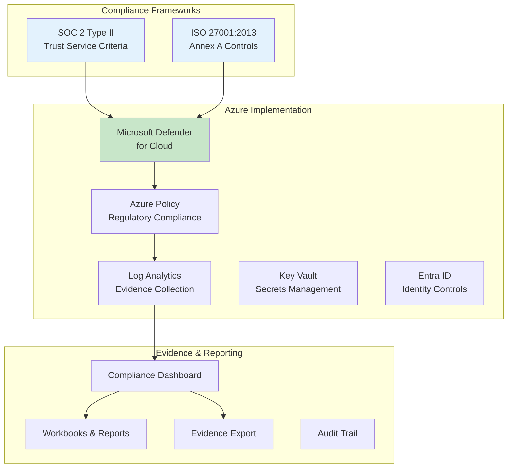
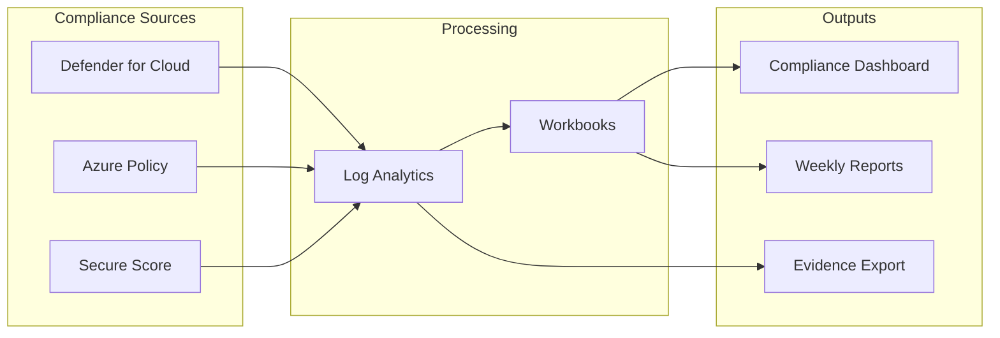
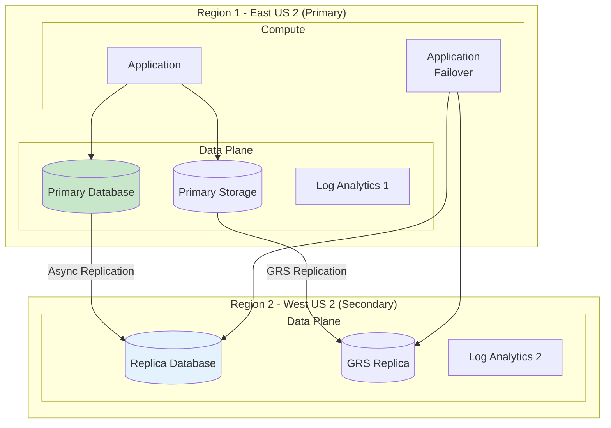

# Compliance Baseline

> **Related:** [README](./README.md) | [Identity Landing Zone](./01-identity-landing-zone.md) | [Management Landing Zone](./02-management-landing-zone.md)

## Overview

This document provides compliance mappings for SOC 2 Type II and ISO 27001 controls to Azure services and configurations. It covers evidence collection strategies, regulatory compliance dashboard setup, and multi-region data residency considerations.

## Compliance Framework Overview



## SOC 2 Type II Control Mapping

### Trust Service Criteria Categories

| Category | Description | Primary Azure Services |
|----------|-------------|------------------------|
| **CC** (Common Criteria) | Security controls | Defender, Entra ID, Azure Policy |
| **A** (Availability) | System availability | Azure Monitor, Load Balancers, DR |
| **PI** (Processing Integrity) | System processing | Application Insights, Diagnostics |
| **C** (Confidentiality) | Data confidentiality | Key Vault, Encryption, RBAC |
| **P** (Privacy) | Personal information | Data classification, Access controls |

### Key SOC 2 Controls Mapping

#### CC6: Logical and Physical Access Controls

| Control | Requirement | Azure Implementation | Evidence |
|---------|-------------|---------------------|----------|
| CC6.1 | Unique user IDs | Entra ID user accounts | Entra ID audit logs |
| CC6.1 | Authentication mechanisms | MFA via Conditional Access | Sign-in logs |
| CC6.2 | Authorization controls | RBAC, PIM | Activity logs |
| CC6.3 | Privileged access | PIM with time-bound access | PIM audit logs |
| CC6.6 | System boundaries | NSGs, Firewall, Private Endpoints | Network flow logs |
| CC6.7 | Restrict data transmission | TLS 1.2+, Private Endpoints | Azure Policy compliance |
| CC6.8 | Prevent unauthorized software | Defender for Cloud | Security recommendations |

```yaml
# SOC 2 CC6 Controls - Azure Policy Assignments
soc2_cc6_policies:
  # CC6.1 - Authentication
  - policy: "Accounts with owner permissions should have MFA enabled"
    effect: "AuditIfNotExists"
    scope: "Company Root MG"
    
  # CC6.7 - Encryption in Transit
  - policy: "Secure transfer to storage accounts should be enabled"
    effect: "Deny"
    scope: "Company Root MG"
    
  - policy: "HTTPS only should be required for Function Apps"
    effect: "Deny"
    scope: "Landing Zones MG"
    
  # CC6.8 - System Integrity
  - policy: "Microsoft Defender for servers should be enabled"
    effect: "AuditIfNotExists"
    scope: "Company Root MG"
```

#### CC7: System Operations

| Control | Requirement | Azure Implementation | Evidence |
|---------|-------------|---------------------|----------|
| CC7.1 | Detect anomalies | Defender for Cloud, Sentinel | Security alerts |
| CC7.2 | Monitor system components | Azure Monitor, Log Analytics | Diagnostic logs |
| CC7.3 | Evaluate security events | Sentinel analytics rules | Security incidents |
| CC7.4 | Respond to incidents | Sentinel playbooks | Incident reports |
| CC7.5 | Recover from incidents | Backup, DR | Recovery tests |

```yaml
# SOC 2 CC7 Controls - Monitoring Configuration
soc2_cc7_monitoring:
  # CC7.2 - System Monitoring
  log_analytics:
    retention_days: 90  # Minimum for SOC 2
    data_sources:
      - "Activity Logs"
      - "Entra ID Sign-in Logs"
      - "Entra ID Audit Logs"
      - "Resource Diagnostics"
      - "Security Events"
      
  # CC7.1 - Anomaly Detection
  defender_alerts:
    enabled: true
    severity_threshold: "Medium"
    
  # CC7.3 - Security Event Evaluation
  sentinel_analytics:
    enabled: true  # Day 2
    rules:
      - "Brute force attacks"
      - "Impossible travel"
      - "Privilege escalation"
```

#### CC8: Change Management

| Control | Requirement | Azure Implementation | Evidence |
|---------|-------------|---------------------|----------|
| CC8.1 | Change authorization | GitHub PR approvals, PIM | Git history, PIM logs |

#### CC9: Risk Mitigation

| Control | Requirement | Azure Implementation | Evidence |
|---------|-------------|---------------------|----------|
| CC9.1 | Risk assessment | Defender recommendations | Secure score history |
| CC9.2 | Vendor management | Azure compliance certifications | Azure compliance docs |

### Availability Controls

| Control | Requirement | Azure Implementation | Evidence |
|---------|-------------|---------------------|----------|
| A1.1 | Capacity planning | Azure Monitor metrics, Cost Management | Usage reports |
| A1.2 | System availability | Multi-region deployment, Front Door | Uptime reports |
| A1.3 | Backup and recovery | Azure Backup, geo-replication | Backup logs |

## ISO 27001 Control Mapping

### Annex A Controls

#### A.5 - Information Security Policies

| Control | Requirement | Azure Implementation |
|---------|-------------|---------------------|
| A.5.1.1 | Policies for information security | Azure Policy + documentation |
| A.5.1.2 | Review of policies | Policy versioning, compliance dashboard |

#### A.6 - Organization of Information Security

| Control | Requirement | Azure Implementation |
|---------|-------------|---------------------|
| A.6.1.1 | Information security roles | Entra ID roles, RBAC |
| A.6.1.2 | Segregation of duties | Separate subscriptions, PIM |

#### A.9 - Access Control

| Control | Requirement | Azure Implementation |
|---------|-------------|---------------------|
| A.9.1.1 | Access control policy | RBAC policy, Conditional Access |
| A.9.1.2 | Access to networks | NSGs, Private Endpoints |
| A.9.2.1 | User registration | Entra ID lifecycle management |
| A.9.2.2 | User access provisioning | Entra ID, Access packages |
| A.9.2.3 | Privileged access management | PIM |
| A.9.2.4 | Secret management | Key Vault |
| A.9.2.5 | Review of user access | Access Reviews |
| A.9.2.6 | Removal of access rights | Entra ID lifecycle, offboarding |
| A.9.3.1 | Use of secret authentication | MFA, passwordless |
| A.9.4.1 | Information access restriction | RBAC, data classification |
| A.9.4.2 | Secure log-on procedures | Conditional Access |
| A.9.4.3 | Password management | Entra ID password policies |

```yaml
# ISO 27001 A.9 Controls - Identity Configuration
iso27001_a9_identity:
  # A.9.2.3 - Privileged Access
  pim_configuration:
    enabled: true
    roles_protected:
      - "Global Administrator"
      - "Security Administrator"
      - "Privileged Role Administrator"
    max_activation_duration: "8 hours"
    require_justification: true
    require_mfa: true
    
  # A.9.2.5 - Access Reviews
  access_reviews:
    enabled: true
    frequency: "quarterly"
    scope:
      - "PIM role assignments"
      - "Guest users"
      - "Application access"
      
  # A.9.4.2 - Secure Log-on
  conditional_access:
    mfa_required: true
    legacy_auth_blocked: true
    risky_sign_in_blocked: true
```

#### A.10 - Cryptography

| Control | Requirement | Azure Implementation |
|---------|-------------|---------------------|
| A.10.1.1 | Policy on use of cryptography | TLS policies, encryption policies |
| A.10.1.2 | Key management | Key Vault, managed keys |

```yaml
# ISO 27001 A.10 Controls - Cryptography
iso27001_a10_crypto:
  # A.10.1.1 - Cryptographic Policy
  encryption_policies:
    - policy: "Storage accounts should use customer-managed key"
      effect: "Audit"  # Or "Deny" for strict
    - policy: "SQL servers should use customer-managed keys"
      effect: "Audit"
    - policy: "Azure Cosmos DB accounts should use customer-managed keys"
      effect: "Audit"
      
  # A.10.1.2 - Key Management
  key_vault:
    soft_delete: true
    purge_protection: true
    key_rotation_reminder_days: 90
    access_logging: true
```

#### A.12 - Operations Security

| Control | Requirement | Azure Implementation |
|---------|-------------|---------------------|
| A.12.1.2 | Change management | GitHub + Terraform |
| A.12.2.1 | Malware protection | Defender for Cloud |
| A.12.3.1 | Backup | Azure Backup |
| A.12.4.1 | Event logging | Log Analytics, diagnostic settings |
| A.12.4.2 | Protection of log information | RBAC on Log Analytics |
| A.12.4.3 | Administrator logs | Activity logs, PIM logs |
| A.12.4.4 | Clock synchronization | Azure-managed (automatic) |
| A.12.6.1 | Management of vulnerabilities | Defender for Cloud |

#### A.13 - Communications Security

| Control | Requirement | Azure Implementation |
|---------|-------------|---------------------|
| A.13.1.1 | Network controls | NSGs, Firewall, Private Endpoints |
| A.13.1.2 | Security of network services | DDoS, WAF |
| A.13.1.3 | Segregation in networks | VNet segmentation, subnets |
| A.13.2.1 | Information transfer policies | TLS enforcement |
| A.13.2.3 | Electronic messaging | Email protection (O365) |

## Microsoft Defender for Cloud Configuration

### Regulatory Compliance Dashboard

```yaml
defender_regulatory_compliance:
  # Enable compliance standards
  standards:
    - name: "Azure Security Benchmark"
      enabled: true
      default: true
      
    - name: "SOC 2 Type 2"
      enabled: true
      initiative_id: "/providers/Microsoft.Authorization/policySetDefinitions/2e8f9f1a-9c67-4f4e-9e5c-c9f2c8b5a1d3"
      
    - name: "ISO 27001:2013"
      enabled: true
      initiative_id: "/providers/Microsoft.Authorization/policySetDefinitions/89c6cddc-1c73-4ac1-b19c-54d1a15a42f2"
      
  # Continuous export for evidence
  continuous_export:
    enabled: true
    destination: "log-analytics"
    export_data:
      - "Security recommendations"
      - "Security alerts"
      - "Secure score"
      - "Regulatory compliance"
```

### Compliance Score Tracking



## Evidence Collection Strategy

### Automated Evidence Collection

| Evidence Type | Source | Collection Method | Storage |
|--------------|--------|-------------------|---------|
| Sign-in logs | Entra ID | Diagnostic settings | Log Analytics + Storage |
| Audit logs | Entra ID | Diagnostic settings | Log Analytics + Storage |
| Activity logs | Azure | Diagnostic settings | Log Analytics + Storage |
| Security alerts | Defender | Continuous export | Log Analytics |
| Compliance status | Defender | Continuous export | Log Analytics |
| Policy compliance | Azure Policy | Built-in | Azure Policy portal |
| PIM actions | Entra ID | Audit logs | Log Analytics |

### Evidence Retention

| Evidence Type | Hot Storage | Archive | Total Retention | Compliance Requirement |
|--------------|-------------|---------|-----------------|------------------------|
| Security logs | 90 days | Storage Account | 2 years | SOC 2 |
| Audit logs | 90 days | Storage Account | 7 years | SOC 2, ISO 27001 |
| Sign-in logs | 90 days | Storage Account | 2 years | SOC 2 |
| Activity logs | 90 days | Storage Account | 2 years | SOC 2 |
| Compliance reports | — | Storage Account | 7 years | Audit requirements |

### Evidence Export Configuration

```yaml
evidence_export:
  # Log Analytics data export
  data_export_rules:
    - name: "export-security-evidence"
      enabled: true
      destination:
        type: "storage_account"
        name: "stcomplianceevidence001"
        container: "security-logs"
      tables:
        - "SigninLogs"
        - "AuditLogs"
        - "AzureActivity"
        - "SecurityAlert"
        
  # Storage account configuration
  evidence_storage:
    name: "stcomplianceevidence001"
    resource_group: "rg-management-compliance"
    replication: "GRS"
    retention:
      default: 730  # 2 years
      audit_logs: 2555  # 7 years
    immutability:
      enabled: true
      days: 365
```

### Compliance Workbook

```yaml
# Azure Monitor Workbook for Compliance
compliance_workbook:
  name: "Compliance Dashboard"
  
  tabs:
    - name: "Overview"
      sections:
        - title: "SOC 2 Compliance Score"
          query: |
            SecurityRecommendation
            | where RecommendationName contains "SOC"
            | summarize Compliant = countif(Status == "Healthy"),
                        NonCompliant = countif(Status == "Unhealthy")
                        
    - name: "Access Control Evidence"
      sections:
        - title: "MFA Usage"
          query: |
            SigninLogs
            | where TimeGenerated > ago(30d)
            | summarize 
                MfaUsed = countif(AuthenticationRequirement == "multiFactorAuthentication"),
                NoMfa = countif(AuthenticationRequirement == "singleFactorAuthentication")
                by bin(TimeGenerated, 1d)
                
        - title: "PIM Activations"
          query: |
            AuditLogs
            | where Category == "RoleManagement"
            | where OperationName contains "activation"
            | project TimeGenerated, Identity, OperationName, Result
            
    - name: "Change Management"
      sections:
        - title: "Resource Changes"
          query: |
            AzureActivity
            | where CategoryValue == "Administrative"
            | where OperationNameValue contains "write" or OperationNameValue contains "delete"
            | summarize count() by OperationNameValue, bin(TimeGenerated, 1d)
```

## Multi-Region Data Residency

### Data Residency Requirements

| Data Type | Residency Requirement | Azure Implementation |
|-----------|----------------------|---------------------|
| Customer data | US only (example) | Allowed locations policy |
| Backups | Same as primary | GRS within region pair |
| Logs | Same region as resources | Per-region Log Analytics |
| Metadata | Global (Microsoft-managed) | Accept for Azure services |

### Data Residency Policy

```yaml
data_residency_policy:
  # Azure Policy - Allowed Locations
  allowed_locations:
    policy_name: "Allowed locations"
    effect: "Deny"
    parameters:
      listOfAllowedLocations:
        - "eastus2"
        - "westus2"
        - "centralus"  # Paired region consideration
    scope: "Landing Zones MG"
    
  # Azure Policy - Allowed locations for resource groups
  allowed_rg_locations:
    policy_name: "Allowed locations for resource groups"
    effect: "Deny"
    parameters:
      listOfAllowedLocations:
        - "eastus2"
        - "westus2"
```

### Multi-Region Architecture for Compliance



## Audit Preparation

### Pre-Audit Checklist

#### SOC 2 Evidence Checklist

- [ ] **CC6 - Access Controls**
  - [ ] User access list export
  - [ ] MFA enrollment report
  - [ ] PIM role assignment report
  - [ ] Terminated user access review
  - [ ] Service account inventory
  
- [ ] **CC7 - System Operations**
  - [ ] Security alert summary (past year)
  - [ ] Incident response records
  - [ ] Vulnerability scan reports
  - [ ] Patch management evidence
  
- [ ] **CC8 - Change Management**
  - [ ] Change records (Git history)
  - [ ] Approval documentation (PR reviews)
  - [ ] Deployment logs
  
- [ ] **Availability**
  - [ ] Uptime reports
  - [ ] Backup test results
  - [ ] DR test results
  - [ ] Capacity planning documentation

#### ISO 27001 Evidence Checklist

- [ ] **A.9 - Access Control**
  - [ ] Access control policy document
  - [ ] Access review completion records
  - [ ] Privileged access inventory
  
- [ ] **A.10 - Cryptography**
  - [ ] Encryption inventory
  - [ ] Key rotation records
  
- [ ] **A.12 - Operations Security**
  - [ ] Change management records
  - [ ] Backup logs
  - [ ] Malware protection status
  
- [ ] **A.13 - Communications Security**
  - [ ] Network diagram
  - [ ] Firewall rule documentation
  - [ ] TLS configuration evidence

### Evidence Export Automation

```yaml
# Automation runbook for evidence export
evidence_export_runbook:
  name: "Export-ComplianceEvidence"
  schedule: "Monthly, 1st day, 6 AM"
  
  steps:
    - name: "Export User Access List"
      action: "Get-AzureADUser"
      output: "user-access-list-{date}.csv"
      
    - name: "Export MFA Status"
      action: "Get-MFAStatus"
      output: "mfa-status-{date}.csv"
      
    - name: "Export PIM Assignments"
      action: "Get-AzureADMSPrivilegedRoleAssignment"
      output: "pim-assignments-{date}.csv"
      
    - name: "Export Policy Compliance"
      action: "Get-AzPolicyState"
      output: "policy-compliance-{date}.json"
      
    - name: "Export Security Recommendations"
      action: "Get-AzSecurityTask"
      output: "security-recommendations-{date}.json"
      
    - name: "Upload to Evidence Storage"
      action: "Copy-ToStorage"
      destination: "stcomplianceevidence001/monthly-reports/"
```

## Continuous Compliance Monitoring

### Key Compliance Metrics

| Metric | Target | Alert Threshold | Measurement |
|--------|--------|-----------------|-------------|
| Secure Score | > 80% | < 70% | Defender for Cloud |
| MFA Coverage | 100% | < 95% | Conditional Access |
| Policy Compliance | > 95% | < 90% | Azure Policy |
| Open High-Severity Recommendations | 0 | > 5 | Defender for Cloud |
| Days Since Last Access Review | < 90 | > 90 | Entra ID |

### Compliance Alerts

```yaml
compliance_alerts:
  - name: "Secure Score Drop"
    condition: "SecureScore < 70"
    severity: "High"
    action_group: "ag-security-critical"
    
  - name: "Policy Non-Compliance Spike"
    condition: "NonCompliantResources > 10"
    severity: "Medium"
    action_group: "ag-platform-critical"
    
  - name: "High Severity Recommendation"
    condition: "NewHighSeverityRecommendation == true"
    severity: "High"
    action_group: "ag-security-critical"
```

## References

- [SOC 2 compliance in Azure](https://learn.microsoft.com/azure/compliance/offerings/offering-soc-2)
- [ISO 27001 compliance in Azure](https://learn.microsoft.com/azure/compliance/offerings/offering-iso-27001)
- [Microsoft Defender regulatory compliance](https://learn.microsoft.com/azure/defender-for-cloud/regulatory-compliance-dashboard)
- [Azure Policy regulatory compliance](https://learn.microsoft.com/azure/governance/policy/concepts/regulatory-compliance)
- [Azure compliance documentation](https://learn.microsoft.com/azure/compliance/)

---

**Previous:** [07 - Application Landing Zone](./07-application-landing-zone.md) | **Next:** [09 - Day 1 / Day 2 Prioritization](./09-day1-day2-prioritization.md)
