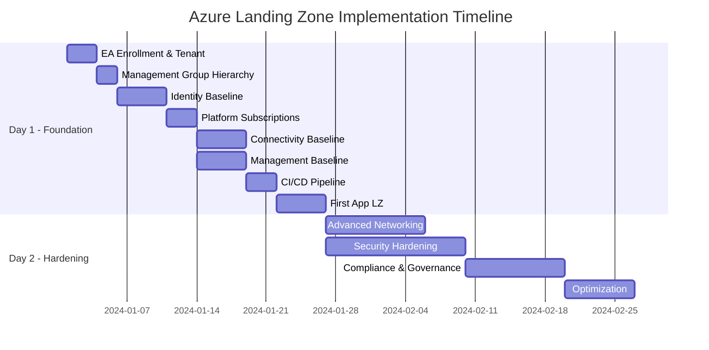
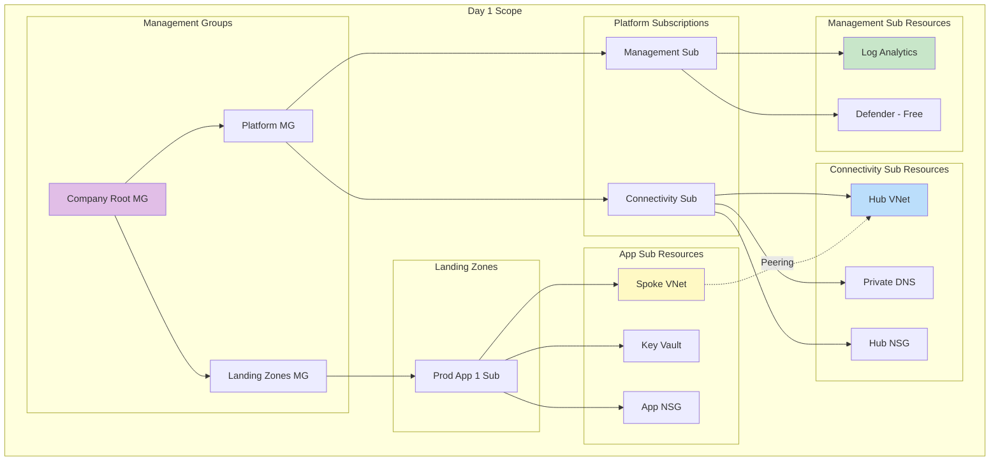
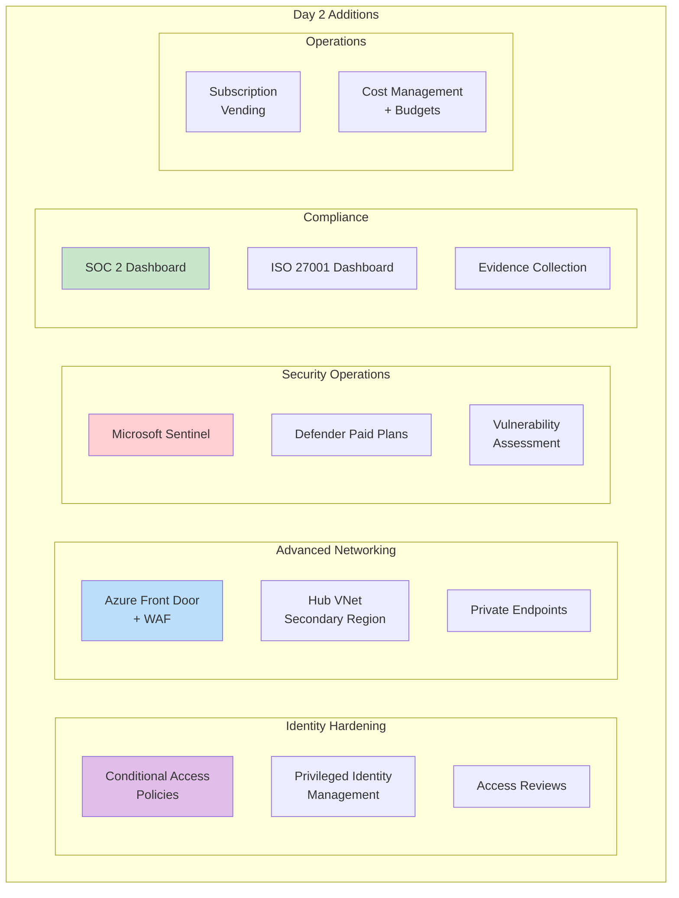
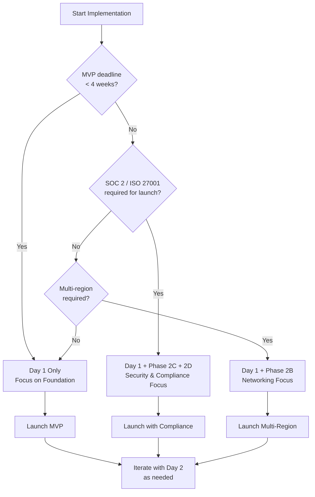

# Day 1 / Day 2 Prioritization

> **Related:** [README](./README.md) | [All Documentation Files](#document-index)

## Table of Contents

1. [Overview](#overview)
2. [Phase Overview](#phase-overview)
3. [Day 1: Foundation (Weeks 1-4)](#day-1-foundation-weeks-1-4)
4. [Day 2: Hardening (Weeks 5-12)](#day-2-hardening-weeks-5-12)
5. [Implementation Decision Tree](#implementation-decision-tree)
6. [Priority Definitions](#priority-definitions)
7. [Quick Reference: What Goes Where](#quick-reference-what-goes-where)
8. [Success Criteria](#success-criteria)
9. [Document Index](#document-index)

---

## Overview

This document provides a phased rollout plan for implementing the Azure Landing Zone architecture. Day 1 focuses on establishing the foundational platform with minimal viable security controls. Day 2 focuses on hardening, optimization, and advanced capabilities.

## Phase Overview

## Day 1: Foundation (Weeks 1-4)

### Goals
- Establish core platform structure
- Enable development teams to deploy workloads
- Implement baseline security controls
- Cost-optimized for startup

### Day 1 Checklist

#### Week 1: Enrollment & Identity

| # | Task | Owner | Docs | Priority |
|---|------|-------|------|----------|
| 1.1 | Create EA enrollment / billing account | Finance + Platform | [EA Architecture](./04-ea-subscription-architecture.md) | P0 |
| 1.2 | Create/configure Entra ID tenant | Platform | [Identity LZ](./01-identity-landing-zone.md) | P0 |
| 1.3 | Create break-glass accounts (2) | Platform | [Identity LZ](./01-identity-landing-zone.md#break-glass-accounts) | P0 |
| 1.4 | Configure emergency access procedure | Platform | [Identity LZ](./01-identity-landing-zone.md#break-glass-accounts) | P0 |
| 1.5 | Create platform admin group | Platform | [Identity LZ](./01-identity-landing-zone.md#group-design) | P0 |
| 1.6 | Enable Security Defaults (temporary) | Platform | [Identity LZ](./01-identity-landing-zone.md) | P0 |
| 1.7 | Register GitHub OIDC app | Platform | [GitHub Actions](./06-github-actions-cicd.md) | P0 |

#### Week 2: Management Groups & Platform Subscriptions

| # | Task | Owner | Docs | Priority |
|---|------|-------|------|----------|
| 2.1 | Create management group hierarchy | Platform | [EA Architecture](./04-ea-subscription-architecture.md#management-group-hierarchy) | P0 |
| 2.2 | Create Management subscription | Platform | [Management LZ](./02-management-landing-zone.md) | P0 |
| 2.3 | Create Connectivity subscription | Platform | [Connectivity LZ](./03-connectivity-landing-zone.md) | P0 |
| 2.4 | Create Identity subscription | Platform | [Identity LZ](./01-identity-landing-zone.md) | P1 |
| 2.5 | Deploy Terraform state storage | Platform | [Terraform Guide](./05-terraform-implementation.md#state-management) | P0 |
| 2.6 | Configure OIDC federated credentials | Platform | [GitHub Actions](./06-github-actions-cicd.md#oidc-configuration) | P0 |
| 2.7 | Deploy CI/CD pipelines | Platform | [GitHub Actions](./06-github-actions-cicd.md) | P0 |

#### Week 3: Connectivity & Management Baseline

| # | Task | Owner | Docs | Priority |
|---|------|-------|------|----------|
| 3.1 | Deploy Hub VNet (primary region) | Platform | [Connectivity LZ](./03-connectivity-landing-zone.md#hub-virtual-network) | P0 |
| 3.2 | Configure Azure DNS private zones | Platform | [Connectivity LZ](./03-connectivity-landing-zone.md#private-dns-zones) | P0 |
| 3.3 | Deploy Log Analytics workspace | Platform | [Management LZ](./02-management-landing-zone.md#log-analytics-workspace) | P0 |
| 3.4 | Enable Defender for Cloud (Free tier) | Platform | [Management LZ](./02-management-landing-zone.md#microsoft-defender-for-cloud) | P0 |
| 3.5 | Configure Activity Log diagnostic settings | Platform | [Management LZ](./02-management-landing-zone.md) | P0 |
| 3.6 | Deploy baseline NSG rules | Platform | [Connectivity LZ](./03-connectivity-landing-zone.md#network-security-groups) | P0 |
| 3.7 | Configure Azure Policy (audit mode) | Platform | [Management LZ](./02-management-landing-zone.md#azure-policy) | P1 |

#### Week 4: First Application Landing Zone

| # | Task | Owner | Docs | Priority |
|---|------|-------|------|----------|
| 4.1 | Create first Landing Zone subscription | Platform | [App LZ](./07-application-landing-zone.md) | P0 |
| 4.2 | Deploy spoke VNet | Platform | [App LZ](./07-application-landing-zone.md#spoke-vnet-template) | P0 |
| 4.3 | Configure VNet peering | Platform | [Connectivity LZ](./03-connectivity-landing-zone.md) | P0 |
| 4.4 | Deploy baseline Key Vault | Platform | [App LZ](./07-application-landing-zone.md#key-vault-configuration) | P0 |
| 4.5 | Configure diagnostic settings | Platform | [App LZ](./07-application-landing-zone.md) | P0 |
| 4.6 | Enable Application Insights | Platform | [App LZ](./07-application-landing-zone.md#observability) | P1 |
| 4.7 | Handoff to application team | Platform | — | P0 |

### Day 1 Architecture

### Day 1 Cost Profile

| Component | SKU/Tier | Est. Monthly Cost |
|-----------|----------|------------------|
| Log Analytics | Pay-as-you-go (5 GB/day free) | $0 - $100 |
| Defender for Cloud | Free tier | $0 |
| Hub VNet | Standard | $5 |
| Spoke VNet | Standard | $5 |
| Key Vault | Standard (< 10K operations) | $5 |
| Storage (Terraform state) | LRS, hot | $2 |
| **Day 1 Platform Total** | — | **~$20 - $120/mo** |

---

## Day 2: Hardening (Weeks 5-12)

### Goals
- Implement advanced security controls
- Enable compliance frameworks
- Add high availability
- Optimize costs and operations

### Day 2 Checklist

#### Phase 2A: Advanced Identity (Weeks 5-6)

| # | Task | Owner | Docs | Priority |
|---|------|-------|------|----------|
| 2A.1 | Disable Security Defaults | Platform | — | P0 |
| 2A.2 | Deploy Conditional Access policies | Platform | [Identity LZ](./01-identity-landing-zone.md#conditional-access-policies) | P0 |
| 2A.3 | Configure PIM for privileged roles | Platform | [Identity LZ](./01-identity-landing-zone.md#privileged-identity-management) | P0 |
| 2A.4 | Configure PIM for Azure roles | Platform | [Identity LZ](./01-identity-landing-zone.md#pim-for-azure-rbac) | P0 |
| 2A.5 | Enable Access Reviews | Platform | [Identity LZ](./01-identity-landing-zone.md#access-reviews) | P1 |
| 2A.6 | Configure service principal governance | Platform | [Identity LZ](./01-identity-landing-zone.md#service-principal-governance) | P1 |
| 2A.7 | Document identity procedures | Platform | — | P1 |

#### Phase 2B: Advanced Networking (Weeks 5-7)

| # | Task | Owner | Docs | Priority |
|---|------|-------|------|----------|
| 2B.1 | Deploy Hub VNet (secondary region) | Platform | [Connectivity LZ](./03-connectivity-landing-zone.md) | P1 |
| 2B.2 | Configure hub-to-hub peering | Platform | [Connectivity LZ](./03-connectivity-landing-zone.md) | P1 |
| 2B.3 | Deploy Azure Front Door | Platform | [Connectivity LZ](./03-connectivity-landing-zone.md#azure-front-door) | P1 |
| 2B.4 | Configure WAF policies | Platform | [Connectivity LZ](./03-connectivity-landing-zone.md#waf-policy) | P1 |
| 2B.5 | Enable DDoS Protection (evaluate) | Platform | [Connectivity LZ](./03-connectivity-landing-zone.md#ddos-protection) | P2 |
| 2B.6 | Deploy Azure Firewall (if required) | Platform | [Connectivity LZ](./03-connectivity-landing-zone.md) | P2 |
| 2B.7 | Configure Private Endpoints for PaaS | Platform | [Connectivity LZ](./03-connectivity-landing-zone.md#private-endpoints) | P1 |

#### Phase 2C: Security Hardening (Weeks 6-8)

| # | Task | Owner | Docs | Priority |
|---|------|-------|------|----------|
| 2C.1 | Enable Defender paid plans | Platform | [Management LZ](./02-management-landing-zone.md#defender-plans) | P0 |
| 2C.2 | Configure Defender auto-provisioning | Platform | [Management LZ](./02-management-landing-zone.md) | P1 |
| 2C.3 | Deploy Microsoft Sentinel | Platform | [Management LZ](./02-management-landing-zone.md#microsoft-sentinel) | P1 |
| 2C.4 | Configure Sentinel connectors | Platform | [Management LZ](./02-management-landing-zone.md) | P1 |
| 2C.5 | Deploy Sentinel analytics rules | Platform | [Management LZ](./02-management-landing-zone.md) | P1 |
| 2C.6 | Configure security alerts | Platform | [Management LZ](./02-management-landing-zone.md#alerting-configuration) | P0 |
| 2C.7 | Enable vulnerability scanning | Platform | [Management LZ](./02-management-landing-zone.md) | P1 |

#### Phase 2D: Compliance & Governance (Weeks 8-10)

| # | Task | Owner | Docs | Priority |
|---|------|-------|------|----------|
| 2D.1 | Enable Azure Policy Deny effects | Platform | [Management LZ](./02-management-landing-zone.md#azure-policy) | P0 |
| 2D.2 | Configure SOC 2 compliance standard | Platform | [Compliance](./08-compliance-baseline.md#soc-2-type-ii-control-mapping) | P0 |
| 2D.3 | Configure ISO 27001 compliance standard | Platform | [Compliance](./08-compliance-baseline.md#iso-27001-control-mapping) | P1 |
| 2D.4 | Set up compliance dashboard | Platform | [Compliance](./08-compliance-baseline.md#microsoft-defender-for-cloud-configuration) | P1 |
| 2D.5 | Configure evidence collection | Platform | [Compliance](./08-compliance-baseline.md#evidence-collection-strategy) | P1 |
| 2D.6 | Set up Cost Management budgets | Platform | [Management LZ](./02-management-landing-zone.md#cost-management) | P0 |
| 2D.7 | Configure anomaly alerts | Platform | [Management LZ](./02-management-landing-zone.md#cost-alerts) | P1 |

#### Phase 2E: Optimization (Weeks 10-12)

| # | Task | Owner | Docs | Priority |
|---|------|-------|------|----------|
| 2E.1 | Implement subscription vending automation | Platform | [App LZ](./07-application-landing-zone.md#subscription-vending) | P1 |
| 2E.2 | Create reusable Terraform modules | Platform | [Terraform Guide](./05-terraform-implementation.md) | P1 |
| 2E.3 | Document onboarding process | Platform | [App LZ](./07-application-landing-zone.md) | P1 |
| 2E.4 | Implement tagging governance | Platform | [EA Architecture](./04-ea-subscription-architecture.md#tagging-strategy) | P1 |
| 2E.5 | Review and right-size resources | Platform | — | P2 |
| 2E.6 | Evaluate Reserved Instances | Platform | — | P2 |
| 2E.7 | Document DR procedures | Platform | — | P1 |

### Day 2 Architecture Additions

### Day 2 Additional Cost Profile

| Component | SKU/Tier | Est. Monthly Cost |
|-----------|----------|------------------|
| Defender for Cloud | Defender CSPM, Servers P2, etc. | $200 - $500 |
| Microsoft Sentinel | Pay-as-you-go | $100 - $300 |
| Azure Front Door | Premium + WAF | $50 - $200 |
| DDoS Protection | Standard (if enabled) | $2,944 |
| Azure Firewall (if required) | Standard | $1,000 |
| PIM | Entra ID P2 (per user) | $9/user/mo |
| **Day 2 Platform Additions** | — | **~$400 - $5,000/mo** |

> **Note:** DDoS Protection Standard has a fixed cost. Evaluate carefully vs. DDoS IP Protection per-IP model for startups.

---

## Implementation Decision Tree

## Priority Definitions

| Priority | Definition | Day 1 Expectation | Day 2 Expectation |
|----------|------------|-------------------|-------------------|
| **P0** | Blocker for go-live | Must complete | Must complete |
| **P1** | Important, low risk to defer | Best effort | Should complete |
| **P2** | Nice to have | Optional | Best effort |

## Quick Reference: What Goes Where

| Capability | Day 1 | Day 2 |
|------------|-------|-------|
| Break-glass accounts | ✅ | — |
| Security Defaults (MFA) | ✅ | Replaced by CA |
| Conditional Access | — | ✅ |
| PIM | — | ✅ |
| Management Groups | ✅ | — |
| Hub VNet (primary) | ✅ | — |
| Hub VNet (secondary) | — | ✅ |
| NSGs | ✅ | — |
| Azure Firewall | — | ✅ (if needed) |
| Azure Front Door | — | ✅ |
| Private Endpoints | — | ✅ |
| Log Analytics | ✅ | — |
| Defender Free | ✅ | Upgraded |
| Defender Paid Plans | — | ✅ |
| Microsoft Sentinel | — | ✅ |
| Azure Policy (Audit) | ✅ | — |
| Azure Policy (Deny) | — | ✅ |
| SOC 2 / ISO 27001 Dashboard | — | ✅ |
| Cost Management Budgets | — | ✅ |
| Subscription Vending | Manual | Automated |

## Success Criteria

### Day 1 Complete When:
- [ ] All management groups created
- [ ] Platform subscriptions provisioned
- [ ] Hub VNet deployed and operational
- [ ] CI/CD pipeline deploying infrastructure
- [ ] First application team can deploy workloads
- [ ] Break-glass accounts tested
- [ ] Basic monitoring in place

### Day 2 Complete When:
- [ ] All Conditional Access policies active
- [ ] PIM configured for all privileged roles
- [ ] Defender paid plans enabled
- [ ] Sentinel operational with analytics rules
- [ ] Compliance dashboards showing status
- [ ] Evidence collection automated
- [ ] DR procedures documented and tested
- [ ] Subscription vending automated

---

## Document Index

| # | Document | Description |
|---|----------|-------------|
| 00 | [README](./README.md) | Architecture overview and index |
| 01 | [Identity Landing Zone](./01-identity-landing-zone.md) | Entra ID, PIM, Conditional Access |
| 02 | [Management Landing Zone](./02-management-landing-zone.md) | Monitoring, security, governance |
| 03 | [Connectivity Landing Zone](./03-connectivity-landing-zone.md) | Networking, DNS, Front Door |
| 04 | [EA & Subscription Architecture](./04-ea-subscription-architecture.md) | Management groups, subscriptions |
| 05 | [Terraform Implementation](./05-terraform-implementation.md) | IaC modules and state management |
| 06 | [GitHub Actions CI/CD](./06-github-actions-cicd.md) | OIDC and deployment pipelines |
| 07 | [Application Landing Zone](./07-application-landing-zone.md) | App team template |
| 08 | [Compliance Baseline](./08-compliance-baseline.md) | SOC 2, ISO 27001 mappings |
| 09 | [Day 1/Day 2 Prioritization](./09-day1-day2-prioritization.md) | This document |

---

**Previous:** [08 - Compliance Baseline](./08-compliance-baseline.md) | **Home:** [README](./README.md)
