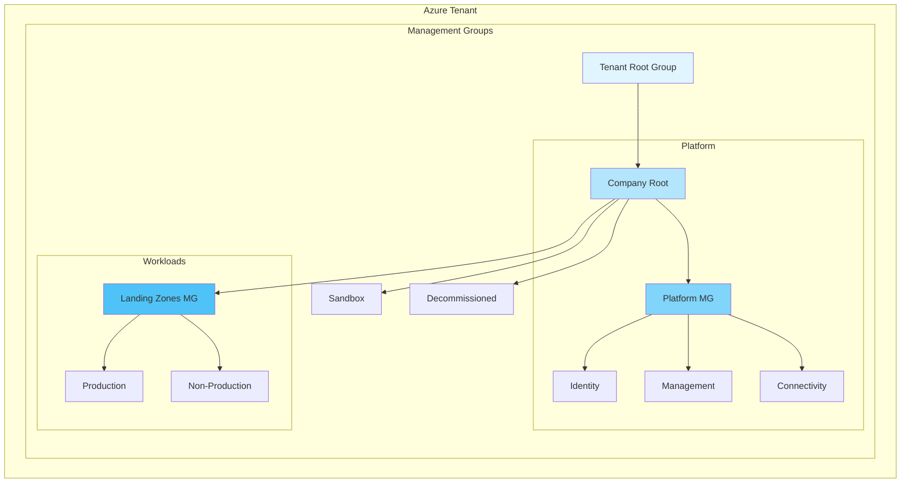

# Azure Tenant Setup for SaaS Startup

> **Documentation Phase** — This repository contains comprehensive guidance for setting up a greenfield Azure tenant for a SaaS startup. Code implementation will follow in a separate phase.

## Table of Contents

1. [Context](#context)
2. [Architecture Overview](#architecture-overview)
3. [Documentation Structure](#documentation-structure)
4. [Framework References](#framework-references)
5. [Quick Start](#quick-start)
6. [Key Design Decisions](#key-design-decisions)
7. [Contributing](#contributing)

---

## Context

| Attribute | Value |
|-----------|-------|
| **Scenario** | Greenfield Azure tenant for SaaS startup |
| **Billing** | New tenant under existing EA enrollment |
| **Connectivity** | Cloud-only (no on-premises/hybrid) |
| **Product Type** | Multi-region SaaS application |
| **Deployment** | Multi-region (active-active or active-passive) |
| **Compliance** | SOC 2 Type II, ISO 27001 |
| **IaC Tooling** | Terraform |
| **CI/CD Pipeline** | GitHub Actions |
| **Accelerator** | [Azure Landing Zones Terraform Module](https://github.com/Azure/terraform-azurerm-caf-enterprise-scale) |
| **Date** | January 2026 |

## Architecture Overview

## Documentation Structure

This documentation is organized into the following sections:

### Platform Landing Zones

| Document | Description |
|----------|-------------|
| [01 - Identity Landing Zone](./01-identity-landing-zone.md) | Microsoft Entra ID configuration, PIM, Conditional Access, break-glass accounts |
| [02 - Management Landing Zone](./02-management-landing-zone.md) | Log Analytics, Defender for Cloud, Azure Monitor, Azure Policy, Cost Management |
| [03 - Connectivity Landing Zone](./03-connectivity-landing-zone.md) | Multi-region networking, DNS, DDoS protection, Private Endpoints, Front Door |

### Organization & Governance

| Document | Description |
|----------|-------------|
| [04 - EA & Subscription Architecture](./04-ea-subscription-architecture.md) | EA enrollment, management group hierarchy, subscription vending, tagging |
| [05 - Terraform Implementation Guide](./05-terraform-implementation.md) | ALZ module configuration, remote state, multi-region structure |
| [06 - GitHub Actions CI/CD](./06-github-actions-cicd.md) | Repository structure, OIDC authentication, workflows, secrets management |

### Application Teams

| Document | Description |
|----------|-------------|
| [07 - Application Landing Zone Template](./07-application-landing-zone.md) | Subscription vending, baseline modules, naming conventions, network security |
| [08 - Compliance Baseline](./08-compliance-baseline.md) | SOC 2 / ISO 27001 control mappings, evidence collection, data residency |

### Implementation Planning

| Document | Description |
|----------|-------------|
| [09 - Day 1 / Day 2 Prioritization](./09-day1-day2-prioritization.md) | MVP requirements, hardening phases, rollout checklist |

## Framework References

- [Cloud Adoption Framework](https://learn.microsoft.com/azure/cloud-adoption-framework/)
- [Well-Architected Framework](https://learn.microsoft.com/azure/architecture/framework/)
- [Azure Landing Zones](https://learn.microsoft.com/azure/cloud-adoption-framework/ready/landing-zone/)
- [Azure Landing Zones Terraform Accelerator](https://aka.ms/alz/accelerator)

## Quick Start

1. **Review the architecture** — Start with [04 - EA & Subscription Architecture](./04-ea-subscription-architecture.md) to understand the management group hierarchy
2. **Understand identity requirements** — Review [01 - Identity Landing Zone](./01-identity-landing-zone.md) for Entra ID setup
3. **Plan the implementation** — Use [09 - Day 1 / Day 2 Prioritization](./09-day1-day2-prioritization.md) for phased rollout
4. **Set up CI/CD** — Follow [06 - GitHub Actions CI/CD](./06-github-actions-cicd.md) for pipeline configuration

## Key Design Decisions

| Decision | Choice | Rationale |
|----------|--------|-----------|
| **IaC Tool** | Terraform | Team familiarity, multi-cloud capability, strong Azure provider |
| **CI/CD Platform** | GitHub Actions | Native integration, OIDC support, cost-effective for startups |
| **Authentication** | Workload Identity Federation (OIDC) | No secrets to manage, automatic token rotation |
| **Network Topology** | Hub-spoke per region | Simplified for cloud-only, cost-optimized |
| **Firewall** | NSG-based (Day 1) → Azure Firewall (Day 2) | Cost optimization for startup scale |
| **Global Load Balancer** | Azure Front Door | Built-in WAF, global presence, simplified management |

## Contributing

This documentation is maintained by the platform team. For questions or suggestions:

1. Open an issue in this repository
2. Submit a pull request with proposed changes
3. Contact the platform team via Teams

---

**Next Steps:** Begin with [01 - Identity Landing Zone](./01-identity-landing-zone.md) or jump to [09 - Day 1 / Day 2 Prioritization](./09-day1-day2-prioritization.md) for implementation planning.
