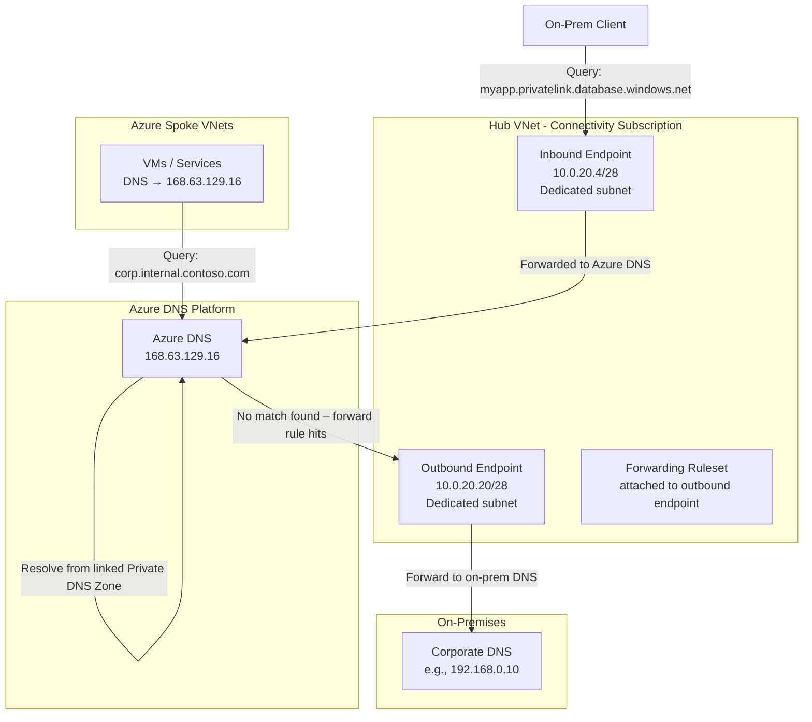
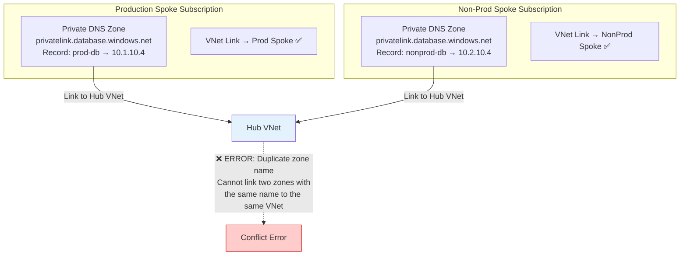
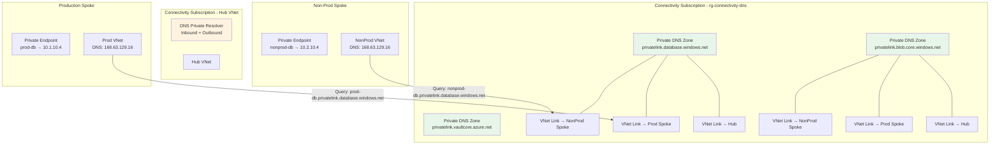
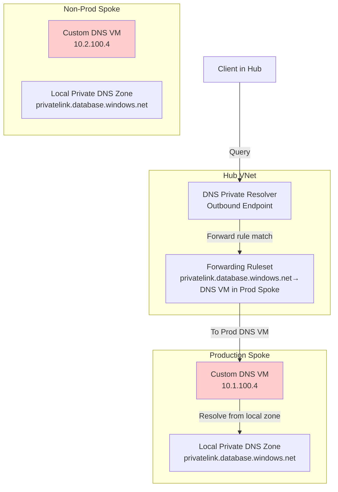
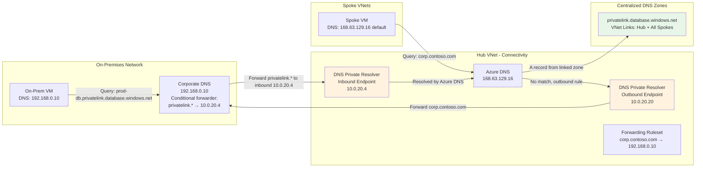

> **Related:** [Connectivity Landing Zone](./03-connectivity-landing-zone.md) | [Application Landing Zone](./07-application-landing-zone.md) | [README](./README.md)

## Table of Contents

1. [Why DNS is the Backbone of Private Connectivity](#why-dns-is-the-backbone-of-private-connectivity)
2. [Component Reference](#component-reference)
3. [The Enterprise DNS Design Question](#the-enterprise-dns-design-question)
4. [Architectural Patterns](#architectural-patterns)
5. [Decision Matrix](#decision-matrix)
6. [Role Summary of Each Component](#role-summary-of-each-component)
7. [Implementation Checklist](#implementation-checklist)
8. [Common Misconfigurations and How to Detect Them](#common-misconfigurations-and-how-to-detect-them)
9. [Azure Landing Zone Policy Alignment](#azure-landing-zone-policy-alignment)
10. [Microsoft Documentation References](#microsoft-documentation-references)

---

## Why DNS is the Backbone of Private Connectivity

Every private endpoint deployed in Azure depends on correct DNS resolution to route traffic privately. When an application connects to `mystorage.blob.core.windows.net`, one of two things happens:

1. DNS resolves the name to a **public IP** and traffic traverses the internet.
2. DNS resolves the name to a **private IP** (the private endpoint NIC) and traffic stays entirely within the virtual network fabric.

Private DNS Zones and Azure DNS Private Resolver together ensure outcome two happens reliably across every spoke, region, and network boundary. Getting this architecture wrong is one of the most common root causes of private endpoint connectivity failures and name resolution inconsistencies in enterprise environments.

## Component Reference

### Azure DNS (Platform Default)

Azure DNS is the platform-level resolver present in every Azure virtual network. It is not a deployable resource: it is permanently available at the link-local address **[168.63.129.16](https://learn.microsoft.com/azure/virtual-network/what-is-ip-address-168-63-129-16)** and serves as the default DNS resolver when no custom DNS server is configured on a VNet.

Azure DNS resolves:

- Azure service FQDNs (e.g., `storage.azure.com`, `management.azure.com`)
- Internal VNet hostnames (resource name auto-registration)
- Private DNS zones that are **linked** to the VNet

When Azure DNS receives a query for a name like `mydb.privatelink.database.windows.net`, it checks whether a Private DNS Zone for `privatelink.database.windows.net` is linked to the originating VNet. If a matching record (A record) exists in that zone, it returns the private IP of the private endpoint. If no zone is linked, it falls back to public DNS and returns the service's public IP.

### Azure Private DNS Zones

A [Private DNS Zone](https://learn.microsoft.com/azure/dns/private-dns-overview) is an Azure resource that holds DNS records (A, CNAME, TXT, etc.) for a closed namespace. Private DNS Zones have no internet exposure: they are only visible and queryable from VNets that have a **Virtual Network Link** established to them.

Each Azure PaaS service that supports Private Endpoints uses a dedicated DNS zone name following the `privatelink.*` convention. The table below lists the most commonly used zones. The complete and authoritative list for every Azure service is maintained at [Azure private endpoint DNS configuration](https://learn.microsoft.com/azure/private-link/private-endpoint-dns):

| Service | Private DNS Zone |
|---------|-----------------|
| Azure Blob Storage | `privatelink.blob.core.windows.net` |
| Azure File Storage | `privatelink.file.core.windows.net` |
| Azure SQL Database | `privatelink.database.windows.net` |
| Azure Cosmos DB (NoSQL) | `privatelink.documents.azure.com` |
| Azure Key Vault | `privatelink.vaultcore.azure.net` |
| Azure Container Registry | `privatelink.azurecr.io` |
| Azure Redis Cache | `privatelink.redis.cache.windows.net` |
| Azure Event Hubs / Service Bus | `privatelink.servicebus.windows.net` |
| Azure AI Services / Azure OpenAI | `privatelink.cognitiveservices.azure.com` |
| Azure Monitor (AMPLS) | `privatelink.monitor.azure.com` |
| Log Analytics (data ingestion) | `privatelink.ods.opinsights.azure.com` |
| Log Analytics (agent) | `privatelink.oms.opinsights.azure.com` |

When a private endpoint is created, Azure automatically creates an A record in the corresponding Private DNS Zone (if the zone is associated with the private endpoint via a **[Private DNS Zone Group](https://learn.microsoft.com/azure/private-link/private-endpoint-dns#private-dns-zone-group)**). The A record maps the service FQDN to the NIC's private IP address.

#### Virtual Network Links

A **Virtual Network Link** connects a Private DNS Zone to a VNet so that Azure DNS (168.63.129.16) within that VNet can resolve names in the zone. Key constraints:

- **One link per zone per VNet.** You cannot create two Virtual Network Links from the same zone to the same VNet.
- **The same zone name cannot exist in two separate zones and both be linked to the same VNet.** If both a zone named `privatelink.database.windows.net` in Resource Group A and another zone with the same name in Resource Group B are linked to the same VNet, Azure raises a conflict error: only one authoritative zone per name per VNet is permitted.
- A single Private DNS Zone can be linked to up to **1,000 VNets** (see [Azure DNS limits](https://learn.microsoft.com/azure/azure-resource-manager/management/azure-subscription-service-limits#azure-dns-limits)).
- VNet links can optionally enable **auto-registration**, which automatically creates A records for VMs in the VNet. For `privatelink.*` zones, auto-registration should always be **disabled** (records are managed by private endpoint provisioning, not by VMs).

### Azure DNS Private Resolver

[Azure DNS Private Resolver](https://learn.microsoft.com/azure/dns/dns-private-resolver-overview) is a fully managed, high-availability DNS proxy service deployed inside a VNet. It acts as a **DNS forwarding bridge** between environments that cannot share the same DNS namespace.



The DNS Private Resolver exposes two distinct endpoint types:

#### Inbound Endpoint

The inbound endpoint receives DNS queries from **outside the VNet** (typically on-premises machines reachable over ExpressRoute or VPN) and forwards them to Azure DNS (168.63.129.16) within the Hub VNet. This allows on-premises clients to resolve Azure private endpoint FQDNs without deploying a VM-based DNS forwarder.

A dedicated `/28` subnet within the Hub VNet hosts the inbound endpoint. This subnet must be:

- Delegated to `Microsoft.Network/dnsResolvers`
- Free of any other resources (no private endpoints, no VMs)
- Reachable from on-premises over ExpressRoute or VPN

See [Azure DNS Private Resolver endpoints and rulesets](https://learn.microsoft.com/azure/dns/private-resolver-endpoints-rulesets) for the full subnet requirements and constraints.

#### Outbound Endpoint

The outbound endpoint originates DNS queries **toward external DNS servers** based on forwarding rules. A Forwarding Ruleset attached to the outbound endpoint defines which domain suffixes route to which DNS servers. Any domain not matching a rule falls back to Azure DNS.

A dedicated `/28` subnet hosts the outbound endpoint with the same delegation requirement as the inbound subnet.

#### Forwarding Ruleset

A [Forwarding Ruleset](https://learn.microsoft.com/azure/dns/private-resolver-endpoints-rulesets#forwarding-rulesets) is a standalone resource linked to the outbound endpoint and optionally associated with additional VNets. Each rule pairs a domain suffix with one or more DNS target IP addresses:

```yaml
forwarding_rulesets:
  - name: "ruleset-hybrid-dns"
    rules:
      - domain: "corp.contoso.com."         # On-premises corporate domain
        targets: ["192.168.0.10:53", "192.168.0.11:53"]
      - domain: "partner.fabrikam.com."     # External partner domain
        targets: ["203.0.113.50:53"]
      # All other queries fall back to Azure DNS (168.63.129.16)
```

> **Note:** Azure Monitor Private Link Scope (AMPLS) requires linking five Private DNS Zones together: `privatelink.monitor.azure.com`, `privatelink.ods.opinsights.azure.com`, `privatelink.oms.opinsights.azure.com`, `privatelink.agentsvc.azure-automation.net`, and `privatelink.blob.core.windows.net`. All five must be linked to each VNet that uses AMPLS for private connectivity to monitoring services. See the [Azure Monitor private link documentation](https://learn.microsoft.com/azure/azure-monitor/logs/private-link-configure) for the full list.

## The Enterprise DNS Design Question

The following section addresses the architectural question of whether Private DNS Zones should live centrally in the Hub VNet or be distributed across Spoke VNets, and what role the DNS Private Resolver plays in each pattern.

### The Name Collision Problem (Why Spoke-Based Zones Break)

When Private DNS Zones are created independently in each Spoke VNet (e.g., one `privatelink.database.windows.net` in the Production Spoke and another with the same name in the Non-Prod Spoke), the following problem emerges when attempting to centralize resolution through the Hub:



Azure rejects the second Virtual Network Link because the Hub VNet already resolves `privatelink.database.windows.net` through the first zone. This is not a transient error; it is a fundamental platform constraint.

**The DNS Private Resolver does not eliminate this name collision.** Even if a DNS Private Resolver is deployed in the Hub, it still relies on Azure DNS (168.63.129.16) to answer queries within the Hub's scope. The collision occurs at the Azure DNS layer, not at the resolver layer.

## Architectural Patterns

### Pattern 1: Centralized Private DNS Zones (Recommended)

All Private DNS Zones are created **once** in the **Connectivity subscription**, hosted within a dedicated resource group (e.g., `rg-connectivity-dns`). Each zone is linked to every VNet that needs to resolve that zone's names: the Hub and all Spokes.



#### How it works

1. A private endpoint is deployed in the Production Spoke with a **Private DNS Zone Group** pointing to the centralized `privatelink.database.windows.net` zone in the Connectivity subscription.
2. Azure automatically creates an A record (`prod-db → 10.1.10.4`) in that central zone.
3. Any Spoke VNet with a Virtual Network Link to that zone resolves the A record correctly via Azure DNS (168.63.129.16).
4. No Spoke VNet needs its own copy of the zone.

#### Eliminating existing Spoke-based zone collisions

When migrating from a distributed model to centralized zones:

```text
Migration Steps:

1. Create canonical zones in rg-connectivity-dns (Connectivity subscription).
2. For each zone, create Virtual Network Links to Hub and all Spoke VNets.
3. Remove (unlink) existing VNet Links from zone copies in Spoke subscriptions.
4. Reassociate Private DNS Zone Groups on existing private endpoints to point to
   the new canonical zones.
5. Delete the redundant zone copies from Spoke resource groups.
6. Validate: nslookup <private-endpoint-fqdn> from a VM in each Spoke — confirm
   private IP is returned.
```

#### Configuration example

```yaml
private_dns_zone_centralized:
  resource_group: "rg-connectivity-dns"
  subscription: "connectivity-subscription-id"

  zones:
    - name: "privatelink.database.windows.net"
      virtual_network_links:
        - vnet: "vnet-hub-eastus2-001"
          registration_enabled: false
        - vnet: "vnet-spoke-prod-eastus2-001"
          registration_enabled: false
        - vnet: "vnet-spoke-nonprod-eastus2-001"
          registration_enabled: false
        - vnet: "vnet-hub-westus2-001"
          registration_enabled: false
        - vnet: "vnet-spoke-prod-westus2-001"
          registration_enabled: false

    - name: "privatelink.blob.core.windows.net"
      virtual_network_links:
        # (same VNets as above)

    - name: "privatelink.vaultcore.azure.net"
      virtual_network_links:
        # (same VNets as above)
```

#### Advantages

- No name collisions: one zone per namespace, period.
- Private endpoints created in any spoke automatically register their A records in the correct central zone when the Private DNS Zone Group is correctly configured.
- Adding a new spoke requires only adding Virtual Network Links to existing zones, not creating new zones.
- RBAC can be delegated: application teams can create private endpoints and zone groups without needing to create or manage zones.
- Aligns directly with the [Azure Landing Zone DNS guidance](https://learn.microsoft.com/azure/cloud-adoption-framework/ready/azure-best-practices/private-link-and-dns-integration-at-scale).

#### Limitations

- Requires the Connectivity/platform team to own and maintain the centralized zone resource group.
- Application teams must reference the correct zone resource IDs (can be solved with policy or shared variables).
- When crossing subscription boundaries, Private DNS Zone Group configuration requires appropriate cross-subscription permissions.

### Pattern 2: Spoke-Local DNS Zones with DNS Private Resolver Forwarding (Not Recommended)

Private DNS Zones remain in each Spoke subscription. A DNS Private Resolver in the Hub uses forwarding rules to direct `privatelink.*` queries to a custom DNS server (e.g., a Windows DNS Server VM or a DNS forwarder) that knows how to reach the Spoke-local zones.



#### Why this pattern creates more problems than it solves

- Requires VM-based DNS servers in every spoke, adding operational overhead, patching burden, and single-point-of-failure risk.
- The forwarding ruleset can only route a domain suffix to **one set of target servers** per rule. If both Production and Non-Prod Spokes use `privatelink.database.windows.net`, you cannot forward the same domain to two different DNS VMs from a single ruleset; you would need client-specific routing logic that Azure DNS forwarding does not natively support.
- DNS Private Resolver forwarding rulesets are applied VNet-wide. A client in the Hub VNet would always forward `privatelink.database.windows.net` to one specific Spoke's DNS VM, making cross-spoke resolution for the same zone name impossible from the same VNet.
- The name collision is simply relocated from the VNet Link layer to the DNS forwarding routing layer.
- Application teams lose the ability to use Azure-native Private DNS Zone Group auto-registration and must manually manage A records.

### Pattern 3: Centralized Zones + DNS Private Resolver for Hybrid Scenarios (Recommended for Hybrid)

This pattern combines the centralized zone design from Pattern 1 with a DNS Private Resolver to handle hybrid DNS scenarios (on-premises to Azure and Azure to on-premises).



#### How the collaboration works

The centralized Private DNS Zones answer all `privatelink.*` queries within Azure VNets natively via Azure DNS. The DNS Private Resolver adds the cross-boundary forwarding capability:

- **Inbound endpoint:** Receives queries from on-premises machines (routed by the corporate DNS server's conditional forwarder pointing to the inbound IP). Azure DNS resolves the query using the linked Private DNS Zones and returns the private IP.
- **Outbound endpoint + ruleset:** Routes queries from Azure VMs for on-premises or partner domains to the appropriate external DNS servers.

The two components are complementary, not competing. Private DNS Zones handle the record storage and resolution for Azure PaaS services. The DNS Private Resolver handles the **routing** of queries between network boundaries. For a detailed walkthrough of this hybrid topology, see [Resolve Azure and on-premises domains](https://learn.microsoft.com/azure/dns/private-resolver-hybrid-dns).

## Decision Matrix

| Scenario | Recommended Approach | Private DNS Zone Location | DNS Private Resolver Needed |
|---|---|---|---|
| Cloud-only, single region | Centralized in Connectivity subscription | Hub resource group | No |
| Cloud-only, multi-region | Centralized in Connectivity subscription | Single global resource group (zones are global) | No |
| Hybrid (ExpressRoute/VPN) | Centralized + DNS Private Resolver | Connectivity subscription | Yes (inbound + outbound) |
| Regulated multi-tenant SaaS | Centralized with policy enforcement | Connectivity subscription | Recommended |
| Spoke-isolated test environments | Centralized + separate zones for isolated tenants | Connectivity + per-tenant zone override | Optional |

## Role Summary of Each Component

| Component | Deployed In | Primary Role | Solves |
|---|---|---|---|
| Azure DNS (168.63.129.16) | Platform (no deployment) | Default resolver for all VNets | Auto-resolution of linked zones |
| Private DNS Zone | Connectivity subscription (centralized) | Authoritative zone for `privatelink.*` FQDNs | Private endpoint FQDN to private IP mapping |
| Virtual Network Link | On each Private DNS Zone | Grants a VNet access to resolve the zone | Scoping zone visibility to specific VNets |
| Private DNS Zone Group | On each Private Endpoint | Auto-creates A records in the correct zone | Lifecycle management of DNS records |
| DNS Private Resolver – Inbound | Hub VNet (dedicated subnet) | Accepts DNS queries from outside the VNet | On-premises to Azure private DNS resolution |
| DNS Private Resolver – Outbound | Hub VNet (dedicated subnet) | Originates forwarded queries to external DNS | Azure to on-premises (or partner) DNS resolution |
| Forwarding Ruleset | Attached to outbound endpoint | Defines conditional forwarding rules | Domain-based routing to external DNS servers |

## Implementation Checklist

### Phase 1: Centralize Private DNS Zones

- [ ] Create resource group `rg-connectivity-dns` in the Connectivity subscription.
- [ ] Create one Private DNS Zone per `privatelink.*` service in scope.
- [ ] Disable auto-registration on all virtual network links.
- [ ] Create Virtual Network Links from each zone to: Hub VNet (all regions), each Spoke VNet.
- [ ] Update Private DNS Zone Group configuration on all existing private endpoints to reference the centralized zones.
- [ ] Remove orphaned zone copies from Spoke resource groups.
- [ ] Apply Azure Policy to enforce auto-registration in centralized zones for new private endpoints. See [Private Link and DNS integration at scale](https://learn.microsoft.com/azure/cloud-adoption-framework/ready/azure-best-practices/private-link-and-dns-integration-at-scale) for the recommended `DeployIfNotExists` policies used in Azure Landing Zone deployments.

### Phase 2: Deploy DNS Private Resolver (Hybrid only)

- [ ] Create two dedicated `/28` subnets in the Hub VNet: `snet-dnsresolver-inbound` and `snet-dnsresolver-outbound`.
- [ ] Delegate both subnets to `Microsoft.Network/dnsResolvers` (see [subnet requirements](https://learn.microsoft.com/azure/dns/private-resolver-endpoints-rulesets)).
- [ ] Deploy DNS Private Resolver with inbound and outbound endpoints (see [Quickstart: Create an Azure DNS Private Resolver](https://learn.microsoft.com/azure/dns/dns-private-resolver-create-portal)).
- [ ] Create forwarding ruleset with rules for on-premises domain suffixes (e.g., `corp.contoso.com.`).
- [ ] Associate the forwarding ruleset to the outbound endpoint and to additional VNets as needed.
- [ ] Configure on-premises DNS server: add conditional forwarder for `privatelink.*` suffixes pointing to the inbound endpoint IP.

### Validation

```bash
# Validate from a VM inside a Spoke VNet
# A private IP should be returned, not a public IP

nslookup prod-db.privatelink.database.windows.net
# Expected: Address: 10.1.10.4 (the private endpoint NIC IP)

nslookup prod-storage.privatelink.blob.core.windows.net
# Expected: Address: 10.1.10.5

# Validate from on-premises (if hybrid)
nslookup prod-db.privatelink.database.windows.net <inbound-endpoint-ip>
# Expected: Address: 10.1.10.4
```

## Common Misconfigurations and How to Detect Them

### A record missing in the centralized zone

**Symptom:** `nslookup` returns the public IP of the Azure service, not a private IP.

**Cause:** The private endpoint's Private DNS Zone Group points to the wrong zone, or no zone group is configured.

**Fix:** Navigate to the private endpoint in the Azure portal, open the DNS configuration tab, and verify the zone group references the centralized zone in the Connectivity subscription.

### VNet Link missing from a Spoke

**Symptom:** Resolution from the new Spoke returns public IP; other Spokes resolve correctly.

**Cause:** The Virtual Network Link for the new Spoke was not added to the centralized zone.

**Fix:** Add a Virtual Network Link from the centralized zone to the new Spoke's VNet. Resolution is effective within a few minutes.

### Zone collision when adding a VNet Link

**Symptom:** Azure portal or Terraform returns a "DNS Zone Link conflict" or "A virtual network link already exists" error.

**Cause:** A duplicate Private DNS Zone with the same name already exists in another resource group and is already linked to the target VNet.

**Fix:** Identify the duplicate zone using Azure Resource Graph, remove its VNet link, reassociate any private endpoint zone groups to the canonical centralized zone, then delete the duplicate.

```bash
# Identify all zones with the same name across subscriptions
az graph query -q "
  Resources
  | where type == 'microsoft.network/privatednszones'
  | where name == 'privatelink.database.windows.net'
  | project name, resourceGroup, subscriptionId, id
" --query "data"
```

### DNS resolution fails from on-premises (hybrid)

**Symptom:** On-premises machines cannot resolve `privatelink.*` FQDNs.

**Cause:** Corporate DNS server lacks a conditional forwarder pointing to the DNS Private Resolver inbound endpoint IP, or ExpressRoute/VPN connectivity to the Hub VNet subnet is missing.

**Fix:** Add a conditional forwarder on the corporate DNS server for each `privatelink.*` suffix (or a wildcard `privatelink.*` forwarder) pointing to the inbound endpoint IP (e.g., `10.0.20.4`). Verify that the corporate DNS server can reach port 53 at that IP over ExpressRoute/VPN.

## Azure Landing Zone Policy Alignment

The [Azure Landing Zone reference implementation](https://learn.microsoft.com/azure/cloud-adoption-framework/ready/landing-zone/) enforces centralized DNS through built-in policies assigned at the management group level. The [Private Link and DNS integration at scale](https://learn.microsoft.com/azure/cloud-adoption-framework/ready/azure-best-practices/private-link-and-dns-integration-at-scale) guidance describes the exact policy set and the reasoning behind centralized DNS ownership:

| Policy | Effect | Purpose |
|---|---|---|
| `Deploy DNS Zone Group for Blob Private Endpoint` | DeployIfNotExists | Auto-creates zone group pointing to centralized blob zone |
| `Deploy DNS Zone Group for SQL Private Endpoint` | DeployIfNotExists | Auto-creates zone group pointing to centralized SQL zone |
| `Deny creation of Private DNS Zones in non-connectivity subscriptions` | Deny | Prevents application teams from creating rogue local zones |

Assign the deny policy at the Landing Zones management group and exempt the Connectivity subscription. This ensures all new private endpoints in application landing zones automatically register in centralized zones and eliminates the risk of zone sprawl over time.

## Microsoft Documentation References

The following table lists every primary Microsoft public document referenced in this guide. All links resolve to the official Microsoft Learn documentation.

### Azure DNS

| Topic | Microsoft Learn URL |
|---|---|
| What is IP address 168.63.129.16? | [learn.microsoft.com/azure/virtual-network/what-is-ip-address-168-63-129-16](https://learn.microsoft.com/azure/virtual-network/what-is-ip-address-168-63-129-16) |
| Azure Private DNS overview | [learn.microsoft.com/azure/dns/private-dns-overview](https://learn.microsoft.com/azure/dns/private-dns-overview) |
| Azure Private DNS – Virtual Network Links | [learn.microsoft.com/azure/dns/private-dns-virtual-network-links](https://learn.microsoft.com/azure/dns/private-dns-virtual-network-links) |
| Azure DNS limits (VNet links per zone, zones per VNet) | [learn.microsoft.com/azure/azure-resource-manager/management/azure-subscription-service-limits#azure-dns-limits](https://learn.microsoft.com/azure/azure-resource-manager/management/azure-subscription-service-limits#azure-dns-limits) |
| Azure DNS Private Resolver overview | [learn.microsoft.com/azure/dns/dns-private-resolver-overview](https://learn.microsoft.com/azure/dns/dns-private-resolver-overview) |
| DNS Private Resolver endpoints and rulesets | [learn.microsoft.com/azure/dns/private-resolver-endpoints-rulesets](https://learn.microsoft.com/azure/dns/private-resolver-endpoints-rulesets) |
| Quickstart: Create an Azure DNS Private Resolver (portal) | [learn.microsoft.com/azure/dns/dns-private-resolver-create-portal](https://learn.microsoft.com/azure/dns/dns-private-resolver-create-portal) |
| Resolve Azure and on-premises domains (hybrid DNS) | [learn.microsoft.com/azure/dns/private-resolver-hybrid-dns](https://learn.microsoft.com/azure/dns/private-resolver-hybrid-dns) |

### Azure Private Link and Private Endpoints

| Topic | Microsoft Learn URL |
|---|---|
| Azure private endpoint DNS configuration (canonical zone name list) | [learn.microsoft.com/azure/private-link/private-endpoint-dns](https://learn.microsoft.com/azure/private-link/private-endpoint-dns) |
| Private DNS Zone Group for private endpoints | [learn.microsoft.com/azure/private-link/private-endpoint-dns#private-dns-zone-group](https://learn.microsoft.com/azure/private-link/private-endpoint-dns#private-dns-zone-group) |
| What is Azure Private Link? | [learn.microsoft.com/azure/private-link/private-link-overview](https://learn.microsoft.com/azure/private-link/private-link-overview) |
| What is a private endpoint? | [learn.microsoft.com/azure/private-link/private-endpoint-overview](https://learn.microsoft.com/azure/private-link/private-endpoint-overview) |
| Private endpoint DNS integration | [learn.microsoft.com/azure/private-link/private-endpoint-dns-integration](https://learn.microsoft.com/azure/private-link/private-endpoint-dns-integration) |

### Azure Landing Zone and Cloud Adoption Framework

| Topic | Microsoft Learn URL |
|---|---|
| Private Link and DNS integration at scale (CAF) | [learn.microsoft.com/azure/cloud-adoption-framework/ready/azure-best-practices/private-link-and-dns-integration-at-scale](https://learn.microsoft.com/azure/cloud-adoption-framework/ready/azure-best-practices/private-link-and-dns-integration-at-scale) |
| Azure Landing Zone reference implementation | [learn.microsoft.com/azure/cloud-adoption-framework/ready/landing-zone/](https://learn.microsoft.com/azure/cloud-adoption-framework/ready/landing-zone/) |
| Define an Azure network topology (hub-spoke) | [learn.microsoft.com/azure/cloud-adoption-framework/ready/azure-best-practices/define-an-azure-network-topology](https://learn.microsoft.com/azure/cloud-adoption-framework/ready/azure-best-practices/define-an-azure-network-topology) |
| DNS for on-premises and Azure resources (CAF) | [learn.microsoft.com/azure/cloud-adoption-framework/ready/azure-best-practices/dns-for-on-premises-and-azure-resources](https://learn.microsoft.com/azure/cloud-adoption-framework/ready/azure-best-practices/dns-for-on-premises-and-azure-resources) |
| Connectivity to Azure landing zones subscription | [learn.microsoft.com/azure/cloud-adoption-framework/ready/landing-zone/design-area/network-topology-and-connectivity](https://learn.microsoft.com/azure/cloud-adoption-framework/ready/landing-zone/design-area/network-topology-and-connectivity) |

### Azure Monitor Private Link

| Topic | Microsoft Learn URL |
|---|---|
| Azure Monitor Private Link Scope (AMPLS) – DNS configuration | [learn.microsoft.com/azure/azure-monitor/logs/private-link-configure](https://learn.microsoft.com/azure/azure-monitor/logs/private-link-configure) |
| AMPLS required Private DNS Zones | [learn.microsoft.com/azure/azure-monitor/logs/private-link-design#dns-zones-required-for-the-private-link](https://learn.microsoft.com/azure/azure-monitor/logs/private-link-design#dns-zones-required-for-the-private-link) |

### Azure Policy and Governance

| Topic | Microsoft Learn URL |
|---|---|
| Azure Resource Graph overview | [learn.microsoft.com/azure/governance/resource-graph/overview](https://learn.microsoft.com/azure/governance/resource-graph/overview) |
| Azure Resource Graph query language (KQL) | [learn.microsoft.com/azure/governance/resource-graph/concepts/query-language](https://learn.microsoft.com/azure/governance/resource-graph/concepts/query-language) |
| Azure Policy DeployIfNotExists effect | [learn.microsoft.com/azure/governance/policy/concepts/effects#deployifnotexists](https://learn.microsoft.com/azure/governance/policy/concepts/effects#deployifnotexists) |
