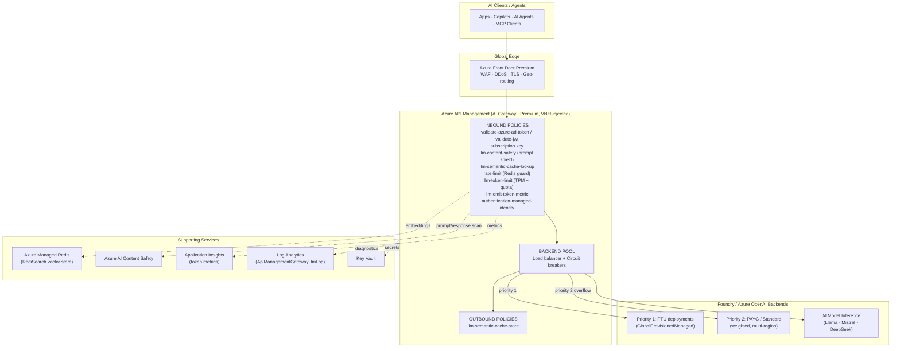
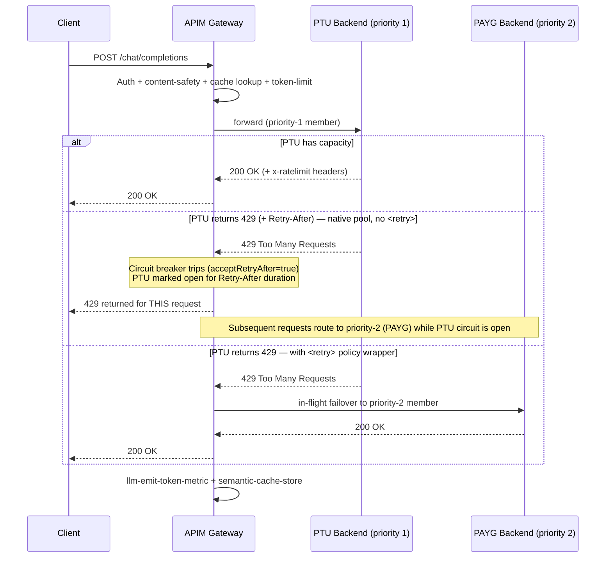
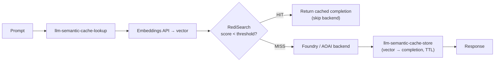

# Azure AI Gateway Architecture with Microsoft Foundry — Latest Best-Practice Proposal (2025–2026)

> **Scope:** A production-grade AI Gateway reference architecture using **Azure API Management (APIM)** in front of **Microsoft Foundry / Azure OpenAI** model endpoints, covering load balancing, resiliency, the full AI-endpoint error taxonomy, APIM GenAI policy best practices, observability, security, and cost governance.
>
> **Currency:** All guidance is drawn from **current canonical Microsoft Learn documentation and official Azure samples (docs cycle May–July 2026, reflecting 2025–2026 GA state)**. Deprecated `azure-openai-*` policy names and legacy "Azure AI Studio" branding are explicitly called out where superseded. No outdated or deprecated patterns are recommended.

**Last reviewed:** July 7, 2026
**Status:** Draft — AI-authored technical reference. **Requires human subject-matter expert review before any customer or production distribution.**

> 🤖 **Document provenance & quality assurance**
> This document was **authored and quality-reviewed by AI agents** operating against the official Microsoft Learn knowledge base. The primary author was Anthropic's `claude-opus-4.8`, with independent cross-review passes by OpenAI's `gpt-5.5` and Google's `gemini-3.1-pro` (see the **Peer review** note in [Confidence Assessment](#confidence-assessment)). All substantive claims are cited against first-party Microsoft sources — see [References](#references).
>
> **This is an AI-generated draft.** It has **not** been reviewed by a human Microsoft subject-matter expert. Before sharing with customers, escalating to support, or driving production changes, a qualified Azure/APIM specialist should validate the content. Pilot all configuration changes in a non-production environment.

---

## Table of Contents

- [Executive Summary](#executive-summary)
- [1. Microsoft Foundry Endpoints — What You Are Fronting](#1-microsoft-foundry-endpoints--what-you-are-fronting)
  - [1.1 Endpoint Patterns to Route Through the Gateway](#11-endpoint-patterns-to-route-through-the-gateway)
  - [1.2 Deployment (SKU) Types — Load-Balancing Implications](#12-deployment-sku-types--load-balancing-implications)
  - [1.3 Authentication & RBAC](#13-authentication--rbac)
- [2. Target AI Gateway Architecture](#2-target-ai-gateway-architecture)
- [3. AI Models Load Balancing — The Core Solution](#3-ai-models-load-balancing--the-core-solution)
  - [3.1 Request Flow (Load Balancing + Failover)](#31-request-flow-load-balancing--failover)
  - [3.2 Native Backend Pool (GA — API version `2024-05-01`)](#32-native-backend-pool-ga--api-version-2024-05-01)
  - [3.3 Circuit Breaker — `Retry-After` Awareness](#33-circuit-breaker--retry-after-awareness-critical-for-azure-openai)
  - [3.4 Alternative — `<retry>` Policy for Explicit Spillover](#34-alternative--retry-policy-for-explicit-spillover)
  - [3.5 Session Affinity (Preview)](#35-session-affinity-stateful-assistantsresponses--preview)
  - [3.6 Latest Preview Enhancements](#36-latest-preview-enhancements-2025-09-01-preview)
- [4. AI Endpoint Errors — Complete Taxonomy & Gateway Handling](#4-ai-endpoint-errors--complete-taxonomy--gateway-handling)
  - [4.1 Master Error Table](#41-master-error-table)
  - [4.2 Retriable vs Terminal Classification](#42-retriable-vs-terminal-classification)
  - [4.3 The Four Faces of `429`](#43-the-four-faces-of-429)
  - [4.4 Rate-Limit Response Headers](#44-rate-limit-response-headers-surfacemonitor-these)
  - [4.5 JSON Error Body Shapes](#45-json-error-body-shapes)
  - [4.6 Native Spillover Signals (PTU → Standard)](#46-native-spillover-signals-ptu--standard)
- [5. APIM GenAI Policies — Best Practices](#5-apim-genai-policies--best-practices)
  - [5.1 `llm-token-limit`](#51-llm-token-limit--tpm-rate-limit--quota-fair-share--chargeback)
  - [5.2 `llm-emit-token-metric`](#52-llm-emit-token-metric--observability--finops)
  - [5.3 `llm-semantic-cache-lookup` / `-store`](#53-llm-semantic-cache-lookup-and-llm-semantic-cache-store--vector-cache)
  - [5.4 `llm-content-safety`](#54-llm-content-safety--content-safety--prompt-shields-new-ga)
- [6. Observability](#6-observability)
- [7. Cost Governance & Chargeback](#7-cost-governance--chargeback)
- [8. Security Best Practices (Well-Architected)](#8-security-best-practices-well-architected)
- [9. Backend Topologies (Architecture Center)](#9-backend-topologies-architecture-center)
- [10. Key Repositories & Docs Summary](#10-key-repositories--docs-summary)
- [11. Implementation Checklist](#11-implementation-checklist)
- [Confidence Assessment](#confidence-assessment)
- [References](#references)

---

## Executive Summary

Azure API Management provides a **built-in AI Gateway capability set** (not a separate SKU) purpose-built to front Microsoft Foundry / Azure OpenAI model deployments.<sup>[1](#ref-1)</sup> As of 2025–2026 the LLM-aware policies were **renamed from `azure-openai-*` to `llm-*`** to support multi-provider models (OpenAI, Anthropic, Google Vertex AI, Amazon Bedrock); the old names still execute for backward compatibility but the `llm-*` names are canonical.<sup>[2](#ref-2)</sup> The gateway combines **native backend-pool load balancing + circuit breakers (GA since API version `2024-05-01`)**,<sup>[3](#ref-3)</sup> token-based rate limiting/quota, semantic caching, content safety, and token telemetry into a single control plane. A successful AI load-balancing solution routes **PTU (provisioned) endpoints as priority 1 with pay-as-you-go (PAYG) as priority-2 overflow**, trips circuit breakers on `429` responses while honoring the `Retry-After` header, and enforces per-consumer TPM quotas for fair-share and chargeback.<sup>[4](#ref-4)</sup> This document provides the complete architecture, Mermaid diagrams, exact policy XML/Bicep, and the full AI-endpoint error taxonomy with recommended gateway handling.

---

## 1. Microsoft Foundry Endpoints — What You Are Fronting

**Microsoft Foundry** (rebranded from *Azure AI Studio / Azure AI Foundry* in 2025) is a unified Azure PaaS for enterprise AI, built on the `Microsoft.CognitiveServices` resource provider. A **Foundry resource** (`kind: AIServices`) consolidates Azure OpenAI + AI Services + Agent Service; **Foundry projects** provide team isolation.<sup>[5](#ref-5)</sup> Existing Azure OpenAI resources can be upgraded to a Foundry resource while preserving endpoints and keys.<sup>[5](#ref-5)</sup>

### 1.1 Endpoint Patterns to Route Through the Gateway

| Pattern | URL shape | Model selector | Auth | Notes |
|---|---|---|---|---|
| **v1 API (new, GA Aug 2025)** | `https://{res}.openai.azure.com/openai/v1/{op}` | In request **body** (`model: "deployment"`) | api-key **or** Entra ID | Preferred for new apps. No `api-version` query param. Uses standard `OpenAI()` client with token auto-refresh.<sup>[6](#ref-6)</sup> |
| **Classic dated API** | `https://{res}.openai.azure.com/openai/deployments/{dep}/{op}?api-version=2024-10-21` | In **path** | api-key **or** Entra ID | Still supported; latest GA dated version is `2024-10-21`.<sup>[7](#ref-7)</sup> |
| **AI Model Inference (MaaS / serverless)** | `{deployment-endpoint}/chat/completions?api-version=2025-04-01` | Per-deployment endpoint | api-key (keyless not supported for serverless) | For non-OpenAI Foundry models (Llama, Mistral, DeepSeek, etc.). Top-level error schema differs from Azure OpenAI.<sup>[8](#ref-8)</sup> |

**Key operations:** `/responses` (new preferred, stateful Responses API), `/chat/completions`, `/embeddings`, `/models`.<sup>[6](#ref-6)</sup>

### 1.2 Deployment (SKU) Types — Load-Balancing Implications

| Deployment type | SKU code | Routing | Billing | LB implication |
|---|---|---|---|---|
| Global Standard | `GlobalStandard` | Any region (dynamic) | Pay-per-token | Highest quota; latency variance at scale |
| Global Provisioned | `GlobalProvisionedManaged` | Any region | Reserved PTU/hr | Consistent low latency; **use as priority-1 backend** |
| Data Zone Standard/Provisioned | `DataZone*` | US or EU zone | Token / PTU | EU/US data residency compliance |
| Standard | `Standard` | Single region | Pay-per-token | Regional compliance; **use as priority-2 overflow** |
| Regional Provisioned | `ProvisionedManaged` | Single region | Reserved PTU/hr | Guaranteed throughput + SLA |
| Global Batch | `GlobalBatch` | Any region | 50% discount, 24h async | Separate enqueued-token quota |

PTU quota pools are **separate** per deployment type (`GlobalProvisionedManaged`, `DataZoneProvisionedManaged`, `ProvisionedManaged`) and per region/subscription.<sup>[9](#ref-9)</sup> Native **spillover** can overflow PTU → Standard via the `x-ms-spillover-deployment` header.<sup>[10](#ref-10)</sup>

### 1.3 Authentication & RBAC

- **Preferred:** Microsoft Entra ID (managed identity). Token audience for data-plane calls: **`https://cognitiveservices.azure.com/.default`** (classic) / **`https://ai.azure.com/.default`** (v1 API).<sup>[6](#ref-6)</sup>
- **Minimal role (classic Azure OpenAI):** `Cognitive Services OpenAI User` for keyless inference.<sup>[11](#ref-11)</sup>
- **New Foundry resources:** use Foundry roles (`Foundry User`, `Foundry Project Manager`, etc.). **Do not** assign `Cognitive Services *` roles to Foundry projects.<sup>[11](#ref-11)</sup>
- ⚠️ **Constraint:** The embeddings API does **not** yet support Entra ID with the v1 API — use API key auth for embeddings (as of 2026-06).<sup>[8](#ref-8)</sup>

---

## 2. Target AI Gateway Architecture



**Reference implementations (official):**
- APIM AI Gateway labs — [`Azure-Samples/AI-Gateway`](https://github.com/Azure-Samples/AI-Gateway) (30+ Bicep + policy labs).<sup>[1](#ref-1)</sup>
- Smart LB custom policy — [`Azure-Samples/openai-apim-lb`](https://github.com/Azure-Samples/openai-apim-lb).<sup>[3](#ref-3)</sup>
- GenAI gateway toolkit — [`Azure-Samples/apim-genai-gateway-toolkit`](https://github.com/Azure-Samples/apim-genai-gateway-toolkit).<sup>[12](#ref-12)</sup>
- **Landing Zone Accelerator:** `https://aka.ms/apim-genai-lza` (Bicep/IaC, cloud + on-prem self-hosted gateway).<sup>[12](#ref-12)</sup>

---

## 3. AI Models Load Balancing — The Core Solution

### 3.1 Request Flow (Load Balancing + Failover)



> **Important nuance:** APIM's **native** backend-pool circuit breaker does **not** transparently retry the *in-flight* request that tripped the breaker — that request receives the `429`; only **subsequent** requests are routed to the priority-2 member. For **transparent in-flight failover**, wrap `forward-request` in a `<retry>` policy (see §3.4).

### 3.2 Native Backend Pool (GA — API version `2024-05-01`)

A `Pool`-type backend groups `Single` backends; circuit breakers on members drive failover.<sup>[3](#ref-3)</sup>

- **`priority`** (0–100): lower = preferred. Lower-priority members receive traffic only when all higher-priority members' circuit breakers are tripped. → **PTU-first, PAYG-overflow.**
- **`weight`** (0–100): within a priority group, distributes traffic proportionally (e.g., 50/30/20 across regions).
- **No priority/weight** = round-robin.
- **Limits:** max **30 backends** per pool; load balancing is approximate (not synchronized across gateway nodes); circuit breaker **not** supported on Consumption tier.<sup>[3](#ref-3)</sup>

```bicep
// PTU backend (priority 1) with 429 circuit breaker
resource ptuBackend 'Microsoft.ApiManagement/service/backends@2024-05-01' = {
  name: 'apim/aoai-ptu-eastus'
  properties: {
    url: 'https://myaoai-ptu-eastus.openai.azure.com/openai'
    protocol: 'http'
    circuitBreaker: {
      rules: [{
        name: 'ptu-429'
        failureCondition: {
          count: 1
          interval: 'PT10S'
          statusCodeRanges: [{ min: 429, max: 429 }]
        }
        tripDuration: 'PT10S'
        acceptRetryAfter: true   // honor Azure OpenAI Retry-After header
      }]
    }
  }
}

// PAYG backend (priority 2) with 5xx circuit breaker
resource paygBackend 'Microsoft.ApiManagement/service/backends@2024-05-01' = {
  name: 'apim/aoai-payg-westus'
  properties: {
    url: 'https://myaoai-payg-westus.openai.azure.com/openai'
    protocol: 'http'
    circuitBreaker: {
      rules: [{
        name: 'payg-5xx'
        failureCondition: {
          count: 3
          interval: 'PT1M'
          statusCodeRanges: [{ min: 500, max: 599 }]
        }
        tripDuration: 'PT30S'
        acceptRetryAfter: true
      }]
    }
  }
}

// Load-balanced pool: PTU primary, PAYG fallback
resource aoaiPool 'Microsoft.ApiManagement/service/backends@2024-05-01' = {
  name: 'apim/aoai-pool'
  properties: {
    type: 'Pool'
    pool: {
      services: [
        { id: ptuBackend.id,  priority: 1, weight: 100 }
        { id: paygBackend.id, priority: 2, weight: 100 }
      ]
    }
  }
}
```

### 3.3 Circuit Breaker — `Retry-After` Awareness (Critical for Azure OpenAI)

Azure OpenAI returns `429` + a `Retry-After` header whose value can be **very large** (e.g., 1 day for PTU exhaustion). With **`acceptRetryAfter: true`**, APIM uses that header value as the actual trip duration instead of the configured value — keeping the circuit open exactly as long as the backend dictates, maximizing PTU recovery.<sup>[3](#ref-3)</sup> When tripped, APIM returns `503` to the caller **or** (in a pool) routes to the next member automatically.<sup>[3](#ref-3)</sup>

**Constraints:** currently **1 rule per backend**; circuit breaker state is **per gateway worker node**, not synchronized across scale units.<sup>[3](#ref-3)</sup> In multi-instance/multi-region (Premium) deployments this means load balancing and failover are **approximate**: during a PTU-exhaustion burst, *each* worker node must independently hit the PTU backend, receive a `429`, and trip its *local* breaker — so clients may see intermittent `429`s until all nodes' breakers open. Combine with a client-side retry (honoring `retry-after-ms`) and/or a `<retry>` policy for smooth failover.

### 3.4 Alternative — `<retry>` Policy for Explicit Spillover

Use when you need per-attempt logging or per-request decisions (costs an extra round-trip to the throttled backend):<sup>[13](#ref-13)</sup>

```xml
<backend>
  <retry condition="@(context.Response != null &amp;&amp; context.Response.StatusCode == 429)"
         count="1" interval="1" first-fast-retry="true">
    <set-variable name="attempt" value="@(context.Variables.GetValueOrDefault&lt;int&gt;('attempt',0)+1)" />
    <!-- attempt 0 (initial) = PTU; attempt 1 (retry) = PAYG spillover -->
    <set-backend-service backend-id="@(context.Variables.GetValueOrDefault&lt;int&gt;('attempt') &gt;= 1
        ? &quot;aoai-payg-backend&quot; : &quot;aoai-ptu-backend&quot;)" />
    <forward-request buffer-request-body="true" />
  </retry>
</backend>
```

> **Note:** Inside `@(...)` expressions, `<`/`>`/`&` must be XML-escaped (`&lt;`/`&gt;`/`&amp;`), and string literals use single quotes or `&quot;`. The variable increments to `1` on the retry so the second attempt targets **PAYG**, not PTU again.

### 3.5 Session Affinity (stateful Assistants/Responses) — Preview

> ⚠️ **The `sessionAffinity` pool property is only available in the `2025-09-01-preview` backend schema** (`BackendSessionAffinity`), **not** in GA `2024-05-01`. Use the preview API version for this feature.<sup>[3](#ref-3)</sup>

```bicep
resource aoaiPool 'Microsoft.ApiManagement/service/backends@2025-09-01-preview' = {
  name: 'apim/aoai-pool'
  properties: {
    type: 'Pool'
    pool: {
      services: [ /* ... */ ]
      sessionAffinity: { sessionId: { source: 'Cookie', name: 'SessionId' } }
    }
  }
}
```
APIM sets `Set-Cookie: SessionId=…`; subsequent requests route to the same backend — useful for stateful conversational agents.<sup>[3](#ref-3)</sup>

### 3.6 Latest Preview Enhancements (`2025-09-01-preview`)

Adds **carbon-aware load balancing** (`preferredCarbonEmission` per pool member) and an **`azureRegion`** backend property for region-aware routing.<sup>[3](#ref-3)</sup>

---

## 4. AI Endpoint Errors — Complete Taxonomy & Gateway Handling

### 4.1 Master Error Table

| HTTP | JSON `code` | Cause (AI inference) | Retriable? | Gateway handling |
|---|---|---|---|---|
| **400** | `content_filter` | Prompt blocked by content safety (hate/sexual/violence/self-harm/jailbreak) | ❌ Terminal | Surface; do **not** retry same prompt; log category |
| **400** | `ResponsibleAIPolicyViolation` | RAI block (image/DALL·E, some completions) | ❌ | Surface; extract `innererror.content_filter_result` |
| **400** | `context_length_exceeded` | Input + `max_tokens` > context window | ❌ | Surface; instruct truncate / lower `max_tokens` |
| **400** | `InvalidRequest` | Malformed JSON, wrong `api-version`, bad params | ❌ | Surface; do not retry unchanged |
| **400** | *(PTU long-context)* | GPT-4.1 >128K on PTU | ❌ on PTU → **spillover** | Trigger spillover to Standard |
| **401** | `InvalidAuthenticationToken` / `Unauthorized` | Bad/expired key or Entra token; wrong audience | ❌ | Surface; refresh creds; do not retry |
| **403** | `PermissionDenied` / `AuthorizationFailure` | Missing RBAC role; IP firewall / VNet block | ❌ | Surface; alert; check IAM/network |
| **404** | `DeploymentNotFound` | Deployment missing or <5 min old | ⚠️ retry after delay | Retry w/ backoff if just created; else surface |
| **404** | `model_not_found` / `ResourceNotFound` | Wrong URL/region; model unavailable | ❌ | Surface; verify endpoint |
| **408** | *(timeout)* | Network/client timeout | ✅ | Retry w/ backoff |
| **413** | `RequestEntityTooLarge` | Body too large (bytes, not tokens) | ❌ | Surface; reduce payload |
| **415** | `UnsupportedMediaType` | Wrong `Content-Type` | ❌ | Fix Content-Type |
| **422** | `parameter_not_supported` | Model lacks requested parameter (AI Inference API) | ❌ | Surface `detail.loc`; do not retry unchanged |
| **429** | `TooManyRequests` / `RateLimitReached` | TPM/RPM rate limit exhausted | ✅ | Honor `retry-after-ms`; backoff+jitter |
| **429** | `TooManyRequests` (PTU) | PTU capacity at 100% | ✅ / spillover | Honor `retry-after-ms`; spillover; don't hammer |
| **429** | `QuotaExceeded` | Subscription quota ceiling reached | ❌ until increased | Alert; request increase (`aka.ms/oai/stuquotarequest`) |
| **500** | `InternalServerError` | Unhandled backend error | ✅ | Retry 1–2×; log `apim-request-id` |
| **502** | *(gateway)* | Invalid upstream response | ✅ | Retry; treat like 503 |
| **503** | `ServiceUnavailable` | Model overloaded / initializing / regional outage | ✅ | Backoff; failover region; check Service Health |
| **504** | `GatewayTimeout` | Long generation / network timeout | ✅ (cautious) | Retry once w/ lower `max_tokens`; consider streaming |

Source: current Foundry quota, content-filter, PTU, and REST API docs.<sup>[9](#ref-9)</sup><sup>[10](#ref-10)</sup><sup>[14](#ref-14)</sup><sup>[15](#ref-15)</sup>

### 4.2 Retriable vs Terminal Classification

- **✅ Retriable (with backoff):** `429` (all), `500`, `502`, `503`, `504`, `408`, `404 DeploymentNotFound` (recently created only).<sup>[9](#ref-9)</sup>
- **❌ Terminal (do not retry unchanged):** `400` (content_filter, context_length_exceeded, InvalidRequest, max_tokens), `401`, `403`, `404 model_not_found`, `413`, `415`, `422`, `429 QuotaExceeded`.<sup>[9](#ref-9)</sup>
- **⚠️ Conditional:** `400` PTU long-context → spillover; `429` capacity throttle → backoff + failover.<sup>[10](#ref-10)</sup>

### 4.3 The Four Faces of `429`

| Sub-type | Indicator | Root cause | Action |
|---|---|---|---|
| Rate limit (TPM/RPM) | "Rate limit is exceeded" | Deployment TPM/RPM exhausted (resets each minute) | Retry after `retry-after-ms`; rebalance |
| System capacity | "System is experiencing high demand" | Shared-pool constraint | Retry; consider PTU |
| Temporary adjustment | `x-ratelimit-limit-tokens` < configured TPM | Service proactively lowers effective rate | Backoff; usually resolves in hours |
| Token-budget inflation | 429 but usage looks low | `max_tokens` inflates estimate | Reduce `max_tokens` to minimum needed |

**TPM enforcement uses an estimate** = prompt tokens + `max_tokens` (+ `best_of`), **not** actual billed tokens. Even rejected `400`s may count.<sup>[9](#ref-9)</sup>

### 4.4 Rate-Limit Response Headers (surface/monitor these)

`x-ratelimit-limit-requests`, `x-ratelimit-limit-tokens`, `x-ratelimit-remaining-requests`, `x-ratelimit-remaining-tokens`, `x-ratelimit-reset-requests`, `x-ratelimit-reset-tokens`; and on `429` only: **`retry-after-ms`** (ms) and **`retry-after`** (s).<sup>[9](#ref-9)</sup> Monitor `x-ratelimit-limit-tokens` — if it drops below your configured TPM, a temporary adjustment is active.

### 4.5 JSON Error Body Shapes

Azure OpenAI (nested):
```json
{ "error": { "code": "content_filter", "message": "The response was filtered",
             "param": "prompt", "status": 400 } }
```
AI Model Inference API (top-level — gateways must handle **both**):
```json
{ "status": 422, "code": "parameter_not_supported",
  "detail": { "loc": ["body","response_format"], "input": "json_object" },
  "message": "One of the parameters contain invalid values." }
```
Content filter with categories (`ResponsibleAIPolicyViolation`) exposes `innererror.content_filter_result` with per-category `{filtered, severity}`.<sup>[14](#ref-14)</sup>

### 4.6 Native Spillover Signals (PTU → Standard)

Spillover triggers on PTU `429`, `400` (context limit), `500`, `503`. Confirm via response headers: `x-ms-spillover-from-deployment`, `x-ms-deployment-name` (who actually served), `x-ms-spillover-error` (originating PTU code).<sup>[10](#ref-10)</sup>

---

## 5. APIM GenAI Policies — Best Practices

> **Naming:** Use the canonical **`llm-*`** policies. `azure-openai-*` names are deprecated aliases retained for backward compatibility (old doc URLs 301-redirect to `llm-*`).<sup>[2](#ref-2)</sup>

### 5.1 `llm-token-limit` — TPM Rate Limit + Quota (fair-share + chargeback)

```xml
<llm-token-limit
    counter-key="@(context.Subscription.Id)"
    tokens-per-minute="5000"
    token-quota="100000"
    token-quota-period="Monthly"
    estimate-prompt-tokens="false"
    remaining-tokens-variable-name="remainingTPM"
    remaining-quota-tokens-variable-name="remainingMonthly"
    tokens-consumed-variable-name="tokensConsumed"
    retry-after-header-name="Retry-After" />
```
- Returns **`429`** when TPM exceeded, **`403`** when quota exceeded.<sup>[16](#ref-16)</sup>
- `estimate-prompt-tokens="true"` pre-checks and rejects early (saves wasted backend calls); `false` uses actual counts from the response.<sup>[16](#ref-16)</sup>
- **Counters are per-scope and per-regional-gateway — they do not aggregate globally.**<sup>[16](#ref-16)</sup>
- **Streaming caveat:** with `stream:true`, tokens are always *estimated* unless the request sets `include_usage:true`.<sup>[16](#ref-16)</sup>
- Classic tiers use a sliding window; v2 tiers use a token bucket — keep `tokens-per-minute` consistent across instances sharing a `counter-key` on v2.<sup>[16](#ref-16)</sup>

### 5.2 `llm-emit-token-metric` — Observability / FinOps

```xml
<llm-emit-token-metric namespace="llm-metrics">
  <dimension name="Subscription ID" />
  <dimension name="API ID" />
  <dimension name="Client IP" value="@(context.Request.IpAddress)" />
  <dimension name="TeamName" value="@(context.Request.Headers.GetValueOrDefault('x-team','unknown'))" />
</llm-emit-token-metric>
```
Emits `Total/Prompt/Completion` (preview: `cached/reasoning/thinking`) token metrics to Application Insights. **Max 5 custom dimensions** per policy; requires custom-metrics-with-dimensions enabled on App Insights.<sup>[17](#ref-17)</sup>

### 5.3 `llm-semantic-cache-lookup` and `llm-semantic-cache-store` — Vector Cache

```xml
<inbound>
  <base />
  <llm-semantic-cache-lookup
      score-threshold="0.15"
      embeddings-backend-id="embeddings-backend"
      embeddings-backend-auth="system-assigned"
      ignore-system-messages="true"
      max-message-count="10">
    <vary-by>@(context.Subscription.Id)</vary-by>
  </llm-semantic-cache-lookup>
  <rate-limit calls="10" renewal-period="60" />  <!-- guard when Redis unavailable -->
</inbound>
<outbound>
  <llm-semantic-cache-store duration="60" />
  <base />
</outbound>
```
- Requires **Azure Managed Redis with the RediSearch module** (enable at creation only) + an embeddings deployment registered as an APIM backend with managed identity.<sup>[18](#ref-18)</sup>
- **`score-threshold`** is cosine distance: **lower = stricter**. Docs recommend starting **low (~0.05)**; values **`>0.2`** increase mismatch risk.<sup>[18](#ref-18)</sup>
- Always set **`<vary-by>`** (e.g., subscription/user) to prevent cross-user cache leakage.<sup>[18](#ref-18)</sup>
- ⚠️ **Auth constraint:** because `embeddings-backend-auth="system-assigned"` requires managed identity, the embeddings backend must target the **classic dated embeddings API** (`/openai/deployments/{dep}/embeddings?api-version=2024-10-21`) — **not** the v1 `/openai/v1/embeddings` route, which does not yet support Entra ID (see §1.3).<sup>[8](#ref-8)</sup>



### 5.4 `llm-content-safety` — Content Safety + Prompt Shields (new, GA)

```xml
<!-- shield-prompt="true" enables jailbreak / prompt-injection detection -->
<!-- enforce-on-completions="true" also scans model responses -->
<llm-content-safety backend-id="content-safety-backend"
    shield-prompt="true"
    enforce-on-completions="true"
    window-size="10000" window-overlap-size="500">
  <categories output-type="EightSeverityLevels">
    <category name="Hate"     threshold="4" />
    <category name="Violence" threshold="4" />
    <category name="Sexual"   threshold="6" />
    <category name="SelfHarm" threshold="4" />
  </categories>
  <blocklists><id>my-blocklist</id></blocklists>
</llm-content-safety>
```
- Blocks return **`403`**. `threshold`: 0 = most restrictive … 7 = least. `FourSeverityLevels` (0/2/4/6) or `EightSeverityLevels` (0–7).<sup>[19](#ref-19)</sup>
- For streaming, a sliding buffer window stops forwarding on violation (no in-stream `403`).<sup>[19](#ref-19)</sup>

---

## 6. Observability

| Capability | Mechanism | Source |
|---|---|---|
| **Token metrics** | `llm-emit-token-metric` → Application Insights custom metrics | <sup>[17](#ref-17)</sup> |
| **Prompt/completion logging** | Diagnostic setting *"Logs related to generative AI gateway"* → Log Analytics table **`ApiManagementGatewayLlmLog`** (log prompts/completions up to 32 KB each, chunked to 2 MB) | <sup>[20](#ref-20)</sup> |
| **Built-in dashboard** | APIM → Monitoring → Analytics → **Language models** tab | <sup>[20](#ref-20)</sup> |
| **Tracing** | Test Console traces cache hits/policy flow — **disable in production** (data exposure) | <sup>[18](#ref-18)</sup> |

**Sample KQL — reconstruct a conversation for audit:**
```kusto
ApiManagementGatewayLlmLog
| extend Req = parse_json(RequestMessages), Res = parse_json(ResponseMessages)
| mv-expand Req | mv-expand Res
| project CorrelationId,
    In = tostring(Req.content), Out = tostring(Res.content)
| summarize Input = strcat_array(make_list(In), " . "),
            Output = strcat_array(make_list(Out), " . ") by CorrelationId
| where isnotempty(Input) and isnotempty(Output)
```

---

## 7. Cost Governance & Chargeback

1. **Products per tier** (e.g., `GenAI-Chat`, `GenAI-Embeddings`) + **Subscriptions per team** → each team gets its own subscription key.<sup>[21](#ref-21)</sup>
2. Apply `llm-token-limit` with `counter-key="@(context.Subscription.Id)"` for **real-time enforcement** (TPM + monthly quota).<sup>[16](#ref-16)</sup>
3. Emit `Subscription ID` dimension via `llm-emit-token-metric` and query `ApiManagementGatewayLlmLog` by `SubscriptionId` for **historical chargeback**.<sup>[21](#ref-21)</sup>
4. **PTU + PAYG spillover** bounds cost: reserved PTU absorbs baseline; PAYG absorbs overflow only when PTU is throttled.<sup>[21](#ref-21)</sup>

---

## 8. Security Best Practices (Well-Architected)

```mermaid
flowchart LR
    C["Client"] -->|"1 · WAF + DDoS"| AFD["Front Door WAF"]
    AFD -->|"2 · JWT / Entra token"| J["validate-azure-ad-token"]
    J -->|"3 · Subscription key"| K["Ocp-Apim-Subscription-Key"]
    K -->|"4 · content safety"| CS["llm-content-safety"]
    CS -->|"5 · Managed identity"| MI["authentication-managed-identity"]
    MI -->|"6 · Private Endpoint"| AOAI["Foundry / Azure OpenAI"]
```



| Layer | Control | Detail | Source |
|---|---|---|---|
| **Backend auth** | Managed identity, **no keys in clients** | System-assigned MI + `Cognitive Services OpenAI User` role scoped to the resource | <sup>[22](#ref-22)</sup> |
| **Client auth** | Defense-in-depth | WAF → `validate-azure-ad-token`/`validate-jwt` → subscription key → MI to backend | <sup>[22](#ref-22)</sup> |
| **Network** | VNet injection (internal mode) + Private Endpoints | AOAI/Content Safety private endpoints in a dedicated subnet; NSG allows only the `ApiManagement` service tag; public IP no longer required (internal mode, since May 2024) | <sup>[23](#ref-23)</sup> |
| **Content** | `llm-content-safety` + Prompt Shields | Harm categories + jailbreak/XPIA detection; PII via `send-request` to AI Language / Presidio | <sup>[19](#ref-19)</sup> |
| **Platform** | TLS 1.3, Key Vault named values, Defender for APIs, disable direct mgmt API (retired Mar 2025), disable unused dev portal, suppress `Server`/`X-Powered-By` headers | Per WAF service guide | <sup>[24](#ref-24)</sup> |

**`validate-azure-ad-token` example:**
```xml
<validate-azure-ad-token tenant-id="{{TENANT_ID}}" header-name="Authorization"
    failed-validation-httpcode="401">
  <client-application-ids><application-id>{{CLIENT_APP_ID}}</application-id></client-application-ids>
  <audiences><audience>api://my-aoai-gateway</audience></audiences>
  <required-claims><claim name="roles"><value>LLM.Consumer</value></claim></required-claims>
</validate-azure-ad-token>
```

---

## 9. Backend Topologies (Architecture Center)

| Topology | When to use | Gateway benefit |
|---|---|---|
| Multiple deployments, single instance | Blue-green / multi-model routing | Client abstraction from deployment names |
| Multiple instances, single region | PTU + PAYG spillover; failover | Centralized retry/circuit-break |
| Multiple instances, multi-subscription | Central AI platform team | Quota aggregation across subscriptions |
| Multiple instances, multiple regions | Global HA, data residency | Regional affinity + global failover |

Source: Azure Architecture Center *"Use a gateway in front of Foundry model deployments/instances."*<sup>[25](#ref-25)</sup>

---

## 10. Key Repositories & Docs Summary

| Resource | URL |
|---|---|
| APIM GenAI capabilities | `learn.microsoft.com/azure/api-management/genai-gateway-capabilities` |
| AI Gateway labs | [Azure-Samples/AI-Gateway](https://github.com/Azure-Samples/AI-Gateway) |
| Smart LB policy | [Azure-Samples/openai-apim-lb](https://github.com/Azure-Samples/openai-apim-lb) |
| GenAI gateway toolkit | [Azure-Samples/apim-genai-gateway-toolkit](https://github.com/Azure-Samples/apim-genai-gateway-toolkit) |
| Landing Zone Accelerator | `https://aka.ms/apim-genai-lza` |
| Backends (pools/circuit breaker) | `learn.microsoft.com/azure/api-management/backends` |
| Architecture Center gateway guide | `learn.microsoft.com/azure/architecture/ai-ml/guide/azure-openai-gateway-guide` |

---

## 11. Implementation Checklist

- [ ] Provision APIM **Premium** (VNet-injected, internal mode) behind **Front Door + WAF**.
- [ ] Register Foundry/AOAI deployments as **Single backends** with **429 circuit breakers** (`acceptRetryAfter: true`).
- [ ] Create a **Pool** backend: PTU = priority 1, PAYG = priority 2 (weighted across regions).
- [ ] Enable **system-assigned managed identity**; grant `Cognitive Services OpenAI User`; remove client-side keys.
- [ ] Add inbound stack: `validate-azure-ad-token` → subscription key → `llm-content-safety` → `llm-semantic-cache-lookup` + `rate-limit` guard → `llm-token-limit` → `llm-emit-token-metric` → `authentication-managed-identity`.
- [ ] Add outbound `llm-semantic-cache-store`; provision **Azure Managed Redis (RediSearch)**.
- [ ] Enable **"Logs related to generative AI gateway"** diagnostic → Log Analytics; build token dashboards in App Insights.
- [ ] Map **Products + Subscriptions** per team for quota + chargeback.
- [ ] Implement client-side **retriable-vs-terminal** error handling (§4.2) honoring `retry-after-ms`.
- [ ] (Optional) Configure native **spillover** and adopt `2025-09-01-preview` carbon-aware routing.

---

## Confidence Assessment

| Area | Confidence | Notes |
|---|---|---|
| Policy names/XML (`llm-*`) | **High** | Verified against current Learn docs; old URLs 301-redirect to `llm-*`.<sup>[2](#ref-2)</sup> |
| Backend pool / circuit breaker (GA `2024-05-01`) | **High** | Confirmed in backends docs + REST API spec.<sup>[3](#ref-3)</sup> |
| Error taxonomy & headers | **High** | From Foundry quota/content-filter/PTU/REST docs.<sup>[9](#ref-9)</sup><sup>[10](#ref-10)</sup><sup>[14](#ref-14)</sup> |
| Foundry endpoints & SKUs | **High** | Current Foundry architecture/deployment-types docs.<sup>[5](#ref-5)</sup><sup>[9](#ref-9)</sup> |
| Security/observability/cost | **High** | WAF service guide + AI gateway how-tos + AI Playbook.<sup>[20](#ref-20)</sup><sup>[22](#ref-22)</sup><sup>[24](#ref-24)</sup> |
| Carbon-aware LB, spillover exact codes | **Medium** | Preview (`2025-09-01-preview`); PTU 429 has no distinct JSON `code` beyond `TooManyRequests`.<sup>[3](#ref-3)</sup><sup>[10](#ref-10)</sup> |

**Assumptions:** APIM Premium (needed for VNet + full features); a mixed PTU + PAYG estate; and multi-provider readiness (hence `llm-*` policies). Adjust tier/topology to your compliance and scale requirements.

> **Peer review:** This report was cross-reviewed by two independent models (GPT-5.5 and Gemini 3.1 Pro). Corrections applied: (a) native pool circuit breaker does **not** transparently retry the in-flight `429` request — only subsequent requests failover unless wrapped in `<retry>` (§3.1); (b) `sessionAffinity` is `2025-09-01-preview`, not GA (§3.5); (c) fixed XML escaping in the `<retry>` and `llm-content-safety` snippets (§3.4, §5.4); (d) clarified per-worker circuit-breaker state and intermittent-429 behavior (§3.3); (e) semantic-cache embeddings backend must use the classic dated embeddings API since v1 embeddings lack Entra ID (§5.3). Two reviewer claims were **rejected after verifying Microsoft Learn**: the v1 API token audience `https://ai.azure.com/.default` is correct (classic uses `https://cognitiveservices.azure.com/.default`), and the v1 embeddings Entra ID limitation is a current, documented constraint.

---

## References

1. <a id="ref-1"></a>APIM AI/GenAI gateway capabilities — [genai-gateway-capabilities](https://learn.microsoft.com/en-us/azure/api-management/genai-gateway-capabilities) (updated 2026-05-29); [Azure-Samples/AI-Gateway](https://github.com/Azure-Samples/AI-Gateway).
2. <a id="ref-2"></a>Policy rename `azure-openai-*` → `llm-*` (old URLs 301-redirect) — [llm-token-limit-policy](https://learn.microsoft.com/en-us/azure/api-management/llm-token-limit-policy) (updated 2026-06-26).
3. <a id="ref-3"></a>Backends — load-balanced pools & circuit breakers (GA `2024-05-01`; preview `2025-09-01-preview` carbon-aware) — [Backends in API Management](https://learn.microsoft.com/en-us/azure/api-management/backends) (updated 2026-06-25); [REST: backend/create-or-update (2024-05-01)](https://learn.microsoft.com/en-us/rest/api/apimanagement/backend/create-or-update?view=rest-apimanagement-2024-05-01).
4. <a id="ref-4"></a>PTU-first / PAYG-overflow pattern with `Retry-After`-aware circuit breaker — [Backends in API Management — Circuit breaker](https://learn.microsoft.com/en-us/azure/api-management/backends#circuit-breaker).
5. <a id="ref-5"></a>What is Microsoft Foundry / architecture — [What is Microsoft Foundry](https://learn.microsoft.com/en-us/azure/foundry/what-is-foundry) (updated 2026-06-19); [Foundry architecture](https://learn.microsoft.com/en-us/azure/foundry/concepts/architecture) (updated 2026-07-06).
6. <a id="ref-6"></a>v1 API lifecycle & Entra ID token provider — [API version lifecycle](https://learn.microsoft.com/en-us/azure/foundry/openai/api-version-lifecycle) (ms.date 2026-05-13).
7. <a id="ref-7"></a>Classic dated data-plane API (`2024-10-21` GA) — [Azure OpenAI REST API reference](https://learn.microsoft.com/en-us/azure/foundry/openai/reference) (updated 2026-06-24).
8. <a id="ref-8"></a>Azure AI Model Inference REST API + embeddings Entra ID constraint — [Model Inference REST API](https://learn.microsoft.com/en-us/rest/api/microsoft-foundry/modelinference/) (updated 2026-06-11); [Generate embeddings (v1 Entra ID note)](https://learn.microsoft.com/en-us/azure/foundry/openai/how-to/embeddings).
9. <a id="ref-9"></a>Quotas & limits, 429 sub-types, rate-limit headers — [Manage quota (classic)](https://learn.microsoft.com/en-us/azure/foundry-classic/openai/how-to/quota) (2026-05-04); [Quotas & limits](https://learn.microsoft.com/en-us/azure/foundry/openai/quotas-limits) (2026-05-27).
10. <a id="ref-10"></a>Spillover traffic management + provisioned throughput — [Spillover traffic management](https://learn.microsoft.com/en-us/azure/foundry/openai/how-to/spillover-traffic-management) (2026-06-18); [Provisioned throughput](https://learn.microsoft.com/en-us/azure/foundry/openai/concepts/provisioned-throughput) (2026-05-22).
11. <a id="ref-11"></a>RBAC — [RBAC for Microsoft Foundry](https://learn.microsoft.com/en-us/azure/foundry/concepts/rbac-foundry) (updated 2026-07-03); [RBAC for Azure OpenAI (classic)](https://learn.microsoft.com/en-us/azure/foundry-classic/openai/how-to/role-based-access-control) (2026-01-31).
12. <a id="ref-12"></a>Landing Zone Accelerator & toolkits — [APIM-based GenAI gateway reference architecture](https://learn.microsoft.com/en-us/ai/playbook/solutions/genai-gateway/reference-architectures/apim-based) (Dec 2024); [aka.ms/apim-genai-lza](https://aka.ms/apim-genai-lza); [Azure-Samples/apim-genai-gateway-toolkit](https://github.com/Azure-Samples/apim-genai-gateway-toolkit).
13. <a id="ref-13"></a>Retry policy (switch backend on 429) — [Retry policy](https://learn.microsoft.com/en-us/azure/api-management/retry-policy) (ms.date 2025-09-11).
14. <a id="ref-14"></a>Content filtering categories/scenarios & error bodies — [Content filtering](https://learn.microsoft.com/en-us/azure/foundry-classic/foundry-models/concepts/content-filter) (2026-02-04).
15. <a id="ref-15"></a>PTU sizing — [Provisioned throughput sizing](https://learn.microsoft.com/en-us/azure/foundry/openai/how-to/provisioned-throughput-sizing) (2026-05-25).
16. <a id="ref-16"></a>`llm-token-limit` policy — [llm-token-limit-policy](https://learn.microsoft.com/en-us/azure/api-management/llm-token-limit-policy) (updated 2026-06-26).
17. <a id="ref-17"></a>`llm-emit-token-metric` policy — [llm-emit-token-metric-policy](https://learn.microsoft.com/en-us/azure/api-management/llm-emit-token-metric-policy) (updated 2026-06-26).
18. <a id="ref-18"></a>Semantic caching policies & how-to — [llm-semantic-cache-lookup-policy](https://learn.microsoft.com/en-us/azure/api-management/llm-semantic-cache-lookup-policy); [llm-semantic-cache-store-policy](https://learn.microsoft.com/en-us/azure/api-management/llm-semantic-cache-store-policy); [Enable semantic caching](https://learn.microsoft.com/en-us/azure/api-management/azure-openai-enable-semantic-caching) (2025-10-28).
19. <a id="ref-19"></a>`llm-content-safety` policy — [llm-content-safety-policy](https://learn.microsoft.com/en-us/azure/api-management/llm-content-safety-policy) (updated 2026-06-26).
20. <a id="ref-20"></a>LLM logs & Analytics dashboard — [Observe LLM APIs (LLM logs)](https://learn.microsoft.com/en-us/azure/api-management/api-management-howto-llm-logs) (updated 2026-06-25).
21. <a id="ref-21"></a>Chargeback via Products/Subscriptions + PTU spillover — [APIM-based GenAI gateway reference architecture](https://learn.microsoft.com/en-us/ai/playbook/solutions/genai-gateway/reference-architectures/apim-based) (Dec 2024).
22. <a id="ref-22"></a>Authenticate/authorize AI APIs (managed identity, JWT) — [Authenticate and authorize access to Azure OpenAI APIs](https://learn.microsoft.com/en-us/azure/api-management/api-management-authenticate-authorize-ai-apis) (updated 2026-06-25).
23. <a id="ref-23"></a>VNet integration & multi-backend network topology — [Deploy APIM in a VNet](https://learn.microsoft.com/en-us/azure/api-management/api-management-using-with-vnet) (updated 2026-06-25); [Gateway in front of multiple backends](https://learn.microsoft.com/en-us/azure/architecture/ai-ml/guide/azure-openai-gateway-multi-backend) (updated 2026-07-02).
24. <a id="ref-24"></a>APIM Well-Architected service guide — [Azure Well-Architected: API Management](https://learn.microsoft.com/en-us/azure/well-architected/service-guides/azure-api-management) (updated 2026-03-17).
25. <a id="ref-25"></a>Gateway guide & multi-backend topologies — [Access Foundry models through a gateway](https://learn.microsoft.com/en-us/azure/architecture/ai-ml/guide/azure-openai-gateway-guide) (updated 2026-07-02).
