# Microsoft Foundry Models - Comprehensive Guide

## Table of Contents

1. [Overview](#overview)
2. [Model Catalog Architecture](#model-catalog-architecture)
3. [Model Categories](#model-categories)
4. [Deployment Options](#deployment-options)
5. [Deployment Types (SKUs)](#deployment-types-skus)
6. [Endpoints and API Access](#endpoints-and-api-access)
7. [Azure AI Model Inference API](#azure-ai-model-inference-api)
8. [SDK Integration](#sdk-integration)
9. [Content Safety and Guardrails](#content-safety-and-guardrails)
10. [Fine-Tuning](#fine-tuning)
11. [Pricing and Billing](#pricing-and-billing)
12. [Quotas and Rate Limits](#quotas-and-rate-limits)
13. [Regional Availability](#regional-availability)
14. [Security and Compliance](#security-and-compliance)
15. [Best Practices](#best-practices)
16. [References](#references)

---

## Overview

Microsoft Foundry Models is a comprehensive platform for discovering, evaluating, and deploying powerful AI models. Whether you're building a custom copilot, creating an agent, enhancing an existing application, or exploring new AI capabilities, Foundry Models provides the flexibility and control to build AI solutions that scale securely and responsibly.

### Key Capabilities

| Capability | Description |
|------------|-------------|
| **Model Discovery** | Explore 1900+ models from Microsoft, OpenAI, DeepSeek, Hugging Face, Meta, Anthropic, and more |
| **Model Comparison** | Compare and evaluate models side-by-side using real-world tasks and your own data |
| **Deployment Flexibility** | Deploy with confidence using serverless APIs, managed compute, or provisioned throughput |
| **Fine-Tuning** | Customize models using supervised learning, DPO, or reinforcement learning |
| **Responsible AI** | Built-in content safety, guardrails, and compliance features |

### Platform Architecture

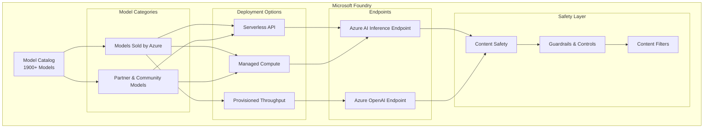

---

## Model Catalog Architecture

The Model Catalog in Foundry portal is the central hub for discovering and using AI models for building generative AI applications. It features hundreds of models across multiple providers.

### Catalog Features

| Feature | Description |
|---------|-------------|
| **Keyword Search** | Search models by name, capability, or use case |
| **Collection Filters** | Filter by model provider collection |
| **Industry Filters** | Find models trained on industry-specific datasets |
| **Capability Filters** | Filter by features like reasoning and tool calling |
| **Deployment Options** | Filter by serverless API, provisioned, batch, or managed compute |
| **Inference Tasks** | Filter by inference task type |
| **Fine-tune Tasks** | Filter by fine-tuning task type |
| **Licenses** | Filter by license type |
| **Benchmark Metrics** | Access performance benchmarks for select models |
| **Model Leaderboard** | Compare model performance rankings |

### Model Card Components

Each model in the catalog includes a detailed model card with:

- **Quick Facts**: Key information at a glance
- **Details**: Description, version info, supported data types
- **Benchmarks**: Performance metrics for select models
- **Existing Deployments**: View already deployed instances
- **License**: Legal information and licensing terms
- **Artifacts**: Model assets and download options (open models only)

---

## Model Categories

### Models Sold Directly by Azure

These models are hosted and sold by Microsoft under Microsoft Product Terms with direct Microsoft support.

**Characteristics:**

| Attribute | Description |
|-----------|-------------|
| Support | Available directly from Microsoft |
| Integration | Deep Azure services integration |
| Responsible AI | Subject to Microsoft's Responsible AI standards |
| Documentation | Transparency reports and model documentation provided |
| Enterprise Features | Enterprise-grade scalability, reliability, and security |
| Fungible PTU | Flexible quota and reservations across models |

**Key Model Providers:**
- Azure OpenAI (GPT-4, GPT-4o, o1, o3, DALL-E)
- DeepSeek (R1, V3)
- Microsoft Phi (Phi-4, Phi-4-mini)
- Meta Llama (3.1, 3.2, 3.3)
- Mistral (Large, Nemo, Small)

### Models from Partners and Community

These models are provided by third-party organizations, partners, research labs, and community contributors.

**Characteristics:**

| Attribute | Description |
|-----------|-------------|
| Support | Managed by respective model providers |
| Diversity | Wide range of specialized and niche models |
| Innovation | Rapid availability of cutting-edge models |
| Deployment | Available via Managed Compute or Serverless API |
| Marketplace | Offered through Azure Marketplace |

**Key Partners:**
- **Anthropic**: Claude family (Haiku, Sonnet, Opus)
- **Cohere**: Command R+, Rerank, Embed models
- **Hugging Face**: Hundreds of open models
- **Stability AI**: Stable Diffusion models
- **Gretel**: Navigator for synthetic data
- **Nixtla**: TimeGEN for time series

---

## Deployment Options

### Deployment Options Comparison

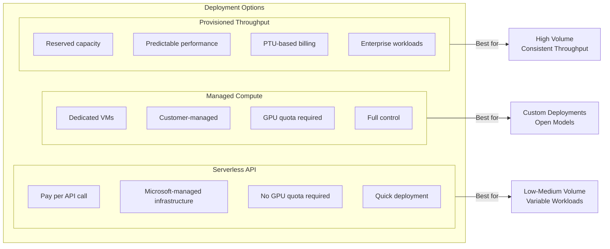

### Serverless API Deployment

Deploy models without managing infrastructure. Microsoft hosts the model and provides API access.

| Feature | Details |
|---------|---------|
| **Billing** | Pay per input/output tokens |
| **Authentication** | API Keys only |
| **Content Safety** | Azure AI Content Safety integrated |
| **Network** | Follows hub's public network access flag |
| **Quota** | No subscription GPU quota required |

**Best For:**
- Quick prototyping and experimentation
- Variable workloads with unpredictable traffic
- Cost-sensitive applications
- Applications requiring rapid scaling

> ⚠️ **Note:** Cloud Solution Provider (CSP) subscriptions do not have the ability to purchase serverless API deployment models.

### Managed Compute Deployment

Deploy models to dedicated Azure virtual machines with full control over infrastructure.

| Feature | Details |
|---------|---------|
| **Billing** | VM core hours |
| **Authentication** | Keys and Microsoft Entra ID |
| **Content Safety** | Integrate via Azure AI Content Safety APIs |
| **Network** | Configure managed networks for hubs |
| **Quota** | Requires VM quota in subscription |

**Best For:**
- Custom model deployments
- Open-source model hosting
- Specialized hardware requirements
- Full infrastructure control needs

### Capabilities Comparison

| Feature | Managed Compute | Serverless API |
|---------|-----------------|----------------|
| Deployment Experience | VM-based, managed compute | API provisioning |
| Billing | VM core hours | Token-based (input/output) |
| API Authentication | Keys + Entra ID | Keys only |
| Content Safety | Via Content Safety APIs | Integrated with inference |
| Network Isolation | Managed networks | Hub PNA flag setting |

---

## Deployment Types (SKUs)

Microsoft Foundry offers multiple deployment types to match different business requirements for data processing location, throughput, and cost.

### Standard Deployments

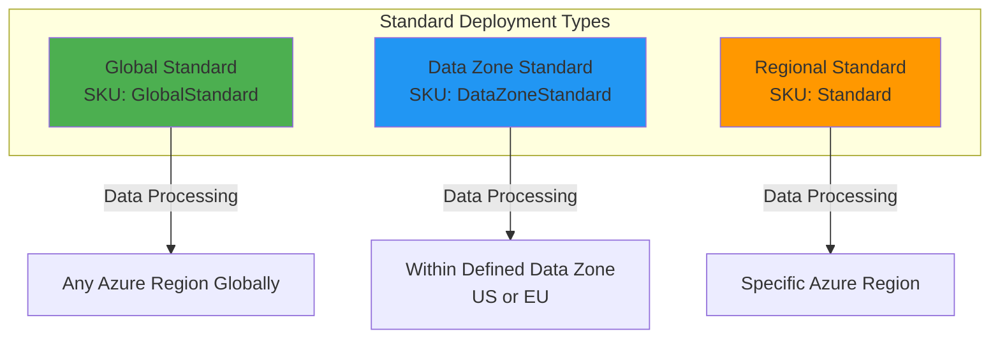

### Provisioned Deployments

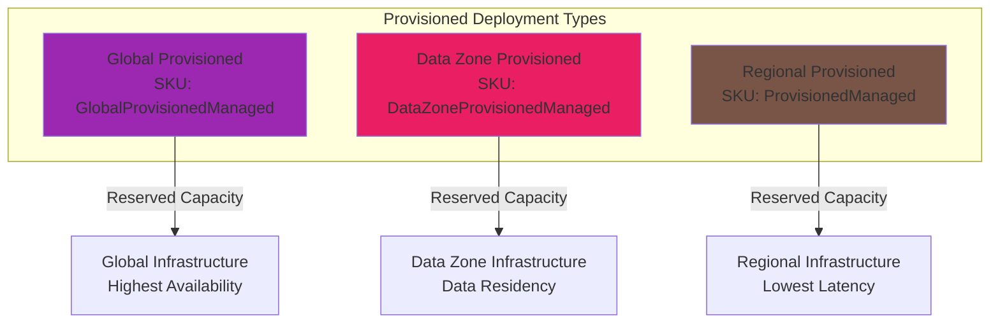

### Deployment Type Details

| Type | SKU Name | Data Processing | Best For |
|------|----------|-----------------|----------|
| **Global Standard** | `GlobalStandard` | Any Azure region | Highest quota, best availability |
| **Global Provisioned** | `GlobalProvisionedManaged` | Any Azure region | Reserved capacity, global routing |
| **Global Batch** | `GlobalBatch` | Any Azure region | Large-scale async processing (50% cost savings) |
| **Data Zone Standard** | `DataZoneStandard` | Within data zone (US/EU) | Data residency + high quota |
| **Data Zone Provisioned** | `DataZoneProvisionedManaged` | Within data zone | Data residency + reserved capacity |
| **Data Zone Batch** | `DataZoneBatch` | Within data zone | Batch + data residency |
| **Regional Standard** | `Standard` | Specific region | Low-medium volume, regional |
| **Regional Provisioned** | `ProvisionedManaged` | Specific region | Lowest latency, predictable |
| **Developer** | `DeveloperTier` | Any region | Fine-tuned model evaluation (no SLA) |

> ⚠️ **BCDR Note:** With Global Standard and Data Zone Standard deployment types, if the primary region experiences an interruption in service, all traffic initially routed to this region is affected. For disaster recovery guidance, see the [business continuity and disaster recovery guide](https://learn.microsoft.com/en-us/azure/ai-foundry/openai/how-to/business-continuity-disaster-recovery).

### Choosing the Right Deployment Type

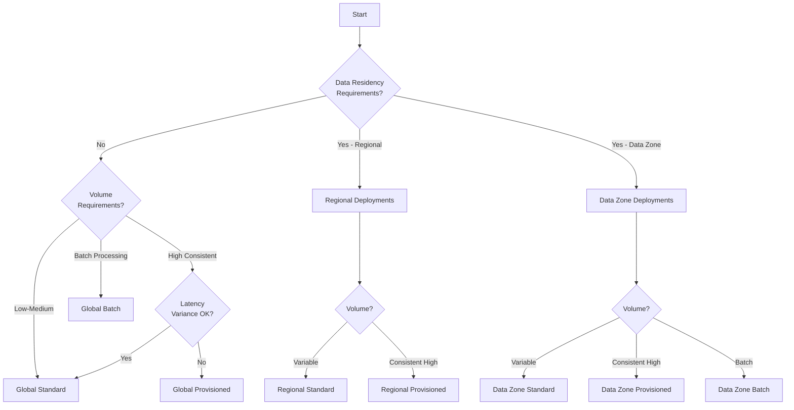

---

## Endpoints and API Access

### Endpoint Architecture

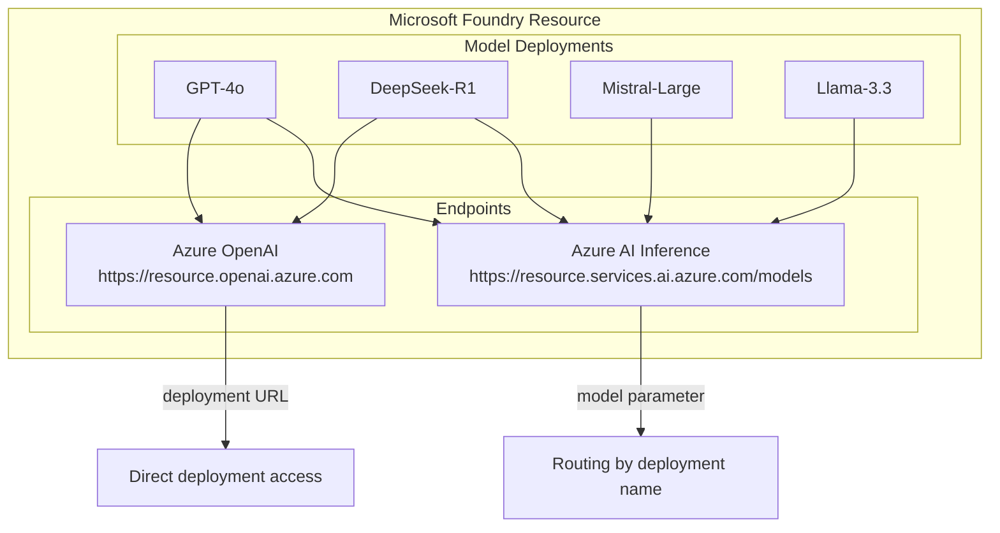

### Azure AI Inference Endpoint

The unified endpoint for accessing all Foundry Models with a single authentication and schema.

**Endpoint Format:** `https://<resource-name>.services.ai.azure.com/models`

**Supported Modalities:**
- Chat Completions
- Text Embeddings
- Image Embeddings

**Routing Mechanism:**
The endpoint routes requests based on the `model` parameter matching the deployment name:

```json
{
    "messages": [...],
    "model": "mistral-large"  // Routes to deployment named "mistral-large"
}
```

### Azure OpenAI Inference Endpoint

Full capabilities of OpenAI models including assistants, threads, files, and batch inference.

**Endpoint Format:** `https://<resource-name>.openai.azure.com`

**Deployment URL Pattern:**
```
https://<resource>.openai.azure.com/openai/deployments/<deployment-name>/chat/completions
```

---

## Azure AI Model Inference API

The Azure AI Model Inference API provides a unified interface for consuming predictions from diverse AI models consistently.

### API Benefits

| Benefit | Description |
|---------|-------------|
| **Portability** | Switch between models without code changes |
| **Consistency** | Uniform request/response schema |
| **Flexibility** | Use the right model for the right task |
| **Efficiency** | Compose multiple models in applications |
| **Extensibility** | Pass model-specific parameters via headers |

### API Capabilities

| Capability | Endpoint | Description |
|------------|----------|-------------|
| **Get Info** | `/info` | Returns model information |
| **Chat Completions** | `/chat/completions` | Generate chat responses |
| **Text Embeddings** | `/embeddings` | Create text embedding vectors |
| **Image Embeddings** | `/images/embeddings` | Create image embedding vectors |

### Extensibility with Extra Parameters

Pass model-specific parameters using the `extra-parameters` header:

```http
POST /chat/completions?api-version=2025-04-01
Authorization: Bearer <token>
Content-Type: application/json
extra-parameters: pass-through

{
    "messages": [...],
    "safe_prompt": true  // Mistral-specific parameter
}
```

**Header Values:**
| Value | Behavior |
|-------|----------|
| `error` (default) | Returns error for unknown parameters |
| `pass-through` | Passes unknown parameters to model |
| `drop` | Silently drops unknown parameters |

---

## SDK Integration

### Available SDKs

| Language | Package | Documentation |
|----------|---------|---------------|
| **Python** | `azure-ai-inference` | [PyPI](https://pypi.org/project/azure-ai-inference/) |
| **JavaScript** | `@azure-rest/ai-inference` | [npm](https://www.npmjs.com/package/@azure/ai-inference) |
| **C#** | `Azure.AI.Inference` | [NuGet](https://www.nuget.org/packages/Azure.AI.Inference/) |
| **Java** | `azure-ai-inference` | [Maven](https://central.sonatype.com/artifact/com.azure/azure-ai-inference/) |

### Python SDK Example

```python
# Install: pip install azure-ai-inference

import os
from azure.ai.inference import ChatCompletionsClient
from azure.ai.inference.models import SystemMessage, UserMessage
from azure.core.credentials import AzureKeyCredential

# Create client
client = ChatCompletionsClient(
    endpoint="https://<resource>.services.ai.azure.com/models",
    credential=AzureKeyCredential(os.environ["AZURE_INFERENCE_CREDENTIAL"]),
)

# Make request
response = client.complete(
    messages=[
        SystemMessage(content="You are a helpful assistant."),
        UserMessage(content="Explain Riemann's conjecture in 1 paragraph"),
    ],
    model="mistral-large"  # Deployment name
)

print(response.choices[0].message.content)
```

### JavaScript SDK Example

```javascript
// Install: npm install @azure-rest/ai-inference

import ModelClient from "@azure-rest/ai-inference";
import { AzureKeyCredential } from "@azure/core-auth";

const client = new ModelClient(
    "https://<resource>.services.ai.azure.com/models", 
    new AzureKeyCredential(process.env.AZURE_INFERENCE_CREDENTIAL)
);

const response = await client.path("/chat/completions").post({
    body: {
        messages: [
            { role: "system", content: "You are a helpful assistant" },
            { role: "user", content: "Explain quantum computing" },
        ],
        model: "gpt-4o"
    }
});

console.log(response.body.choices[0].message.content);
```

### OpenAI SDK with Azure (Python)

```python
# Install: pip install openai azure-identity

from openai import OpenAI
from azure.identity import DefaultAzureCredential, get_bearer_token_provider

# Keyless authentication with Entra ID
token_provider = get_bearer_token_provider(
    DefaultAzureCredential(), 
    "https://cognitiveservices.azure.com/.default"
)

client = OpenAI(
    base_url="https://<resource>.openai.azure.com/openai/v1/",
    api_key=token_provider,
)

completion = client.chat.completions.create(
    model="gpt-4o",  # Deployment name
    messages=[
        {"role": "system", "content": "You are a helpful assistant."},
        {"role": "user", "content": "What is Azure AI?"}
    ]
)

print(completion.choices[0].message.content)
```

### C# SDK Example

```csharp
// Install: dotnet add package Azure.AI.Inference

using Azure;
using Azure.AI.Inference;

var client = new ChatCompletionsClient(
    new Uri("https://<resource>.services.ai.azure.com/models"),
    new AzureKeyCredential(Environment.GetEnvironmentVariable("AZURE_INFERENCE_CREDENTIAL"))
);

var requestOptions = new ChatCompletionsOptions()
{
    Messages = {
        new ChatRequestSystemMessage("You are a helpful assistant."),
        new ChatRequestUserMessage("Explain machine learning")
    },
    Model = "gpt-4o"
};

var response = client.Complete(requestOptions);
Console.WriteLine(response.Value.Content);
```

---

## Content Safety and Guardrails

### Content Safety Architecture

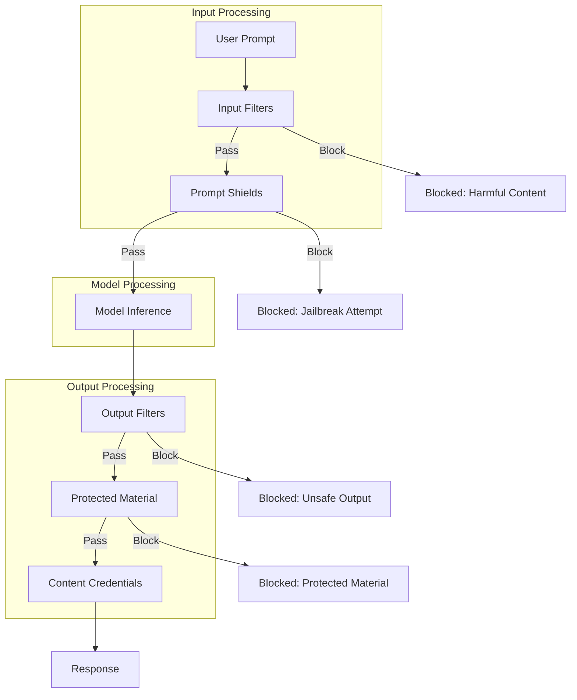

### Default Content Filter Configuration

**Text Models:**

| Risk Category | Prompt | Completion | Default Threshold |
|---------------|--------|------------|-------------------|
| Hate and Fairness | ✅ | ✅ | Medium |
| Violence | ✅ | ✅ | Medium |
| Sexual | ✅ | ✅ | Medium |
| Self-Harm | ✅ | ✅ | Medium |
| Jailbreak Detection | ✅ | ❌ | N/A |
| Protected Material - Text | ❌ | ✅ | N/A |
| Protected Material - Code | ❌ | ✅ | N/A |

**Image Models (DALL-E 3, DALL-E 2):**

| Risk Category | Prompt | Completion | Default Threshold |
|---------------|--------|------------|-------------------|
| Hate and Fairness | ✅ | ✅ | Low |
| Violence | ✅ | ✅ | Low |
| Sexual | ✅ | ✅ | Low |
| Self-Harm | ✅ | ✅ | Low |
| Content Credentials | ❌ | ✅ | N/A |
| Protected Material - Art | ✅ | ❌ | N/A |
| Jailbreak Detection | ✅ | ❌ | N/A |

> **Note:** DALL-E models also include [prompt transformation](https://learn.microsoft.com/en-us/azure/ai-foundry/openai/concepts/prompt-transformation) by default to enhance safety for diversity, public figures, and protected material.

### Content Filter Severity Levels

| Configuration | Prompts | Completions | Description |
|---------------|---------|-------------|-------------|
| Low, Medium, High | Yes | Yes | Strictest - filters all detected harmful content |
| Medium, High | Yes | Yes | Moderate - allows low severity content |
| High Only | Yes | Yes | Permissive - only blocks high severity |
| No Filters | Approval Required | Approval Required | No filtering (requires approval) |
| Annotate Only | Approval Required | Approval Required | Returns annotations without blocking |

### Creating Custom Content Filters

1. Navigate to **Guardrails + controls** in Foundry portal
2. Select **Content filters** tab
3. Click **+ Create content filter**
4. Configure:
   - Filter name
   - Connection association
   - Input filters (prompt processing)
   - Output filters (completion processing)
   - Severity thresholds per category

### Vision Model Safety

For vision models (GPT-4o, GPT-4 Turbo with Vision):

| Risk Category | Applies To | Notes |
|---------------|------------|-------|
| Harm Categories | Text + Images | Standard filtering |
| Individual Identification | Prompts | Prevents identifying individuals |
| Sensitive Attributes | Prompts | Prevents inferring sensitive attributes |
| Jailbreak | Prompts | Vision-specific attack detection |

---

## Fine-Tuning

### Fine-Tuning Overview

Fine-tuning customizes a pretrained AI model with additional training on specific tasks or datasets to improve performance, add new skills, or enhance accuracy.

### When to Fine-Tune

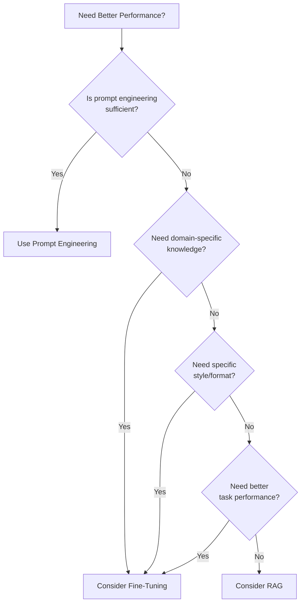

### Top Use Cases

| Use Case | Description | Example |
|----------|-------------|---------|
| **Domain Specialization** | Adapt for specialized fields | Medical, legal, financial terminology |
| **Task Performance** | Optimize for specific tasks | Classification, summarization |
| **Style and Tone** | Match communication style | Brand voice, formal writing |
| **Instruction Following** | Improve format compliance | Multi-step instructions, JSON output |
| **Compliance and Safety** | Adhere to policies | Organizational guidelines |
| **Language Adaptation** | Tailor for specific languages | Dialects, cultural contexts |

### Training Techniques

| Technique | Description | Best For | Supported Models |
|-----------|-------------|----------|------------------|
| **SFT** (Supervised Fine-Tuning) | Train on input-output pairs | Most use cases | GPT-4o, GPT-4.1, Phi-4, Llama, Mistral |
| **DPO** (Direct Preference Optimization) | Learn from comparative feedback | Response quality, alignment | GPT-4o, GPT-4.1, GPT-4.1-mini |
| **RFT** (Reinforcement Fine-Tuning) | Optimize with reward signals | Complex reasoning tasks | o4-mini |

### Fine-Tuning Model Comparison

| Model | Modalities | Techniques | Best For |
|-------|------------|------------|----------|
| GPT-4.1 | Text, Vision | SFT, DPO | Complex tasks, nuanced understanding |
| GPT-4.1-mini | Text | SFT, DPO | Fast iteration, cost-effective |
| GPT-4.1-nano | Text | SFT, DPO | Minimal resource usage |
| GPT-4o | Text, Vision | SFT, DPO | Complex tasks (previous gen) |
| o4-mini | Text | RFT | Complex logical reasoning |
| Phi-4 | Text | SFT | Cost-effective simple tasks |
| Mistral Large (2411) | Text | SFT | Complex tasks |

### Fine-Tuning Workflow

```mermaid
flowchart LR
    subgraph Prepare["1. Prepare"]
        Data[Prepare Data<br/>50-100 examples]
        Format[Format JSONL]
    end
    
    subgraph Configure["2. Configure"]
        Model[Select Model]
        Tech[Choose Technique]
        Params[Set Hyperparameters]
    end
    
    subgraph Train["3. Train"]
        Upload[Upload Data]
        Train2[Training Job]
        Safety[Safety Evaluation]
    end
    
    subgraph Deploy["4. Deploy"]
        Eval[Evaluate Model]
        Deploy2[Deploy Endpoint]
        Monitor[Monitor Performance]
    end
    
    Prepare --> Configure --> Train --> Deploy
```

### Serverless vs Managed Compute Fine-Tuning

| Aspect | Serverless | Managed Compute |
|--------|------------|-----------------|
| **Pricing** | From $1.70/M input tokens | VM costs |
| **Infrastructure** | Microsoft-managed | Customer-managed |
| **GPU Quota** | Not required | Required |
| **OpenAI Models** | ✅ Available | ❌ Not available |
| **Hyperparameters** | Limited options | Full control |
| **Best For** | Most customers | Advanced customization |

---

## Pricing and Billing

### Billing Models

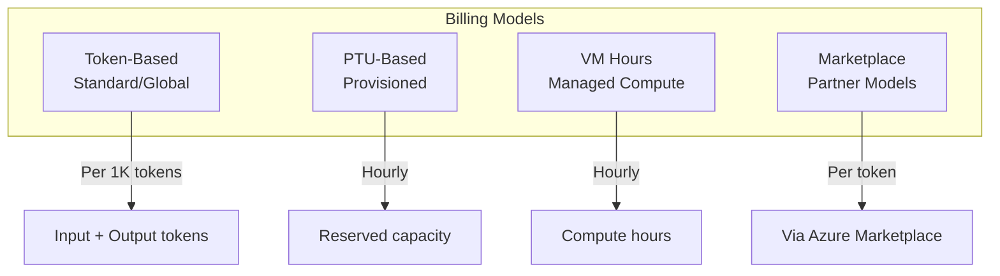

### Token-Based Pricing (Standard)

Language and vision models process inputs as tokens (roughly 4 characters of text).

| Component | Billing |
|-----------|---------|
| Input Tokens | Per 1,000 tokens |
| Output Tokens | Per 1,000 tokens |
| Image Tokens | Converted to token equivalent |
| Audio Tokens | Converted to token equivalent |

> **Note:** Pricing varies by model series and deployment type. See [Azure OpenAI Pricing](https://azure.microsoft.com/pricing/details/cognitive-services/openai-service/)

### Provisioned Throughput Units (PTU)

PTUs represent model processing capacity for predictable, high-throughput workloads.

| Aspect | Details |
|--------|---------|
| **Billing** | Hourly based on deployed PTUs |
| **Discounts** | Available via Azure Reservations |
| **Quota** | Model-independent (usable across models) |
| **Minimum Deployment** | Varies by model (15-100 PTUs) |
| **Scale Increment** | Varies by model (5-100 PTUs) |

### PTU Minimum Requirements

| Model | Global/Data Zone Min | Global/Data Zone Increment | Regional Min | Regional Increment |
|-------|---------------------|---------------------------|--------------|-------------------|
| GPT-4.1 | 15 | 5 | 50 | 50 |
| GPT-4.1-mini | 15 | 5 | 25 | 25 |
| GPT-4.1-nano | 15 | 5 | 25 | 25 |
| GPT-4o | 15 | 5 | 50 | 50 |
| GPT-4o-mini | 15 | 5 | 25 | 25 |
| o4-mini | 15 | 5 | 25 | 25 |
| o3 | 15 | 5 | 50 | 50 |
| o3-mini | 15 | 5 | 25 | 25 |
| o1 | 15 | 5 | 25 | 50 |
| DeepSeek-R1 | 100 | 100 | N/A | N/A |
| DeepSeek-V3-0324 | 100 | 100 | N/A | N/A |
| Llama-3.3-70B-Instruct | 100 | 100 | N/A | N/A |

### Fine-Tuned Model Costs

| Component | Billing |
|-----------|---------|
| **Training** | Per token in training file |
| **Hosting** | Hourly (applies even when unused) |
| **Inference** | Per 1,000 tokens |

> ⚠️ **Important:** Inactive fine-tuned model deployments (unused for 15+ days) are automatically deleted. Remove unused deployments to control costs.

### HTTP Error Response Billing

| Scenario | Billed? |
|----------|---------|
| 200 OK | Yes |
| 400 (Content filter/input limit) | Yes - processing occurred |
| 408 (Timeout) | Yes - processing occurred |
| 401 (Authentication) | No |
| 429 (Rate limit) | No |

---

## Quotas and Rate Limits

### Standard Deployment Quotas

Quotas are measured in Tokens Per Minute (TPM) and Requests Per Minute (RPM).

#### O-Series Models

| Model | Tier | TPM Limit | RPM |
|-------|------|-----------|-----|
| o4-mini | Enterprise | 10M | 10K |
| o3 | Enterprise | 10M | 10K |
| o3-mini | Enterprise | 50M | 5K |
| o1 | Enterprise | 30M | 5K |
| o4-mini | Default | 1M | 1K |
| o3 | Default | 1M | 1K |
| o3-mini | Default | 5M | 500 |

### Provisioned Throughput Quota

PTU quota is model-independent and region-specific.

| Deployment Type | Quota Name |
|-----------------|------------|
| Regional Provisioned | Regional Provisioned Throughput Unit |
| Global Provisioned | Global Provisioned Throughput Unit |
| Data Zone Provisioned | Data Zone Provisioned Throughput Unit |

> ⚠️ **Important:** Quota doesn't guarantee capacity. Deploy your model in Foundry **before** purchasing a matching reservation in the Azure portal. Capacity is allocated at deployment time and held for as long as the deployment exists.

### Requesting Quota Increases

1. Navigate to **Management center** → **Quota** in Foundry portal
2. Submit request via [Request Quota Link](https://customervoice.microsoft.com/Pages/ResponsePage.aspx?id=v4j5cvGGr0GRqy180BHbR4xPXO648sJKt4GoXAed-0pUMFE1Rk9CU084RjA0TUlVSUlMWEQzVkJDNCQlQCN0PWcu)
3. Approval typically within 2 business days

### Dynamic Quota (Preview)

Enable opportunistic access to additional quota when capacity is available:

- Standard deployments can temporarily exceed TPM limits
- Extra requests billed at regular rates
- Never decreases below configured value

---

## Regional Availability

### Model Availability by Provider

#### Anthropic Claude Models

| Model | Deployment Regions |
|-------|-------------------|
| Claude Haiku 4.5 | East US 2, Sweden Central |
| Claude Sonnet 4.5 | East US 2, Sweden Central |
| Claude Opus 4.5 | East US 2, Sweden Central |
| Claude Opus 4.1 | East US 2, Sweden Central |

#### Meta Llama Models

| Model | Deployment Regions | Fine-Tuning |
|-------|-------------------|-------------|
| Llama 3.1 405B Instruct | East US, East US 2, North Central US, South Central US, West US, West US 3 | ❌ |
| Llama 3.3 70B Instruct | East US, East US 2, North Central US, South Central US, Sweden Central, West US, West US 3 | West US 3 |
| Llama 3.2 Vision | East US, East US 2, North Central US, South Central US, Sweden Central, West US, West US 3 | West US 3 |

#### Microsoft Models

| Model | Deployment Regions | Fine-Tuning |
|-------|-------------------|-------------|
| Phi-4 | East US, East US 2, North Central US, South Central US, Sweden Central, West US, West US 3 | ✅ |
| MAI-DS-R1 | East US, East US 2, North Central US, South Central US, West US, West US 3 | ❌ |

#### DeepSeek Models

| Model | Deployment Regions |
|-------|-------------------|
| DeepSeek-R1 | East US, East US 2, North Central US, South Central US, West US, West US 3 |
| DeepSeek-V3-0324 | East US, East US 2, North Central US, South Central US, West US, West US 3 |

### Cross-Region Consumption

If your infrastructure is in a region without model availability:
1. Create a hub/project in a supported region
2. Deploy the model
3. Consume the endpoint from your primary region
4. See [Consume serverless APIs from a different hub](https://learn.microsoft.com/en-us/azure/ai-foundry/how-to/deploy-models-serverless-connect)

---

## Security and Compliance

### Authentication Methods

| Method | Serverless API | Managed Compute | Provisioned |
|--------|----------------|-----------------|-------------|
| API Keys | ✅ | ✅ | ✅ |
| Microsoft Entra ID | ❌ | ✅ | ✅ |
| Managed Identity | ❌ | ✅ | ✅ |

### Keyless Authentication (Entra ID)

```python
from azure.identity import DefaultAzureCredential, get_bearer_token_provider

token_provider = get_bearer_token_provider(
    DefaultAzureCredential(), 
    "https://cognitiveservices.azure.com/.default"
)

client = OpenAI(
    base_url="https://<resource>.openai.azure.com/openai/v1/",
    api_key=token_provider,
)
```

### Network Security

| Feature | Serverless | Managed Compute |
|---------|------------|-----------------|
| Private Endpoints | Via hub configuration | Configurable |
| VNet Integration | Hub PNA flag | Managed networks |
| Public Network Access | Configurable | Configurable |

> **Network Isolation Limitations:**
> - Hubs with private endpoints created **before July 11, 2024**: Serverless API deployments won't follow the hub's networking configuration. Create a new private endpoint and redeploy.
> - Existing MaaS deployments **before July 11, 2024**: Won't follow hub networking configuration. Deployments must be recreated.
> - Network configuration changes may take **up to 5 minutes** to propagate.
> - Azure OpenAI On Your Data is **not available** for serverless API deployments in private hubs.

### Data Processing and Compliance

| Deployment Type | Data at Rest | Data Processing |
|-----------------|--------------|-----------------|
| Regional | Customer region | Customer region |
| Data Zone | Customer region | Within data zone (US/EU) |
| Global | Customer region | Any Azure region |

### Azure Policy Controls

Disable specific deployment types using Azure Policy:

```json
{
    "mode": "All",
    "policyRule": {
        "if": {
            "allOf": [
                {
                    "field": "type",
                    "equals": "Microsoft.CognitiveServices/accounts/deployments"
                },
                {
                    "field": "Microsoft.CognitiveServices/accounts/deployments/sku.name",
                    "equals": "GlobalStandard"
                }
            ]
        }
    }
}
```

---

## Best Practices

### Model Selection

1. **Start with Global Standard** for highest availability and default quotas
2. **Use GPT-4.1** for complex tasks requiring nuanced understanding
3. **Use GPT-4.1-mini** for cost-effective simple tasks
4. **Consider DeepSeek-R1** for reasoning-heavy workloads
5. **Evaluate Phi-4** for cost-sensitive applications

### Deployment Strategy

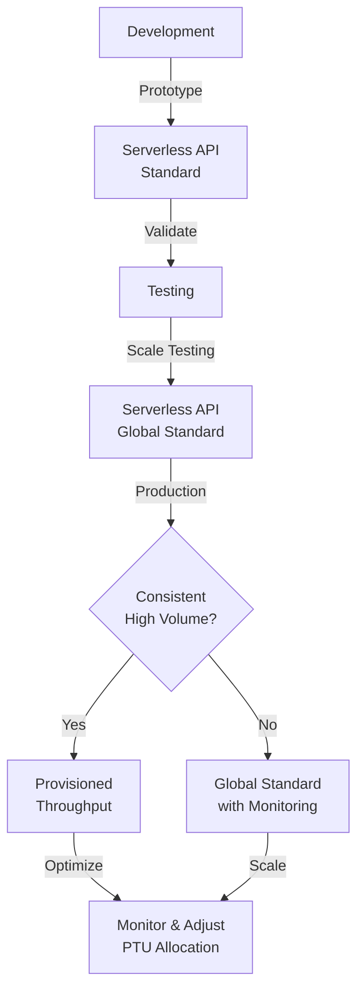

### Cost Optimization

| Strategy | Implementation |
|----------|----------------|
| Right-size deployments | Monitor usage and adjust PTU allocations |
| Use Global Batch | 50% cost reduction for async workloads |
| Leverage caching | Cached tokens deducted 100% from utilization |
| Clean up unused resources | Delete inactive fine-tuned model deployments |
| Use smaller models | GPT-4.1-mini/nano for simple tasks |

### Content Safety

1. **Use default filters** for most applications
2. **Create custom filters** for specific compliance requirements
3. **Enable prompt shields** for user-facing applications
4. **Implement protected material detection** for content generation
5. **Monitor content safety metrics** in production

### SDK Best Practices

1. **Use singleton clients** - avoid creating new clients per request
2. **Implement retry logic** - handle 429 errors with exponential backoff
3. **Use async APIs** - for better throughput in Python/JavaScript
4. **Enable diagnostics** - log response headers for troubleshooting
5. **Use keyless auth** - prefer Entra ID over API keys in production

### Fine-Tuning Guidelines

1. **Start small** - 50-100 high-quality examples for initial testing
2. **Scale gradually** - 500+ examples for production models
3. **Begin with SFT** - covers most use cases
4. **Iterate and evaluate** - measure performance, refine approach
5. **Use serverless** - unless you need advanced customization

---

## References

### Official Documentation

- [Microsoft Foundry Models Overview](https://learn.microsoft.com/en-us/azure/ai-foundry/concepts/foundry-models-overview)
- [Deploy Models as Serverless APIs](https://learn.microsoft.com/en-us/azure/ai-foundry/how-to/deploy-models-serverless)
- [Azure AI Model Inference API](https://learn.microsoft.com/en-us/azure/ai-foundry/model-inference/reference/reference-model-inference-api)
- [Deployment Types](https://learn.microsoft.com/en-us/azure/ai-foundry/foundry-models/concepts/deployment-types)
- [Content Filtering](https://learn.microsoft.com/en-us/azure/ai-foundry/concepts/content-filtering)
- [Fine-Tuning Overview](https://learn.microsoft.com/en-us/azure/ai-foundry/concepts/fine-tuning-overview)
- [Regional Availability](https://learn.microsoft.com/en-us/azure/ai-foundry/how-to/deploy-models-serverless-availability)

### SDK References

- [Python SDK (azure-ai-inference)](https://pypi.org/project/azure-ai-inference/)
- [JavaScript SDK (@azure-rest/ai-inference)](https://www.npmjs.com/package/@azure/ai-inference)
- [C# SDK (Azure.AI.Inference)](https://www.nuget.org/packages/Azure.AI.Inference/)
- [Java SDK (azure-ai-inference)](https://central.sonatype.com/artifact/com.azure/azure-ai-inference/)

### Additional Resources

- [Azure OpenAI Pricing](https://azure.microsoft.com/pricing/details/cognitive-services/openai-service/)
- [Azure AI Content Safety](https://learn.microsoft.com/en-us/azure/ai-services/content-safety/overview)
- [Responsible AI Practices](https://learn.microsoft.com/en-us/azure/ai-foundry/responsible-ai/openai/overview)
- [Foundry Portal](https://ai.azure.com)

---

*Last Updated: January 2026*
