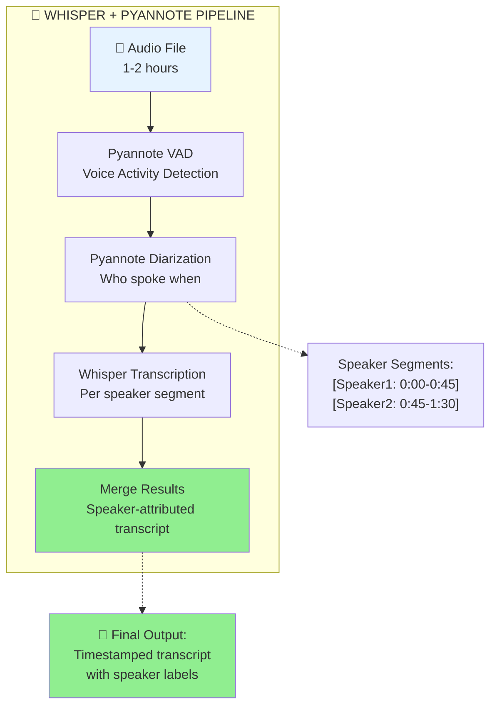
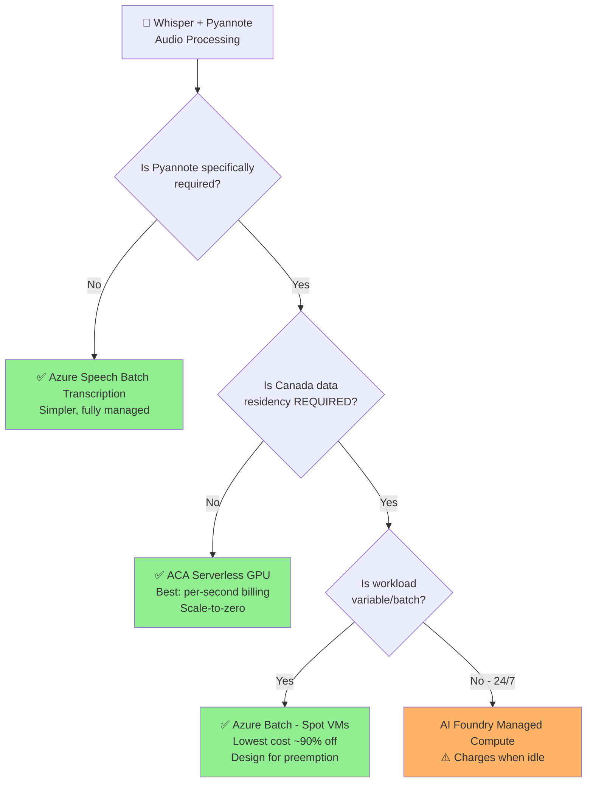

# Azure GPU Hosting Options for Open-Source AI Models - Customer Guidance

## Executive Summary

This document provides comprehensive guidance for hosting open-source AI models (Hugging Face, Whisper, Pyannote, etc.) on Azure, with a focus on Azure Container Apps (ACA) with serverless GPUs. It addresses regional availability, **cost optimization**, and best practices for production deployments, specifically for **long-running audio analysis workloads (1-2 hours)** with **speaker diarization**.

---

## 🎯 Key Use Case: Long Audio File Analysis (1-2 Hours)

Your customer's scenario: **Processing long audio files (1-2 hours) with custom open-source models using serverless GPU**

### Critical Cost Comparison

| Hosting Option | Billing Model | Cost When Idle | Best For |
|----------------|---------------|----------------|----------|
| **ACA Serverless GPU** | **Per-second** | **$0 (scale-to-zero)** | Variable workloads, batch jobs |
| **Azure Batch (Spot VMs)** | Spot pricing (~90% off) | **$0 (scale-to-zero)** | Maximum savings, batch jobs, Canada OK |
| **AI Foundry Managed Compute** | Per-hour (VM uptime) | **Continues charging** | 24/7 consistent workloads |
| **Azure Speech Batch Transcription** | Per-audio-hour | **$0 (pay-per-use)** | Standard Whisper transcription |
| **Azure Speech Fast Transcription** | Per-audio-hour | **$0 (pay-per-use)** | Files <2 hours, <300MB |

### 💰 Cost Analysis for Long Audio Processing

**Scenario**: Processing 10 audio files of 2 hours each per day

| Option | Active Processing | Idle Hours (22h) | Monthly Estimate |
|--------|-------------------|------------------|------------------|
| **ACA Serverless GPU (T4)** | Pay only for ~20h processing | **$0** | Lower |
| **AI Foundry Managed Compute** | Pay for 24h VM | **Still paying** | ~3-4x higher |

**Winner for batch/variable workloads**: ✅ ACA Serverless GPU

---

## 1. Azure Container Apps (ACA) with Serverless GPUs

### Overview

Azure Container Apps serverless GPUs provide a **middle-layer option** between:
- **Azure AI Foundry serverless APIs** (fully managed, pay-per-token)
- **Managed compute** (dedicated VMs, pay-per-compute-uptime - **charges even when idle**)

### Key Benefits for Long Audio Processing

| Feature | Description | Benefit for Audio Workloads |
|---------|-------------|----------------------------|
| **Scale-to-Zero** | GPUs scale down when not in use | **Pay $0 between processing jobs** |
| **Per-Second Billing** | Pay only for actual GPU compute time | **2-hour job = pay for 2 hours only** |
| **Data Governance** | Data never leaves container boundaries | Audio files stay in your container |
| **No Infrastructure Management** | Serverless - no driver installation | Focus on model, not infrastructure |
| **Automatic Scaling** | Scales based on workload demand | Handle burst of audio files |
| **Jobs Support** | ACA Jobs for batch processing | Perfect for audio batch processing |

### GPU Types Available

| GPU Type | Memory | Approx. Cost/Hour | Best For | Recommendation for Audio |
|----------|--------|-------------------|----------|--------------------------|
| **NVIDIA T4** | 16GB VRAM | ~$0.32/hr | Cost-effective inference, models <10GB | ✅ **Recommended for Whisper/audio models** |
| **NVIDIA A100** | 80GB HBM2e | ~$2.34/hr | Large models >15GB, training | Overkill for most audio processing |

> **Cost Insight**: A100 provides ~4× the performance but costs ~7-8× more than T4. For Whisper + Pyannote (~8-10GB VRAM combined), T4 is the cost-effective choice.

### ACA Billing Details

```
Billing = (vCPU-seconds × rate) + (GiB-seconds × rate) + (GPU-seconds × rate)

✅ When scaled to ZERO replicas = NO charges
✅ Per-second precision billing
✅ GPU-seconds billed only when GPU is allocated
```

**Important**: Idle usage charges do NOT apply to serverless GPU apps - they're **always billed for active usage only**.

### 🚨 Regional Availability - CRITICAL LIMITATION

**Canada is NOT supported for ACA serverless GPUs.** 

| Region | A100 | T4 |
|--------|------|-----|
| **Australia East** | ✅ Yes | ✅ Yes |
| **Brazil South** | ✅ Yes | ✅ Yes |
| **Central India** | ❌ No | ✅ Yes |
| **East US** | ✅ Yes | ✅ Yes |
| **France Central** | ❌ No | ✅ Yes |
| **Italy North** | ✅ Yes | ✅ Yes |
| **Japan East** | ❌ No | ✅ Yes |
| **North Central US** | ❌ No | ✅ Yes |
| **South Central US** | ❌ No | ✅ Yes |
| **South East Asia** | ❌ No | ✅ Yes |
| **South India** | ❌ No | ✅ Yes |
| **Sweden Central** | ✅ Yes | ✅ Yes |
| **West Europe*** | ❌ No | ✅ Yes |
| **West US** | ✅ Yes | ✅ Yes |
| **West US 2** | ❌ No | ✅ Yes |
| **West US 3** | ✅ Yes | ✅ Yes |
| **Canada Central** | ❌ **NOT AVAILABLE** | ❌ **NOT AVAILABLE** |
| **Canada East** | ❌ **NOT AVAILABLE** | ❌ **NOT AVAILABLE** |

*West Europe requires creating a new workload profile environment.

### Considerations for ACA Serverless GPUs

1. **CUDA Version**: Supports latest CUDA version
2. **Single GPU per Container**: Only one container in an app can use the GPU at a time
3. **No Fractional GPUs**: Multi and fractional GPU replicas aren't supported
4. **Quota Required**: Must request GPU quotas via Azure support case (EA/Pay-as-you-go have default quota)
5. **Instance Limits**: Max 1× A100 GPU, 24 vCPU, 96 GB RAM per container instance
6. **Network**: Consumes one IP address per replica when using VNet integration

### Why NOT Other Azure Services?

| Alternative | Scale-to-Zero? | Why Not Preferred |
|-------------|----------------|-------------------|
| **Azure ML Online Endpoints** | ❌ No | Requires at least 1 GPU node running 24/7 - incurs idle costs |
| **AKS with GPU Node Pools** | ⚠️ Possible but complex | Can configure scale-to-zero but requires Kubernetes expertise, longer cold starts (minutes) |
| **Azure Batch** | ✅ Yes | Good for batch jobs but not real-time serving, more setup |
| **Azure Functions** | ❌ No GPU support | No GPU on Consumption plan |
| **Dedicated GPU VMs** | ❌ No | Manual management, risk of forgetting to shut down |

---

## 2. Azure AI Foundry Model Hosting Options

### About Azure AI Foundry

Azure AI Foundry catalogs **11,000+ models** including open-source Hugging Face models. It offers two deployment modes:

1. **Serverless API** - Managed, pay-per-token (uses ephemeral containers under the hood)
2. **Managed Compute** - Dedicated VMs you provision (pays per VM uptime)

### Deployment Options Comparison (With Cost Impact)

| Option | Billing Model | Idle Cost | Hugging Face Support | Canada |
|--------|---------------|-----------|---------------------|--------|
| **Serverless API** | Pay-per-token | **$0** | ❌ Limited (popular models only) | ✅ Yes |
| **Managed Compute** | Pay-per-VM-hour | **💸 Continues charging** | ✅ Full | ✅ Yes |
| **ACA Serverless GPU** | Pay-per-second | **$0 (scale-to-zero)** | ✅ Full | ❌ No |

### ⚠️ Managed Compute Cost Warning

> **AI Foundry Managed Compute charges per VM uptime, NOT per inference.**
> 
> If your workload is variable (e.g., process audio files during business hours only), you'll pay for:
> - Active processing time
> - **PLUS all idle time the VM is running**
> 
> This can result in **3-4x higher costs** compared to serverless GPU for batch workloads.

### When Serverless API Won't Work

Not every model can run on the serverless footprint. Models that **exceed these limits** require Managed Compute:

- **GPU**: More than 1× A100 (multi-GPU inference)
- **CPU**: More than 24 vCPUs
- **RAM**: More than 96 GB

Large models requiring multi-GPU for inference cannot use the simple serverless deployment.

### Hugging Face Models in AI Foundry

**Important**: Hugging Face models in Azure AI Foundry are **NOT available as serverless APIs**. They require **Managed Compute** deployment.

> *"Managed compute deployment is required for model collections that include: Hugging Face, NVIDIA inference microservices (NIMs), Industry models, Databricks, Custom models"*

---

## 3. ALL Azure Options for Long Audio Processing (1-2 Hours)

### Complete Options Matrix

| Option | Model Flexibility | File Size Limit | Billing | Scale-to-Zero | Custom Models | Pyannote | Canada |
|--------|-------------------|-----------------|---------|---------------|---------------|----------|--------|
| **ACA Serverless GPU** | ✅ Any model | Unlimited | Per-second | ✅ Yes | ✅ Yes | ✅ Yes | ❌ No |
| **ACA Jobs + GPU** | ✅ Any model | Unlimited | Per-second | ✅ Yes | ✅ Yes | ✅ Yes | ❌ No |
| **Azure Batch (Spot VMs)** | ✅ Any model | Unlimited | Spot (~90% off) | ✅ Yes | ✅ Yes | ✅ Yes | ✅ Yes |
| **Azure Speech Batch Transcription** | Whisper only | Up to 1GB | Per-audio-hour | ✅ Yes | ❌ No | ❌ MS only | ✅ Yes |
| **Azure Speech Fast Transcription** | Whisper only | <300MB, <2h | Per-audio-hour | ✅ Yes | ❌ No | ❌ MS only | ✅ Yes |
| **Azure OpenAI Whisper** | Whisper only | 25MB | Per-token | ✅ Yes | ❌ No | ❌ No | ✅ Yes |
| **AI Foundry Managed Compute** | ✅ Any model | Unlimited | Per-VM-hour | ❌ **No** | ✅ Yes | ✅ Yes | ✅ Yes |
| **AKS with GPU Nodes** | ✅ Any model | Unlimited | Per-node-hour | ⚠️ Manual | ✅ Yes | ✅ Yes | ✅ Yes |

### Option Details

#### Option 1: ACA Serverless GPU with Container Apps (✅ RECOMMENDED)

**Best for**: Custom open-source models, variable workloads, long audio files

```
Architecture:
┌─────────────────┐     ┌─────────────────────────────────────┐
│  Audio Files    │────▶│  Azure Container Apps               │
│  (Blob Storage) │     │  - Serverless GPU (T4)              │
└─────────────────┘     │  - Custom Whisper/Hugging Face      │
                        │  - Scale-to-zero when idle          │
                        │  - Per-second billing               │
                        └─────────────────────────────────────┘
```

**Pros**:
- ✅ Per-second billing (pay only during processing)
- ✅ Scale-to-zero (no cost when idle)
- ✅ Use ANY open-source model
- ✅ Process files of ANY size
- ✅ Full data governance

**Cons**:
- ❌ Not available in Canada
- ❌ Requires container image management
- ❌ Cold start time (mitigated with artifact streaming)

#### Option 2: ACA Jobs with GPU (✅ EXCELLENT FOR BATCH)

**Best for**: Scheduled batch processing of multiple audio files

```
Architecture:
┌─────────────────┐     ┌─────────────────────────────────────┐
│  Queue/Schedule │────▶│  Azure Container Apps Job           │
│  (Storage Queue)│     │  - Event/Schedule triggered         │
└─────────────────┘     │  - Serverless GPU (T4)              │
                        │  - Runs, processes, exits           │
                        │  - Pay only during execution        │
                        └─────────────────────────────────────┘
```

**Job Types**:
- **Manual Jobs**: Trigger on-demand via API
- **Scheduled Jobs**: Cron-based (e.g., nightly batch)
- **Event-driven Jobs**: Triggered by queue messages

**Pros**:
- ✅ Perfect for batch audio processing
- ✅ Automatic retry on failure
- ✅ Pay only during job execution
- ✅ Scales based on queue depth

#### Option 3: Azure Speech Batch Transcription (For Standard Whisper)

**Best for**: Standard Whisper transcription without custom models

```
Limits:
- Files up to 1GB
- Concurrent processing
- Diarization support
- Word-level timestamps
```

**Pros**:
- ✅ Fully managed, no infrastructure
- ✅ Pay-per-audio-hour
- ✅ Supports files >25MB (unlike Azure OpenAI Whisper)
- ✅ Available in Canada

**Cons**:
- ❌ Whisper model only (no custom models)
- ❌ No real-time processing (async only)
- ❌ May take up to 30 min to start at peak hours

#### Option 4: Azure Speech Fast Transcription API

**Best for**: Quick turnaround on files <2 hours

```
Limits:
- Files less than 2 hours
- Files less than 300MB
- Synchronous response (faster than real-time)
```

**Pros**:
- ✅ Predictable, fast latency
- ✅ Synchronous results
- ✅ Available in Canada

**Cons**:
- ❌ 2-hour file limit
- ❌ 300MB size limit
- ❌ Standard Whisper only
- ❌ Uses Microsoft's diarization (NOT Pyannote)

#### Option 5: Azure Batch with Spot VMs (✅ RECOMMENDED FOR CANADA)

**Best for**: Maximum cost savings, large-scale batch processing, full infrastructure control

```
Architecture:
┌─────────────────┐     ┌────────────────────────────────────┐
│  Storage Queue  │────▶│  Azure Batch Pool (Spot GPU VMs)   │
│  (Job Triggers) │     │  - NC-series or ND-series GPUs     │
└─────────────────┘     │  - Spot pricing (~90% off)         │
                        │  - Custom container image          │
                        │  - Auto-scale 0 to N nodes         │
                        └────────────────────────────────────┘
```

**Pros**:
- ✅ **Lowest cost option** - Spot VMs up to 90% cheaper
- ✅ **Available in Canada**
- ✅ Scale-to-zero (pools auto-scale based on job queue)
- ✅ Full flexibility - any Docker container
- ✅ Supports large GPU VMs (NC, ND series)
- ✅ Parallel processing across multiple nodes

**Cons**:
- ⚠️ Spot VMs can be preempted at any time
- ⚠️ More infrastructure setup required
- ⚠️ Need to handle checkpointing for preemption recovery
- ⚠️ Not available in BatchService mode (requires UserSubscription)

**Spot VM Consideration**: Jobs should be designed to handle preemption. For 1-2 hour audio files, consider checkpointing progress or breaking into smaller segments.

---

## 4. Whisper + Pyannote: Speaker Diarization Considerations

### ⚠️ Important: No Managed SaaS/PaaS for Pyannote

**There is NO Azure managed service that offers Pyannote specifically.** Pyannote is an open-source library, not a commercial product, so no cloud provider offers it as a SaaS/PaaS solution.

| Service | Whisper | Speaker Diarization | Fully Managed | Pyannote? |
|---------|---------|---------------------|---------------|-----------|
| **Azure Speech Batch Transcription** | ✅ Yes | ✅ Microsoft's built-in | ✅ Yes | ❌ No |
| **Azure Speech Fast Transcription** | ✅ Yes | ✅ Microsoft's built-in | ✅ Yes | ❌ No |
| **Azure OpenAI Whisper** | ✅ Yes | ❌ No diarization | ✅ Yes | ❌ No |
| **Self-hosted (ACA, Batch, AKS)** | ✅ Yes | ✅ Pyannote | ❌ You manage | ✅ Yes |

### 🤔 Key Question for the Customer: Is Pyannote Actually Required?

**Before investing in custom GPU hosting, evaluate if Azure Speech's built-in diarization meets your needs:**

| Capability | Azure Speech Diarization | Pyannote |
|------------|--------------------------|----------|
| Speaker identification | ✅ Yes (up to 36 speakers) | ✅ Yes |
| Overlapping speech | ⚠️ Limited | ✅ Better |
| Custom fine-tuning | ❌ No | ✅ Yes |
| Accuracy on complex audio | Good | State-of-the-art |
| Infrastructure required | None (fully managed) | GPU container hosting |
| Available in Canada | ✅ Yes | Depends on hosting |

**Recommendation**: 
- **Try Azure Speech Batch Transcription first** - it's fully managed, pay-per-use, and may be "good enough"
- **Only use Pyannote if** you need higher accuracy on complex scenarios, overlapping speech detection, or custom fine-tuning

### What is Pyannote?

**Pyannote Audio** is an open-source speaker diarization toolkit that provides:
- **Speaker diarization** - identifying "who spoke when"
- **Voice activity detection (VAD)**
- **Speaker segmentation and clustering**
- **Overlapped speech detection**

### Why Combine Whisper + Pyannote?

Azure Speech Service has built-in diarization, but **Pyannote offers**:
- Higher accuracy for complex scenarios
- Better handling of overlapping speech
- More customization options
- Fine-tuning capability on your own data
- State-of-the-art performance on benchmarks

### 🔄 Alternative Hugging Face Models for Speaker Diarization

If Pyannote doesn't fit your needs (licensing, performance, or ease of use), consider these alternatives:

| Model/Framework | Type | License | VRAM | Best For |
|-----------------|------|---------|------|----------|
| **[Pyannote 3.1](https://huggingface.co/pyannote/speaker-diarization-3.1)** | Full pipeline | MIT | ~2-4 GB | State-of-the-art diarization, overlapped speech |
| **[NVIDIA NeMo](https://github.com/NVIDIA/NeMo)** | Full toolkit | Apache 2.0 | ~2-6 GB | Enterprise-grade, NVIDIA GPU optimized, Riva deployment |
| **[SpeechBrain ECAPA-TDNN](https://huggingface.co/speechbrain/spkrec-ecapa-voxceleb)** | Speaker embeddings | Apache 2.0 | ~1-2 GB | Speaker verification, embedding extraction |
| **[Wav2Vec2 + clustering](https://huggingface.co/facebook/wav2vec2-large-960h)** | DIY approach | MIT | ~2-4 GB | Custom pipelines, research flexibility |
| **[WhisperX](https://github.com/m-bain/whisperX)** | Whisper + diarization | BSD | ~4-8 GB | Combined transcription + diarization in one |

#### Option 1: NVIDIA NeMo (⭐ Recommended Enterprise Alternative)

**NVIDIA NeMo** is a scalable AI framework with built-in speaker diarization:
- ✅ Apache 2.0 license (enterprise-friendly)
- ✅ Optimized for NVIDIA GPUs
- ✅ Can deploy to production with **NVIDIA Riva**
- ✅ Active development, 16k+ GitHub stars
- ✅ Includes ASR, TTS, and speaker diarization in one toolkit

```python
# NeMo speaker diarization example
from nemo.collections.asr.models import ClusteringDiarizer
diarizer = ClusteringDiarizer.from_pretrained("nvidia/speakerdiarization_en")
```

#### Option 2: SpeechBrain ECAPA-TDNN

**SpeechBrain** provides speaker embedding models that can be combined with clustering for diarization:
- ✅ Apache 2.0 license
- ✅ Pre-trained on VoxCeleb (1M+ downloads/month)
- ✅ Easy to integrate with custom clustering
- ⚠️ Requires building your own diarization pipeline

```python
# SpeechBrain speaker embeddings
from speechbrain.inference.speaker import EncoderClassifier
classifier = EncoderClassifier.from_hparams(source="speechbrain/spkrec-ecapa-voxceleb")
embeddings = classifier.encode_batch(audio_signal)
# Then cluster embeddings to identify speakers
```

#### Option 3: WhisperX (Easiest Combined Solution)

**WhisperX** combines Whisper transcription with speaker diarization in a single package:
- ✅ Combines Whisper + Pyannote + forced alignment
- ✅ Word-level timestamps with speaker attribution
- ✅ Single package, easy to deploy
- ⚠️ Uses Pyannote under the hood (requires accepting Pyannote license)

```python
# WhisperX combined transcription + diarization
import whisperx
model = whisperx.load_model("large-v3", device="cuda")
result = model.transcribe(audio_file)
diarize_result = whisperx.DiarizationPipeline()(audio_file)
```

#### Comparison: Pyannote vs Alternatives

| Criteria | Pyannote | NVIDIA NeMo | SpeechBrain | WhisperX |
|----------|----------|-------------|-------------|----------|
| **Accuracy (DER)** | Best (~12-25%) | Very Good | Good (needs pipeline) | Good (uses Pyannote) |
| **Ease of Use** | Easy | Medium | Medium | Easiest |
| **License** | MIT (with contact form) | Apache 2.0 | Apache 2.0 | BSD |
| **Enterprise Support** | Commercial option | NVIDIA Riva | Community | Community |
| **Overlapped Speech** | ✅ Best | ✅ Good | ⚠️ Limited | ✅ Good |
| **Production Ready** | ✅ Yes | ✅ Yes (Riva) | ⚠️ Custom | ⚠️ Custom |

### GPU Memory Requirements

Running both models requires more VRAM:

| Model | VRAM Usage | Notes |
|-------|------------|-------|
| Whisper large-v3 | ~3-5 GB | Varies by batch size |
| Whisper medium | ~2-3 GB | Good quality/cost tradeoff |
| Pyannote 3.0 | ~2-4 GB | Speaker diarization |
| **Combined** | **~8-10 GB** | Both models loaded |

**Recommendation**: NVIDIA T4 (16GB VRAM) is sufficient for Whisper + Pyannote. A100 (80GB) is overkill.

### Processing Pipeline

Typical Whisper + Pyannote workflow:



### Options Comparison for Whisper + Pyannote

| Option | Whisper | Pyannote | Billing | Scale-to-Zero | Canada | Cost Rating |
|--------|---------|----------|---------|---------------|--------|-------------|
| **ACA Serverless GPU** | ✅ | ✅ | Per-second | ✅ | ❌ | 💰 Lowest |
| **Azure Batch (Spot VMs)** | ✅ | ✅ | Spot (~90% off) | ✅ | ✅ | 💰 Lowest |
| **AI Foundry Managed Compute** | ✅ | ✅ | Per-VM-hour | ❌ | ✅ | 💰💰💰💰 High |
| **Azure Speech Batch** | ✅ | ❌ Microsoft's | Per-audio-hour | ✅ | ✅ | 💰💰 Medium |

*Spot VMs may be preempted - design jobs to handle checkpointing.

### Decision Tree for Whisper + Pyannote



---

## 5. Best Practices for Open-Source Model Hosting on ACA

### Cold Start Optimization

For audio processing jobs, cold start matters less since processing time dominates:

| Technique | Impact | When to Use |
|-----------|--------|-------------|
| **ACR Artifact Streaming** | Container starts *before* full image pull completes | Always (requires Premium ACR) |
| **Storage Mounts for Models** | Model weights load from persistent storage, not re-downloaded | Large models (>5GB) |
| **Azure Files/Blob Volume** | Persists between container restarts, speeds model loading | Production deployments |
| **Minimum Replica = 1** | Eliminates cold start entirely | Latency-critical workloads |
| **Minimum Replica = 0** | Maximum cost savings (scale-to-zero) | Batch processing (recommended) |

**For 1-2 hour audio files**: Cold start of 30-60 seconds is negligible compared to processing time. Use `minReplicas=0` for cost optimization.

### Scaling and Concurrency Tuning

| Strategy | Description | Recommendation |
|----------|-------------|----------------|
| **Batch inference per replica** | Process multiple requests per GPU to maximize utilization | Avoid over-scaling on every request |
| **Max replicas limit** | Set `maxReplicas` to control costs | Prevent runaway scaling |
| **Queue-based triggers** | Use Storage Queue or Service Bus to trigger processing | App only spins up when work arrives |
| **HTTP scaling rules** | KEDA-based autoscaling on concurrent requests | Fine-tune scale thresholds |
| **Monitor GPU utilization** | If GPU underutilized, handle more concurrent load per replica | Consider CPU if GPU usage very low |

> **Key Insight**: Each ACA replica can only use ONE GPU. Horizontal scaling adds more replicas (each with its own GPU). Size your workload to maximize single-GPU utilization before scaling out.

### Cost Optimization Strategies

| Strategy | Implementation | Savings |
|----------|----------------|---------|
| **Use T4 instead of A100** | T4 (~$0.32/hr) vs A100 (~$2.34/hr) for Whisper/audio | ~85% savings |
| **Scale to Zero** | Set `minReplicas=0` | 100% during idle |
| **Use ACA Jobs** | For batch processing workflows | More efficient than always-on |
| **Optimize container image** | Smaller image = faster cold start | Reduced startup latency |
| **Mount models from storage** | Azure Files/Blob instead of baking into image | Faster updates, smaller images |
| **Queue-based architecture** | Only process when work arrives | No idle GPU time |

---

## 6. Recommendations for Canadian Customers

Since ACA serverless GPUs are **not available in Canada**, here are alternatives:

### Option 1: Azure Batch with Spot VMs (✅ RECOMMENDED)

**Best for Whisper + Pyannote in Canada with maximum savings**

**Pros**:
- ✅ Spot pricing - up to 90% off
- ✅ Available in Canada
- ✅ Full Docker container flexibility
- ✅ Scale pools based on job queue
- ✅ Full HuggingFace model support (Whisper, Pyannote)

**Cons**:
- ⚠️ Spot VMs can be preempted anytime
- ⚠️ More infrastructure setup required
- ⚠️ Need checkpointing for long jobs

### Option 2: AI Foundry Managed Compute in Canada Central

**Pros**:
- Full Hugging Face model support
- Data residency in Canada
- Enterprise security features

**Cons**:
- ⚠️ **Pay per VM uptime (charges even when idle)**
- Higher operational cost for variable workloads

**Cost Mitigation**: 
- Use Azure Automation to start/stop VMs on schedule
- Consider if batch processing can be done in off-hours

### Option 3: ACA Serverless GPU in US Region (If US Data Processing OK)

**Pros**:
- ✅ Scale-to-zero capability
- ✅ Per-second billing
- ✅ Significantly lower cost for variable workloads

**Cons**:
- Data leaves Canada (compliance concern)
- Network latency from Canada to US (~20-50ms)

**For audio processing**: Latency is usually acceptable since files are uploaded, processed, and results retrieved asynchronously.

### Option 4: Azure Speech Batch Transcription (If Standard Whisper + MS Diarization Works)

**Pros**:
- ✅ Available in Canada
- ✅ Pay-per-use (no idle charges)
- ✅ Handles files up to 1GB
- ✅ Diarization and word timestamps

**Cons**:
- Standard Whisper only (no custom models)
- Async processing (may take time to start)

### Recommended Architecture for Canadian Customers (Whisper + Pyannote)

```mermaid
flowchart LR
    subgraph Canada["🇨🇦 CANADA-COMPLIANT OPTIONS"]
        direction TB
        
        subgraph A["✅ OPTION A: Azure Batch - Spot VMs (RECOMMENDED)"]
            A1[Audio Files<br/>Canada] --> A2[Azure Batch<br/>Spot GPU Pool]
            A2 --> A3["• Spot pricing ~90% off<br/>• Custom Docker container<br/>• May be preempted<br/>• Data stays in Canada"]
        end
        
        subgraph B["OPTION B: Azure Speech (If Pyannote NOT required)"]
            B1[Audio Files<br/>Canada] --> B2[Azure Speech<br/>Batch Transcription]
            B2 --> B3["• Pay-per-audio-hour<br/>• Built-in diarization (up to 36)<br/>• Files up to 1GB"]
        end
        
        subgraph C["OPTION C: ACA Serverless (If US processing OK)"]
            C1[Audio Files<br/>Canada] --> C2[ACA Serverless GPU<br/>East US]
            C2 --> C3["• Scale-to-zero, per-second<br/>• Whisper + Pyannote<br/>• ⚠️ Data processed in US"]
        end
        
        subgraph D["OPTION D: AI Foundry (24/7 workloads only)"]
            D1[Audio Files<br/>Canada] --> D2[AI Foundry<br/>Managed Compute]
            D2 --> D3["• Canada Central<br/>• ⚠️ Charges when idle<br/>• Only for 24/7 loads"]
        end
    end
    
    style A fill:#90EE90
    style B fill:#E6F3FF
    style C fill:#FFE4B5
    style D fill:#FFB366
```



---

## 7. Is ACA Serverless GPU the Best Solution for Long Audio Processing?

### ✅ YES, ACA Serverless GPU is THE BEST When:

- ✅ Workload is **variable/batch** (not running 24/7)
- ✅ Processing long files (1-2 hours) where cold start is negligible
- ✅ Running **custom open-source models** (Hugging Face Whisper variants, etc.)
- ✅ Deploying in **supported US or European regions**
- ✅ Want **minimal cost** - pay only during actual processing
- ✅ Need **scale-to-zero** to eliminate idle costs
- ✅ Processing audio files in batches (use ACA Jobs)

### ❌ Consider Alternatives When:

- ❌ **Canada data residency is REQUIRED** → Use **Azure Batch (Spot VMs)**
- ❌ **Standard Whisper + MS diarization is sufficient** → Use Azure Speech Batch/Fast Transcription (simpler, fully managed)
- ❌ **24/7 consistent workload** → Managed Compute may be simpler (though still more expensive)
- ❌ **Need fractional GPU sharing** → Use AKS with GPU sharing
- ❌ **Real-time streaming transcription** → Use Azure Speech real-time API
- ❌ **Need lowest possible cost with some preemption tolerance** → Use Azure Batch with Spot VMs

---

## 8. Complete Cost Comparison Summary

| Scenario | Best Option | Billing | Idle Cost |
|----------|-------------|---------|----------|
| Variable batch audio processing, US region | **ACA Serverless GPU** | Per-second | **$0** |
| Whisper + Pyannote, Canada required | **Azure Batch (Spot VMs)** | Spot (~90% off) | **$0** |
| Standard Whisper + MS diarization, files >25MB | **Azure Speech Batch Transcription** | Per-audio-hour | **$0** |
| Standard Whisper, files <2h, fast turnaround | **Azure Speech Fast Transcription** | Per-audio-hour | **$0** |
| Custom model, Canada required, 24/7 consistent load | AI Foundry Managed Compute | Per-hour | **💸 Continues** |
| Maximum control/customization | AKS with GPU Nodes | Per-node-hour | **💸 Continues** |

### Cost Formula Comparison (Monthly Estimate)

**Scenario**: 20 hours of audio processing per day, 22 business days/month = 440 processing hours

| Option | Calculation | Est. Monthly Cost |
|--------|-------------|-------------------|
| **ACA Serverless GPU (T4)** | 440h × ~$0.32/hr | ~$140/month |
| **AI Foundry Managed Compute** | 24h × 30 days × ~$0.32/hr | ~$230/month (3-4x more if larger VM) |
| **Azure Speech Batch** | 440 audio-hours × rate | ~$Y (competitive for standard Whisper) |

**Key Insight**: ACA Serverless GPU can be **60-85% cheaper** than Managed Compute for batch/variable workloads.

### ⚠️ When Dedicated VMs Might Be Better

For **high-volume, steady 24/7 workloads** (e.g., continuous audio processing with consistent traffic), a dedicated GPU VM or Azure ML deployment with **reserved capacity** could be more economical:

| Workload Pattern | Best Option |
|------------------|-------------|
| Sporadic/variable (< 40% utilization) | ACA Serverless GPU (consumption) |
| Predictable off-hours (business hours only) | ACA Serverless GPU + scale-to-zero |
| 24/7 heavy traffic (> 80% utilization) | Dedicated VM or Reserved Capacity |

> **Rule of thumb**: If GPU utilization exceeds ~80% consistently around the clock, compare per-second costs against reserved/dedicated pricing. The crossover point varies by workload.

---

## 9. Action Items for Customer

1. **Clarify Data Residency Requirements**
   - If Canada REQUIRED → Plan for **Azure Batch (Spot VMs)**
   - If US acceptable → ✅ ACA Serverless GPU is optimal

2. **Evaluate if Pyannote is Required (vs Azure Speech diarization)**
   - If Pyannote NOT required → Azure Speech Batch Transcription (simplest, Canada available)
   - If Pyannote required → Need custom model hosting (ACA, Azure ML Batch, or Azure Batch)

3. **Evaluate if Standard Whisper Works**
   - If YES → Azure Speech Batch/Fast Transcription (simplest, Canada available)
   - If NO (need custom Whisper variant) → Custom model hosting required

4. **Assess Workload Patterns**
   - Variable with idle time → ✅ ACA Serverless GPU or Azure ML Batch/Azure Batch
   - 24/7 consistent → Managed Compute (but still more expensive)

5. **Evaluate Preemption Tolerance** (for Canada workloads)
   - Can tolerate preemption → Azure Batch (Spot VMs) for lowest cost
   - Need guaranteed execution → AI Foundry Managed Compute or dedicated VMs

6. **Request GPU Quota** (if choosing ACA)
   - EA and Pay-as-you-go customers have default quota
   - Submit Azure support case for additional quota

7. **Plan Architecture**
   - Use **ACA Jobs** for batch processing workflows (if using ACA)
   - Use **Azure ML Batch Endpoints** for Canada with MLOps features
   - Use **Azure Batch** for maximum control and lowest cost
   - Use **Storage Queue** triggers for event-driven processing
   - Mount models from **Azure Storage** to reduce image size

8. **Optimize Cold Start**
   - Use Premium ACR with artifact streaming
   - For batch jobs, cold start is negligible vs. 1-2 hour processing time

9. **Design for GPU Memory** (Whisper + Pyannote)
   - Combined models need ~8-10GB VRAM
   - NVIDIA T4 (16GB) is sufficient
   - Consider sequential vs parallel model execution

---

## References

### Azure Container Apps
- [Azure Container Apps Serverless GPUs](https://learn.microsoft.com/en-us/azure/container-apps/gpu-serverless-overview)
- [ACA Billing](https://learn.microsoft.com/en-us/azure/container-apps/billing)
- [ACA Jobs](https://learn.microsoft.com/en-us/azure/container-apps/jobs)
- [Comparing GPU Types in ACA](https://learn.microsoft.com/en-us/azure/container-apps/gpu-types)

### Azure Machine Learning
- [Azure ML Batch Endpoints](https://learn.microsoft.com/en-us/azure/machine-learning/concept-endpoints-batch)
- [Deploy HuggingFace Models](https://learn.microsoft.com/en-us/azure/machine-learning/how-to-deploy-models-from-huggingface)
- [Deploy Language Models in Batch Endpoints](https://learn.microsoft.com/en-us/azure/machine-learning/how-to-nlp-processing-batch)

### Azure Batch
- [Azure Batch Overview](https://learn.microsoft.com/en-us/azure/batch/batch-technical-overview)
- [Spot VMs with Batch](https://learn.microsoft.com/en-us/azure/batch/batch-spot-vms)
- [GPU Instances in Batch Pools](https://learn.microsoft.com/en-us/azure/batch/batch-pool-compute-intensive-sizes)

### Azure Speech Services
- [Azure Speech Batch Transcription](https://learn.microsoft.com/en-us/azure/ai-services/speech-service/batch-transcription)
- [Azure Speech Fast Transcription](https://learn.microsoft.com/en-us/azure/ai-services/speech-service/fast-transcription-create)
- [Speaker Diarization](https://learn.microsoft.com/en-us/azure/ai-services/speech-service/get-started-stt-diarization)
- [Whisper Model Overview](https://learn.microsoft.com/en-us/azure/ai-services/speech-service/whisper-overview)

### AI Foundry
- [AI Foundry Managed Compute Deployment](https://learn.microsoft.com/en-us/azure/ai-foundry/how-to/deploy-models-managed)
- [Azure OpenAI Whisper](https://learn.microsoft.com/en-us/azure/ai-foundry/openai/whisper-quickstart)

### Pyannote (Open Source)
- [Pyannote Audio GitHub](https://github.com/pyannote/pyannote-audio)
- [Pyannote Speaker Diarization](https://huggingface.co/pyannote/speaker-diarization-3.1)

---

*Document prepared: January 2026*
*Last verified against official Microsoft documentation: January 20, 2026*
*Based on current Azure documentation and service availability*

### ✅ Verification Status

The following information has been verified against official Microsoft Learn documentation:

| Claim | Verified | Source |
|-------|----------|--------|
| ACA Serverless GPU: 17 regions (Canada NOT available) | ✅ | [ACA GPU Overview](https://learn.microsoft.com/en-us/azure/container-apps/gpu-serverless-overview) |
| ACA T4: 16GB VRAM, A100: 80GB HBM2e | ✅ | [ACA GPU Types](https://learn.microsoft.com/en-us/azure/container-apps/gpu-types) |
| Speech Batch Transcription: 1GB max, 240min with diarization | ✅ | [Speech Quotas](https://learn.microsoft.com/en-us/azure/ai-services/speech-service/speech-services-quotas-and-limits) |
| Speech Fast Transcription: <300MB, <120min | ✅ | [Speech Quotas](https://learn.microsoft.com/en-us/azure/ai-services/speech-service/speech-services-quotas-and-limits) |
| Speaker Diarization: max 36 speakers | ✅ | [Batch Transcription Create](https://learn.microsoft.com/en-us/azure/ai-services/speech-service/batch-transcription-create) |
| Azure OpenAI Whisper: 25MB file limit | ✅ | [Whisper Quickstart](https://learn.microsoft.com/en-us/azure/ai-foundry/openai/whisper-quickstart) |
| Azure Batch Spot VMs: up to 90% discount | ✅ | [Batch Spot VMs](https://learn.microsoft.com/en-us/azure/batch/batch-spot-vms) |
| Low-Priority VMs: Retired September 30, 2025 | ✅ | [Batch Spot VMs](https://learn.microsoft.com/en-us/azure/batch/batch-spot-vms) |
| ACA Per-second billing, scale-to-zero | ✅ | [ACA Billing](https://learn.microsoft.com/en-us/azure/container-apps/billing) |
| ACA: Only one container per app can use GPU | ✅ | [ACA GPU Overview](https://learn.microsoft.com/en-us/azure/container-apps/gpu-serverless-overview) |
| ACA: Multi/fractional GPU replicas NOT supported | ✅ | [ACA GPU Overview](https://learn.microsoft.com/en-us/azure/container-apps/gpu-serverless-overview) |
| EA/Pay-as-you-go default GPU quota | ✅ | [ACA GPU Overview](https://learn.microsoft.com/en-us/azure/container-apps/gpu-serverless-overview) |
| West Europe requires new workload profile environment | ✅ | [ACA GPU Overview](https://learn.microsoft.com/en-us/azure/container-apps/gpu-serverless-overview) |

**Note**: Specific hourly pricing (~$0.32/hr T4, ~$2.34/hr A100) are estimates based on Azure pricing calculator and may vary. Always confirm current pricing at [Azure Pricing Calculator](https://azure.microsoft.com/pricing/calculator/).
