# Mission-Critical SaaS: API Gateway and AI Gateway Architecture with Azure API Management

## Executive Summary

This document provides comprehensive architectural guidance for implementing both an **API Gateway** and a dedicated **AI Gateway** in a mission-critical SaaS application hosted on Azure. The solution leverages **Azure Container Apps** for microservices, with **Azure API Management (APIM)** serving as the foundation for both gateways. This architecture addresses multi-region deployment for high availability and disaster recovery, priority-based AI request handling, and separation of concerns between general API traffic and AI/GenAI workloads.

---

## Table of Contents

1. [Architecture Overview](#architecture-overview)
2. [Architecture Decision: Combined vs. Separate Gateways](#architecture-decision-combined-vs-separate-gateways)
3. [Recommended Architecture: Hybrid Approach](#recommended-architecture-hybrid-approach)
4. [Multi-Region Deployment Strategy](#multi-region-deployment-strategy)
5. [AI Gateway Design Patterns](#ai-gateway-design-patterns)
6. [Priority and Request Handling for AI Services](#priority-and-request-handling-for-ai-services)
7. [Load Balancing and Resilience](#load-balancing-and-resilience)
8. [Security Considerations](#security-considerations)
9. [Monitoring and Observability](#monitoring-and-observability)
10. [Implementation Guidance](#implementation-guidance)
11. [References](#references)

---

## Architecture Overview

### High-Level Architecture

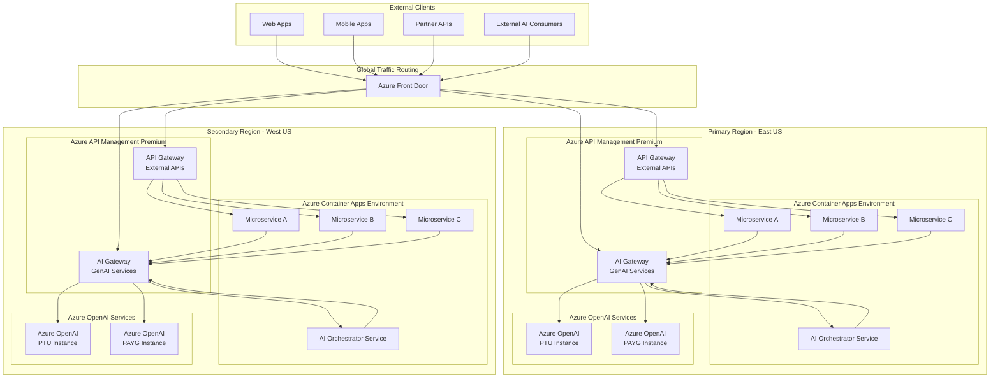

### Key Components

| Component | Purpose | Azure Service |
|-----------|---------|---------------|
| **Global Traffic Router** | Latency-based routing, failover, WAF | Azure Front Door |
| **API Gateway** | External/internal API management, routing, security | Azure API Management Premium |
| **AI Gateway** | GenAI request management, load balancing, token limits | Azure API Management Premium |
| **Microservices Platform** | Containerized workloads | Azure Container Apps |
| **AI Services** | LLM inference, embeddings | Azure OpenAI Service |

---

## Architecture Decision: Combined vs. Separate Gateways

### Option 1: Single Combined Gateway

A single APIM instance handles both traditional API traffic and AI/GenAI traffic.

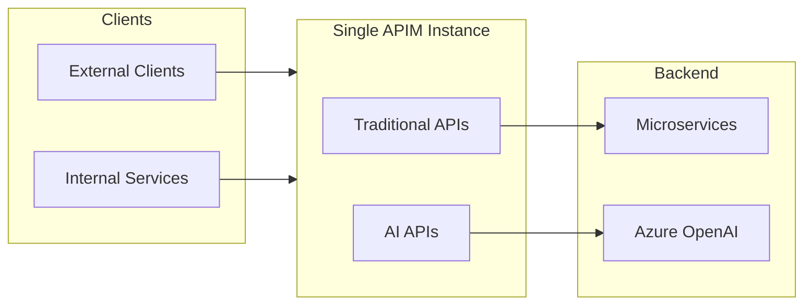

**Pros:**
- Simpler management with single control plane
- Lower operational overhead
- Unified monitoring and logging
- Cost-effective for smaller deployments

**Cons:**
- Risk of noisy neighbor issues between AI and regular API traffic
- AI workloads may consume disproportionate resources
- Difficult to apply different SLAs and rate limiting strategies
- Scaling constraints (AI traffic spikes affect all APIs)

---

### Option 2: Fully Separate Gateways

Two completely independent APIM instances - one for APIs, one for AI.

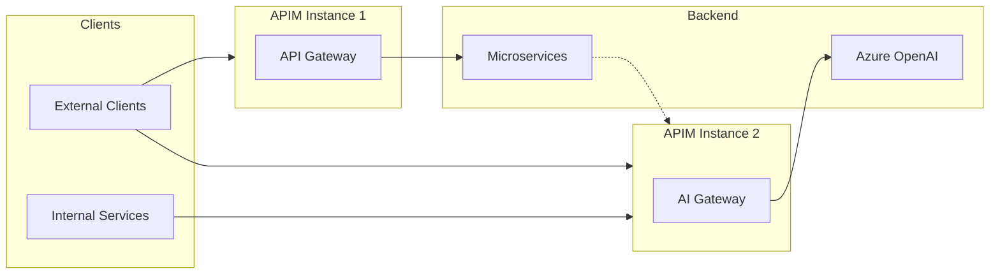

**Pros:**
- Complete isolation between workloads
- Independent scaling for AI-specific demands
- Separate rate limiting and quota management
- Different security policies per gateway
- Easier to implement AI-specific features

**Cons:**
- Higher cost (two Premium APIM instances per region)
- More complex management
- Duplicate configuration for common policies
- Multiple endpoints for clients to manage

---

### Option 3: Hybrid Approach (Recommended)

Single APIM instance with logical separation using **Products**, **Workspaces**, or **distinct API versioning**, combined with dedicated backend pools.

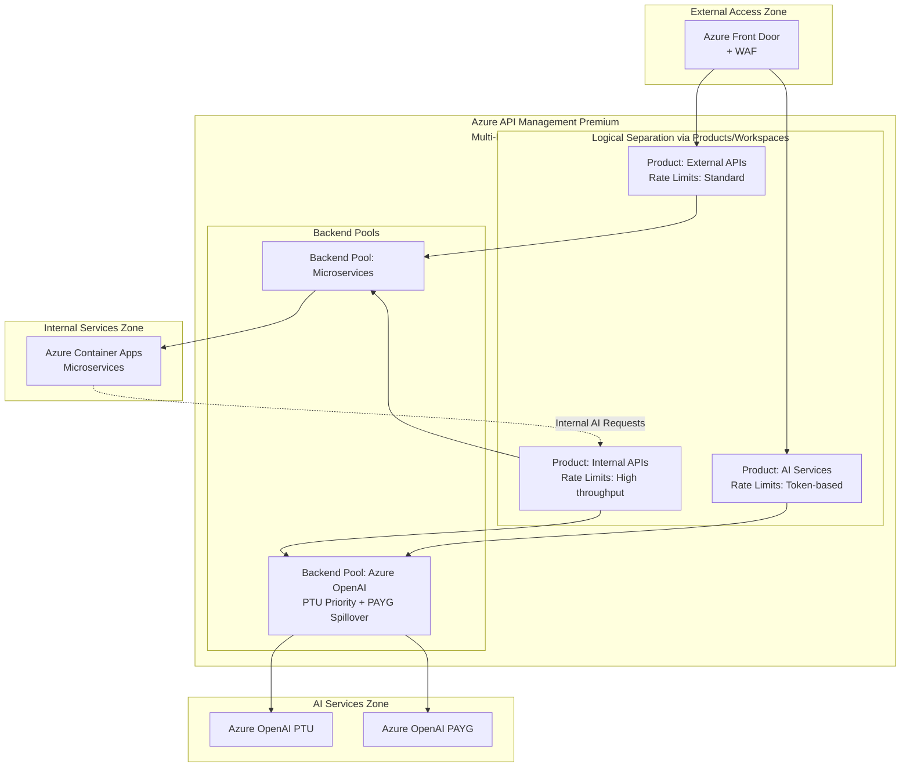

**Pros:**
- Single control plane with logical isolation
- Cost-effective (one Premium instance per region)
- Flexible product-based access control
- Centralized monitoring with workload segregation
- Ability to apply AI-specific policies per product

**Cons:**
- Requires careful capacity planning
- More complex policy configuration
- Shared infrastructure (though logically separated)

---

## Recommended Architecture: Hybrid Approach

For mission-critical SaaS applications, the **Hybrid Approach** provides the best balance of cost, manageability, and separation of concerns.

### Architecture Details

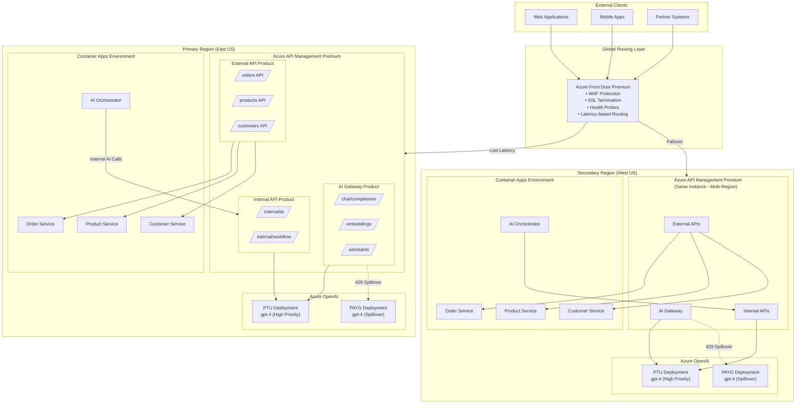

### Product Configuration Strategy

| Product | Target Consumers | Rate Limiting | Features |
|---------|------------------|---------------|----------|
| **External APIs** | External clients, partners | Requests/sec per subscription | OAuth 2.0, API keys, standard throttling |
| **AI Gateway (External)** | External AI consumers | Token-based (TPM) limits | Semantic caching, content safety, priority queuing |
| **Internal APIs** | Backend microservices | Higher limits, service identity | Managed identity auth, circuit breaker |

---

## Multi-Region Deployment Strategy

### Active-Active Multi-Region Configuration

For mission-critical workloads requiring 99.99%+ SLA, deploy APIM Premium with multi-region gateways.

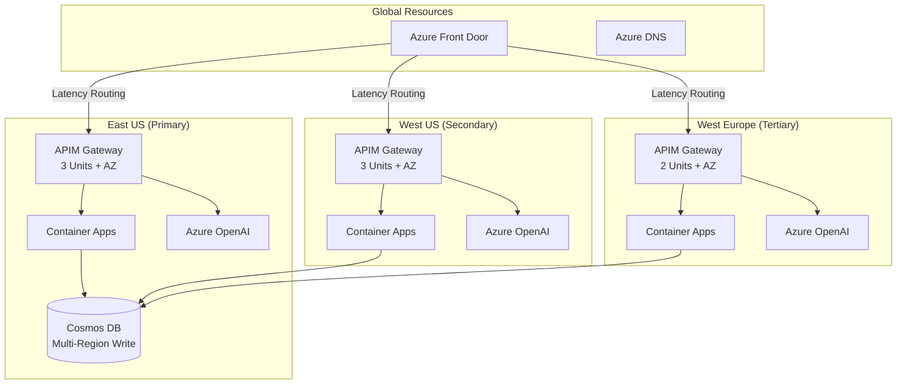

### Region-Aware Backend Routing

Use APIM policies to route requests to regional backend services:

```xml
<policies>
    <inbound>
        <base />
        <choose>
            <!-- Route to regional Azure OpenAI based on gateway region -->
            <when condition="@("East US".Equals(context.Deployment.Region, StringComparison.OrdinalIgnoreCase))">
                <set-backend-service base-url="https://aoai-eastus.openai.azure.com/" />
            </when>
            <when condition="@("West US".Equals(context.Deployment.Region, StringComparison.OrdinalIgnoreCase))">
                <set-backend-service base-url="https://aoai-westus.openai.azure.com/" />
            </when>
            <when condition="@("West Europe".Equals(context.Deployment.Region, StringComparison.OrdinalIgnoreCase))">
                <set-backend-service base-url="https://aoai-westeurope.openai.azure.com/" />
            </when>
            <otherwise>
                <set-backend-service base-url="https://aoai-eastus.openai.azure.com/" />
            </otherwise>
        </choose>
    </inbound>
</policies>
```

---

## AI Gateway Design Patterns

### 1. Load Balancing with Circuit Breaker

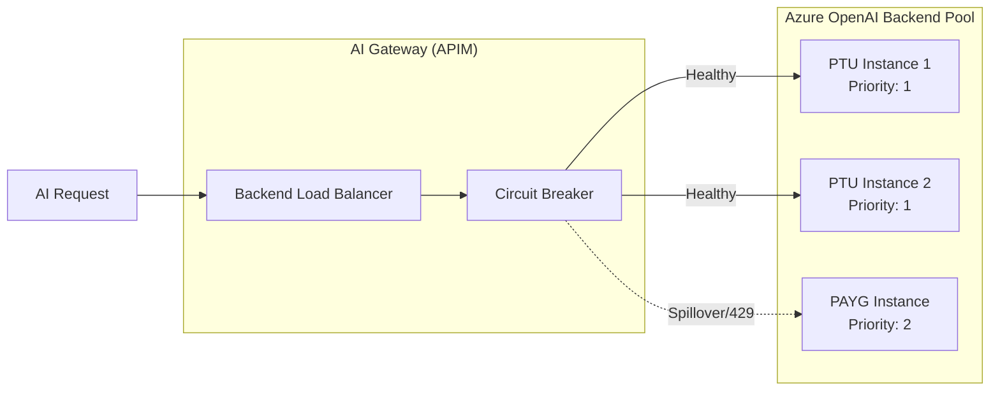

### Backend Pool Configuration

```json
{
  "backends": [
    {
      "url": "https://aoai-ptu-primary.openai.azure.com",
      "priority": 1,
      "weight": 50
    },
    {
      "url": "https://aoai-ptu-secondary.openai.azure.com",
      "priority": 1,
      "weight": 50
    },
    {
      "url": "https://aoai-payg-spillover.openai.azure.com",
      "priority": 2,
      "weight": 100
    }
  ],
  "circuitBreaker": {
    "rules": [
      {
        "failureCondition": {
          "count": 3,
          "interval": "PT10S",
          "statusCodeRanges": [
            { "min": 429, "max": 429 },
            { "min": 500, "max": 599 }
          ]
        },
        "tripDuration": "PT30S",
        "acceptRetryAfter": true
      }
    ]
  }
}
```

### 2. PTU to PAYG Spillover Strategy

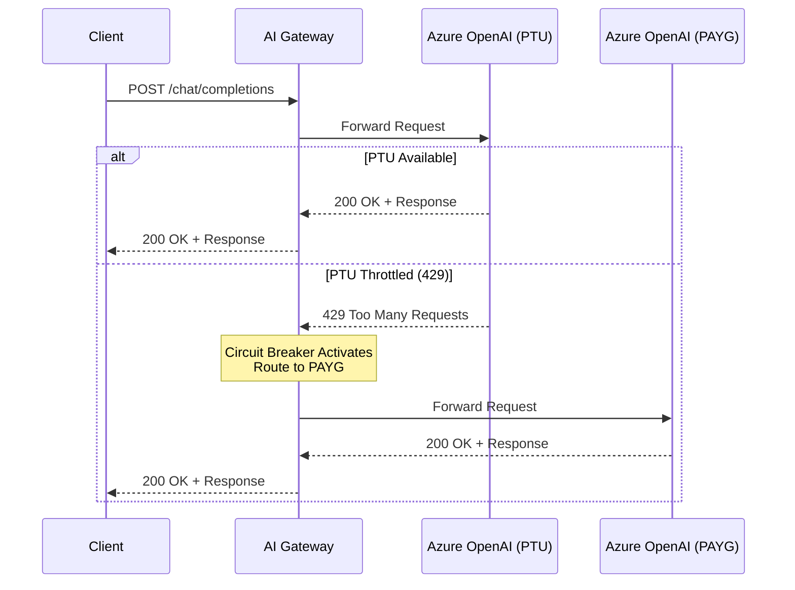

### 3. Token Rate Limiting

Apply token-based rate limiting per consumer:

```xml
<policies>
    <inbound>
        <base />
        <!-- Token limit policy for AI APIs -->
        <llm-token-limit 
            counter-key="@(context.Subscription.Id)" 
            tokens-per-minute="10000"
            estimate-prompt-tokens="true"
            remaining-tokens-variable-name="remainingTokens">
            <llm-token-limit-backend-id>aoai-backend</llm-token-limit-backend-id>
        </llm-token-limit>
    </inbound>
</policies>
```

---

## Priority and Request Handling for AI Services

### Priority Queue Architecture

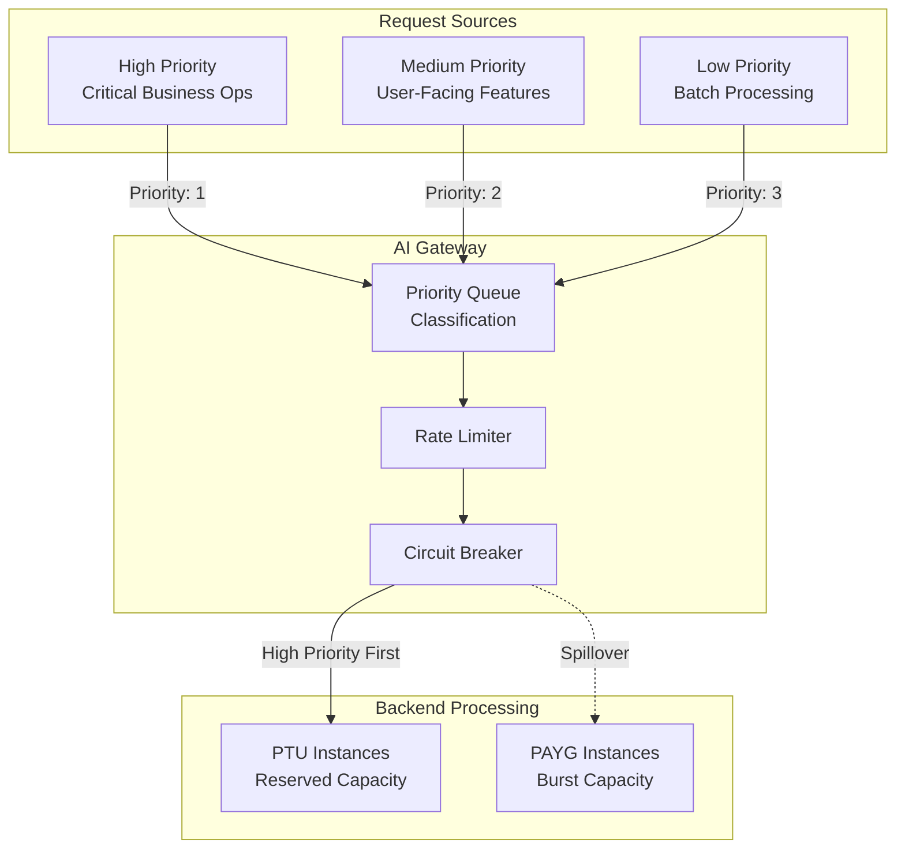

### Priority-Based Routing Policy

```xml
<policies>
    <inbound>
        <base />
        <!-- Extract priority from header or subscription -->
        <set-variable name="requestPriority" 
            value="@(context.Request.Headers.GetValueOrDefault("X-Priority", "medium"))" />
        
        <choose>
            <!-- High priority: Direct to PTU with no throttling -->
            <when condition="@(context.Variables.GetValueOrDefault<string>("requestPriority") == "high")">
                <set-backend-service backend-id="aoai-ptu-primary" />
                <set-header name="X-Route" exists-action="override">
                    <value>ptu-priority</value>
                </set-header>
            </when>
            
            <!-- Medium priority: PTU with spillover to PAYG -->
            <when condition="@(context.Variables.GetValueOrDefault<string>("requestPriority") == "medium")">
                <set-backend-service backend-id="aoai-backend-pool" />
            </when>
            
            <!-- Low priority: PAYG only, with aggressive rate limiting -->
            <otherwise>
                <rate-limit-by-key 
                    calls="10" 
                    renewal-period="60" 
                    counter-key="@(context.Subscription.Id)" />
                <set-backend-service backend-id="aoai-payg" />
            </otherwise>
        </choose>
    </inbound>
</policies>
```

### Consumer-Based Quota Allocation

| Consumer Type | TPM Quota | Priority | Backend Pool |
|---------------|-----------|----------|--------------|
| **Critical Operations** | 50,000 | High | PTU Only |
| **User-Facing Apps** | 20,000 | Medium | PTU + PAYG Spillover |
| **Batch Processing** | 5,000 | Low | PAYG Only |
| **Development/Test** | 1,000 | Low | PAYG (Shared) |

---

## Load Balancing and Resilience

### Multi-Backend Load Balancing

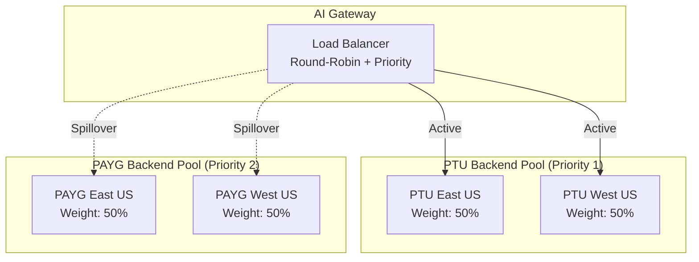

### Retry and Circuit Breaker Configuration

```xml
<policies>
    <backend>
        <retry condition="@(context.Response.StatusCode == 429 || context.Response.StatusCode >= 500)" 
               count="3" 
               interval="1" 
               delta="1" 
               max-interval="10" 
               first-fast-retry="true">
            <forward-request buffer-request-body="true" />
        </retry>
    </backend>
    
    <on-error>
        <base />
        <choose>
            <when condition="@(context.Response.StatusCode == 429)">
                <!-- Return Retry-After header to client -->
                <return-response>
                    <set-status code="429" reason="Too Many Requests" />
                    <set-header name="Retry-After" exists-action="override">
                        <value>@(context.Response.Headers.GetValueOrDefault("Retry-After", "30"))</value>
                    </set-header>
                </return-response>
            </when>
        </choose>
    </on-error>
</policies>
```

---

## Security Considerations

### Authentication Architecture

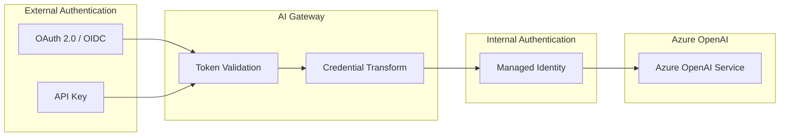

### Security Best Practices

1. **Terminate client credentials at the gateway** - Use managed identity for backend connections
2. **Apply Content Safety policies** - Integrate Azure AI Content Safety
3. **Implement PII detection** - Scan prompts before forwarding
4. **Network isolation** - Deploy APIM and backends in private virtual networks

### Content Safety Integration

```xml
<policies>
    <inbound>
        <base />
        <!-- Content Safety Check -->
        <llm-content-safety backend-id="content-safety-backend">
            <text-blocklist-ids>
                <id>custom-blocklist-1</id>
            </text-blocklist-ids>
            <categories>
                <category name="Hate" threshold="Medium" />
                <category name="Violence" threshold="Medium" />
                <category name="Sexual" threshold="Medium" />
                <category name="SelfHarm" threshold="Medium" />
            </categories>
        </llm-content-safety>
    </inbound>
</policies>
```

---

## Monitoring and Observability

### Observability Architecture

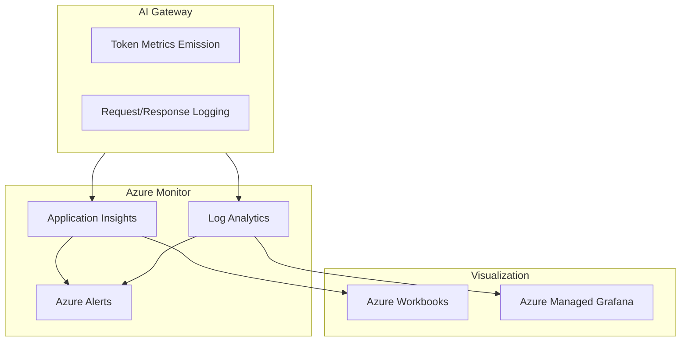

### Token Metrics Emission Policy

```xml
<policies>
    <outbound>
        <base />
        <!-- Emit token metrics for chargeback and monitoring -->
        <llm-emit-token-metric namespace="genai-metrics">
            <dimension name="Subscription" value="@(context.Subscription.Id)" />
            <dimension name="Product" value="@(context.Product.Name)" />
            <dimension name="API" value="@(context.Api.Name)" />
            <dimension name="Region" value="@(context.Deployment.Region)" />
            <dimension name="Model" value="@(context.Request.Headers.GetValueOrDefault("X-Model", "unknown"))" />
        </llm-emit-token-metric>
    </outbound>
</policies>
```

### Key Metrics to Monitor

| Metric | Description | Alert Threshold |
|--------|-------------|-----------------|
| **Total Tokens** | Total tokens consumed per subscription | 80% of quota |
| **Prompt Tokens** | Input tokens per request | Anomaly detection |
| **Completion Tokens** | Output tokens per request | Anomaly detection |
| **429 Rate** | Throttling frequency | > 5% of requests |
| **Latency P95** | 95th percentile response time | > 5 seconds |
| **Circuit Breaker Trips** | Backend failures | Any occurrence |

---

## Implementation Guidance

### Phase 1: Foundation (Weeks 1-2)

1. Deploy Azure API Management Premium in primary region
2. Configure availability zones (minimum 3 units)
3. Set up virtual network integration
4. Create Product structure (External APIs, AI Gateway, Internal APIs)

### Phase 2: AI Gateway Configuration (Weeks 3-4)

1. Import Azure OpenAI API definitions
2. Configure backend pools with PTU and PAYG instances
3. Implement load balancing policies
4. Set up circuit breaker rules

### Phase 3: Multi-Region Expansion (Weeks 5-6)

1. Add secondary region to APIM instance
2. Deploy regional Azure OpenAI instances
3. Configure region-aware routing policies
4. Set up Azure Front Door with health probes

### Phase 4: Security and Monitoring (Weeks 7-8)

1. Implement managed identity authentication
2. Configure content safety policies
3. Set up Application Insights integration
4. Create monitoring dashboards and alerts

### Deployment Checklist

- [ ] APIM Premium tier deployed with availability zones
- [ ] Multi-region gateways configured
- [ ] Backend pools defined for PTU/PAYG spillover
- [ ] Token rate limiting policies applied
- [ ] Circuit breaker configured
- [ ] Managed identity authentication enabled
- [ ] Content safety integration complete
- [ ] Monitoring and alerting configured
- [ ] Disaster recovery runbooks documented

---

## Summary

For your mission-critical SaaS application, the **Hybrid Approach** with a single APIM Premium instance provides:

| Requirement | Solution |
|-------------|----------|
| **High Availability** | Multi-region APIM deployment with active-active configuration |
| **Disaster Recovery** | Automatic failover via Azure Front Door |
| **AI Request Priority** | Product-based segregation with priority routing policies |
| **Cost Optimization** | PTU for predictable workloads, PAYG for spillover |
| **Security** | Managed identity, content safety, network isolation |
| **Observability** | Token metrics, request logging, alerting |

The architecture maintains logical separation between API Gateway and AI Gateway functionality while sharing infrastructure for cost efficiency and simplified management.

---

## References

1. [AI Gateway in Azure API Management](https://learn.microsoft.com/en-us/azure/api-management/genai-gateway-capabilities) - Microsoft Learn
2. [Use a Gateway in Front of Multiple Azure OpenAI Deployments](https://learn.microsoft.com/en-us/azure/architecture/ai-ml/guide/azure-openai-gateway-multi-backend) - Azure Architecture Center
3. [GenAI Gateway Reference Architecture using APIM](https://learn.microsoft.com/en-us/ai/playbook/solutions/generative-ai/genai-gateway/reference-architectures/apim-based) - AI Playbook
4. [Key Considerations for Designing a GenAI Gateway Solution](https://learn.microsoft.com/en-us/ai/playbook/solutions/generative-ai/genai-gateway/key-considerations) - AI Playbook
5. [Deploy Azure API Management to Multiple Regions](https://learn.microsoft.com/en-us/azure/api-management/api-management-howto-deploy-multi-region) - Microsoft Learn
6. [Reliability in Azure API Management](https://learn.microsoft.com/en-us/azure/reliability/reliability-api-management) - Microsoft Learn
7. [Azure API Management Landing Zone Architecture](https://learn.microsoft.com/en-us/azure/architecture/example-scenario/integration/app-gateway-internal-api-management-function) - Azure Architecture Center
8. [Mission-Critical Architecture Pattern](https://learn.microsoft.com/en-us/azure/well-architected/mission-critical/mission-critical-architecture-pattern) - Well-Architected Framework
9. [Microservices with Azure Container Apps](https://learn.microsoft.com/en-us/azure/container-apps/microservices) - Microsoft Learn
10. [API Gateway Pattern for Microservices](https://learn.microsoft.com/en-us/azure/architecture/microservices/design/gateway) - Azure Architecture Center

---

*Document Version: 1.0*  
*Last Updated: December 2024*  
*Author: Architecture Team*
