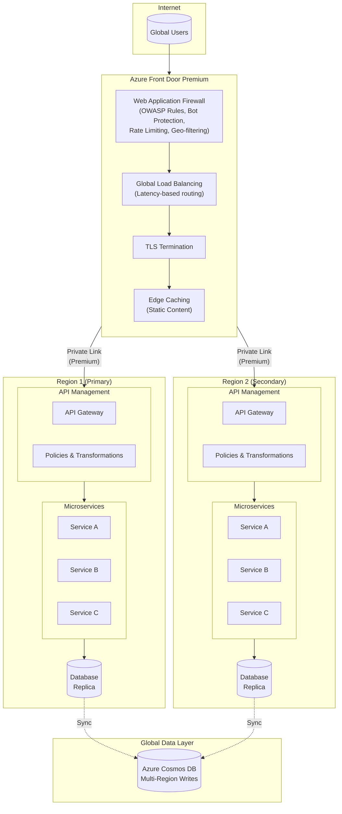
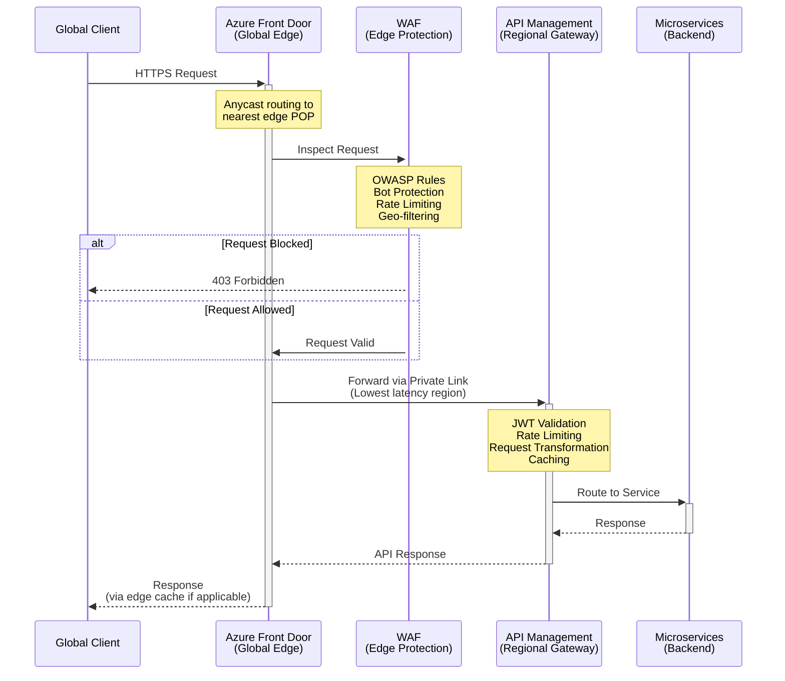
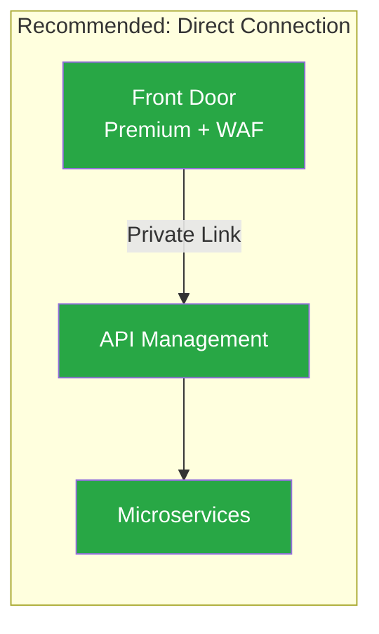
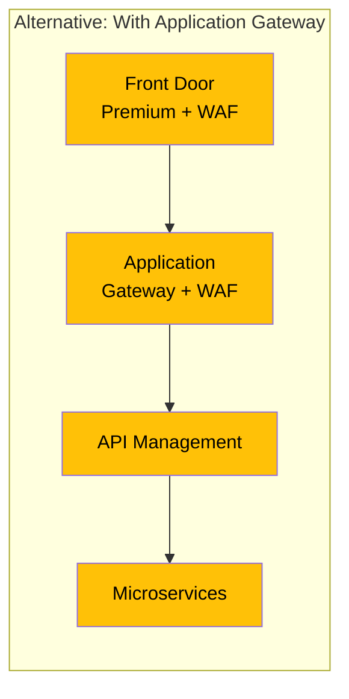
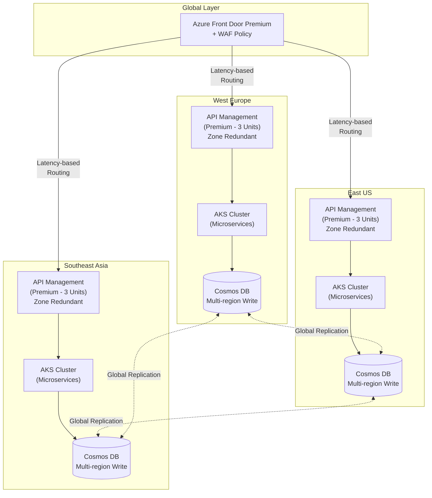
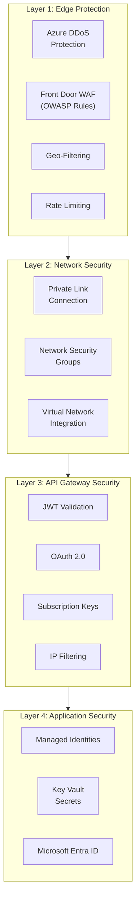
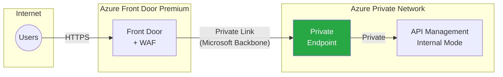
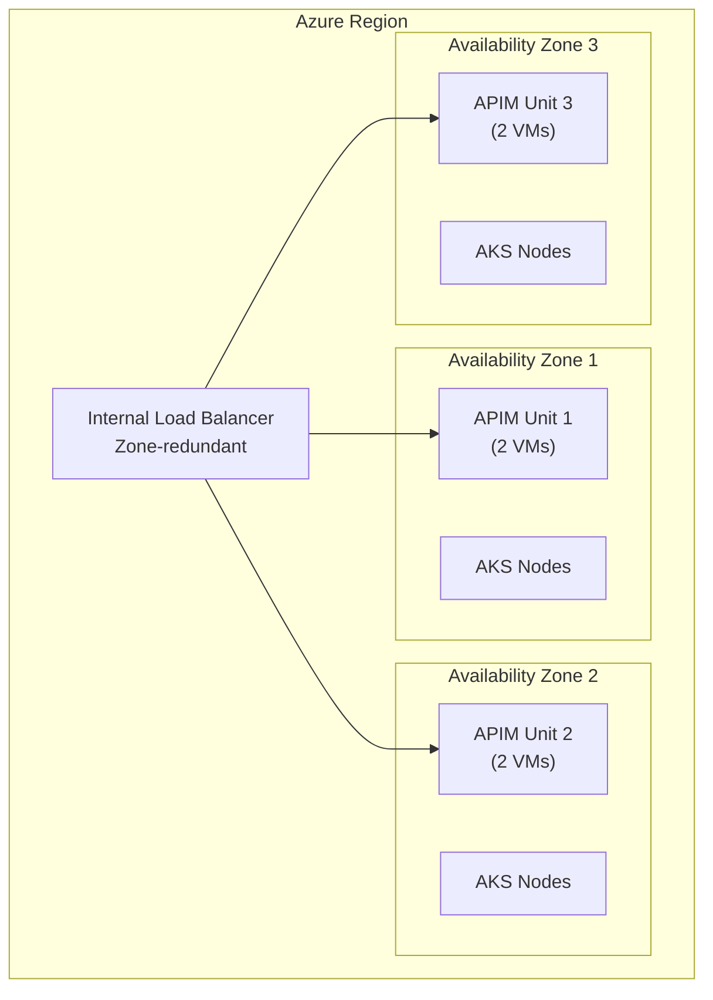
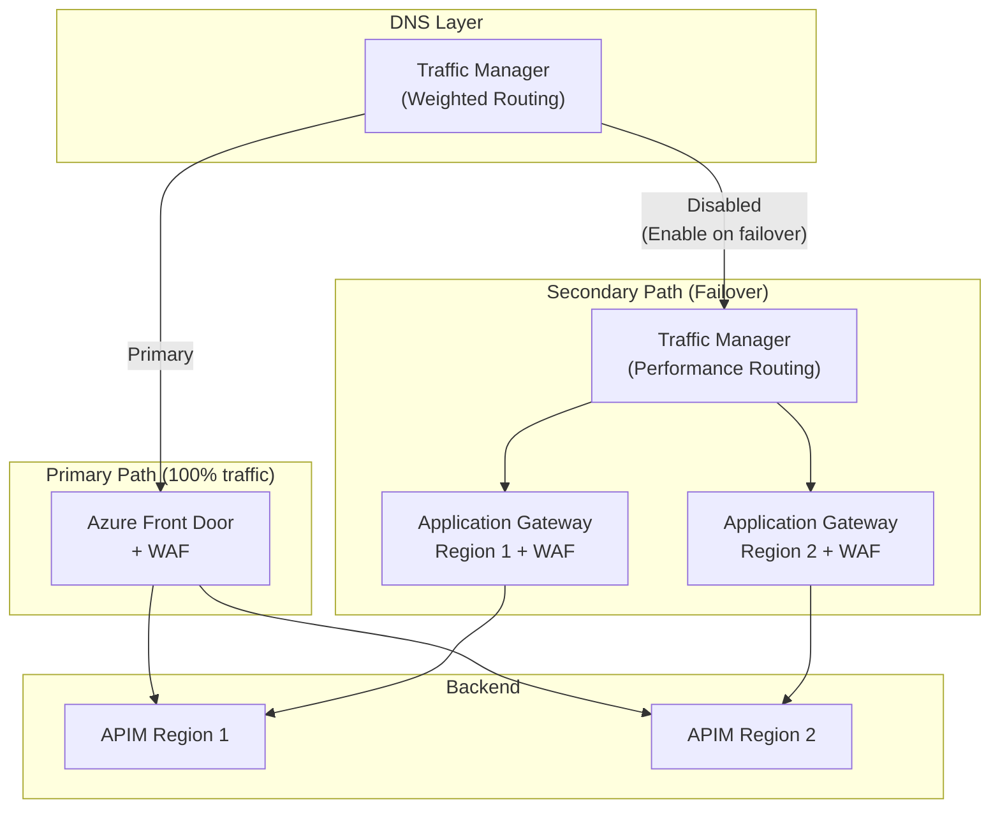

# Mission-Critical SaaS Architecture with Azure API Management and Global Load Balancing

## Executive Summary

This document provides architecture guidance for building a **mission-critical SaaS application** hosted on Azure with multi-regional deployment for high availability (HA) and disaster recovery (DR). The architecture leverages **Azure Front Door with WAF** for global load balancing and **Azure API Management (APIM)** as the API Gateway for microservices.

### Key Question Addressed

> **Do I need an Application Gateway with WAF before the APIM in this architecture?**

**Short Answer:** Generally **No** - when using Azure Front Door Premium with WAF for a mission-critical architecture, you typically **do not need** an additional Application Gateway with WAF in front of API Management. Azure Front Door provides comprehensive WAF capabilities at the global edge, and adding Application Gateway creates operational complexity without significant benefit.

However, there are specific scenarios where Application Gateway may be beneficial, which are detailed in this document.

---

## Architecture Overview

### Recommended Architecture Pattern



---

## Traffic Flow Analysis

### Request Flow Through the Architecture



---

## Why Application Gateway is NOT Required

### Azure Front Door WAF Capabilities

Azure Front Door Premium provides comprehensive WAF capabilities that eliminate the need for Application Gateway WAF in most scenarios:

| Capability | Front Door WAF | Application Gateway WAF |
|------------|----------------|-------------------------|
| **OWASP Core Rule Sets** | ✅ CRS 3.2+ | ✅ CRS 3.2+ |
| **DDoS Protection** | ✅ Built-in (Layer 7) | ❌ Requires separate DDoS |
| **Bot Protection** | ✅ Native | ❌ Limited |
| **Rate Limiting** | ✅ Native | ❌ Requires custom rules |
| **Geo-filtering** | ✅ Native | ❌ Limited |
| **Global Scale** | ✅ Edge locations worldwide | ❌ Regional only |
| **Managed Certificates** | ✅ Automatic renewal | ✅ Manual/Key Vault |

### Key Recommendations from Microsoft

> **"Enable WAF capabilities at a single service location, either globally with Azure Front Door or regionally with Azure Application Gateway, since this simplifies configuration fine tuning and optimizes performance and cost."**
> — [Mission-Critical Networking Connectivity](https://learn.microsoft.com/en-us/azure/well-architected/mission-critical/mission-critical-networking-connectivity)

> **"Prioritize the use of Azure Front Door WAF since it provides the richest Azure-native feature set and applies protections at the global edge, which simplifies the overall design and drives further efficiencies."**
> — [Mission-Critical Application Delivery](https://learn.microsoft.com/en-us/azure/well-architected/mission-critical/mission-critical-networking-connectivity#application-delivery-services)

---

## Architecture Decision: Front Door → APIM Direct Connection

### Benefits of Direct Connection (Recommended)



| Benefit | Description |
|---------|-------------|
| **Simplified Operations** | Single WAF configuration point to manage |
| **Reduced Latency** | Fewer network hops |
| **Cost Optimization** | No Application Gateway licensing costs |
| **Unified Security** | Consistent WAF rules across all traffic |
| **Private Connectivity** | Front Door Premium supports Private Link to APIM |

### When Application Gateway Might Be Needed



Consider Application Gateway only in these specific scenarios:

| Scenario | Reason |
|----------|--------|
| **Global Routing Redundancy** | Traffic Manager + Application Gateway as fallback when Front Door is unavailable |
| **Internal VNET Only Access** | APIM deployed in internal mode requiring regional WAF |
| **Strict Compliance Requirements** | Specific regulatory needs for dual-layer WAF inspection |
| **Legacy Integration** | Existing Application Gateway deployments that cannot be migrated |

---

## Multi-Region Deployment Pattern

### Active-Active Multi-Region Architecture



### API Management Multi-Region Configuration

For Premium tier APIM, you can deploy the gateway component to multiple regions:

| Configuration | Details |
|--------------|---------|
| **Tier Required** | Premium (Classic) |
| **Primary Region** | Management plane + Developer portal + Gateway |
| **Secondary Regions** | Gateway only (configuration synced within ~10 seconds) |
| **Availability Zones** | Enable across 3 zones per region |
| **Minimum Units** | 3 units per region for zone redundancy |

---

## Security Architecture

### Defense in Depth Model



### Security Best Practices

| Security Control | Implementation |
|-----------------|----------------|
| **TLS Configuration** | Minimum TLS 1.2, prefer TLS 1.3 |
| **Certificate Management** | Front Door Managed Certificates (auto-renewal) |
| **WAF Mode** | Prevention mode in production |
| **Origin Protection** | Validate `X-Azure-FDID` header + Private Link |
| **API Authentication** | OAuth 2.0 with Microsoft Entra ID |
| **Secret Management** | Azure Key Vault with Managed Identities |

---

## Locking Down APIM to Accept Only Front Door Traffic

### Header-Based Validation (Required)

Configure APIM policies to validate that requests originate from your specific Front Door instance:

```xml
<inbound>
    <base />
    <!-- Validate the X-Azure-FDID header -->
    <check-header name="X-Azure-FDID" 
                  failed-check-httpcode="403" 
                  failed-check-error-message="Not authorized" 
                  ignore-case="true">
        <value>YOUR-FRONT-DOOR-ID</value>
    </check-header>
</inbound>
```

### Private Link Connection (Recommended for Premium)



---

## High Availability Configuration

### Availability Zone Distribution



### SLA Composition

| Component | Individual SLA | Notes |
|-----------|---------------|-------|
| Azure Front Door | 99.99% | Global service with built-in redundancy |
| API Management (Premium, Zone Redundant) | 99.99% | With 3+ zones enabled |
| Azure Cosmos DB (Multi-region) | 99.999% | Multi-region writes |
| **Composite SLA** | ~99.97%+ | Based on architecture design |

---

## Cost Considerations

### Component Costs (Approximate)

| Component | Configuration | Monthly Estimate |
|-----------|--------------|------------------|
| **Front Door Premium** | 1 profile + WAF | ~$350/month base |
| **APIM Premium** | 3 units × 3 regions | ~$8,400/month |
| **Application Gateway** (if added) | 3 instances × 3 regions | ~$1,800/month additional |

### Cost Optimization Recommendations

1. **Avoid Redundant WAF**: Using Front Door WAF eliminates need for Application Gateway WAF
2. **Right-size APIM Units**: Use capacity metrics to determine optimal unit count
3. **Leverage Front Door Caching**: Reduces load on APIM and backend services
4. **Use Reserved Capacity**: Consider reserved pricing for predictable workloads

---

## Alternative Architecture: Redundant Ingress Path

For extreme reliability requirements where you need redundancy against Azure Front Door unavailability:



> **Warning**: This redundant architecture significantly increases operational complexity. Both WAF configurations must be kept in sync, and testing becomes more complex. Only implement if your SLA requirements demand it.

---

## Recommendations Summary

### ✅ DO

- Use **Azure Front Door Premium** with WAF for global load balancing
- Enable **Private Link** between Front Door and APIM
- Deploy APIM in **Premium tier** with **multi-region** configuration
- Enable **Availability Zones** across at least 3 zones
- Configure **WAF in Prevention mode** with CRS 3.2+
- Implement **header validation** to ensure traffic originates from Front Door
- Use **managed certificates** for TLS

### ❌ DON'T

- Add Application Gateway WAF when Front Door WAF is sufficient
- Enable WAF at multiple layers without clear justification
- Use single-region deployment for mission-critical workloads
- Expose APIM directly to the internet without origin protection
- Skip health probes configuration on Front Door

---

## Implementation Checklist

- [ ] Deploy Azure Front Door Premium profile
- [ ] Configure WAF policy with OWASP CRS 3.2+ rules
- [ ] Enable bot protection and rate limiting
- [ ] Deploy APIM Premium tier in primary region
- [ ] Enable availability zone redundancy (3 zones minimum)
- [ ] Add secondary regions to APIM
- [ ] Configure Private Link from Front Door to APIM
- [ ] Implement X-Azure-FDID header validation in APIM policies
- [ ] Configure health probes on Front Door
- [ ] Set up Azure Monitor alerts for both services
- [ ] Test failover scenarios between regions
- [ ] Document runbooks for incident response

---

## References

1. [Networking and connectivity for mission-critical workloads on Azure](https://learn.microsoft.com/en-us/azure/well-architected/mission-critical/mission-critical-networking-connectivity)
2. [Architecture best practices for Azure API Management](https://learn.microsoft.com/en-us/azure/well-architected/service-guides/azure-api-management)
3. [Reliability in Azure API Management](https://learn.microsoft.com/en-us/azure/reliability/reliability-api-management)
4. [Connect Azure Front Door Premium to API Management with Private Link](https://learn.microsoft.com/en-us/azure/frontdoor/standard-premium/how-to-enable-private-link-apim)
5. [Mission-critical global HTTP ingress](https://learn.microsoft.com/en-us/azure/architecture/guide/networking/global-web-applications/mission-critical-global-http-ingress)
6. [Protect APIs using Application Gateway and API Management](https://learn.microsoft.com/en-us/azure/architecture/web-apps/api-management/architectures/protect-apis)
7. [Architecture best practices for Azure Front Door](https://learn.microsoft.com/en-us/azure/well-architected/service-guides/azure-front-door)
8. [Plan for application delivery - Cloud Adoption Framework](https://learn.microsoft.com/en-us/azure/cloud-adoption-framework/ready/azure-best-practices/plan-for-app-delivery)
9. [Load balancing options - Azure Architecture Center](https://learn.microsoft.com/en-us/azure/architecture/guide/technology-choices/load-balancing-overview)

---

*Document Version: 1.0*  
*Last Updated: December 18, 2025*  
*Author: Generated with Azure Architecture Guidance*
