# Azure Container Apps (ACA) - Comprehensive Architecture Guide

## Table of Contents
- [Overview](#overview)
- [Key Concepts](#key-concepts)
- [Environment Architecture](#environment-architecture)
- [Single vs Multiple Environments Decision Guide](#single-vs-multiple-environments-decision-guide)
- [Workload Profiles and Plans](#workload-profiles-and-plans)
- [Microservices Architecture Patterns](#microservices-architecture-patterns)
- [Networking and Security](#networking-and-security)
- [Scaling and Performance](#scaling-and-performance)
- [Reliability and High Availability](#reliability-and-high-availability)
- [Cost Optimization](#cost-optimization)
- [Operational Excellence](#operational-excellence)
- [Deployment Strategies](#deployment-strategies)
- [References](#references)

---

## Overview

Azure Container Apps is a fully managed serverless container service designed for running microservices and containerized applications at scale. It provides built-in autoscaling (including scale-to-zero), supports multiple programming languages and frameworks, and eliminates the need to manage underlying infrastructure like Kubernetes clusters.

### When to Use Azure Container Apps

| Use Case | Suitability |
|----------|-------------|
| Microservices architectures | ✅ Excellent |
| Event-driven applications | ✅ Excellent |
| HTTP APIs and web apps | ✅ Excellent |
| Background processing jobs | ✅ Excellent |
| Teams without Kubernetes expertise | ✅ Excellent |
| Direct Kubernetes API access needed | ❌ Use AKS instead |
| Complex custom networking requirements | ⚠️ Consider AKS |

---

## Key Concepts

### Architecture Hierarchy

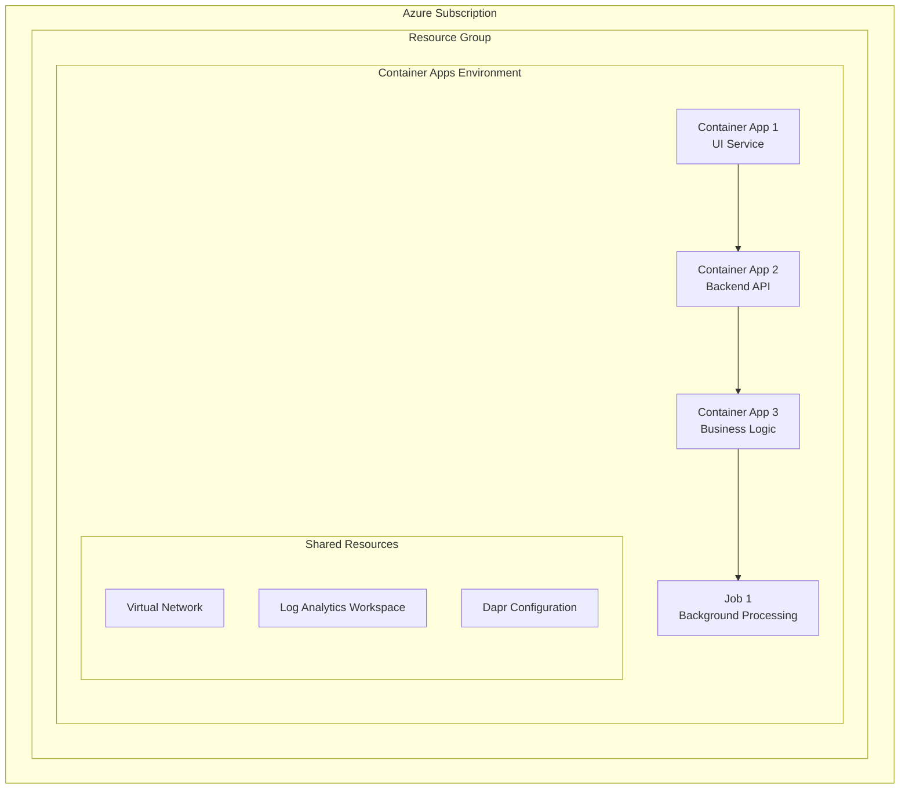
```mermaid
graph TB
    subgraph "Azure Subscription"
        subgraph "Resource Group"
            subgraph "Container Apps Environment"
                CA1[Container App 1<br/>UI Service]
                CA2[Container App 2<br/>Backend API]
                CA3[Container App 3<br/>Business Logic]
                JOB1[Job 1<br/>Background Processing]
                
                subgraph "Shared Resources"
                    VNET[Virtual Network]
                    LOG[Log Analytics Workspace]
                    DAPR[Dapr Configuration]
                end
            end
        end
    end
    
    CA1 --> CA2
    CA2 --> CA3
    CA3 --> JOB1
```

### Core Components

| Component | Description |
|-----------|-------------|
| **Environment** | Secure boundary around container apps; manages networking, logging, and Dapr configuration |
| **Container App** | An application running one or more containers with HTTP ingress, scaling, and lifecycle management |
| **Job** | Containerized task that runs for a finite duration and exits (manual, scheduled, or event-driven) |
| **Revision** | Immutable snapshot of a container app version used for deployments and traffic splitting |
| **Replica** | Running instance of a container app or job |

---

## Environment Architecture

A **Container Apps Environment** is the foundational deployment unit that establishes a secure boundary around your container apps and jobs.

### Environment Features

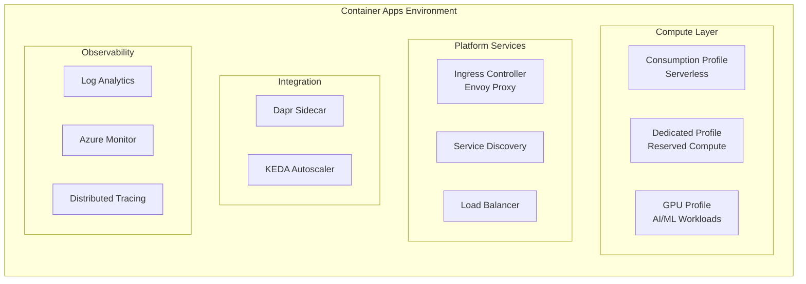
```mermaid
graph LR
    subgraph "Container Apps Environment"
        direction TB
        
        subgraph "Compute Layer"
            WP1[Consumption Profile<br/>Serverless]
            WP2[Dedicated Profile<br/>Reserved Compute]
            WP3[GPU Profile<br/>AI/ML Workloads]
        end
        
        subgraph "Platform Services"
            ING[Ingress Controller<br/>Envoy Proxy]
            SD[Service Discovery]
            LB[Load Balancer]
        end
        
        subgraph "Integration"
            DAPR[Dapr Sidecar]
            KEDA[KEDA Autoscaler]
        end
        
        subgraph "Observability"
            LOGS[Log Analytics]
            METRICS[Azure Monitor]
            TRACES[Distributed Tracing]
        end
    end
```

### Environment Types

| Environment Type | Identifier | Description |
|-----------------|------------|-------------|
| **Workload Profiles (v2)** | Default | Supports both Consumption and Dedicated plans; maximum flexibility |
| **Consumption-only (v1)** | Legacy | Only supports Consumption plan |

> **Recommendation**: Always create **Workload Profiles (v2)** environments for new deployments. They provide all consumption functionality plus access to dedicated compute and robust networking features.

---

## Single vs Multiple Environments Decision Guide

This is a critical architectural decision for microservices deployments. Here's a comprehensive decision framework:

### Use a Single Environment When:

✅ **Managing related services** that form a cohesive workload  
✅ **Services need to communicate** via Dapr service invocation  
✅ **Deploying to the same virtual network**  
✅ **Sharing the same Dapr configuration**  
✅ **Centralizing logs** to a single destination  
✅ **Services share the same security boundary**  

### Use Multiple Environments When:

✅ **Services must never share compute resources** (performance isolation)  
✅ **Team or environment separation** (dev, staging, production)  
✅ **Different security boundaries** are required  
✅ **Avoiding noisy neighbor problems** for critical workloads  
✅ **Services don't need to communicate** via Dapr service invocation  
✅ **Multi-tenant isolation** per customer  

### Environment Strategy Decision Tree

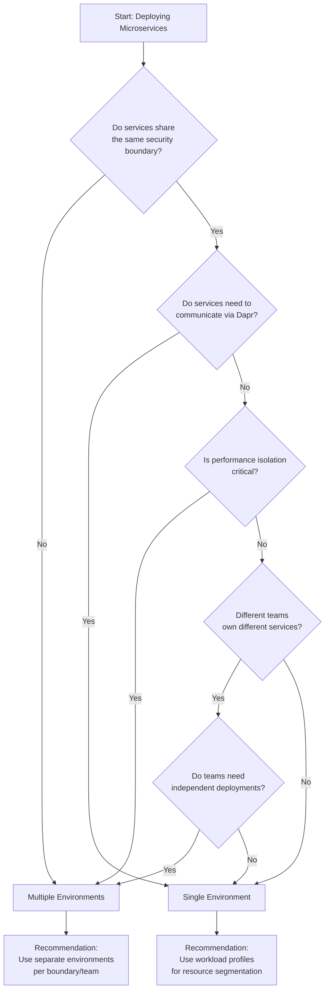
```mermaid
flowchart TD
    START[Start: Deploying Microservices] --> Q1{Do services share<br/>the same security boundary?}
    
    Q1 -->|No| MULTI[Multiple Environments]
    Q1 -->|Yes| Q2{Do services need to<br/>communicate via Dapr?}
    
    Q2 -->|Yes| SINGLE[Single Environment]
    Q2 -->|No| Q3{Is performance isolation<br/>critical?}
    
    Q3 -->|Yes| MULTI
    Q3 -->|No| Q4{Different teams<br/>own different services?}
    
    Q4 -->|Yes| Q5{Do teams need<br/>independent deployments?}
    Q4 -->|No| SINGLE
    
    Q5 -->|Yes| MULTI
    Q5 -->|No| SINGLE
    
    SINGLE --> REC1[Recommendation:<br/>Use workload profiles<br/>for resource segmentation]
    MULTI --> REC2[Recommendation:<br/>Use separate environments<br/>per boundary/team]
```

### Recommended Environment Patterns for Microservices

#### Pattern 1: Environment Per Lifecycle Stage (Recommended for Most Teams)

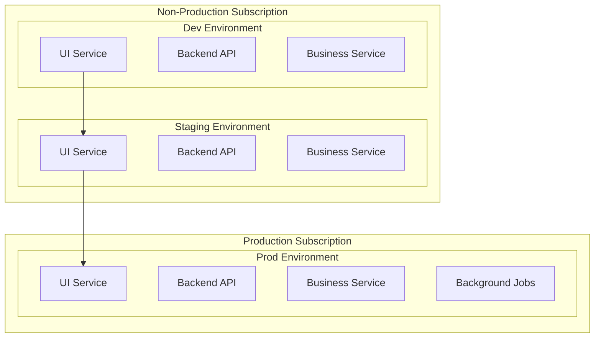
```mermaid
graph TB
    subgraph "Production Subscription"
        subgraph "Prod Environment"
            PROD_UI[UI Service]
            PROD_API[Backend API]
            PROD_BIZ[Business Service]
            PROD_JOB[Background Jobs]
        end
    end
    
    subgraph "Non-Production Subscription"
        subgraph "Staging Environment"
            STAGE_UI[UI Service]
            STAGE_API[Backend API]
            STAGE_BIZ[Business Service]
        end
        
        subgraph "Dev Environment"
            DEV_UI[UI Service]
            DEV_API[Backend API]
            DEV_BIZ[Business Service]
        end
    end
    
    DEV_UI --> STAGE_UI
    STAGE_UI --> PROD_UI
```

#### Pattern 2: Workload Separation Within Single Environment

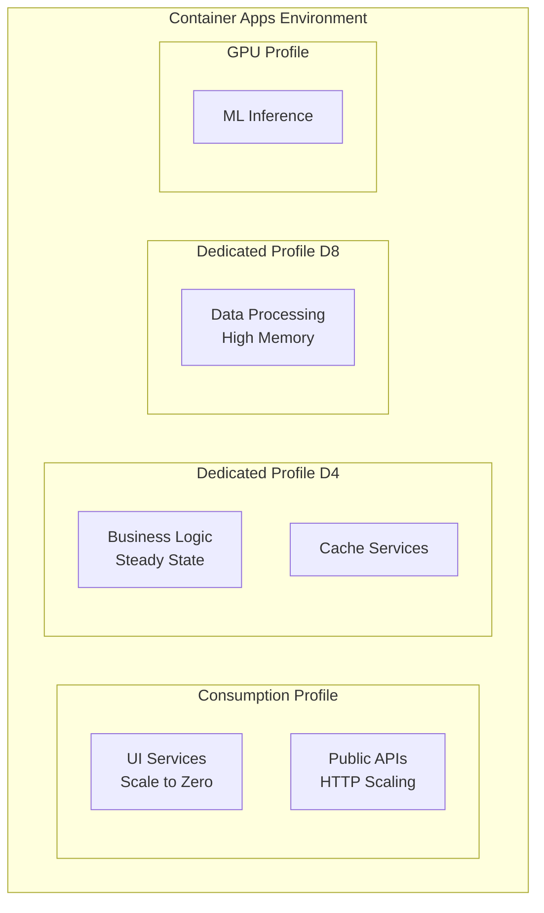
```mermaid
graph TB
    subgraph "Container Apps Environment"
        subgraph "Consumption Profile"
            UI[UI Services<br/>Scale to Zero]
            API[Public APIs<br/>HTTP Scaling]
        end
        
        subgraph "Dedicated Profile D4"
            BIZ[Business Logic<br/>Steady State]
            CACHE[Cache Services]
        end
        
        subgraph "Dedicated Profile D8"
            DATA[Data Processing<br/>High Memory]
        end
        
        subgraph "GPU Profile"
            ML[ML Inference]
        end
    end
```

#### Pattern 3: Multi-tenant Isolation

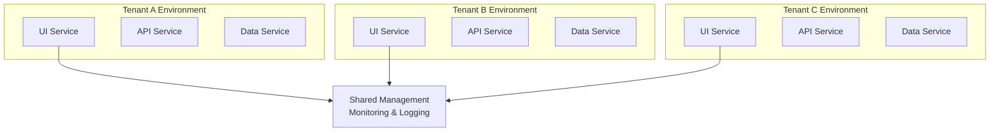
```mermaid
graph TB
    subgraph "Tenant A Environment"
        A_UI[UI Service]
        A_API[API Service]
        A_DATA[Data Service]
    end
    
    subgraph "Tenant B Environment"
        B_UI[UI Service]
        B_API[API Service]
        B_DATA[Data Service]
    end
    
    subgraph "Tenant C Environment"
        C_UI[UI Service]
        C_API[API Service]
        C_DATA[Data Service]
    end
    
    SHARED[Shared Management<br/>Monitoring & Logging]
    
    A_UI --> SHARED
    B_UI --> SHARED
    C_UI --> SHARED
```

### Environment Limits to Consider

| Limit | Value | Notes |
|-------|-------|-------|
| Environments per subscription per region | Limited | Can be increased via support ticket |
| Container apps per environment | 100 (default) | Soft limit, can be increased |
| Replicas per app | 1,000 max | Configure based on workload |
| Cores per environment | Varies by profile | Check quota |

---

## Workload Profiles and Plans

### Profile Types Overview

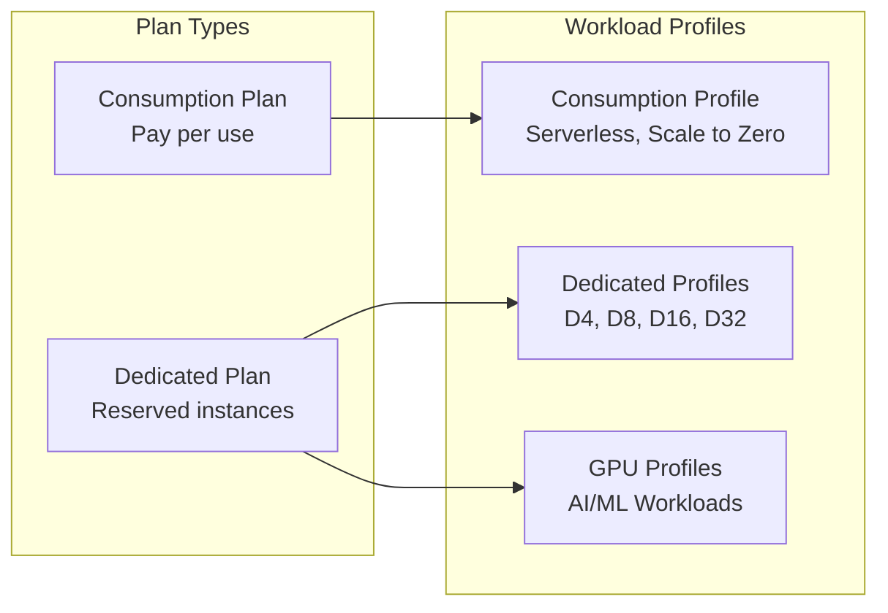
```mermaid
graph LR
    subgraph "Plan Types"
        CONS[Consumption Plan<br/>Pay per use]
        DED[Dedicated Plan<br/>Reserved instances]
    end
    
    subgraph "Workload Profiles"
        CP[Consumption Profile<br/>Serverless, Scale to Zero]
        DP[Dedicated Profiles<br/>D4, D8, D16, D32]
        GP[GPU Profiles<br/>AI/ML Workloads]
    end
    
    CONS --> CP
    DED --> DP
    DED --> GP
```

### Profile Selection Guide

| Profile | Best For | Billing | Scale to Zero |
|---------|----------|---------|---------------|
| **Consumption** | Variable/unpredictable workloads, dev/test | Per-second usage | ✅ Yes |
| **Dedicated (General)** | Steady-state production workloads | Per-instance hour | ❌ No |
| **Dedicated (Memory)** | Data-intensive applications | Per-instance hour | ❌ No |
| **GPU** | AI/ML inference, compute-heavy | Per-instance hour | ❌ No |

### Service Type Recommendations

| Service Type | Recommended Profile | Scaling Strategy |
|--------------|-------------------|------------------|
| **UI/Frontend** | Consumption | HTTP-based, scale to zero |
| **Public API** | Consumption or Dedicated | HTTP-based scaling |
| **Backend Services** | Dedicated | Custom metrics, steady state |
| **Business Logic** | Dedicated | Event-driven or steady |
| **Background Jobs** | Consumption | Event-driven, scale to zero |
| **ML Inference** | GPU | Custom metrics |
| **Data Processing** | Memory-optimized Dedicated | Event-driven |

---

## Microservices Architecture Patterns

### Reference Architecture: Microservices with Container Apps

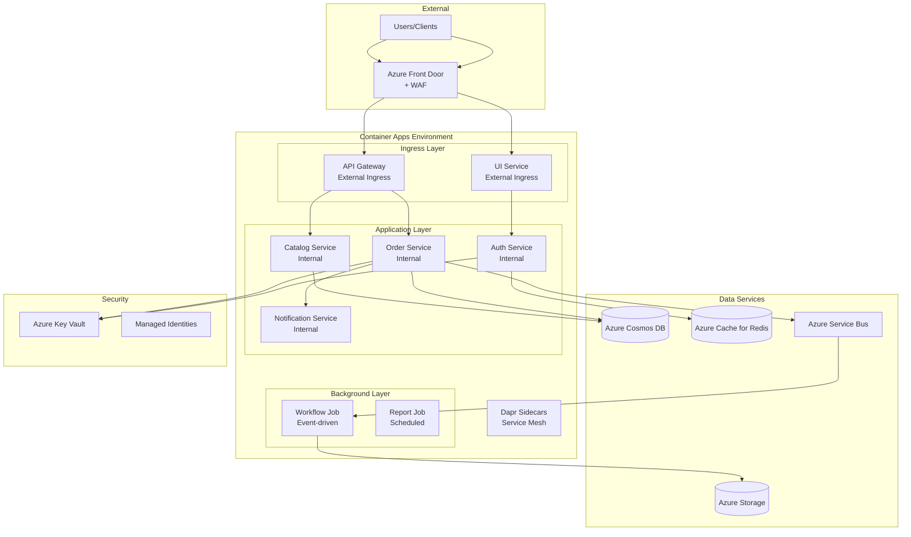
```mermaid
graph TB
    subgraph "External"
        USERS[Users/Clients]
        AFD[Azure Front Door<br/>+ WAF]
    end
    
    subgraph "Container Apps Environment"
        subgraph "Ingress Layer"
            UI[UI Service<br/>External Ingress]
            APIGW[API Gateway<br/>External Ingress]
        end
        
        subgraph "Application Layer"
            AUTH[Auth Service<br/>Internal]
            ORDER[Order Service<br/>Internal]
            CATALOG[Catalog Service<br/>Internal]
            NOTIFY[Notification Service<br/>Internal]
        end
        
        subgraph "Background Layer"
            WORKFLOW[Workflow Job<br/>Event-driven]
            REPORT[Report Job<br/>Scheduled]
        end
        
        DAPR[Dapr Sidecars<br/>Service Mesh]
    end
    
    subgraph "Data Services"
        COSMOS[(Azure Cosmos DB)]
        REDIS[(Azure Cache for Redis)]
        SB[Azure Service Bus]
        STORAGE[(Azure Storage)]
    end
    
    subgraph "Security"
        KV[Azure Key Vault]
        MI[Managed Identities]
    end
    
    USERS --> AFD --> UI
    USERS --> AFD --> APIGW
    
    UI --> AUTH
    APIGW --> ORDER
    APIGW --> CATALOG
    ORDER --> NOTIFY
    ORDER --> SB
    SB --> WORKFLOW
    
    ORDER --> COSMOS
    CATALOG --> COSMOS
    AUTH --> REDIS
    WORKFLOW --> STORAGE
    
    AUTH --> KV
    ORDER --> KV
```

### Service Communication Patterns

#### Internal Service Discovery

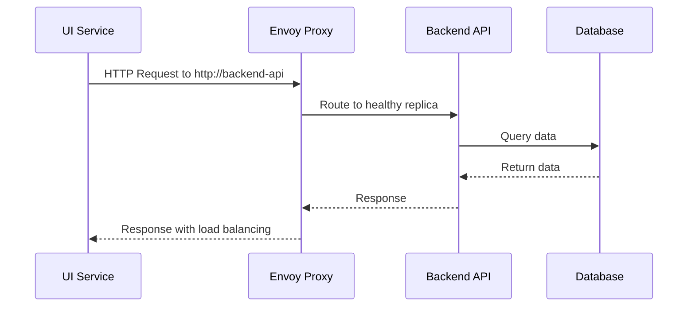
```mermaid
sequenceDiagram
    participant Client as UI Service
    participant Envoy as Envoy Proxy
    participant API as Backend API
    participant DB as Database
    
    Client->>Envoy: HTTP Request to http://backend-api
    Envoy->>API: Route to healthy replica
    API->>DB: Query data
    DB-->>API: Return data
    API-->>Envoy: Response
    Envoy-->>Client: Response with load balancing
```

#### Dapr Service Invocation (Recommended for Microservices)

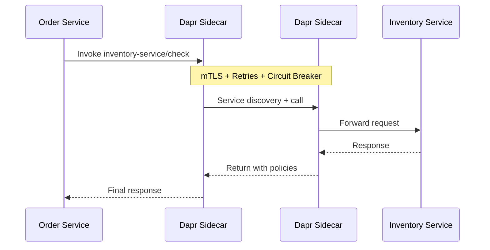
```mermaid
sequenceDiagram
    participant App1 as Order Service
    participant Dapr1 as Dapr Sidecar
    participant Dapr2 as Dapr Sidecar
    participant App2 as Inventory Service
    
    App1->>Dapr1: Invoke inventory-service/check
    Note over Dapr1,Dapr2: mTLS + Retries + Circuit Breaker
    Dapr1->>Dapr2: Service discovery + call
    Dapr2->>App2: Forward request
    App2-->>Dapr2: Response
    Dapr2-->>Dapr1: Return with policies
    Dapr1-->>App1: Final response
```

### Apps vs Jobs: When to Use Each

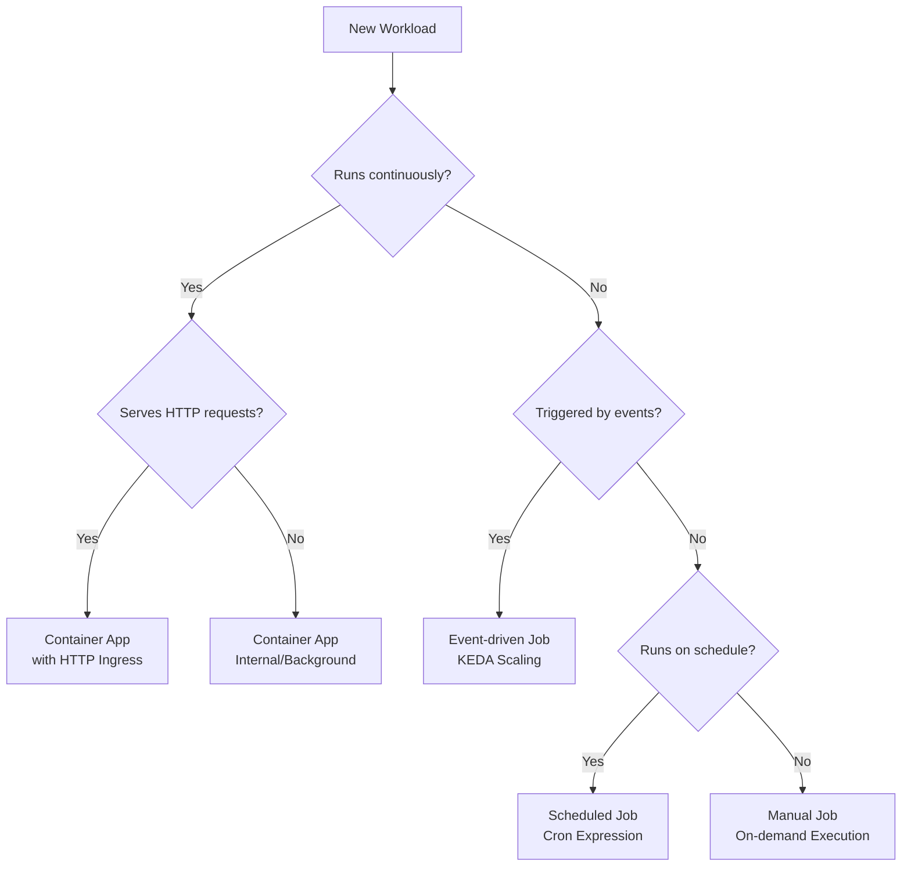
```mermaid
flowchart TD
    START[New Workload] --> Q1{Runs continuously?}
    
    Q1 -->|Yes| Q2{Serves HTTP requests?}
    Q1 -->|No| Q3{Triggered by events?}
    
    Q2 -->|Yes| APP1[Container App<br/>with HTTP Ingress]
    Q2 -->|No| APP2[Container App<br/>Internal/Background]
    
    Q3 -->|Yes| JOB1[Event-driven Job<br/>KEDA Scaling]
    Q3 -->|No| Q4{Runs on schedule?}
    
    Q4 -->|Yes| JOB2[Scheduled Job<br/>Cron Expression]
    Q4 -->|No| JOB3[Manual Job<br/>On-demand Execution]
```

---

## Networking and Security

### Network Architecture

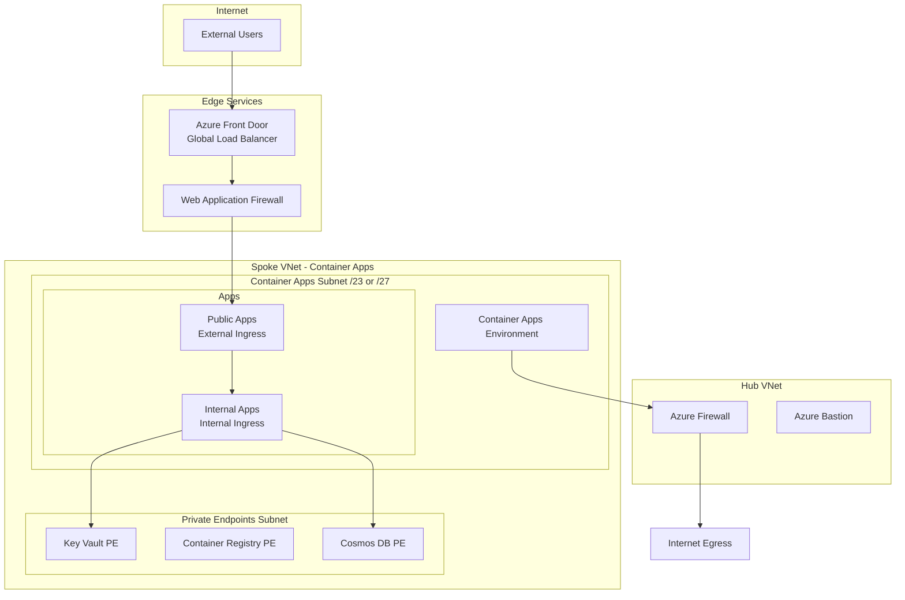
```mermaid
graph TB
    subgraph "Internet"
        USERS[External Users]
    end
    
    subgraph "Edge Services"
        AFD[Azure Front Door<br/>Global Load Balancer]
        WAF[Web Application Firewall]
    end
    
    subgraph "Hub VNet"
        FW[Azure Firewall]
        BASTION[Azure Bastion]
    end
    
    subgraph "Spoke VNet - Container Apps"
        subgraph "Container Apps Subnet /23 or /27"
            ENV[Container Apps Environment]
            subgraph "Apps"
                PUB[Public Apps<br/>External Ingress]
                INT[Internal Apps<br/>Internal Ingress]
            end
        end
        
        subgraph "Private Endpoints Subnet"
            PE_KV[Key Vault PE]
            PE_ACR[Container Registry PE]
            PE_COSMOS[Cosmos DB PE]
        end
    end
    
    USERS --> AFD --> WAF
    WAF --> PUB
    PUB --> INT
    INT --> PE_COSMOS
    INT --> PE_KV
    
    ENV --> FW
    FW --> Internet2[Internet Egress]
```

### Security Best Practices

| Area | Recommendation |
|------|----------------|
| **Identity** | Use managed identities; avoid storing credentials |
| **Network** | Deploy in custom VNet; use internal ingress for backend services |
| **Ingress** | Enable WAF via Application Gateway or Front Door |
| **Egress** | Route through Azure Firewall with UDR |
| **Secrets** | Store in Azure Key Vault; reference via managed identity |
| **Images** | Scan in ACR with Microsoft Defender; use minimal base images |
| **mTLS** | Enable for Dapr service-to-service communication |
| **HTTPS** | Enforce HTTPS-only; configure via Envoy proxy |

### Network Security Checklist

- [ ] Deploy environment into custom virtual network
- [ ] Configure Network Security Groups (NSGs) on subnets
- [ ] Use internal ingress for non-public services
- [ ] Route egress through Azure Firewall or NAT Gateway
- [ ] Enable private endpoints for Azure services (Cosmos DB, Key Vault, ACR)
- [ ] Configure Web Application Firewall for external ingress
- [ ] Enable mTLS for service-to-service communication
- [ ] Disable public network access where not needed

---

## Scaling and Performance

### Autoscaling with KEDA

Azure Container Apps uses KEDA (Kubernetes Event-driven Autoscaling) for powerful autoscaling capabilities.

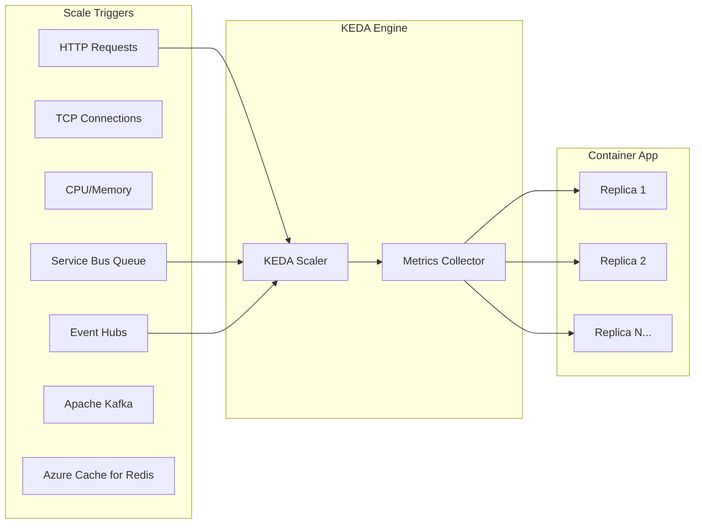
```mermaid
graph LR
    subgraph "Scale Triggers"
        HTTP[HTTP Requests]
        TCP[TCP Connections]
        CPU[CPU/Memory]
        SB[Service Bus Queue]
        EH[Event Hubs]
        KAFKA[Apache Kafka]
        REDIS[Azure Cache for Redis]
    end
    
    subgraph "KEDA Engine"
        SCALER[KEDA Scaler]
        METRICS[Metrics Collector]
    end
    
    subgraph "Container App"
        R1[Replica 1]
        R2[Replica 2]
        R3[Replica N...]
    end
    
    HTTP --> SCALER
    SB --> SCALER
    EH --> SCALER
    
    SCALER --> METRICS
    METRICS --> R1
    METRICS --> R2
    METRICS --> R3
```

### Scaling Configuration

| Parameter | Default | Min | Max | Description |
|-----------|---------|-----|-----|-------------|
| Min replicas | 0 | 0 | 1,000 | Minimum running instances |
| Max replicas | 10 | 1 | 1,000 | Maximum scale-out limit |
| Polling interval | 30s | - | - | How often KEDA checks triggers |
| Cool down period | 300s | - | - | Delay before scaling to zero |

### Scaling Rules by Service Type

| Service Type | Scale Rule | Configuration Example |
|--------------|------------|----------------------|
| **Web API** | HTTP | `concurrentRequests: 100` |
| **Queue Processor** | Azure Service Bus | `queueName: orders, messageCount: 5` |
| **Event Processor** | Event Hubs | `consumerGroup: $Default, threshold: 64` |
| **Real-time Service** | TCP | `concurrentConnections: 100` |
| **Custom Metrics** | Prometheus/Custom | Based on application metrics |

### Performance Recommendations

1. **Configure appropriate min replicas** for critical services (at least 1 to avoid cold starts)
2. **Use availability zones** for production workloads across 3 replicas minimum
3. **Implement health probes** (startup, liveness, readiness) for proper traffic management
4. **Separate workloads** by profile to avoid noisy neighbor issues
5. **Load test** to validate scaling rules before production

---

## Reliability and High Availability

### Availability Zone Architecture

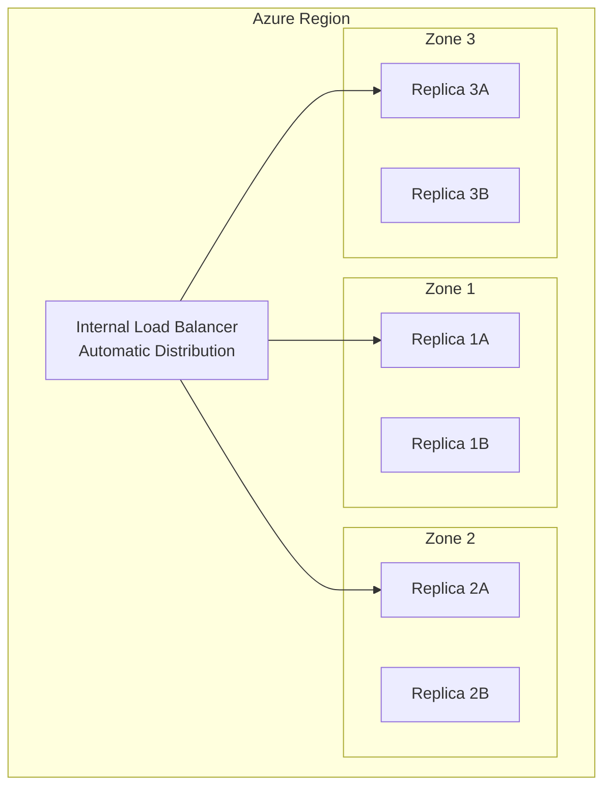
```mermaid
graph TB
    subgraph "Azure Region"
        subgraph "Zone 1"
            R1A[Replica 1A]
            R1B[Replica 1B]
        end
        
        subgraph "Zone 2"
            R2A[Replica 2A]
            R2B[Replica 2B]
        end
        
        subgraph "Zone 3"
            R3A[Replica 3A]
            R3B[Replica 3B]
        end
        
        LB[Internal Load Balancer<br/>Automatic Distribution]
    end
    
    LB --> R1A
    LB --> R2A
    LB --> R3A
```

### Multi-Region Deployment

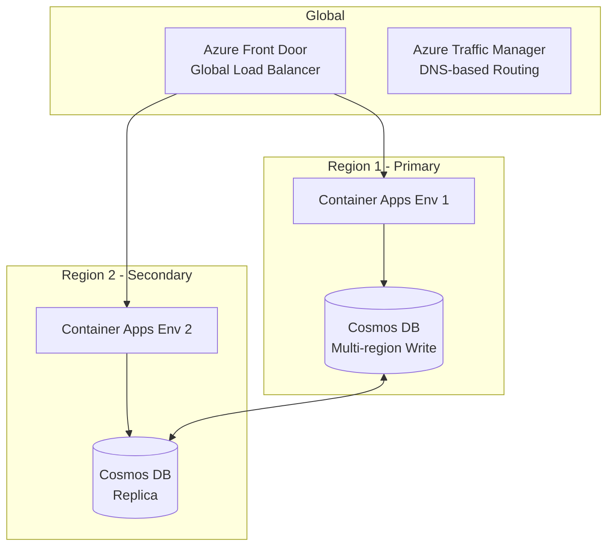
```mermaid
graph TB
    subgraph "Global"
        AFD[Azure Front Door<br/>Global Load Balancer]
        TM[Azure Traffic Manager<br/>DNS-based Routing]
    end
    
    subgraph "Region 1 - Primary"
        ENV1[Container Apps Env 1]
        COSMOS1[(Cosmos DB<br/>Multi-region Write)]
    end
    
    subgraph "Region 2 - Secondary"
        ENV2[Container Apps Env 2]
        COSMOS2[(Cosmos DB<br/>Replica)]
    end
    
    AFD --> ENV1
    AFD --> ENV2
    
    ENV1 --> COSMOS1
    ENV2 --> COSMOS2
    COSMOS1 <--> COSMOS2
```

### Health Probe Configuration

| Probe Type | Purpose | Recommended Settings |
|------------|---------|---------------------|
| **Startup** | Prevents premature restarts for slow-starting apps | `failureThreshold: 60, periodSeconds: 1, initialDelaySeconds: 0` |
| **Readiness** | Ensures only healthy containers receive traffic | `failureThreshold: 60, periodSeconds: 1, initialDelaySeconds: 5` |
| **Liveness** | Detects and restarts failed containers | `failureThreshold: 3, periodSeconds: 10, initialDelaySeconds: 10` |

### Reliability Checklist

- [ ] Enable availability zone support in environment
- [ ] Configure minimum 3 replicas for production services
- [ ] Implement all three health probe types
- [ ] Configure resiliency policies (retries, timeouts, circuit breakers)
- [ ] Use zone-redundant storage (ZRS) for stateful data
- [ ] Deploy IaC templates for disaster recovery
- [ ] Set up monitoring alerts for availability metrics
- [ ] Test failover scenarios regularly

---

## Cost Optimization

### Billing Model

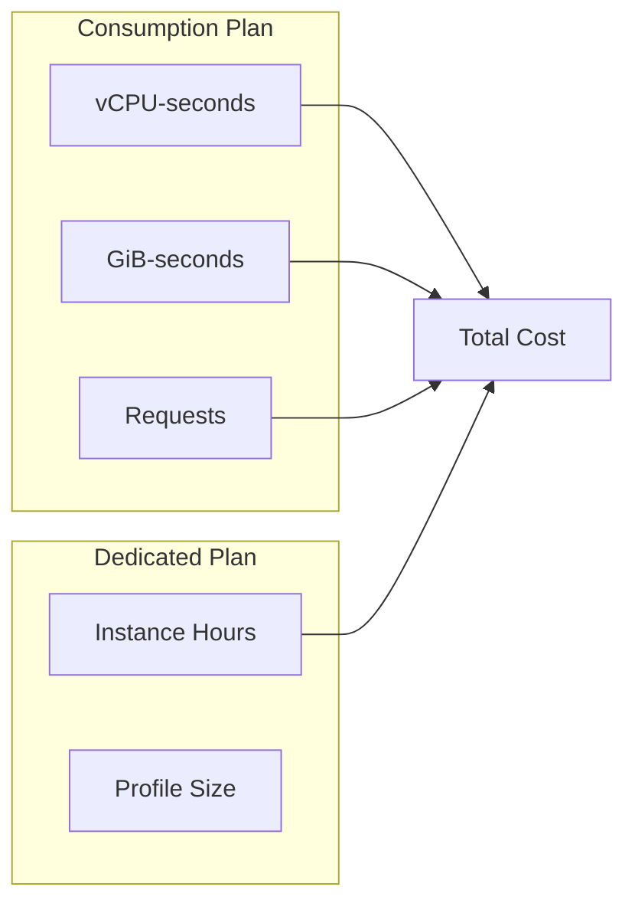
```mermaid
graph LR
    subgraph "Consumption Plan"
        CPU_SEC[vCPU-seconds]
        MEM_SEC[GiB-seconds]
        REQ[Requests]
    end
    
    subgraph "Dedicated Plan"
        INSTANCE[Instance Hours]
        PROFILE[Profile Size]
    end
    
    TOTAL[Total Cost]
    
    CPU_SEC --> TOTAL
    MEM_SEC --> TOTAL
    REQ --> TOTAL
    INSTANCE --> TOTAL
```

### Cost Optimization Strategies

| Strategy | Implementation | Savings Potential |
|----------|---------------|-------------------|
| **Scale to zero** | Set min replicas to 0 for non-critical services | High |
| **Right-size profiles** | Monitor and adjust CPU/memory allocations | Medium |
| **Azure Savings Plan** | Commit to 1 or 3 year plans | Up to 17% |
| **Use Consumption plan** | For variable/unpredictable workloads | Variable |
| **Consolidate environments** | Reduce environment count where possible | Medium |
| **Optimize container images** | Use minimal base images | Low |

### Cost Monitoring

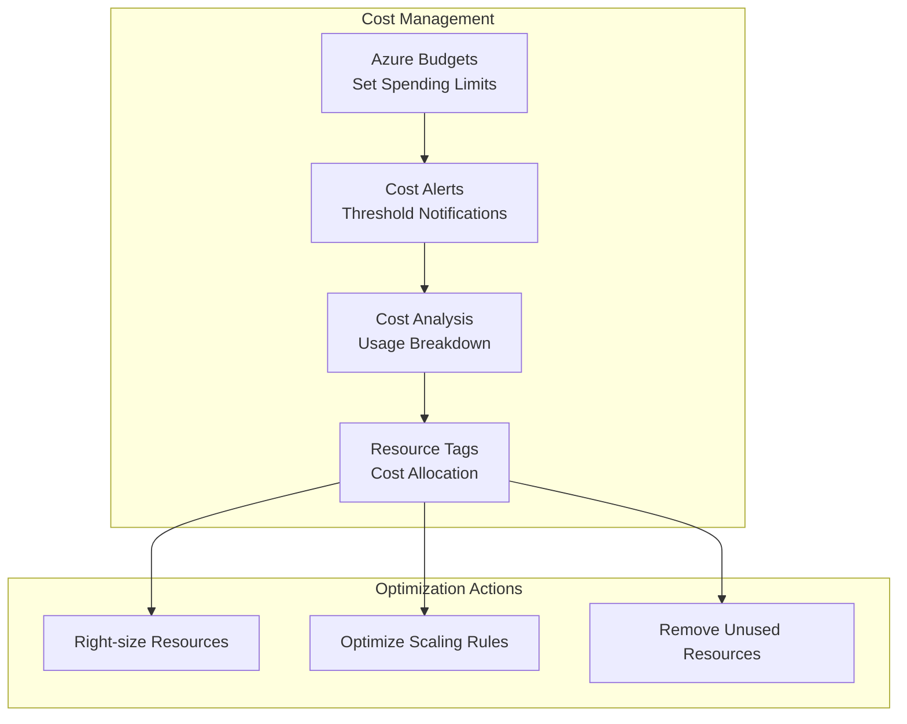
```mermaid
graph TB
    subgraph "Cost Management"
        BUDGET[Azure Budgets<br/>Set Spending Limits]
        ALERTS[Cost Alerts<br/>Threshold Notifications]
        ANALYSIS[Cost Analysis<br/>Usage Breakdown]
        TAGS[Resource Tags<br/>Cost Allocation]
    end
    
    subgraph "Optimization Actions"
        RIGHTSIZE[Right-size Resources]
        SCALE[Optimize Scaling Rules]
        CLEAN[Remove Unused Resources]
    end
    
    BUDGET --> ALERTS
    ALERTS --> ANALYSIS
    ANALYSIS --> TAGS
    TAGS --> RIGHTSIZE
    TAGS --> SCALE
    TAGS --> CLEAN
```

---

## Operational Excellence

### Infrastructure as Code

Deploy Container Apps using Bicep or Terraform for repeatable, traceable deployments.

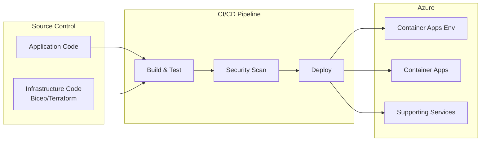
```mermaid
graph LR
    subgraph "Source Control"
        CODE[Application Code]
        IAC[Infrastructure Code<br/>Bicep/Terraform]
    end
    
    subgraph "CI/CD Pipeline"
        BUILD[Build & Test]
        SCAN[Security Scan]
        DEPLOY[Deploy]
    end
    
    subgraph "Azure"
        ENV[Container Apps Env]
        APPS[Container Apps]
        SUPPORT[Supporting Services]
    end
    
    CODE --> BUILD
    IAC --> BUILD
    BUILD --> SCAN
    SCAN --> DEPLOY
    DEPLOY --> ENV
    DEPLOY --> APPS
    DEPLOY --> SUPPORT
```

### Monitoring and Observability

| Tool | Purpose | Integration |
|------|---------|-------------|
| **Azure Monitor** | Metrics, logs, alerts | Built-in |
| **Log Analytics** | Centralized logging | Default destination |
| **Application Insights** | APM, distributed tracing | SDK integration |
| **OpenTelemetry** | Vendor-neutral observability | Collector support |
| **Dapr Dashboard** | Dapr component monitoring | .NET Aspire integration |

### Operational Checklist

- [ ] Implement IaC for all deployments (Bicep/Terraform)
- [ ] Configure CI/CD pipelines with automated testing
- [ ] Set up centralized logging in Log Analytics
- [ ] Enable Application Insights for all services
- [ ] Configure alerting for key metrics
- [ ] Implement consistent resource tagging
- [ ] Document runbooks for common operations
- [ ] Use Azure Policy for governance

---

## Deployment Strategies

### Blue-Green Deployment

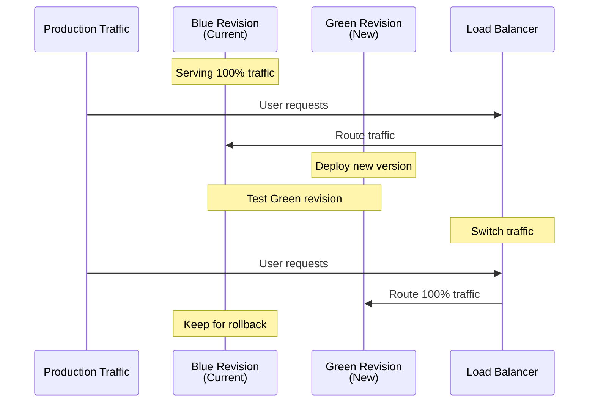
```mermaid
sequenceDiagram
    participant Prod as Production Traffic
    participant Blue as Blue Revision<br/>(Current)
    participant Green as Green Revision<br/>(New)
    participant LB as Load Balancer
    
    Note over Blue: Serving 100% traffic
    Prod->>LB: User requests
    LB->>Blue: Route traffic
    
    Note over Green: Deploy new version
    
    Note over Blue,Green: Test Green revision
    
    Note over LB: Switch traffic
    Prod->>LB: User requests
    LB->>Green: Route 100% traffic
    
    Note over Blue: Keep for rollback
```

### Traffic Splitting for Canary Deployments

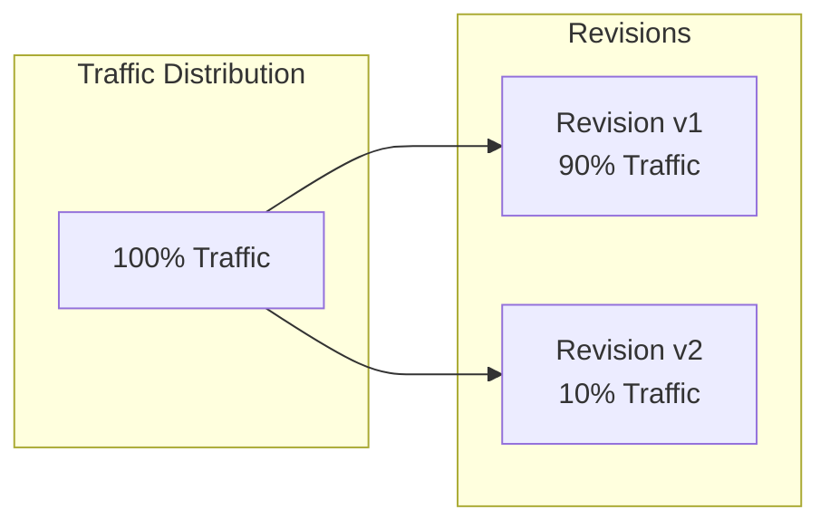
```mermaid
graph LR
    subgraph "Traffic Distribution"
        USERS[100% Traffic]
    end
    
    subgraph "Revisions"
        V1[Revision v1<br/>90% Traffic]
        V2[Revision v2<br/>10% Traffic]
    end
    
    USERS --> V1
    USERS --> V2
```

### Deployment Labels

Use deployment labels for sophisticated deployment strategies:

| Label | Purpose | Use Case |
|-------|---------|----------|
| `production` | Current stable version | Always receives majority traffic |
| `staging` | Pre-release testing | Internal testing, smoke tests |
| `canary` | Early adopter testing | Small % of production traffic |

---

## Summary: Your Microservices Deployment Strategy

Based on your scenario with multiple microservices (UI, backend, business services), here's the recommended approach:

### Recommended Architecture

```mermaid
graph TB
    subgraph "Production"
        subgraph "Prod Environment"
            direction TB
            subgraph "Consumption Profile"
                PROD_UI[UI Services]
                PROD_JOB[Background Jobs]
            end
            subgraph "Dedicated Profile"
                PROD_API[API Gateway]
                PROD_BIZ[Business Services]
                PROD_BACK[Backend Services]
            end
        end
    end
    
    subgraph "Non-Production"
        subgraph "Staging Environment"
            STAGE[All Services<br/>Consumption Profile]
        end
        subgraph "Dev Environment"
            DEV[All Services<br/>Consumption Profile]
        end
    end
```

### Key Recommendations

1. **Environment Strategy**: Use separate environments for dev, staging, and production. Within production, use a single environment with workload profiles for resource segmentation.

2. **Workload Profiles**: 
   - Use **Consumption** for UI services, background jobs, and variable workloads
   - Use **Dedicated** for critical business services and APIs with steady traffic

3. **Communication**: Enable **Dapr** for service-to-service communication to get built-in retries, circuit breakers, and mTLS.

4. **Security**: 
   - Deploy in custom VNet
   - Use internal ingress for all non-public services
   - Front external services with Azure Front Door + WAF

5. **Scaling**: Configure appropriate scaling rules per service type (HTTP, event-driven, or custom metrics).

6. **Reliability**: Enable availability zones with minimum 3 replicas for production services.

---

## References

### Official Microsoft Documentation
1. [Azure Container Apps Documentation](https://learn.microsoft.com/en-us/azure/container-apps/)
2. [Well-Architected Framework - Azure Container Apps](https://learn.microsoft.com/en-us/azure/well-architected/service-guides/azure-container-apps)
3. [Container Apps Environments](https://learn.microsoft.com/en-us/azure/container-apps/environment)
4. [Networking in Azure Container Apps](https://learn.microsoft.com/en-us/azure/container-apps/networking)
5. [Set Scaling Rules in Container Apps](https://learn.microsoft.com/en-us/azure/container-apps/scale-app)
6. [Workload Profiles Overview](https://learn.microsoft.com/en-us/azure/container-apps/workload-profiles-overview)
7. [Microservices with Container Apps](https://learn.microsoft.com/en-us/azure/container-apps/microservices)
8. [Dapr Integration](https://learn.microsoft.com/en-us/azure/container-apps/dapr-overview)
9. [Jobs in Container Apps](https://learn.microsoft.com/en-us/azure/container-apps/jobs)
10. [Blue-Green Deployment](https://learn.microsoft.com/en-us/azure/container-apps/blue-green-deployment)

### Architecture Guides
11. [Microservices with Azure Container Apps - Reference Architecture](https://learn.microsoft.com/en-us/azure/architecture/example-scenario/serverless/microservices-with-container-apps)
12. [Microservices with Container Apps and Dapr](https://learn.microsoft.com/en-us/azure/architecture/example-scenario/serverless/microservices-with-container-apps-dapr)
13. [Container Apps Landing Zone Accelerator](https://learn.microsoft.com/en-us/azure/cloud-adoption-framework/scenarios/app-platform/container-apps/landing-zone-accelerator)
14. [Multitenant Solutions with Container Apps](https://learn.microsoft.com/en-us/azure/architecture/guide/multitenant/service/container-apps)
15. [Choose an Azure Container Service](https://learn.microsoft.com/en-us/azure/architecture/guide/choose-azure-container-service)

### Security and Reliability
16. [Security Baseline for Container Apps](https://learn.microsoft.com/en-us/security/benchmark/azure/baselines/azure-container-apps-security-baseline)
17. [Reliability in Azure Container Apps](https://learn.microsoft.com/en-us/azure/reliability/reliability-azure-container-apps)
18. [Azure Policy for Container Apps](https://learn.microsoft.com/en-us/azure/container-apps/policy-reference)

### GitHub Resources
19. [Container Apps Landing Zone Accelerator - GitHub](https://github.com/Azure/aca-landing-zone-accelerator)
20. [Microservices Reference Implementation](https://github.com/mspnp/container-apps-fabrikam-dronedelivery)

---

*Document Version: 1.0*  
*Last Updated: December 2024*  
*Based on Azure Container Apps documentation as of December 2024*
