# Mission-Critical SaaS Architecture: Azure Service Bus with Microservices on Azure Container Apps

## Executive Summary

This document provides architectural guidance for building a mission-critical SaaS application on Azure with multi-regional deployment, using Azure Container Apps for microservices and Azure Service Bus for inter-service communication and event-driven architecture. The architecture addresses complex workflow orchestration patterns, including scenarios where hundreds of messages must be processed before a workflow can continue.

---

## Table of Contents

1. [Architecture Overview](#architecture-overview)
2. [Core Components](#core-components)
3. [Multi-Region Deployment Strategy](#multi-region-deployment-strategy)
4. [Inter-Service Communication Patterns](#inter-service-communication-patterns)
5. [Workflow Orchestration Patterns](#workflow-orchestration-patterns)
6. [Fan-Out/Fan-In Pattern for Batch Processing](#fan-outfan-in-pattern-for-batch-processing)
7. [Event-Driven Scaling with KEDA](#event-driven-scaling-with-keda)
8. [Reliability and Disaster Recovery](#reliability-and-disaster-recovery)
9. [Security Best Practices](#security-best-practices)
10. [Monitoring and Observability](#monitoring-and-observability)
11. [Implementation Recommendations](#implementation-recommendations)
12. [References](#references)

---

## Architecture Overview

### High-Level Architecture

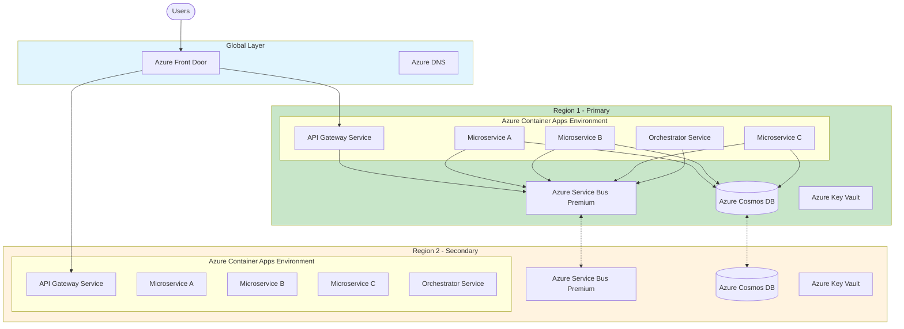

### Key Architectural Decisions

| Decision | Choice | Rationale |
|----------|--------|-----------|
| **Compute Platform** | Azure Container Apps | Fully managed, serverless containers with built-in KEDA support for event-driven scaling |
| **Messaging Backbone** | Azure Service Bus Premium | Enterprise-grade messaging with geo-disaster recovery, sessions, and exactly-once delivery |
| **Data Store** | Azure Cosmos DB | Global distribution, multi-region writes, and 99.999% availability |
| **Traffic Distribution** | Azure Front Door | Global load balancing with health-based routing and automatic failover |
| **Deployment Model** | Active-Active Multi-Region | Maximum availability with near-zero RTO |

---

## Core Components

### Azure Container Apps

Azure Container Apps is a fully managed serverless container platform that provides:

- **Automatic scaling** including scale-to-zero
- **Built-in KEDA integration** for event-driven autoscaling
- **Dapr support** for microservice communication patterns
- **Availability zone redundancy** for high availability
- **Managed identity** for secure service-to-service authentication

### Azure Service Bus Premium

Azure Service Bus Premium tier is essential for mission-critical workloads:

| Feature | Benefit |
|---------|---------|
| **Dedicated resources** | Predictable performance without noisy neighbor issues |
| **Geo-Replication** | Full data and metadata replication across regions |
| **Availability Zones** | Protection against datacenter-level failures |
| **Message sessions** | Ordered processing of related messages |
| **Large messages** | Up to 100 MB message size |
| **Auto-scaling** | Dynamic messaging unit scaling |

---

## Multi-Region Deployment Strategy

### Active-Active Configuration

For mission-critical SaaS applications targeting 99.99%+ availability, deploy using an active-active multi-region architecture:

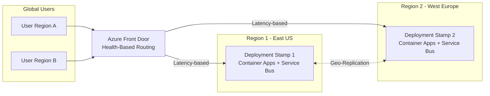

### Service Bus Geo-Replication

Azure Service Bus Premium supports two multi-region options:

#### 1. Geo-Replication (Recommended for Mission-Critical)

- Replicates **both metadata and message data**
- Supports planned and forced promotion
- Enables active-passive with full data consistency

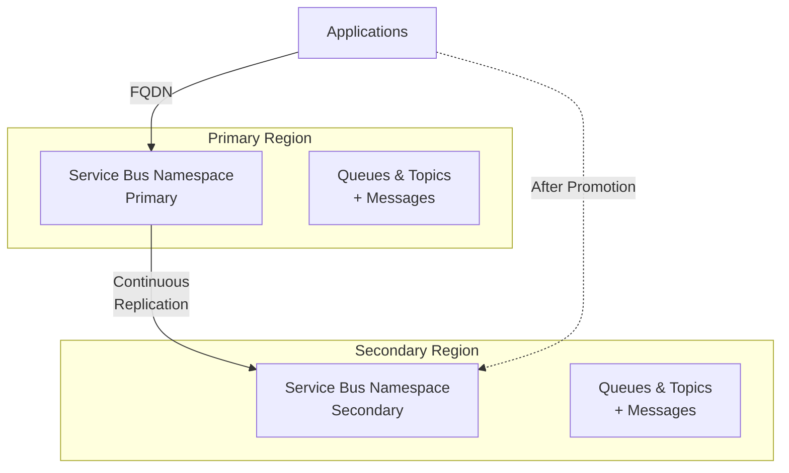

#### 2. Metadata Geo-Disaster Recovery

- Replicates **metadata only** (queues, topics, subscriptions)
- Lower cost, suitable when applications handle their own data replication
- Supports alias-based connection abstraction

### Container Apps Multi-Region Best Practices

1. **Enable availability zones** in each regional deployment
2. **Configure at least 3 replicas** for ingress-exposed applications
3. **Use identical deployment stamps** across regions via Infrastructure as Code
4. **Implement health probes** (liveness, readiness, startup)
5. **Configure service discovery resiliency policies** (retries, timeouts, circuit breakers)

---

## Inter-Service Communication Patterns

### Pattern 1: Point-to-Point with Queues

Use Service Bus queues for direct, one-to-one communication:

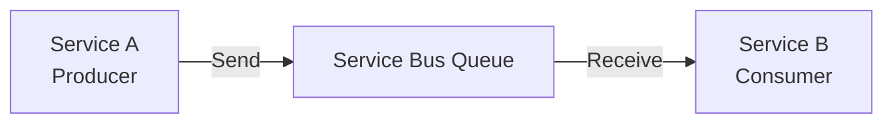

**Use Cases:**
- Command processing
- Task delegation
- Load leveling for bursty workloads

### Pattern 2: Publish-Subscribe with Topics

Use Service Bus topics for one-to-many communication:

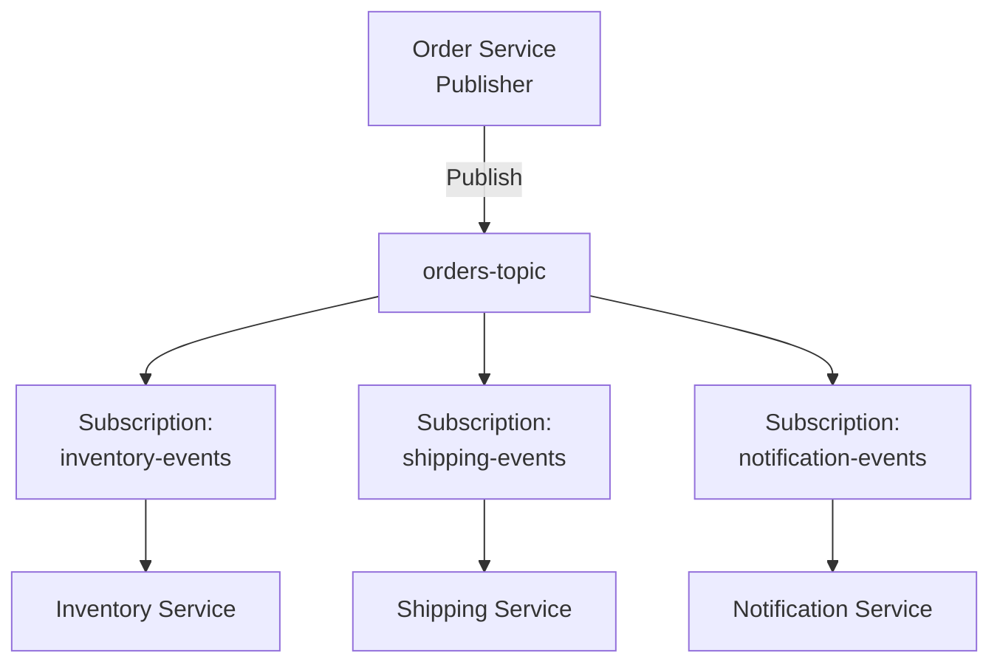

**Use Cases:**
- Event broadcasting
- Microservice event sourcing
- Decoupled integrations

### Pattern 3: Request-Reply with Sessions

For correlated request-reply patterns:

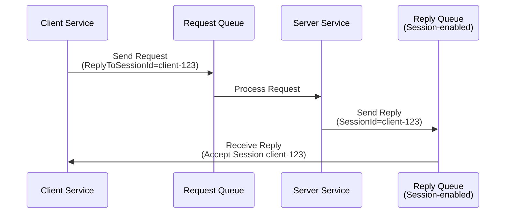

---

## Workflow Orchestration Patterns

For your specific use case—processing 500+ messages before continuing a workflow—there are several recommended patterns:

### Pattern 1: Saga Pattern with Orchestration

The Saga pattern coordinates distributed transactions across multiple services:

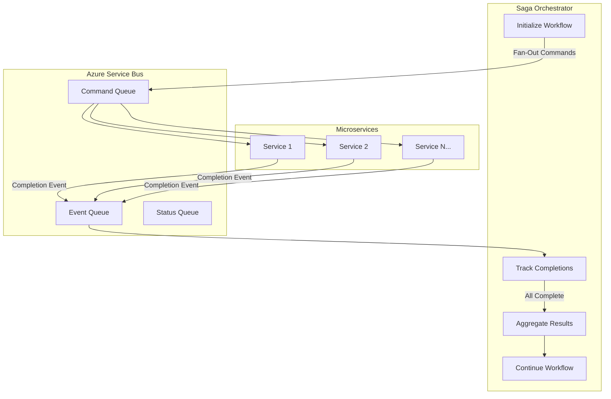

#### Benefits of Saga Orchestration
- **Centralized control** - Single orchestrator manages the workflow
- **Clear visibility** - Easy to track progress and state
- **Compensation support** - Can undo steps if failures occur
- **Complex workflow support** - Handles dependencies between steps

### Pattern 2: Fan-Out/Fan-In with Azure Durable Functions

For scenarios requiring 500+ parallel operations with aggregation:

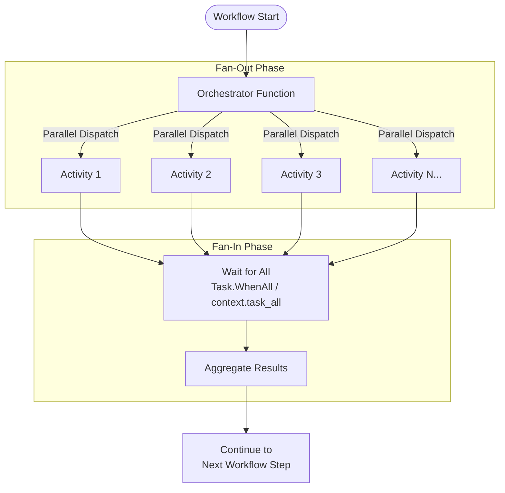

**Key Features:**
- Automatic checkpointing prevents work loss on failures
- Built-in retry policies
- Scales to thousands of parallel activities
- Supports long-running workflows (days/weeks)

### Pattern 3: Aggregator Pattern with Service Bus Sessions

Use Service Bus sessions to correlate and aggregate related messages:

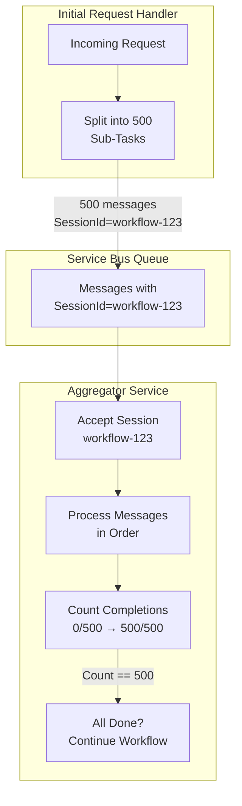

### Pattern 4: Correlation Tracking with Cosmos DB

For complex workflows requiring persistent state tracking:

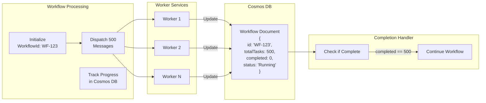

**Implementation Approach:**
1. Use Cosmos DB change feed to trigger completion checks
2. Implement atomic increment operations with optimistic concurrency
3. Use TTL for automatic cleanup of completed workflows

---

## Fan-Out/Fan-In Pattern for Batch Processing

This is the recommended pattern for your 500-message workflow scenario.

### Architecture Flow

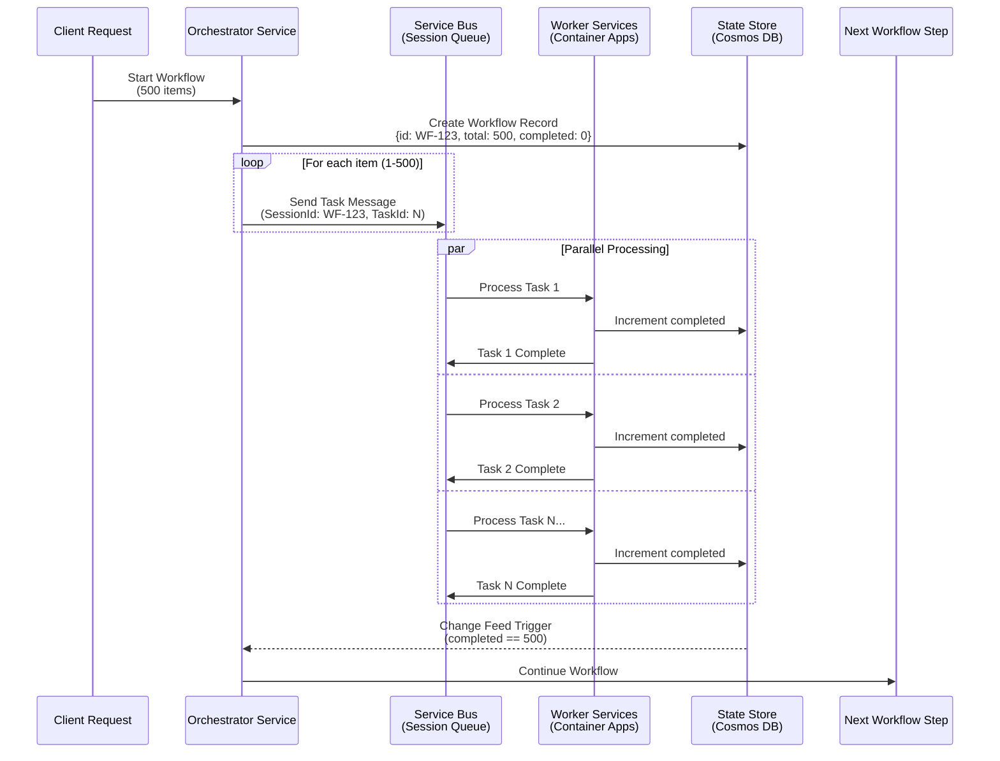

### Service Bus Queue Configuration for Aggregation

| Setting | Value | Rationale |
|---------|-------|-----------|
| **Enable Sessions** | Yes | Groups related messages for ordered processing |
| **Max Delivery Count** | 10 | Retry before dead-lettering |
| **Lock Duration** | 5 minutes | Time for processing complex tasks |
| **Enable Dead Letter** | Yes | Capture failed messages for analysis |
| **Message TTL** | 24 hours | Prevent stale messages |
| **Duplicate Detection** | Yes | Prevent duplicate processing |

### Completion Tracking Approaches

#### Approach 1: Cosmos DB Atomic Counter

```
// Pseudocode for atomic increment
PATCH /dbs/workflows/colls/state/docs/WF-123
{
    "operations": [
        { "op": "incr", "path": "/completed", "value": 1 },
        { "op": "set", "path": "/lastUpdated", "value": "<timestamp>" }
    ]
}
```

#### Approach 2: Service Bus Session State

```
// Store completion count in session state
Session WF-123 State: { "completed": 500, "total": 500 }
```

#### Approach 3: Durable Functions (Recommended for Complex Scenarios)

```python
# Python Durable Functions Example
@myApp.orchestration_trigger(context_name="context")
def workflow_orchestrator(context: df.DurableOrchestrationContext):
    work_items = context.get_input()  # 500 items
    
    # Fan-out: Create parallel tasks
    parallel_tasks = [
        context.call_activity("ProcessItem", item) 
        for item in work_items
    ]
    
    # Fan-in: Wait for all to complete
    results = yield context.task_all(parallel_tasks)
    
    # Aggregate and continue
    aggregated = sum(results)
    yield context.call_activity("ContinueWorkflow", aggregated)
    
    return aggregated
```

---

## Event-Driven Scaling with KEDA

Azure Container Apps uses KEDA (Kubernetes Event-Driven Autoscaling) to automatically scale based on queue depth.

### Service Bus Queue Scaler Configuration

```yaml
# Container Apps scaling rule for Service Bus
scale:
  minReplicas: 1
  maxReplicas: 100
  rules:
    - name: servicebus-queue-scaler
      custom:
        type: azure-servicebus
        metadata:
          queueName: workflow-tasks
          namespace: my-servicebus-namespace
          messageCount: "5"  # Scale when > 5 messages per instance
        auth:
          - secretRef: servicebus-connection
            triggerParameter: connection
```

### Scaling Behavior

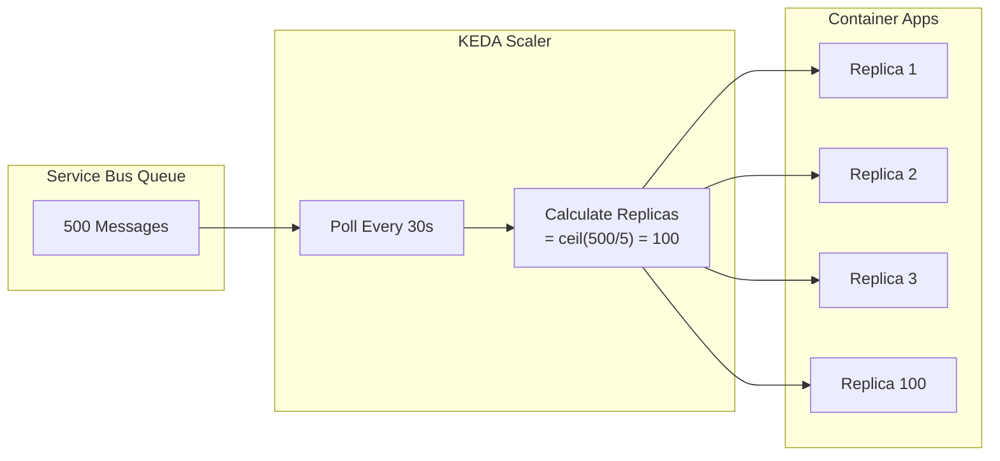

| Scaling Parameter | Value | Description |
|-------------------|-------|-------------|
| **Polling Interval** | 30 seconds | How often KEDA checks queue depth |
| **Cool Down Period** | 300 seconds | Wait time before scaling to zero |
| **Scale Up Step** | 1, 4, 8, 16, 32... | Exponential scale-up |
| **Max Replicas** | 1000 | Platform maximum |

---

## Reliability and Disaster Recovery

### Service Bus Reliability Features

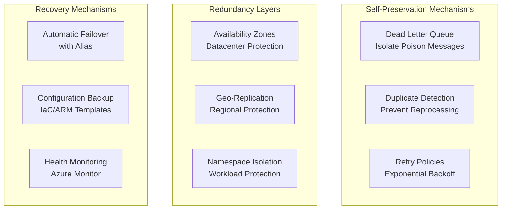

### Dead Letter Queue Handling

For mission-critical workflows, implement comprehensive dead letter handling:

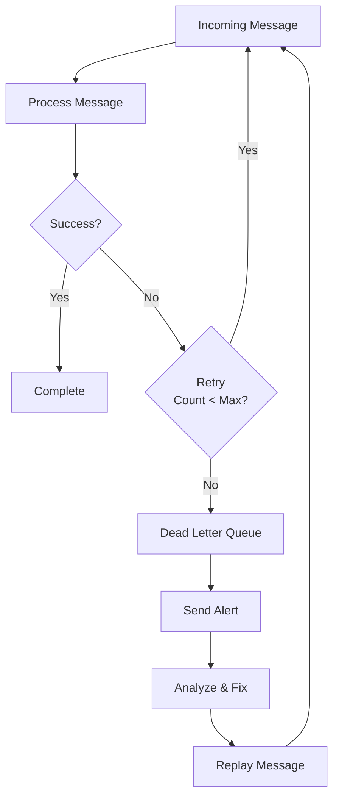

### Disaster Recovery Runbook

| Scenario | RTO | RPO | Action |
|----------|-----|-----|--------|
| **Zone Failure** | Seconds | 0 | Automatic failover within region |
| **Region Failure** | Minutes | Near-zero* | Initiate geo-replication promotion |
| **Data Corruption** | Hours | Varies | Restore from backup |

*With Geo-Replication; may have some data loss with forced promotion

---

## Security Best Practices

### Authentication & Authorization

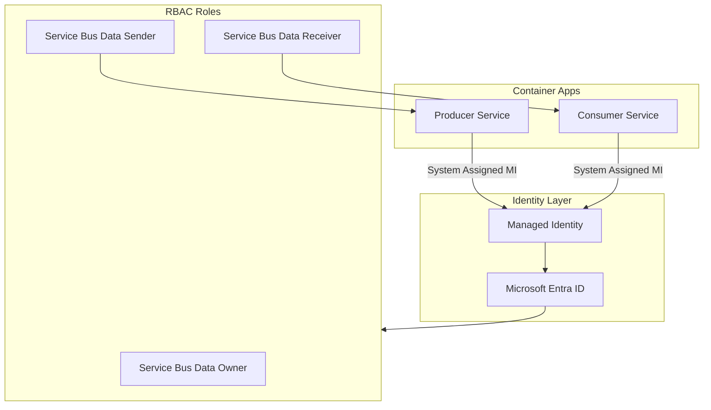

### Network Security

| Control | Implementation |
|---------|----------------|
| **Private Endpoints** | Service Bus accessible only via private IP |
| **VNet Integration** | Container Apps deployed in virtual network |
| **Network Security Groups** | Restrict traffic between subnets |
| **TLS 1.2+** | Enforce minimum TLS version |
| **mTLS** | Enable mutual TLS for service-to-service |

### Key Security Recommendations

1. **Never use connection strings** - Use managed identities
2. **Enable customer-managed keys** for encryption at rest
3. **Configure private endpoints** to eliminate public exposure
4. **Implement regular access reviews** and audit logging
5. **Store secrets in Azure Key Vault** with access policies

---

## Monitoring and Observability

### Key Metrics to Monitor

| Metric | Alert Threshold | Action |
|--------|-----------------|--------|
| **Dead Letter Count** | > 0 | Investigate poison messages |
| **Active Message Count** | > 10,000 | Scale consumers or investigate backlog |
| **Server Errors** | > 1% | Check Service Bus health |
| **Throttling Events** | Any | Scale messaging units |
| **CPU/Memory Usage** | > 80% | Scale Container Apps |

### Distributed Tracing

Enable end-to-end tracing across services:

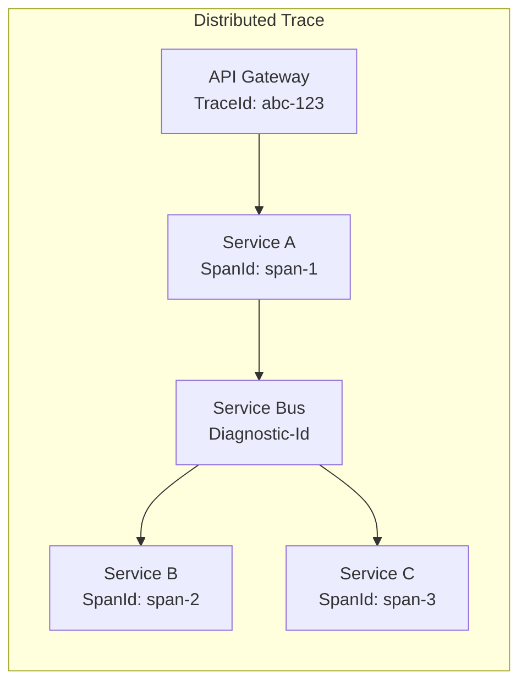

### Azure Monitor Integration

- **Application Insights** - Application-level telemetry
- **Log Analytics** - Centralized logging
- **Azure Monitor Alerts** - Proactive notification
- **Workbooks** - Custom dashboards

---

## Implementation Recommendations

### Phased Implementation

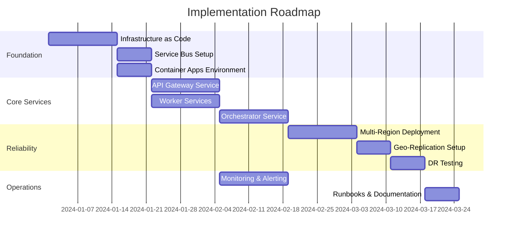

### Technology Stack Recommendations

| Layer | Primary Choice | Alternative |
|-------|---------------|-------------|
| **Orchestration** | Azure Durable Functions | Custom Saga in Container Apps |
| **Messaging** | Azure Service Bus Premium | Azure Event Hubs (for streaming) |
| **State Management** | Azure Cosmos DB | Azure SQL (for relational needs) |
| **Compute** | Azure Container Apps | Azure Kubernetes Service (for more control) |
| **API Gateway** | Azure API Management | Built-in Container Apps ingress |

### Cost Optimization Tips

1. **Use reserved capacity** for Service Bus Premium
2. **Enable scale-to-zero** for non-critical services
3. **Implement message batching** to reduce operations
4. **Co-locate resources** in the same region
5. **Use consumption-based tiers** for development/test

---

## References

### Microsoft Learn Documentation

1. [Azure Well-Architected Framework - Service Bus](https://learn.microsoft.com/en-us/azure/well-architected/service-guides/azure-service-bus)
2. [Azure Well-Architected Framework - Container Apps](https://learn.microsoft.com/en-us/azure/well-architected/service-guides/azure-container-apps)
3. [Enterprise Integration with Message Broker](https://learn.microsoft.com/en-us/azure/architecture/example-scenario/integration/queues-events)
4. [Durable Functions Overview - Fan-Out/Fan-In Pattern](https://learn.microsoft.com/en-us/azure/azure-functions/durable/durable-functions-overview)
5. [Saga Distributed Transactions Pattern](https://learn.microsoft.com/en-us/azure/architecture/patterns/saga)
6. [Azure Service Bus Geo-Replication](https://learn.microsoft.com/en-us/azure/service-bus-messaging/service-bus-geo-replication)
7. [Azure Service Bus Geo-Disaster Recovery](https://learn.microsoft.com/en-us/azure/service-bus-messaging/service-bus-geo-dr)
8. [Mission-Critical Architecture on Azure](https://learn.microsoft.com/en-us/azure/architecture/reference-architectures/containers/aks-mission-critical/mission-critical-intro)
9. [Set Scaling Rules in Azure Container Apps](https://learn.microsoft.com/en-us/azure/container-apps/scale-app)
10. [Service Bus Message Sessions](https://learn.microsoft.com/en-us/azure/service-bus-messaging/message-sessions)

### Architecture Patterns

11. [Sequential Convoy Pattern](https://learn.microsoft.com/en-us/azure/architecture/patterns/sequential-convoy)
12. [Queue-Based Load Leveling Pattern](https://learn.microsoft.com/en-us/azure/architecture/patterns/queue-based-load-leveling)
13. [Publisher-Subscriber Pattern](https://learn.microsoft.com/en-us/azure/architecture/patterns/publisher-subscriber)
14. [Microservices with Container Apps and Dapr](https://learn.microsoft.com/en-us/azure/architecture/example-scenario/serverless/microservices-with-container-apps-dapr)

### Reliability Guidance

15. [Reliability in Azure Service Bus](https://learn.microsoft.com/en-us/azure/reliability/reliability-service-bus)
16. [Multi-Region Disaster Recovery Approaches](https://learn.microsoft.com/en-us/azure/architecture/web-apps/guides/multi-region-app-service/multi-region-app-service)
17. [Best Practices for Insulating Applications Against Service Bus Outages](https://learn.microsoft.com/en-us/azure/service-bus-messaging/service-bus-outages-disasters)

---

## Summary

For your mission-critical SaaS application with 500+ message workflow orchestration:

### Recommended Architecture Pattern

1. **Use Azure Durable Functions** or a **custom Saga Orchestrator** deployed on Azure Container Apps for workflow coordination
2. **Enable Service Bus sessions** to correlate related messages with a workflow ID
3. **Implement the Fan-Out/Fan-In pattern** for parallel processing with aggregation
4. **Track completion state in Azure Cosmos DB** with change feed triggers
5. **Configure KEDA scaling** based on Service Bus queue depth for auto-scaling workers
6. **Deploy multi-region with Geo-Replication** for disaster recovery

### Key Success Factors

- ✅ Use Service Bus Premium tier for mission-critical reliability
- ✅ Implement dead letter queue monitoring and automated handling
- ✅ Enable availability zones and geo-replication
- ✅ Use managed identities for all service authentication
- ✅ Implement comprehensive distributed tracing
- ✅ Test disaster recovery procedures regularly

---

*Document Version: 1.0*  
*Last Updated: December 2024*  
*Author: Azure Architecture Guidance*
