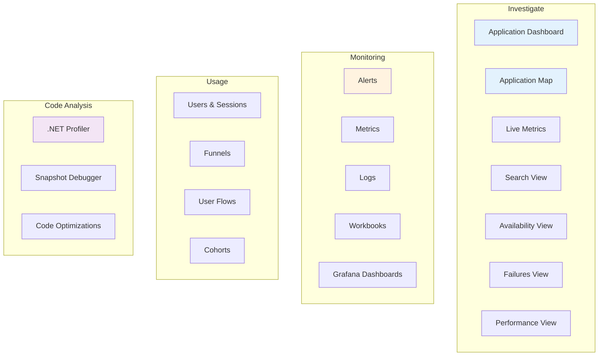
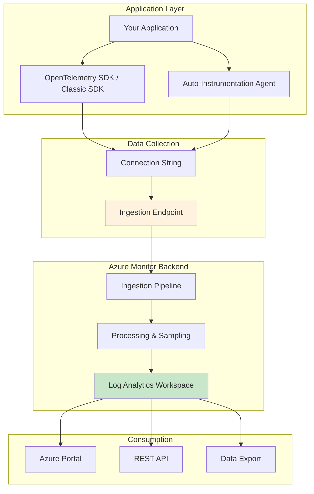
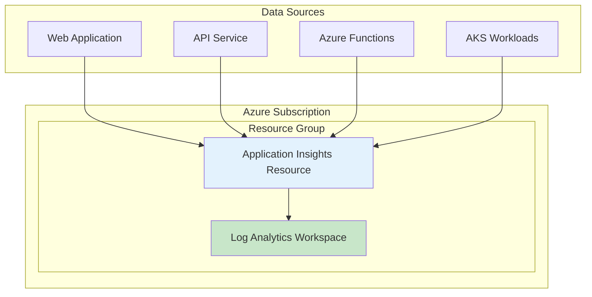
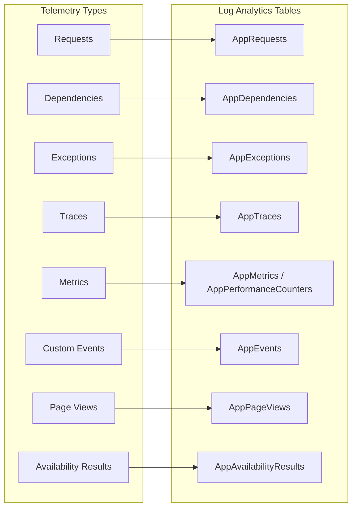
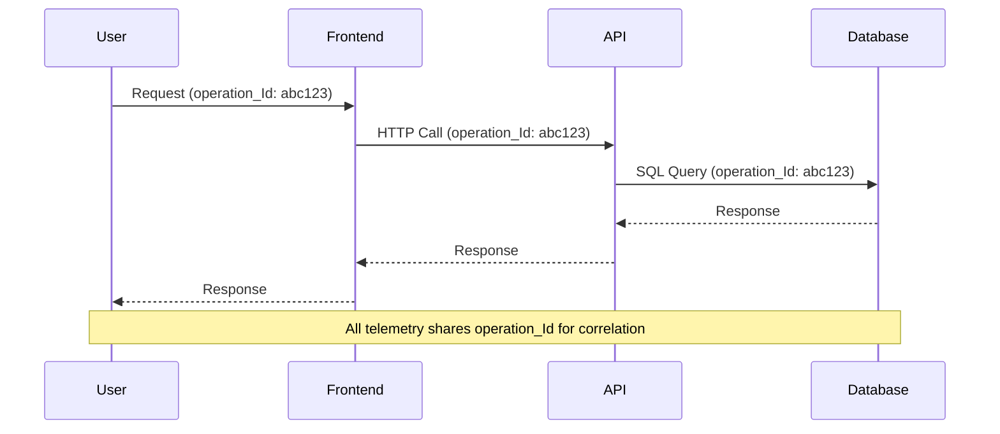
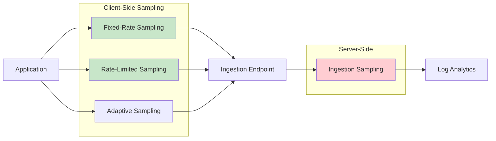
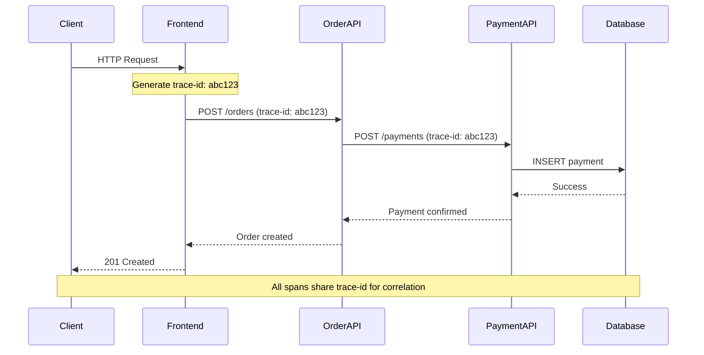
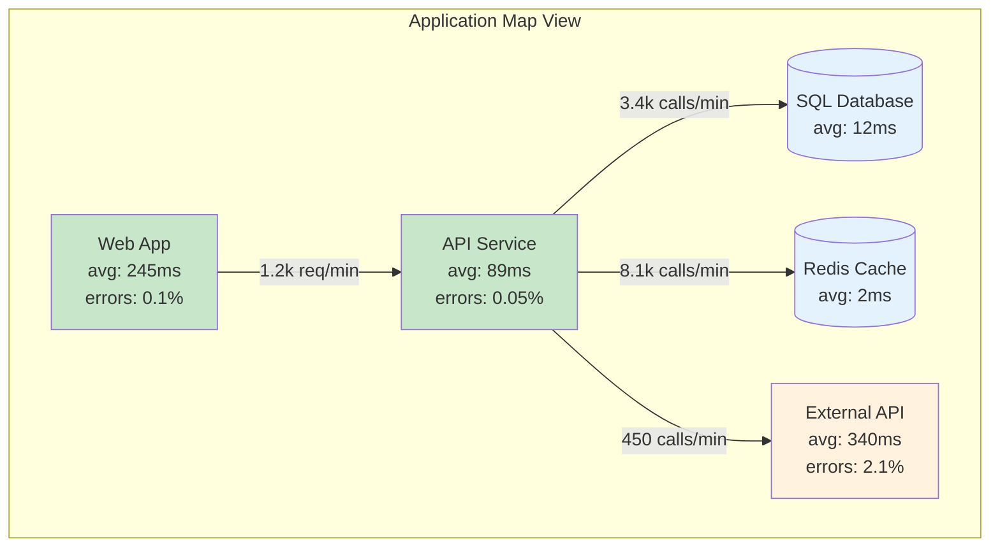
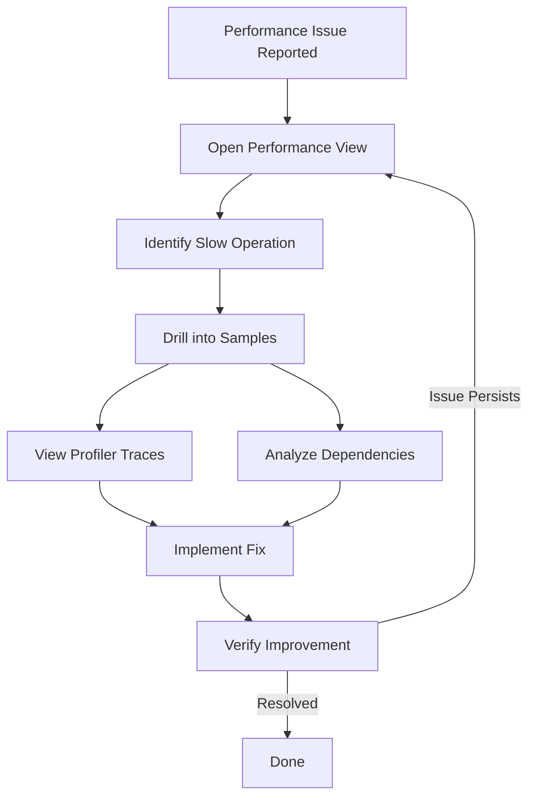
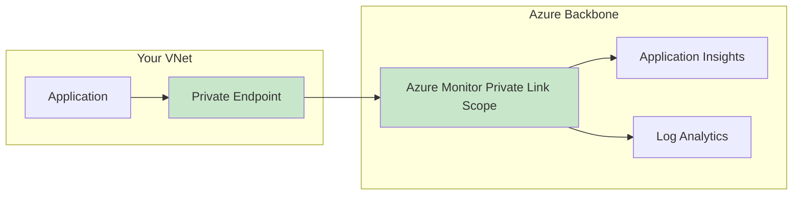

# Application Insights Comprehensive Guide

> **Level**: L300-400 Deep Dive | **Last Updated**: February 2026

## Table of Contents

1. [Overview](#overview)
2. [Architecture and Data Flow](#architecture-and-data-flow)
3. [Instrumentation Methods](#instrumentation-methods)
4. [Telemetry Data Model](#telemetry-data-model)
5. [Configuration Deep Dive](#configuration-deep-dive)
6. [Sampling Strategies](#sampling-strategies)
7. [Distributed Tracing](#distributed-tracing)
8. [Alerting and Smart Detection](#alerting-and-smart-detection)
9. [Performance Diagnostics](#performance-diagnostics)
10. [Cost Optimization](#cost-optimization)
11. [Security and Compliance](#security-and-compliance)
12. [Well-Architected Framework Alignment](#well-architected-framework-alignment)
13. [Production Readiness Checklist](#production-readiness-checklist)
14. [References](#references)

---

## Overview

Azure Monitor Application Insights is an OpenTelemetry-based Application Performance Monitoring (APM) service that provides comprehensive observability for live web applications. It integrates with OpenTelemetry (OTel) to provide a vendor-neutral approach to collecting and analyzing telemetry data.

### Key Capabilities

| Capability | Description |
|------------|-------------|
| **Application Performance Monitoring** | Monitor response times, failure rates, and dependency performance |
| **Distributed Tracing** | End-to-end transaction tracking across microservices |
| **Live Metrics** | Real-time performance monitoring with ~1 second latency |
| **Smart Detection** | ML-powered anomaly detection for failures and performance degradation |
| **Usage Analytics** | User behavior analysis with funnels, flows, and cohorts |
| **Code-Level Diagnostics** | .NET Profiler and Snapshot Debugger for deep troubleshooting |

### Application Insights Experiences



---

## Architecture and Data Flow

### Logic Model

Application Insights follows a layered architecture for data collection, processing, and analysis.



### Resource Topology



### Key Architecture Decisions

| Decision | Recommendation | Rationale |
|----------|----------------|-----------|
| **Resource per environment** | One App Insights per workload per environment | Prevents mixing telemetry; enables environment-specific configurations |
| **Regional alignment** | Deploy in same region as Log Analytics workspace | Reduces latency and eliminates cross-region failure risks |
| **Workspace-based** | Always use workspace-based Application Insights | Enables cost optimization features (Basic Logs, commitment tiers) |

---

## Instrumentation Methods

### Decision Matrix

| Method | Code Changes | Languages | Best For |
|--------|-------------|-----------|----------|
| **Auto-Instrumentation** | None | .NET, Java, Node.js, Python | Quick setup, Azure-hosted apps |
| **OpenTelemetry Distro** | Minimal | .NET, Java, Node.js, Python | New projects, vendor neutrality |
| **Classic SDK** | Moderate | .NET, Node.js | Legacy applications |
| **JavaScript SDK** | Minimal | JavaScript/TypeScript | Client-side monitoring |

### OpenTelemetry Instrumentation (Recommended)

The Azure Monitor OpenTelemetry Distro is the recommended approach for new applications.

#### ASP.NET Core Example

```csharp
// Program.cs
using Azure.Monitor.OpenTelemetry.AspNetCore;

var builder = WebApplication.CreateBuilder(args);

// Add OpenTelemetry and configure for Azure Monitor
builder.Services.AddOpenTelemetry().UseAzureMonitor(options => 
{
    options.ConnectionString = builder.Configuration["APPLICATIONINSIGHTS_CONNECTION_STRING"];
});

var app = builder.Build();
app.Run();
```

#### Java Auto-Instrumentation

```bash
# Add JVM argument to your application startup
# Download latest agent from: https://github.com/microsoft/ApplicationInsights-Java/releases
java -javaagent:"path/to/applicationinsights-agent-{VERSION}.jar" -jar your-app.jar
```

> **Note**: Starting from Java agent 3.4.0+, **rate-limited sampling is enabled by default** at 5 requests per second. This aids in cost management but may cause missing telemetry in high-volume scenarios. See [sampling configuration](https://learn.microsoft.com/en-us/azure/azure-monitor/app/java-standalone-config#sampling) for details.

#### Node.js Example

```typescript
// At the very top of your entry point file
const { useAzureMonitor } = require("@azure/monitor-opentelemetry");

// Configure before any other imports
useAzureMonitor();

// Rest of your application code
```

#### Python Example

```python
# At the very top of your entry point file
from azure.monitor.opentelemetry import configure_azure_monitor

configure_azure_monitor()

# Rest of your application code
```

### Connection String Configuration

| Method | Priority | Use Case |
|--------|----------|----------|
| Code | 1 (Highest) | Local development only |
| Environment Variable | 2 | Production (recommended) |
| Configuration File | 3 | Java applications |

```bash
# Environment variable (recommended for production)
APPLICATIONINSIGHTS_CONNECTION_STRING=InstrumentationKey=xxx;IngestionEndpoint=https://xxx.in.applicationinsights.azure.com/
```

### Auto-Instrumentation Supported Platforms

| Platform | Enablement Method |
|----------|-------------------|
| Azure App Service | Portal toggle / ARM deployment |
| Azure Functions | Built-in integration |
| Azure VM / VMSS | VM extension |
| Azure Spring Apps | Configuration property |
| Azure Container Apps | Environment configuration |
| Azure Kubernetes Service | OTEL Collector / Sidecar |

### Service Limits Reference

| Resource | Default Limit | Maximum Limit |
|----------|---------------|---------------|
| Total data per day | 100 GB | Contact support (up to 1,000 GB via portal) |
| Throttling | 32,000 events/second | Contact support |
| Data retention (logs) | 30-730 days | 730 days |
| Data retention (metrics) | 90 days | 90 days |
| Maximum telemetry item size | 64 KB | 64 KB |
| Maximum telemetry items per batch | 64,000 | 64,000 |
| Property/metric name length | 150 characters | 150 characters |
| Property value string length | 8,192 characters | 8,192 characters |
| Trace/exception message length | 32,768 characters | 32,768 characters |
| Availability tests per resource | 100 | 100 |
| .NET Profiler/Snapshot Debugger retention | 2 weeks | 6 months (contact support) |

---

## Telemetry Data Model

### Telemetry Types



### Telemetry Types Reference

| Type | Table (Log Analytics) | Description | Auto-Collected |
|------|----------------------|-------------|----------------|
| **Request** | `AppRequests` | Incoming HTTP requests | Yes |
| **Dependency** | `AppDependencies` | Outgoing calls (HTTP, SQL, etc.) | Yes |
| **Exception** | `AppExceptions` | Captured exceptions and errors | Yes |
| **Trace** | `AppTraces` | Log messages and diagnostic traces | Yes |
| **Metric** | `AppMetrics` | Custom and performance metrics | Partial |
| **Event** | `AppEvents` | Custom business events | No |
| **Page View** | `AppPageViews` | Browser page loads | Yes (JS SDK) |
| **Availability** | `AppAvailabilityResults` | Synthetic test results | Configured |

### Telemetry Correlation

Application Insights uses operation IDs to correlate telemetry across distributed systems.



### Key Correlation Fields

| Field | Purpose |
|-------|---------|
| `operation_Id` | Unique identifier for the entire distributed trace |
| `operation_ParentId` | ID of the parent operation (for building call trees) |
| `cloud_RoleName` | Identifies the service/component in Application Map |
| `cloud_RoleInstance` | Identifies the specific instance (pod, VM, etc.) |

---

## Configuration Deep Dive

### OpenTelemetry Configuration Options

#### ASP.NET Core Configuration

```csharp
builder.Services.AddOpenTelemetry().UseAzureMonitor(options =>
{
    // Connection string
    options.ConnectionString = "<YOUR-CONNECTION-STRING>";
    
    // Sampling configuration
    options.SamplingRatio = 0.1F;  // 10% fixed-rate sampling
    // OR
    options.TracesPerSecond = 5.0; // Rate-limited sampling
    
    // Enable/disable specific instrumentation
    options.EnableLiveMetrics = true;
});
```

#### Environment Variables

| Variable | Description |
|----------|-------------|
| `APPLICATIONINSIGHTS_CONNECTION_STRING` | Connection string for telemetry ingestion |
| `APPLICATIONINSIGHTS_STATSBEAT_DISABLED` | Disable internal metrics (`true`/`false`) |
| `OTEL_SERVICE_NAME` | Override the service name |
| `OTEL_RESOURCE_ATTRIBUTES` | Additional resource attributes |

### Cloud Role Name Configuration

Setting the Cloud Role Name is critical for proper Application Map visualization. The cloud role name uses the `service.name` resource attribute.

#### Option 1: Environment Variable (Recommended)

```bash
# Set via environment variable (works for all languages)
export OTEL_SERVICE_NAME="my-api-service"

# Or with additional resource attributes
export OTEL_RESOURCE_ATTRIBUTES="service.namespace=mycompany,service.version=1.0.0"
```

#### Option 2: Code Configuration (ASP.NET Core)

```csharp
// ASP.NET Core - Configure via UseAzureMonitor options
builder.Services.AddOpenTelemetry().UseAzureMonitor();

// Configure resource attributes
builder.Services.ConfigureOpenTelemetryTracerProvider((sp, tracerBuilder) =>
{
    tracerBuilder.ConfigureResource(resourceBuilder =>
    {
        resourceBuilder.AddService(
            serviceName: "my-api-service",
            serviceVersion: "1.0.0");
    });
});
```

#### Option 3: Java Configuration

```json
// Java - applicationinsights.json
{
  "connectionString": "<YOUR-CONNECTION-STRING>",
  "role": {
    "name": "my-api-service",
    "instance": "my-instance-id"
  }
}
```

> **Note**: If you have multiple services sending telemetry to the same Application Insights resource, you **must** set Cloud Role Names to distinguish them in the Application Map.

### Java Standalone Agent Configuration

Create `applicationinsights.json` in the same directory as the agent JAR:

```json
{
  "connectionString": "<YOUR-CONNECTION-STRING>",
  "role": {
    "name": "my-java-service"
  },
  "sampling": {
    "percentage": 10
  },
  "instrumentation": {
    "logging": {
      "level": "WARN"
    }
  },
  "preview": {
    "sampling": {
      "overrides": [
        {
          "telemetryType": "request",
          "attributes": [
            {
              "key": "http.url",
              "value": "https?://[^/]+/health.*",
              "matchType": "regexp"
            }
          ],
          "percentage": 0
        }
      ]
    }
  }
}
```

---

## Sampling Strategies

### Why Sampling Matters

Sampling is essential for managing costs and preventing throttling in high-volume applications.

| Without Sampling | With Sampling |
|------------------|---------------|
| High storage costs | Controlled costs |
| Potential throttling (32,000 events/second, measured over a minute) | Stays within limits |
| Full data retention | Statistically representative data |

### Sampling Types



### Sampling Configuration

#### Fixed-Rate Sampling (OpenTelemetry)

```csharp
// ASP.NET Core - 10% sampling
builder.Services.AddOpenTelemetry().UseAzureMonitor(options =>
{
    options.SamplingRatio = 0.1F;
});
```

#### Rate-Limited Sampling

```csharp
// ASP.NET Core - ~5 traces per second
builder.Services.AddOpenTelemetry().UseAzureMonitor(options =>
{
    options.TracesPerSecond = 5.0;
});
```

#### Java Sampling Overrides

```json
{
  "preview": {
    "sampling": {
      "overrides": [
        {
          "telemetryType": "request",
          "attributes": [
            {
              "key": "http.url",
              "value": "https?://[^/]+/health.*",
              "matchType": "regexp"
            }
          ],
          "percentage": 0
        }
      ]
    }
  }
}
```

### Sampling Decision Matrix

| Scenario | Recommended Sampling | Configuration |
|----------|---------------------|---------------|
| Development/Testing | None or 100% | `SamplingRatio = 1.0` |
| Low-volume production | None or minimal | `SamplingRatio = 0.5` to `1.0` |
| High-volume production | Rate-limited | `TracesPerSecond = 5.0` (Java default) |
| Cost-sensitive | Aggressive | `SamplingRatio = 0.01` to `0.1` |
| Health checks | Exclude | Sampling override with 0% |

> **Important**: Sampling is **not enabled by default** in .NET, Node.js, and Python OpenTelemetry distros. You must explicitly configure sampling. Java agent 3.4.0+ enables rate-limited sampling (5 req/sec) by default.

### Best Practices for Sampling

1. **Never use ingestion sampling as primary strategy** - Data is already transmitted before being dropped
2. **Configure sampling at the SDK level** - More efficient and preserves trace integrity
3. **Use sampling overrides for health checks** - Exclude noisy endpoints
4. **Test sampling configurations** - Validate that critical transactions are captured
5. **Monitor for broken traces** - Ensure all services use consistent sampling

---

## Distributed Tracing

### How Distributed Tracing Works



### Context Propagation

Application Insights supports W3C Trace Context standard for cross-service correlation.

| Header | Purpose |
|--------|---------|
| `traceparent` | Contains trace-id, parent-id, and flags |
| `tracestate` | Vendor-specific trace information |

### Application Map

The Application Map provides visual representation of your distributed system topology.



### Transaction Diagnostics

Use transaction diagnostics to trace individual requests end-to-end:

1. Navigate to **Failures** or **Performance** view
2. Select a specific operation
3. Click on a sample request
4. View the end-to-end transaction timeline

---

## Alerting and Smart Detection

### Alert Types

| Alert Type | Use Case | Configuration |
|------------|----------|---------------|
| **Metric Alerts** | Threshold-based monitoring | Define conditions on metrics |
| **Log Alerts** | Complex query-based alerts | KQL queries on log data |
| **Smart Detection** | Anomaly detection | Auto-configured, ML-based |
| **Availability Alerts** | Endpoint health | Synthetic test failures |

### Smart Detection Capabilities

Smart Detection uses machine learning to automatically detect:

| Detection Type | Description |
|----------------|-------------|
| **Failure Anomalies** | Abnormal rise in failed request rate |
| **Performance Anomalies** | Response time degradation |
| **Trace Degradation** | Increase in error/warning log ratio |
| **Memory Leak** | Potential memory leak patterns |
| **Exception Volume** | Abnormal rise in exceptions |
| **Security Anti-patterns** | Potential security issues |

### Configuring Alerts

#### Metric Alert Example (ARM/Bicep)

```bicep
resource metricAlert 'Microsoft.Insights/metricAlerts@2018-03-01' = {
  name: 'High-Failure-Rate-Alert'
  location: 'global'
  properties: {
    severity: 2
    enabled: true
    scopes: [appInsights.id]
    evaluationFrequency: 'PT5M'
    windowSize: 'PT15M'
    criteria: {
      'odata.type': 'Microsoft.Azure.Monitor.SingleResourceMultipleMetricCriteria'
      allOf: [
        {
          name: 'FailedRequests'
          metricName: 'requests/failed'
          operator: 'GreaterThan'
          threshold: 10
          timeAggregation: 'Count'
        }
      ]
    }
    actions: [
      {
        actionGroupId: actionGroup.id
      }
    ]
  }
}
```

#### Log Alert Example (KQL)

```kusto
// Alert on high error rate
requests
| where timestamp > ago(15m)
| summarize 
    TotalRequests = count(),
    FailedRequests = countif(success == false)
| extend FailureRate = (FailedRequests * 100.0) / TotalRequests
| where FailureRate > 5
```

### Availability Tests

| Test Type | Description | Use Case |
|-----------|-------------|----------|
| **URL Ping Test** | Simple HTTP GET | Basic availability check |
| **Standard Test** | HTTP request with assertions | Response validation |
| **Custom TrackAvailability** | Code-based tests | Complex scenarios |

```csharp
// Custom availability test
using var client = new TelemetryClient();
var availability = new AvailabilityTelemetry
{
    Name = "Custom Health Check",
    RunLocation = "Azure Function",
    Success = true,
    Duration = TimeSpan.FromMilliseconds(150)
};
client.TrackAvailability(availability);
```

---

## Performance Diagnostics

### .NET Profiler

The .NET Profiler captures detailed performance traces for your application.

| Feature | Description |
|---------|-------------|
| **Hot Path Analysis** | Identifies CPU-intensive code paths |
| **Memory Allocation** | Tracks object allocations |
| **Exception Profiling** | Captures exception call stacks |
| **Async Analysis** | Visualizes async execution patterns |

#### Enabling .NET Profiler

1. **Azure App Service**: Enable via Application Insights blade
2. **VMs/VMSS**: Install Diagnostic Services extension
3. **Code-based**: Configure in application startup

```csharp
// Profiler settings configuration
builder.Services.AddApplicationInsightsTelemetry();
builder.Services.AddServiceProfiler(options =>
{
    options.IsProfilingEnabled = true;
    options.Duration = TimeSpan.FromMinutes(2);
});
```

### Snapshot Debugger

Automatically captures debug snapshots when exceptions occur.

| Scenario | Captured Data |
|----------|---------------|
| **Unhandled Exceptions** | Full stack, local variables |
| **First-chance Exceptions** | Configurable capture |
| **Throttled** | Limited to prevent overhead |

#### Enabling Snapshot Debugger

```csharp
// ASP.NET Core
builder.Services.AddApplicationInsightsTelemetry();
builder.Services.AddSnapshotCollector(config =>
{
    config.IsEnabled = true;
    config.SnapshotsPerTenMinutesLimit = 1;
    config.MaximumSnapshotsRequired = 3;
});
```

### Performance Investigation Workflow



---

## Cost Optimization

### Cost Drivers

| Factor | Impact | Optimization Strategy |
|--------|--------|----------------------|
| **Data Ingestion Volume** | Primary cost driver | Sampling, filtering |
| **Data Retention** | Storage costs | Reduce retention, archive |
| **Custom Metrics** | Stored in both logs and metrics | Use preaggregated metrics |
| **Query Volume** | Compute costs | Optimize queries, use caching |

### Cost Management Strategies

#### 1. Configure Sampling

```csharp
// Reduce data volume to 10%
builder.Services.AddOpenTelemetry().UseAzureMonitor(options =>
{
    options.SamplingRatio = 0.1F;
});
```

#### 2. Set Daily Cap

> **Important**: For workspace-based Application Insights, you must configure daily caps on **both** the Application Insights resource and the Log Analytics workspace. The effective cap is the **minimum** of the two settings.

Configure via Azure Portal:
1. Navigate to Application Insights → **Usage and estimated costs** → **Daily cap**
2. Navigate to Log Analytics workspace → **Usage and estimated costs** → **Daily cap**

```bicep
// Log Analytics workspace with daily cap
resource logAnalyticsWorkspace 'Microsoft.OperationalInsights/workspaces@2022-10-01' = {
  name: 'my-log-analytics'
  location: location
  properties: {
    retentionInDays: 30
    workspaceCapping: {
      dailyQuotaGb: 5  // Daily cap in GB
    }
  }
}

resource appInsights 'Microsoft.Insights/components@2020-02-02' = {
  name: 'my-app-insights'
  location: location
  kind: 'web'
  properties: {
    Application_Type: 'web'
    WorkspaceResourceId: logAnalyticsWorkspace.id
    RetentionInDays: 30
  }
}
```

> **Warning**: Use daily caps as a safety net, not a replacement for sampling. Hitting the cap causes data loss until the next day.

#### 3. Filter Noisy Telemetry

```csharp
// Filter out health check requests
builder.Services.AddApplicationInsightsTelemetry();
builder.Services.AddApplicationInsightsTelemetryProcessor<HealthCheckFilter>();

public class HealthCheckFilter : ITelemetryProcessor
{
    private ITelemetryProcessor Next { get; }
    
    public HealthCheckFilter(ITelemetryProcessor next)
    {
        Next = next;
    }
    
    public void Process(ITelemetry item)
    {
        if (item is RequestTelemetry request)
        {
            if (request.Url?.AbsolutePath.Contains("/health") == true)
            {
                return; // Don't send health check telemetry
            }
        }
        Next.Process(item);
    }
}
```

#### 4. Use Basic Logs Plan

For high-volume, infrequently-queried tables, switch to Basic Logs plan:

| Plan | Ingestion Cost | Query Cost | Retention |
|------|----------------|------------|-----------|
| Analytics | Standard | Included | 30-730 days |
| Basic | ~67% less | Per query | 8 days |

### Cost Monitoring Query

```kusto
// Analyze data ingestion by table
union withsource=TableName *
| where TimeGenerated > ago(30d)
| summarize 
    RecordCount = count(),
    DataSizeGB = sum(estimate_data_size(*)) / 1024 / 1024 / 1024
    by TableName
| order by DataSizeGB desc
```

---

## Security and Compliance

### Security Best Practices

| Practice | Implementation |
|----------|----------------|
| **Use Managed Identity** | Authenticate without credentials |
| **Connection Strings over iKey** | More secure, supports regional endpoints |
| **Private Link** | Keep traffic on Microsoft backbone |
| **Data Anonymization** | Don't collect PII in telemetry |
| **Customer-Managed Keys** | Encrypt data with your own keys |

### Network Security



### Configuring Private Link

1. Create Azure Monitor Private Link Scope (AMPLS)
2. Add Application Insights and Log Analytics resources to AMPLS
3. Create Private Endpoint in your VNet
4. Configure DNS resolution

### Data Privacy

```csharp
// Disable IP collection (default in recent SDKs)
builder.Services.AddApplicationInsightsTelemetry(options =>
{
    options.EnableAdaptiveSampling = true;
});

// Use telemetry initializer to remove sensitive data
builder.Services.AddSingleton<ITelemetryInitializer, PrivacyTelemetryInitializer>();

public class PrivacyTelemetryInitializer : ITelemetryInitializer
{
    public void Initialize(ITelemetry telemetry)
    {
        // Remove or hash sensitive properties
        if (telemetry is ISupportProperties propTelemetry)
        {
            propTelemetry.Properties.Remove("user_email");
        }
    }
}
```

---

## Well-Architected Framework Alignment

### Reliability

| Recommendation | Benefit |
|----------------|---------|
| One App Insights per workload per environment | Prevents telemetry mixing; isolated failure domains |
| Same region as Log Analytics | Reduces cross-region failure risk |
| Resilient workspace design | Continuous monitoring during failures |
| Infrastructure as Code | Quick recovery of dashboards, alerts, queries |

### Security

| Recommendation | Benefit |
|----------------|---------|
| Use managed identities | No credential management |
| Implement Private Link | Network isolation |
| Enable customer-managed keys | Control over encryption |
| Don't store PII | Compliance with GDPR, etc. |

### Cost Optimization

| Recommendation | Benefit |
|----------------|---------|
| Configure appropriate sampling | Reduced data volume |
| Set daily caps | Prevent cost overruns |
| Use Basic Logs for high-volume tables | Lower ingestion cost |
| Disable unnecessary collection modules | Eliminate waste |

### Operational Excellence

| Recommendation | Benefit |
|----------------|---------|
| Keep SDKs up to date | Security patches, bug fixes |
| Use autoinstrumentation when possible | Reduced maintenance |
| Implement availability tests | Proactive monitoring |
| Configure meaningful alerts | Actionable notifications |

### Performance Efficiency

| Recommendation | Benefit |
|----------------|---------|
| Deploy in same region as workload | Reduced latency |
| Configure appropriate profiling frequency | Minimize overhead |
| Use preaggregated metrics | Efficient querying |

---

## Production Readiness Checklist

### Pre-Launch Checklist

#### Infrastructure Setup
- [ ] Application Insights resource created (workspace-based)
- [ ] Log Analytics workspace configured in same region
- [ ] Connection string stored securely (Key Vault or environment variable)
- [ ] Private Link configured (if required)
- [ ] Daily cap configured appropriately

#### Instrumentation
- [ ] OpenTelemetry or SDK integrated correctly
- [ ] Cloud role name configured for each service
- [ ] Connection string validated
- [ ] Test telemetry flowing to Application Insights

#### Sampling & Data Management
- [ ] Sampling strategy defined and configured
- [ ] Health check endpoints excluded from telemetry
- [ ] Data retention policy configured
- [ ] Cost alerts configured

#### Alerting
- [ ] Availability tests configured
- [ ] Metric alerts for key SLIs (error rate, latency)
- [ ] Smart Detection reviewed and configured
- [ ] Action groups configured with appropriate notifications

#### Distributed Tracing
- [ ] All services instrumented
- [ ] Cross-service correlation validated
- [ ] Application Map shows correct topology
- [ ] Transaction search returns correlated traces

#### Security
- [ ] No sensitive data in telemetry
- [ ] IP collection disabled (if required)
- [ ] RBAC configured for Application Insights access
- [ ] Diagnostic settings enabled for audit logs

#### Operational Readiness
- [ ] Dashboards created for key metrics
- [ ] Runbooks documented for common issues
- [ ] On-call team trained on Application Insights
- [ ] Workbooks created for incident investigation

### Post-Launch Validation

- [ ] Verify telemetry volume is within expectations
- [ ] Confirm sampling is working correctly
- [ ] Validate alerts fire correctly
- [ ] Test incident investigation workflow
- [ ] Review cost after first billing cycle

### Ongoing Maintenance

| Task | Frequency |
|------|-----------|
| Review and update SDK versions | Quarterly |
| Analyze cost trends | Monthly |
| Review Smart Detection findings | Weekly |
| Update dashboards and workbooks | As needed |
| Test availability test alerts | Monthly |
| Review data retention settings | Quarterly |

---

## References

### Official Microsoft Documentation

- [Application Insights Overview](https://learn.microsoft.com/en-us/azure/azure-monitor/app/app-insights-overview)
- [Well-Architected Framework - Application Insights](https://learn.microsoft.com/en-us/azure/well-architected/service-guides/application-insights)
- [OpenTelemetry Configuration](https://learn.microsoft.com/en-us/azure/azure-monitor/app/opentelemetry-configuration)
- [Sampling in Application Insights](https://learn.microsoft.com/en-us/azure/azure-monitor/app/opentelemetry-sampling)
- [Azure Monitor Pricing](https://azure.microsoft.com/pricing/details/monitor/)
- [Application Insights Service Limits](https://learn.microsoft.com/en-us/azure/azure-monitor/fundamentals/service-limits#application-insights)

### GitHub Resources

- [Azure Monitor OpenTelemetry Distro for .NET](https://github.com/Azure/azure-sdk-for-net/tree/main/sdk/monitor/Azure.Monitor.OpenTelemetry.AspNetCore)
- [Azure Monitor OpenTelemetry for Node.js](https://github.com/Azure-Samples/azure-monitor-opentelemetry-node.js)
- [Application Insights Java Samples](https://github.com/Azure-Samples/ApplicationInsights-Java-Samples)
- [Azure Monitor OpenTelemetry for Python](https://github.com/Azure/azure-sdk-for-python/tree/main/sdk/monitor/azure-monitor-opentelemetry)

### Related Guides

- [Cost Optimization in Azure Monitor](https://learn.microsoft.com/en-us/azure/azure-monitor/fundamentals/best-practices-cost)
- [Azure Monitor Private Link](https://learn.microsoft.com/en-us/azure/azure-monitor/logs/private-link-security)
- [Distributed Tracing](https://learn.microsoft.com/en-us/azure/azure-monitor/app/distributed-trace-data)
- [.NET Profiler](https://learn.microsoft.com/en-us/azure/azure-monitor/profiler/profiler-overview)
- [Snapshot Debugger](https://learn.microsoft.com/en-us/azure/azure-monitor/snapshot-debugger/snapshot-debugger)
- [Daily Cap Configuration](https://learn.microsoft.com/en-us/azure/azure-monitor/logs/daily-cap)
- [Java Agent Configuration](https://learn.microsoft.com/en-us/azure/azure-monitor/app/java-standalone-config)
- [Smart Detection](https://learn.microsoft.com/en-us/azure/azure-monitor/alerts/proactive-diagnostics)
