# Application Insights Comprehensive Guide

> **Level**: L300-400 Deep Dive | **Last Updated**: September 2026

## Table of Contents

1. [Overview](#overview)
2. [Architecture and Data Flow](#architecture-and-data-flow)
3. [Enterprise Workspace Design](#enterprise-workspace-design)
4. [Instrumentation Methods](#instrumentation-methods)
5. [Client-Side Monitoring (Real User Monitoring)](#client-side-monitoring-real-user-monitoring)
6. [Telemetry Data Model](#telemetry-data-model)
7. [Configuration Deep Dive](#configuration-deep-dive)
8. [Sampling Strategies](#sampling-strategies)
9. [Distributed Tracing](#distributed-tracing)
10. [Container and Kubernetes Monitoring](#container-and-kubernetes-monitoring)
11. [Alerting and Smart Detection](#alerting-and-smart-detection)
12. [Performance Diagnostics](#performance-diagnostics)
13. [Cost Optimization](#cost-optimization)
14. [Security and Compliance](#security-and-compliance)
15. [Well-Architected Framework Alignment](#well-architected-framework-alignment)
16. [Production Readiness Checklist](#production-readiness-checklist)
17. [FAQ: IIS Auto-Instrumentation and Operations](#faq-iis-auto-instrumentation-and-operations)
18. [References](#references)

---

## Overview

Azure Monitor Application Insights is an OpenTelemetry-based Application Performance Monitoring (APM) service that provides comprehensive observability for live web applications. It integrates with OpenTelemetry (OTel) to provide a vendor-neutral approach to collecting and analyzing telemetry data.

### Key Capabilities

| Capability | Description |
|------------|-------------|
| **Application Performance Monitoring** | Monitor response times, failure rates, and dependency performance |
| **Distributed Tracing** | End-to-end transaction tracking across microservices |
| **Live Metrics** | Real-time performance monitoring with ~1 second latency |
| **Smart Detection** | ML-powered anomaly detection for failures and performance degradation |
| **Usage Analytics** | User behavior analysis with funnels, flows, and cohorts |
| **Code-Level Diagnostics** | .NET Profiler and Snapshot Debugger for deep troubleshooting |

### Application Insights Experiences

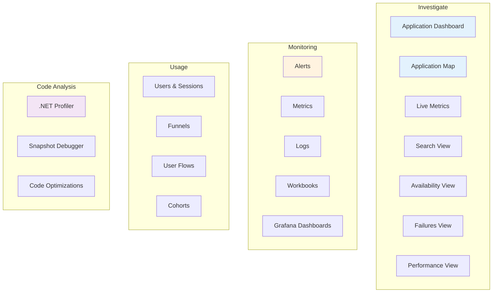

### Where Application Insights Fits in Azure Monitor

Application Insights is the application-layer feature of the broader **Azure Monitor** platform, which is organized around the three pillars of observability plus change tracking:

| Pillar | Store | Role of Application Insights |
|--------|-------|------------------------------|
| **Metrics** | Azure Monitor Metrics / Azure Monitor workspace (Prometheus) | Emits pre-aggregated standard and custom metrics |
| **Logs** | Log Analytics workspace (Azure Data Explorer engine) | Stores all App Insights telemetry as `App*` tables |
| **Distributed traces** | Log Analytics workspace | Primary producer — end-to-end transaction correlation |
| **Changes** | Azure Resource Graph (Change Analysis) | Correlate deployments/config changes with incidents |

> **Tip**: Use **Change Analysis** (built on Azure Resource Graph) alongside Application Insights when triaging incidents — it identifies infrastructure or configuration changes that might have caused a regression, without requiring any resource-provider registration.

---

## Architecture and Data Flow

### Logic Model

Application Insights follows a layered architecture for data collection, processing, and analysis.

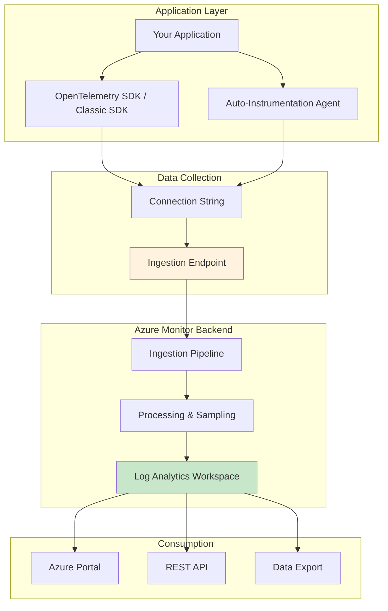

### Resource Topology

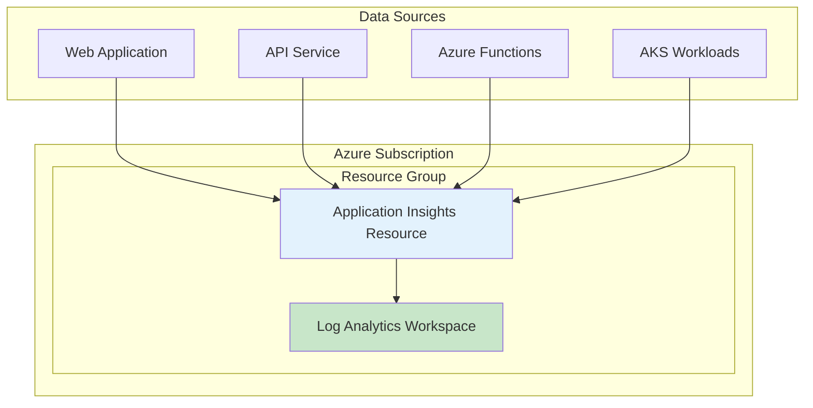

### Key Architecture Decisions

| Decision | Recommendation | Rationale |
|----------|----------------|-----------|
| **Resource per environment** | One App Insights per workload per environment | Prevents mixing telemetry; enables environment-specific configurations |
| **Regional alignment** | Deploy in same region as Log Analytics workspace | Reduces latency and eliminates cross-region failure risks |
| **Workspace-based** | Always use workspace-based Application Insights | Enables cost optimization features (Basic Logs, commitment tiers) |

---

## Enterprise Workspace Design

Because Application Insights stores its telemetry in a Log Analytics workspace, **workspace topology is an Application Insights design decision**. At enterprise scale it determines cost, RBAC, data residency, and how monitoring integrates with SIEM (Microsoft Sentinel).

### How many Application Insights resources?

| Consideration | Guidance |
|---------------|----------|
| **Isolation** | Use one resource per workload per environment (dev/staging/prod) to prevent telemetry mixing and isolate failure domains |
| **Consolidation trade-off** | A shared resource across components gives a holistic Application Map and Usage view, but at high volume it can degrade the performance of those experiences |
| **Component identity** | Distinguish components inside a shared resource with **Cloud Role Name** (see [Configuration Deep Dive](#configuration-deep-dive)) |

### Log Analytics workspace topology

| Factor | Guidance |
|--------|----------|
| **Default posture** | Centralize into as few workspaces as possible — simplifies cross-resource queries, RBAC, and cost management |
| **Data sovereignty** | Create a workspace per region where regulations require data residency; deploy each App Insights resource in the same region as its workspace |
| **Multiple Entra tenants** | Provision at least one workspace per Microsoft Entra tenant for tenant-scoped sources; use **Azure Lighthouse** for centralized cross-tenant access |
| **Operational vs. security data** | Separate workspaces when SOC (Sentinel) and operational data don't overlap, for cost efficiency and access isolation |
| **Scale and cost** | Link high-volume regional workspaces to a **dedicated cluster** for commitment-tier pricing and customer-managed keys. For cross-region resilience, rely on availability zones and workspace replication |

### Landing zone / management subscription pattern

Aligned with the Cloud Adoption Framework, centralize the monitoring data platform in a dedicated **management subscription**:

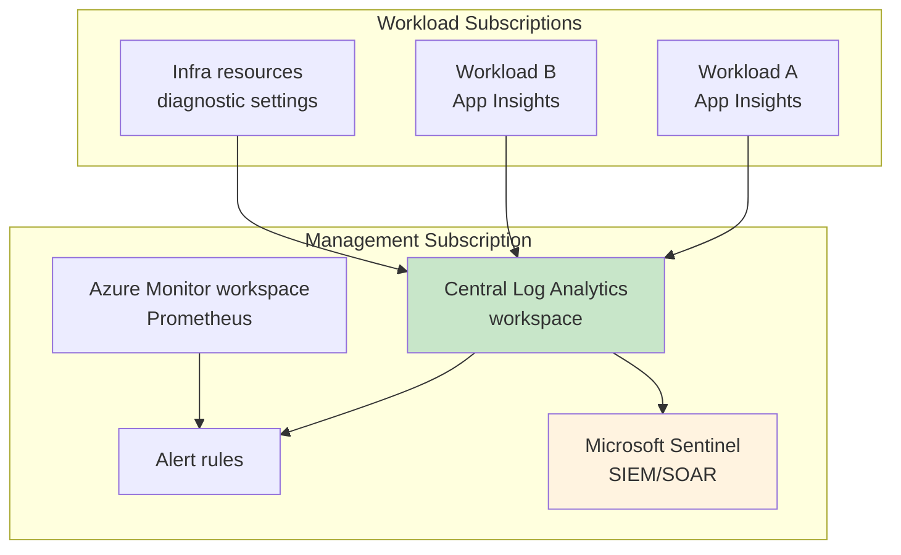

- Data sources across workload subscriptions send to the central workspaces; platform metrics remain at the resource subscription level and are routed to the central workspace for correlation.
- Place alert rules in the same resource group as the workspaces they target.

### Governance and access control

| Control | Benefit |
|---------|---------|
| **Azure Policy** to disable workspace creation for most users | Prevents data fragmentation and cost sprawl |
| **Azure Policy** to auto-configure diagnostic settings on infrastructure | Ensures consistent, centralized log collection |
| **Resource-based RBAC** (not workspace-wide permissions) | Least-privilege access scoped to each resource |
| **Table-level RBAC** | Grants access to specific tables (for example, security tables for a SOC team) |

### Microsoft Sentinel colocation

Microsoft Sentinel uses the **same Log Analytics workspace** as Azure Monitor. You can enable Sentinel (SIEM/SOAR) on the workspace that also holds operational telemetry, or split SOC and operational data across separate workspaces based on data overlap, cost, and access requirements. See the [sample workspace designs](https://learn.microsoft.com/en-us/azure/sentinel/sample-workspace-designs) for multi-tenant, multi-region, and multi-cloud patterns.

### Visualization choice

| Option | When to use |
|--------|-------------|
| **Azure Workbooks** | Default — no extra components or cost; always available |
| **Azure Managed Grafana** | Existing Grafana investment, or dashboards spanning multiple data sources (extra cost) |

---

## Instrumentation Methods

### Decision Matrix

| Method | Code Changes | Languages | Best For |
|--------|-------------|-----------|----------|
| **Auto-Instrumentation** | None | .NET, Java, Node.js, Python | Quick setup, Azure-hosted apps |
| **OpenTelemetry Distro** | Minimal | .NET, Java, Node.js, Python | New projects, vendor neutrality |
| **Classic SDK** | Moderate | .NET, Node.js | Legacy applications |
| **JavaScript SDK** | Minimal | JavaScript/TypeScript | Client-side monitoring |

### OpenTelemetry Instrumentation (Recommended)

The Azure Monitor OpenTelemetry Distro is the recommended approach for new applications.

#### ASP.NET Core Example

```csharp
// Program.cs
using Azure.Monitor.OpenTelemetry.AspNetCore;

var builder = WebApplication.CreateBuilder(args);

// Add OpenTelemetry and configure for Azure Monitor
builder.Services.AddOpenTelemetry().UseAzureMonitor(options => 
{
    options.ConnectionString = builder.Configuration["APPLICATIONINSIGHTS_CONNECTION_STRING"];
});

var app = builder.Build();
app.Run();
```

#### Java Auto-Instrumentation

```bash
# Add JVM argument to your application startup
# Download latest agent from: https://github.com/microsoft/ApplicationInsights-Java/releases
java -javaagent:"path/to/applicationinsights-agent-{VERSION}.jar" -jar your-app.jar
```

> **Note**: Starting from Java agent 3.4.0+, **rate-limited sampling is enabled by default** at 5 requests per second. This aids in cost management but may cause missing telemetry in high-volume scenarios. See [sampling configuration](https://learn.microsoft.com/en-us/azure/azure-monitor/app/java-standalone-config#sampling) for details.

#### Node.js Example

```typescript
// At the very top of your entry point file
const { useAzureMonitor } = require("@azure/monitor-opentelemetry");

// Configure before any other imports
useAzureMonitor();

// Rest of your application code
```

#### Python Example

```python
# At the very top of your entry point file
from azure.monitor.opentelemetry import configure_azure_monitor

configure_azure_monitor()

# Rest of your application code
```

### Connection String Configuration

| Method | Priority | Use Case |
|--------|----------|----------|
| Code | 1 (Highest) | Local development only |
| Environment Variable | 2 | Production (recommended) |
| Configuration File | 3 | Java applications |

```bash
# Environment variable (recommended for production)
APPLICATIONINSIGHTS_CONNECTION_STRING=InstrumentationKey=xxx;IngestionEndpoint=https://xxx.in.applicationinsights.azure.com/
```

### Auto-Instrumentation Supported Platforms

Autoinstrumentation (codeless attach) availability depends on **both** the hosting environment and the language. The following reflects the official support matrix.

| Environment / Resource provider | .NET Framework | .NET / .NET Core | Java | Node.js | Python |
|---------------------------------|:--------------:|:----------------:|:----:|:-------:|:------:|
| App Service — Windows (code) | ✅ | ✅¹ | ✅¹ | ✅¹ | ❌ |
| App Service — Windows (container) | ✅²³ | ✅²³ | ✅²³ | ✅²³ | ❌ |
| App Service — Linux (code) | ❌ | ✅¹ | ✅¹ | ✅¹ | ✅ |
| App Service — Linux (container) | ❌ | ✅³ | ✅³ | ✅³ | ❌ |
| Azure Functions | ✅¹ | ✅¹ | ✅¹ | ✅¹ | ✅¹ |
| Azure Spring Apps | ❌ | ❌ | ✅ | ❌ | ❌ |
| Azure Kubernetes Service (AKS) | ❌ | ✅² | ✅ | ✅ | ✅² |

**Footnotes**: ¹ Enabled automatically / on by default. &nbsp; ² Public preview (for AKS, .NET and Python are in *limited* preview; Java and Node.js in public preview). &nbsp; ³ Single-container apps only — multi-container or sidecar apps require manual OpenTelemetry.

**Other hosting environments:**

| Environment | Codeless option | Notes |
|-------------|-----------------|-------|
| Azure VM / VMSS (Windows) | Application Insights Agent (VM extension) | .NET; other languages use the standalone/manual approach |
| On-premises / IaaS IIS (Windows) | Application Insights Agent (`Az.ApplicationMonitor`, formerly Status Monitor v2) | .NET Framework / .NET — see the [IIS FAQ](#faq-iis-auto-instrumentation-and-operations) |
| Azure Container Apps | **Not supported** | ACA does **not** support the Application Insights auto-instrumentation agent — instrument with the [OpenTelemetry Distro](#opentelemetry-instrumentation-recommended)/SDK (see [Container and Kubernetes Monitoring](#container-and-kubernetes-monitoring)) |

> **Guidance**: For new development, prefer the **OpenTelemetry Distro** over codeless attach for full configuration and extensibility. Use autoinstrumentation for quick coverage and for legacy apps you cannot recompile.

### Service Limits Reference

| Resource | Default Limit | Maximum Limit |
|----------|---------------|---------------|
| Total data per day | 100 GB | Contact support (up to 1,000 GB via portal) |
| Throttling | 32,000 events/second | Contact support |
| Data retention (logs) | 30-730 days | 730 days |
| Data retention (metrics) | 90 days | 90 days |
| Maximum telemetry item size | 64 KB | 64 KB |
| Maximum telemetry items per batch | 64,000 | 64,000 |
| Property/metric name length | 150 characters | 150 characters |
| Property value string length | 8,192 characters | 8,192 characters |
| Trace/exception message length | 32,768 characters | 32,768 characters |
| Availability tests per resource | 100 | 100 |
| .NET Profiler/Snapshot Debugger retention | 2 weeks | 6 months (contact support) |

---

## Client-Side Monitoring (Real User Monitoring)

Server-side instrumentation (OpenTelemetry or the auto-instrumentation agent) captures requests, dependencies, and exceptions — but it sees nothing that happens **inside the user's browser**. The **Application Insights JavaScript SDK** provides Real User Monitoring (RUM): page views, browser load timings, AJAX/fetch calls, client-side exceptions, and the user/session data that powers the **Usage** experiences.

> **Important**: Browser telemetry uses the **JavaScript SDK, not OpenTelemetry**. This is the supported client-side path, and you are **not** expected to migrate browser monitoring to OpenTelemetry. Use OpenTelemetry for server-side code (including Node.js). **Full-stack monitoring = server-side OpenTelemetry + browser JavaScript SDK** — one does not replace the other.

### Enablement options

| Method | When to use |
|--------|-------------|
| **JavaScript (Web) SDK Loader Script** | Recommended for most sites — auto-updates from the CDN; add per page you want monitored |
| **npm package** (`@microsoft/applicationinsights-web`) | When you need IntelliSense, custom events/config, or the React / React Native / Angular framework extensions |

### What it collects

| Signal | Table | Notes |
|--------|-------|-------|
| **Page views** | `AppPageViews` | Collected by default |
| **Browser timings** | `AppBrowserTimings` | Page load performance breakdown |
| **AJAX / fetch dependencies** | `AppDependencies` (`ClientType == "Browser"`) | `fetch` collection is off by default in some versions |
| **Client exceptions** | `AppExceptions` | Unhandled browser errors with stack, URL, line/column |
| **Users / sessions** | Derived from anonymous user/session IDs | Powers Usage → Users, Sessions, Funnels, Flows, Retention, Cohorts |
| **Clicks / interactions** | `AppEvents` (custom events) | Requires the **Click Analytics** plug-in |

### Loader Script example

```html
<script type="text/javascript">
!(function (cfg){/* Application Insights Web SDK Loader Script */})({
  src: "https://js.monitor.azure.com/scripts/b/ai.3.gbl.min.js",
  crossOrigin: "anonymous",
  // cr: true,  // Fail over to backup CDN endpoints if the primary fails to load
  cfg: {
    connectionString: "YOUR_CONNECTION_STRING"
  }
});
</script>
```

> **Load resilience**: Set `cr: true` so the loader falls back to backup CDN endpoints (for example `js.cdn.applicationinsights.io`) if the primary CDN fails. Optionally add Subresource Integrity (SRI) checks.

### npm example

```javascript
import { ApplicationInsights } from '@microsoft/applicationinsights-web';

const appInsights = new ApplicationInsights({ config: {
  connectionString: 'YOUR_CONNECTION_STRING'
}});
appInsights.loadAppInsights();
appInsights.trackPageView();
```

### Security and cost considerations

- **The connection string is embedded in client HTML and visible to end users.** It is not a secret/key, but there is no straightforward way to use Microsoft Entra ID authentication for browser telemetry. Consider a **separate Application Insights resource** (with local auth) for browser telemetry to isolate it from server-side telemetry.
- **Control client-side cost** by limiting the number of AJAX calls reported per page view, or disabling AJAX reporting. Note that disabling AJAX also disables **JavaScript distributed-trace correlation** between the browser and your backend.

### Relationship to the Usage experiences

The **Usage** pane (Users, Sessions, Events, Funnels, User Flows, Retention, Cohorts, Impact) is built primarily from **page views** and **custom events**. Without the JavaScript SDK (or server-side `TrackEvent` custom events), Usage is sparse for server-only workloads — see [Q7 in the IIS FAQ](#q7-what-does-the-usage-pane-show-and-why-is-it-sometimes-empty).

---

## Telemetry Data Model

### Telemetry Types

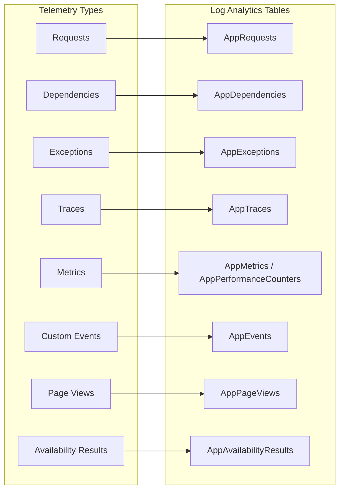

### Telemetry Types Reference

| Type | Table (Log Analytics) | Description | Auto-Collected |
|------|----------------------|-------------|----------------|
| **Request** | `AppRequests` | Incoming HTTP requests | Yes |
| **Dependency** | `AppDependencies` | Outgoing calls (HTTP, SQL, etc.) | Yes |
| **Exception** | `AppExceptions` | Captured exceptions and errors | Yes |
| **Trace** | `AppTraces` | Log messages and diagnostic traces | Yes |
| **Metric** | `AppMetrics` | Custom and performance metrics | Partial |
| **Event** | `AppEvents` | Custom business events | No |
| **Page View** | `AppPageViews` | Browser page loads | Yes (JS SDK) |
| **Availability** | `AppAvailabilityResults` | Synthetic test results | Configured |

### Telemetry Correlation

Application Insights uses operation IDs to correlate telemetry across distributed systems.

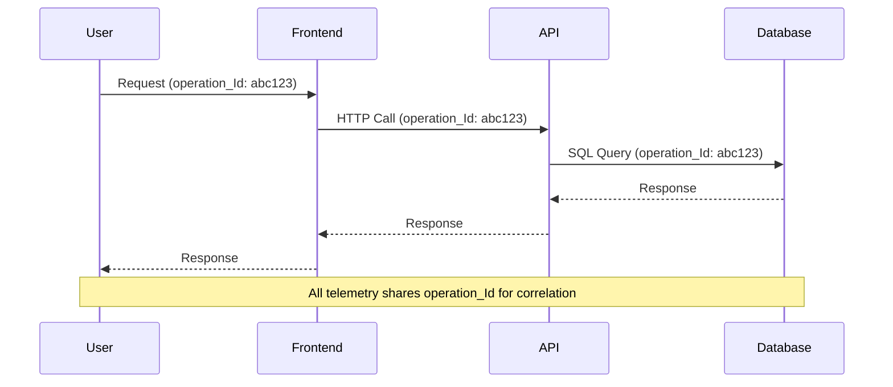

### Key Correlation Fields

| Field | Purpose |
|-------|---------|
| `operation_Id` | Unique identifier for the entire distributed trace |
| `operation_ParentId` | ID of the parent operation (for building call trees) |
| `cloud_RoleName` | Identifies the service/component in Application Map |
| `cloud_RoleInstance` | Identifies the specific instance (pod, VM, etc.) |

---

## Configuration Deep Dive

### OpenTelemetry Configuration Options

#### ASP.NET Core Configuration

```csharp
builder.Services.AddOpenTelemetry().UseAzureMonitor(options =>
{
    // Connection string
    options.ConnectionString = "<YOUR-CONNECTION-STRING>";
    
    // Sampling configuration
    options.SamplingRatio = 0.1F;  // 10% fixed-rate sampling
    // OR
    options.TracesPerSecond = 5.0; // Rate-limited sampling
    
    // Enable/disable specific instrumentation
    options.EnableLiveMetrics = true;
});
```

#### Environment Variables

| Variable | Description |
|----------|-------------|
| `APPLICATIONINSIGHTS_CONNECTION_STRING` | Connection string for telemetry ingestion |
| `APPLICATIONINSIGHTS_STATSBEAT_DISABLED` | Disable internal metrics (`true`/`false`) |
| `OTEL_SERVICE_NAME` | Override the service name |
| `OTEL_RESOURCE_ATTRIBUTES` | Additional resource attributes |

### Cloud Role Name Configuration

Set a distinct Cloud Role Name for each service that sends telemetry to a shared Application Insights resource. This keeps services as separate Application Map nodes. The setting depends on the instrumentation method; there is no universal role-name setting that every agent reads.

#### OpenTelemetry environment variables (recommended)

```bash
# OpenTelemetry workloads only
export OTEL_SERVICE_NAME="my-api-service"

# Or with additional resource attributes
export OTEL_RESOURCE_ATTRIBUTES="service.namespace=mycompany,service.version=1.0.0"
```

The Azure Monitor OpenTelemetry Distro derives Cloud Role Name from the OpenTelemetry `service.name` and optional `service.namespace` resource attributes. `OTEL_SERVICE_NAME` sets `service.name`; it does not configure the legacy IIS Application Insights Agent.

#### OpenTelemetry code configuration (ASP.NET Core)

```csharp
// ASP.NET Core - Configure via UseAzureMonitor options
builder.Services.AddOpenTelemetry().UseAzureMonitor();

// Configure resource attributes
builder.Services.ConfigureOpenTelemetryTracerProvider((sp, tracerBuilder) =>
{
    tracerBuilder.ConfigureResource(resourceBuilder =>
    {
        resourceBuilder.AddService(
            serviceName: "my-api-service",
            serviceVersion: "1.0.0");
    });
});
```

#### Java agent configuration

```json
// Java - applicationinsights.json
{
  "connectionString": "<YOUR-CONNECTION-STRING>",
  "role": {
    "name": "my-api-service",
    "instance": "my-instance-id"
  }
}
```

#### IIS Application Insights Agent limitation

The codeless IIS Application Insights Agent (`Az.ApplicationMonitor`, formerly Status Monitor v2) does not document a supported Cloud Role Name override. Its `InstrumentationKeyMap` and `redfieldConfiguration.instrumentationKeyMap` settings route matching machines, IIS sites, and virtual paths to an Application Insights connection string; they do not assign role names.

Azure Monitor Agent (AMA) is also not involved. AMA collects guest operating system data through data collection rules and does not configure Application Insights APM fields such as `cloud_RoleName` or `cloud_RoleInstance`.

If the automatically populated IIS role identity does not meet your requirements, use one of these supported alternatives:

- Migrate the application to the Azure Monitor OpenTelemetry Distro and set `service.name`.
- For an application already using the classic .NET Application Insights SDK, set `telemetry.Context.Cloud.RoleName` with an `ITelemetryInitializer`. This requires an application change and is not codeless.
- Send each IIS application to a separate Application Insights resource when no application change is possible and strict resource-level separation is required.

> [!IMPORTANT]
> Do not add an undocumented role-name property to the IIS agent configuration or to an AMA data collection rule. The agent ignores settings that are outside its supported schema.

### Java Standalone Agent Configuration

Create `applicationinsights.json` in the same directory as the agent JAR:

```json
{
  "connectionString": "<YOUR-CONNECTION-STRING>",
  "role": {
    "name": "my-java-service"
  },
  "sampling": {
    "percentage": 10
  },
  "instrumentation": {
    "logging": {
      "level": "WARN"
    }
  },
  "preview": {
    "sampling": {
      "overrides": [
        {
          "telemetryType": "request",
          "attributes": [
            {
              "key": "http.url",
              "value": "https?://[^/]+/health.*",
              "matchType": "regexp"
            }
          ],
          "percentage": 0
        }
      ]
    }
  }
}
```

---

## Sampling Strategies

### Why Sampling Matters

Sampling is essential for managing costs and preventing throttling in high-volume applications.

| Without Sampling | With Sampling |
|------------------|---------------|
| High storage costs | Controlled costs |
| Potential throttling (32,000 events/second, measured over a minute) | Stays within limits |
| Full data retention | Statistically representative data |

### Sampling Types

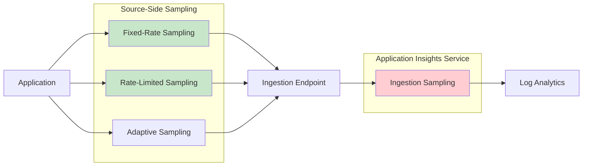

### Sampling Configuration

#### Fixed-Rate Sampling (OpenTelemetry)

```csharp
// ASP.NET Core - 10% sampling
builder.Services.AddOpenTelemetry().UseAzureMonitor(options =>
{
    options.SamplingRatio = 0.1F;
});
```

#### Rate-Limited Sampling

```csharp
// ASP.NET Core - ~5 traces per second
builder.Services.AddOpenTelemetry().UseAzureMonitor(options =>
{
    options.TracesPerSecond = 5.0;
});
```

#### Java Sampling Overrides

```json
{
  "preview": {
    "sampling": {
      "overrides": [
        {
          "telemetryType": "request",
          "attributes": [
            {
              "key": "http.url",
              "value": "https?://[^/]+/health.*",
              "matchType": "regexp"
            }
          ],
          "percentage": 0
        }
      ]
    }
  }
}
```

### Sampling Decision Matrix

| Scenario | Recommended Sampling | Configuration |
|----------|---------------------|---------------|
| Development/Testing | None or 100% | `SamplingRatio = 1.0` |
| Low-volume production | None or minimal | `SamplingRatio = 0.5` to `1.0` |
| High-volume production | Rate-limited | `TracesPerSecond = 5.0` (default in current distros) |
| Cost-sensitive | Aggressive | `SamplingRatio = 0.01` to `0.1` |
| Health checks | Exclude | Sampling override with 0% |

> **Important**: The Azure Monitor OpenTelemetry Distros include a **default sampler** whose type and rate depend on the language and distro version. Current releases converge on **rate-limited sampling (~5 traces/sec)** by default: **.NET / ASP.NET Core** (recent Distro versions), **Node.js** (1.16.0+), **Python** (1.8.6+), and the **Java** agent (3.4.0+). Always verify the default for your distro version and set an explicit sampling configuration for production so behavior is deterministic.

### Best Practices for Sampling

1. **Never use ingestion sampling as primary strategy** - Data is already transmitted before being dropped
2. **Configure sampling at the SDK level** - More efficient and preserves trace integrity
3. **Use sampling overrides for health checks** - Exclude noisy endpoints
4. **Test sampling configurations** - Validate that critical transactions are captured
5. **Monitor for broken traces** - Ensure all services use consistent sampling

---

## Distributed Tracing

### How Distributed Tracing Works

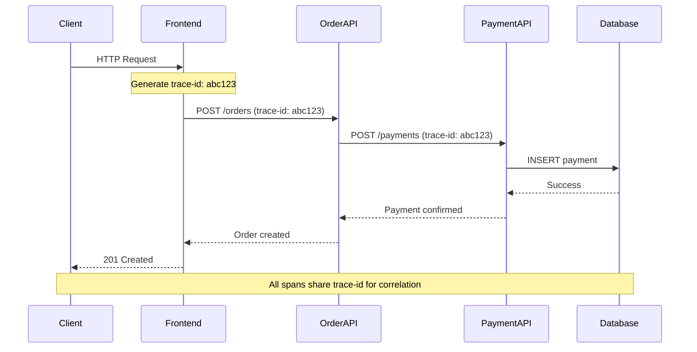

### Context Propagation

Application Insights supports W3C Trace Context standard for cross-service correlation.

| Header | Purpose |
|--------|---------|
| `traceparent` | Contains trace-id, parent-id, and flags |
| `tracestate` | Vendor-specific trace information |

### Application Map

The Application Map provides visual representation of your distributed system topology.

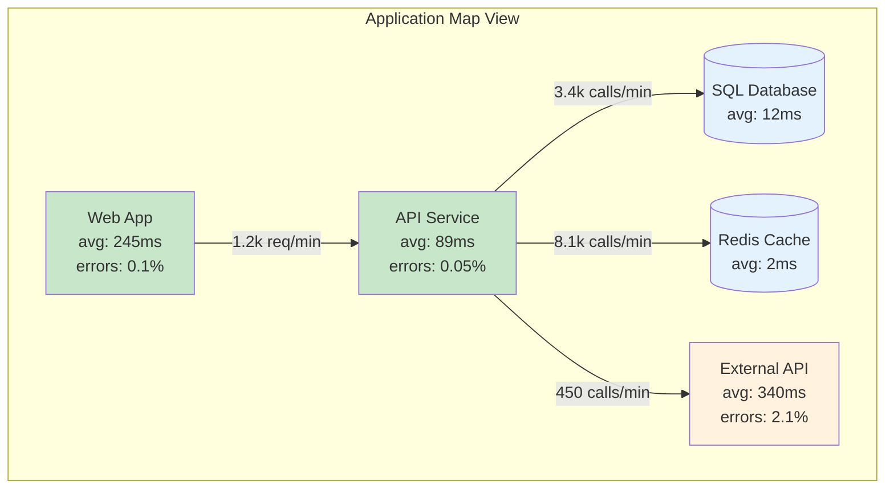

### Transaction Diagnostics

Use transaction diagnostics to trace individual requests end-to-end:

1. Navigate to **Failures** or **Performance** view
2. Select a specific operation
3. Click on a sample request
4. View the end-to-end transaction timeline

---

## Container and Kubernetes Monitoring

Monitoring containerized workloads spans multiple layers. **Application Insights covers the application layer**; other Azure Monitor services cover the cluster, control plane, and infrastructure. Use them together for full-stack visibility.

### Kubernetes monitoring layers

| Layer | What it monitors | Azure service |
|-------|------------------|---------------|
| **Network** | Virtual network, flow logs, traffic between services | Network Watcher, Traffic Analytics, Network Insights |
| **Cluster & control plane** | Nodes, pods, API server, kubelet, Kubernetes events | Azure Monitor managed service for **Prometheus** + **Container Insights** + control-plane **diagnostic logs** |
| **Application** | App performance, distributed traces, dependencies | **Application Insights** (OpenTelemetry) |

> **Visualization**: Analyze cluster metrics with **Azure Managed Grafana** (or Azure Monitor dashboards with Grafana) and container logs/events with **Log Analytics**. Enable the recommended Prometheus alert rules for common cluster issues.

### AKS codeless auto-instrumentation (preview)

AKS supports **codeless** application monitoring that injects the Azure Monitor OpenTelemetry Distro into your pods with no code change.

| Aspect | Detail |
|--------|--------|
| **Languages** | Java and Node.js (public preview); .NET and Python (limited preview) |
| **Platform** | **Linux node pools only** (Windows node pools not supported) |
| **Enable on cluster** | `az aks update --enable-azure-monitor-app-monitoring` (also available at cluster create, or via the portal **Monitor Settings → Enable support for auto-instrumentation**) |
| **Onboarding** | Namespace-wide (an `Instrumentation` custom resource named `default`) or per-deployment (a named CR + pod annotations) |
| **Activation** | Restart deployments (`kubectl rollout restart`) for injection to take effect |
| **Experiences** | Full Application Insights **except Live Metrics and Code Analysis**; in-cluster APM tiles at namespace/workload/pod scope with a *View in Application Insights* deep link |

```azurecli
# Enable the capability on the cluster
az aks update --resource-group myRG --name myAKS --enable-azure-monitor-app-monitoring
```

```yaml
# Namespace-wide onboarding: Instrumentation custom resource named "default"
apiVersion: monitor.azure.com/v1
kind: Instrumentation
metadata:
  name: default
  namespace: mynamespace
spec:
  settings:
    autoInstrumentationPlatforms: ["Java", "NodeJs"]
  destination:
    applicationInsightsConnectionString: "InstrumentationKey=...;IngestionEndpoint=...;LiveEndpoint=..."
```

**Operational notes:**

- **Precedence** when both manual and auto-instrumentation are present: for **Node.js**, manual instrumentation wins; for **Java**, autoinstrumentation wins. Duplicate telemetry is always prevented.
- **Stay current**: the feature injects the latest Distro on each restart. **Restart or redeploy weekly** so long-running deployments pick up the latest security fixes.
- **Application logs**: add the annotation `monitor.azure.com/enable-application-logs: "true"` to collect app logs into Application Insights (correlated with traces).
- **Disable**: remove the `Instrumentation` CR and `rollout restart` for a namespace; use `az aks update --disable-azure-monitor-app-monitoring` for the whole cluster.

### Azure Container Apps

> **Key gotcha**: Azure Container Apps **does not support the Application Insights auto-instrumentation agent**. Instrument your application code with the **OpenTelemetry Distro/SDK** and send telemetry to Application Insights.

Built-in ACA observability complements Application Insights:

| Feature | Purpose |
|---------|---------|
| **Log streaming** & **container console** | Real-time logs and interactive debugging during dev/test |
| **Azure Monitor metrics** | Compute/network usage, comparable across revisions |
| **Application logging → Log Analytics** | Query system and app logs with KQL |
| **Azure Monitor alerts** | Alert per revision on metric/log conditions |
| **Managed OpenTelemetry agent** (environment-level) | Export app telemetry to endpoints including Application Insights |

### Cost and configuration best practices (Kubernetes)

| Recommendation | Benefit |
|----------------|---------|
| Use **Managed Prometheus** for metrics; don't also send Prometheus metrics to Log Analytics | Avoids redundant, double-billed metric data |
| Convert Container Insights logs to **`ContainerLogV2`** and use the **Basic Logs** plan | Significant ingestion cost savings for high-volume container logs |
| Use **resource-specific** AKS resource logs and collect only needed control-plane categories | Enables Basic Logs and avoids collecting logs you never query |
| Use **managed identity** auth (default) and **Private Link** for cluster → workspace traffic | Removes local auth and keeps ingestion on private networks |

---

## Alerting and Smart Detection

### Alert Types

| Alert Type | Use Case | Configuration |
|------------|----------|---------------|
| **Metric Alerts** | Threshold-based monitoring | Define conditions on metrics |
| **Log Alerts** | Complex query-based alerts | KQL queries on log data |
| **Smart Detection** | Anomaly detection | Auto-configured, ML-based |
| **Availability Alerts** | Endpoint health | Synthetic test failures |

### Smart Detection Capabilities

Smart Detection uses machine learning to automatically detect:

| Detection Type | Description |
|----------------|-------------|
| **Failure Anomalies** | Abnormal rise in failed request rate |
| **Performance Anomalies** | Response time degradation |
| **Trace Degradation** | Increase in error/warning log ratio |
| **Memory Leak** | Potential memory leak patterns |
| **Exception Volume** | Abnormal rise in exceptions |
| **Security Anti-patterns** | Potential security issues |

### Configuring Alerts

#### Metric Alert Example (ARM/Bicep)

```bicep
resource metricAlert 'Microsoft.Insights/metricAlerts@2018-03-01' = {
  name: 'High-Failure-Rate-Alert'
  location: 'global'
  properties: {
    severity: 2
    enabled: true
    scopes: [appInsights.id]
    evaluationFrequency: 'PT5M'
    windowSize: 'PT15M'
    criteria: {
      'odata.type': 'Microsoft.Azure.Monitor.SingleResourceMultipleMetricCriteria'
      allOf: [
        {
          name: 'FailedRequests'
          metricName: 'requests/failed'
          operator: 'GreaterThan'
          threshold: 10
          timeAggregation: 'Count'
        }
      ]
    }
    actions: [
      {
        actionGroupId: actionGroup.id
      }
    ]
  }
}
```

#### Log Alert Example (KQL)

```kusto
// Alert on high error rate
requests
| where timestamp > ago(15m)
| summarize 
    TotalRequests = count(),
    FailedRequests = countif(success == false)
| extend FailureRate = (FailedRequests * 100.0) / TotalRequests
| where FailureRate > 5
```

### Availability Tests

| Test Type | Description | Use Case |
|-----------|-------------|----------|
| **URL Ping Test** | Simple HTTP GET | Basic availability check |
| **Standard Test** | HTTP request with assertions | Response validation |
| **Custom TrackAvailability** | Code-based tests | Complex scenarios |

```csharp
// Custom availability test
using var client = new TelemetryClient();
var availability = new AvailabilityTelemetry
{
    Name = "Custom Health Check",
    RunLocation = "Azure Function",
    Success = true,
    Duration = TimeSpan.FromMilliseconds(150)
};
client.TrackAvailability(availability);
```

---

## Performance Diagnostics

### .NET Profiler

The .NET Profiler captures detailed performance traces for your application.

| Feature | Description |
|---------|-------------|
| **Hot Path Analysis** | Identifies CPU-intensive code paths |
| **Memory Allocation** | Tracks object allocations |
| **Exception Profiling** | Captures exception call stacks |
| **Async Analysis** | Visualizes async execution patterns |

#### Enabling .NET Profiler

1. **Azure App Service**: Enable via Application Insights blade
2. **VMs/VMSS**: Install Diagnostic Services extension
3. **Code-based**: Configure in application startup

```csharp
// Enable Profiler for ASP.NET Core (Microsoft.ApplicationInsights.Profiler.AspNetCore)
builder.Services.AddApplicationInsightsTelemetry();
builder.Services.AddServiceProfiler();
```

### Snapshot Debugger

Automatically captures debug snapshots when exceptions occur.

| Scenario | Captured Data |
|----------|---------------|
| **Unhandled Exceptions** | Full stack, local variables |
| **First-chance Exceptions** | Configurable capture |
| **Throttled** | Limited to prevent overhead |

#### Enabling Snapshot Debugger

```csharp
// ASP.NET Core (Microsoft.ApplicationInsights.SnapshotCollector)
builder.Services.AddApplicationInsightsTelemetry();
builder.Services.AddSnapshotCollector();

// Optionally customize via SnapshotCollectorConfiguration:
// builder.Services.Configure<SnapshotCollectorConfiguration>(
//     builder.Configuration.GetSection("SnapshotCollector"));
```

### Performance Investigation Workflow

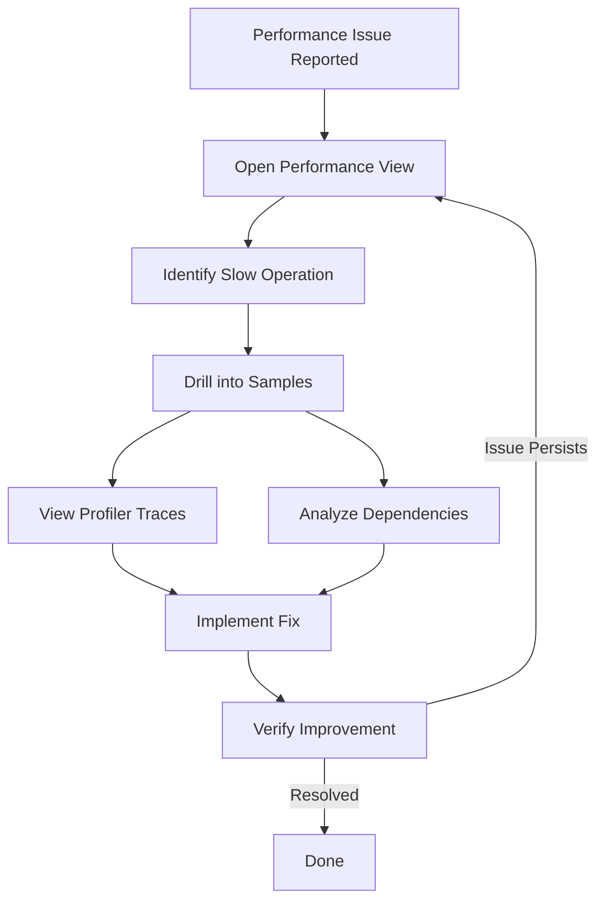

---

## Cost Optimization

### Cost Drivers

| Factor | Impact | Optimization Strategy |
|--------|--------|----------------------|
| **Data Ingestion Volume** | Primary cost driver | Sampling, filtering |
| **Data Retention** | Storage costs | Reduce retention, archive |
| **Custom Metrics** | Stored in both logs and metrics | Use preaggregated metrics |
| **Query Volume** | Compute costs | Optimize queries, use caching |

### Cost Management Strategies

#### 1. Configure Sampling

```csharp
// Reduce data volume to 10%
builder.Services.AddOpenTelemetry().UseAzureMonitor(options =>
{
    options.SamplingRatio = 0.1F;
});
```

#### 2. Set Daily Cap

> **Important**: For workspace-based Application Insights, you must configure daily caps on **both** the Application Insights resource and the Log Analytics workspace. The effective cap is the **minimum** of the two settings.

Configure via Azure Portal:
1. Navigate to Application Insights → **Usage and estimated costs** → **Daily cap**
2. Navigate to Log Analytics workspace → **Usage and estimated costs** → **Daily cap**

```bicep
// Log Analytics workspace with daily cap
resource logAnalyticsWorkspace 'Microsoft.OperationalInsights/workspaces@2022-10-01' = {
  name: 'my-log-analytics'
  location: location
  properties: {
    retentionInDays: 30
    workspaceCapping: {
      dailyQuotaGb: 5  // Daily cap in GB
    }
  }
}

resource appInsights 'Microsoft.Insights/components@2020-02-02' = {
  name: 'my-app-insights'
  location: location
  kind: 'web'
  properties: {
    Application_Type: 'web'
    WorkspaceResourceId: logAnalyticsWorkspace.id
    RetentionInDays: 30
  }
}
```

> **Note**: The Bicep above sets the **Log Analytics workspace** daily cap. The **Application Insights** resource daily cap isn't exposed as a first-class Bicep property on `Microsoft.Insights/components` — set it via the portal (the steps above) or the pricing-plan API. For workspace-based resources, the effective cap is the **minimum** of the two.

> **Warning**: Use daily caps as a safety net, not a replacement for sampling. Hitting the cap causes data loss until the next day.

#### 3. Filter Noisy Telemetry

```csharp
// Filter out health check requests
builder.Services.AddApplicationInsightsTelemetry();
builder.Services.AddApplicationInsightsTelemetryProcessor<HealthCheckFilter>();

public class HealthCheckFilter : ITelemetryProcessor
{
    private ITelemetryProcessor Next { get; }
    
    public HealthCheckFilter(ITelemetryProcessor next)
    {
        Next = next;
    }
    
    public void Process(ITelemetry item)
    {
        if (item is RequestTelemetry request)
        {
            if (request.Url?.AbsolutePath.Contains("/health") == true)
            {
                return; // Don't send health check telemetry
            }
        }
        Next.Process(item);
    }
}
```

#### 4. Use Basic Logs Plan

For high-volume, infrequently-queried tables, switch to the Basic Logs plan:

| Plan | Ingestion Cost | Query Cost | Interactive Retention | Total (Long-term) Retention |
|------|----------------|------------|----------------------|-----------------------------|
| Analytics | Standard | Included (no per-query charge) | 30-730 days | Up to 12 years |
| Basic | Reduced flat rate | Billed per GB scanned | Fixed 30 days | Up to 12 years |

> **Note**: Basic Logs interactive retention is fixed at **30 days**; data beyond that moves to low-cost long-term retention (accessible via search jobs). Not all tables support the Basic plan, and Basic tables have query limitations. Verify table support before switching.

### Cost Monitoring Query

```kusto
// Analyze data ingestion by table
union withsource=TableName *
| where TimeGenerated > ago(30d)
| summarize 
    RecordCount = count(),
    DataSizeGB = sum(estimate_data_size(*)) / 1024 / 1024 / 1024
    by TableName
| order by DataSizeGB desc
```

### Diagnose Ingestion Spikes

When ingestion (and cost) rises unexpectedly, work **top-down** to find the source *before* applying broad sampling or a daily cap.

**Step 1 — Identify the resource.** In the Azure portal, open **Cost Management → Cost analysis** and chart cost by resource to find the offending Application Insights resource or workspace.

**Step 2 — Identify the noisiest table** (by billed bytes):

```kusto
// By billed bytes across App* tables in the workspace
search *
| where TimeGenerated > ago(7d)
| where _IsBillable == true
| summarize BilledGB = sum(_BilledSize) / 1e9 by $table
| sort by BilledGB desc
```

**Step 3 — Break down the noisy table by contributor** (role, then operation / message / dependency type / SDK version):

```kusto
AppTraces
| where TimeGenerated > ago(7d) and _IsBillable == true
| summarize BilledGB = sum(_BilledSize) / 1e9 by AppRoleName
| sort by BilledGB desc
// then drill deeper: | summarize count() by OperationName / Message / SDKVersion
```

**Step 4 — Investigate the trend over time** to pinpoint when a new noisy source appeared:

```kusto
AppDependencies
| where TimeGenerated > ago(30d)
| summarize count() by bin(TimeGenerated, 1d), DependencyType
| sort by TimeGenerated desc
```

**Step 5 — Use the Workspace Insights Usage workbook.** In the Log Analytics workspace, open **Monitoring → Workbooks → Usage** for a per-table and per-resource ingestion breakdown.

**Remediation** (see [Sampling Strategies](#sampling-strategies) and the methods above): add sampling overrides to exclude health checks and noisy endpoints, reduce log levels, disable unneeded instrumentation modules, adjust the daily cap, or move high-volume/rarely-queried tables to the **Basic Logs** plan.

---

## Security and Compliance

### Security Best Practices

| Practice | Implementation |
|----------|----------------|
| **Use Managed Identity** | Authenticate without credentials |
| **Connection Strings over iKey** | More secure, supports regional endpoints |
| **Private Link** | Keep traffic on Microsoft backbone |
| **Data Anonymization** | Don't collect PII in telemetry |
| **Customer-Managed Keys** | Encrypt data with your own keys |

### Network Security

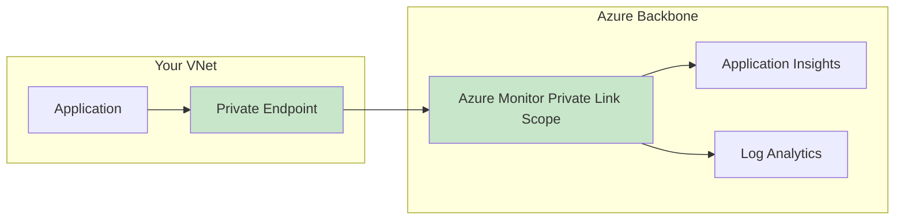

### Configuring Private Link

1. Create Azure Monitor Private Link Scope (AMPLS)
2. Add Application Insights and Log Analytics resources to AMPLS
3. Create Private Endpoint in your VNet
4. Configure DNS resolution

### Data Privacy

```csharp
// Disable IP collection (default in recent SDKs)
builder.Services.AddApplicationInsightsTelemetry(options =>
{
    options.EnableAdaptiveSampling = true;
});

// Use telemetry initializer to remove sensitive data
builder.Services.AddSingleton<ITelemetryInitializer, PrivacyTelemetryInitializer>();

public class PrivacyTelemetryInitializer : ITelemetryInitializer
{
    public void Initialize(ITelemetry telemetry)
    {
        // Remove or hash sensitive properties
        if (telemetry is ISupportProperties propTelemetry)
        {
            propTelemetry.Properties.Remove("user_email");
        }
    }
}
```

---

## Well-Architected Framework Alignment

### Reliability

| Recommendation | Benefit |
|----------------|---------|
| One App Insights per workload per environment | Prevents telemetry mixing; isolated failure domains |
| Same region as Log Analytics | Reduces cross-region failure risk |
| Resilient workspace design | Continuous monitoring during failures |
| Infrastructure as Code | Quick recovery of dashboards, alerts, queries |
| Conduct failure-mode analysis for monitoring outages | Define app behavior if the ingestion endpoint is unreachable at boot or runtime |
| Dedicated cluster (customer-managed keys, commitment tier) with availability zones / workspace replication | Cross-region resilience when telemetry availability within retention is business-critical |

### Security

| Recommendation | Benefit |
|----------------|---------|
| Use managed identities | No credential management |
| Implement Private Link | Network isolation |
| Enable customer-managed keys | Control over encryption |
| Don't store PII | Compliance with GDPR, etc. |
| Use connection strings (not instrumentation keys) | Reliable ingestion; regional endpoints; no global-endpoint dependency |
| Define a personal-data management strategy; keep IP collection off by default | Reduces personal data, but telemetry can still contain PII via user IDs, URLs, custom properties, and exception payloads |

### Cost Optimization

| Recommendation | Benefit |
|----------------|---------|
| Configure appropriate sampling | Reduced data volume |
| Set daily caps | Prevent cost overruns |
| Use Basic Logs for high-volume tables | Lower ingestion cost |
| Disable unnecessary collection modules | Eliminate waste |

### Operational Excellence

| Recommendation | Benefit |
|----------------|---------|
| Keep SDKs up to date | Security patches, bug fixes |
| Use autoinstrumentation when possible | Reduced maintenance |
| Implement availability tests | Proactive monitoring |
| Configure meaningful alerts | Actionable notifications |
| Use release annotations and work-item integration | Correlate deployments with telemetry; create work items with embedded App Insights data |
| Adopt the OpenTelemetry Distro over the classic SDK | Avoids a future forced migration from the classic API |

### Performance Efficiency

| Recommendation | Benefit |
|----------------|---------|
| Deploy in same region as workload | Reduced latency |
| Configure appropriate profiling frequency | Minimize overhead |
| Use preaggregated metrics | Efficient querying |

### Governance (Azure Policy and Advisor)

| Control | Benefit |
|---------|---------|
| **Azure Policy** — enforce linking Application Insights to a Log Analytics workspace | Ensures logs are encrypted and centrally governed |
| **Azure Policy** — audit Application Insights that allow ingestion from public networks or from sources not authenticated by Microsoft Entra ID | Flags components not enforcing authenticated ingestion; pair with AMPLS/Private Link for network isolation |
| **Azure Policy** — auto-configure diagnostic settings | Consistent, automatic log collection across resources |
| **Azure Advisor** recommendations | Personalized best-practice guidance for your App Insights deployment |

---

## Production Readiness Checklist

### Pre-Launch Checklist

#### Infrastructure Setup
- [ ] Application Insights resource created (workspace-based)
- [ ] Log Analytics workspace configured in same region
- [ ] Connection string stored securely (Key Vault or environment variable)
- [ ] Private Link configured (if required)
- [ ] Daily cap configured appropriately

#### Instrumentation
- [ ] OpenTelemetry or SDK integrated correctly
- [ ] Cloud role name configured for each service
- [ ] Connection string validated
- [ ] Test telemetry flowing to Application Insights
- [ ] Client-side monitoring (JavaScript SDK) enabled for browser apps, if applicable
- [ ] Container/Kubernetes workloads instrumented (AKS autoinstrumentation or OpenTelemetry; Container Apps via OpenTelemetry)

#### Sampling & Data Management
- [ ] Sampling strategy defined and configured
- [ ] Health check endpoints excluded from telemetry
- [ ] Data retention policy configured
- [ ] Cost alerts configured

#### Alerting
- [ ] Availability tests configured
- [ ] Metric alerts for key SLIs (error rate, latency)
- [ ] Smart Detection reviewed and configured
- [ ] Action groups configured with appropriate notifications

#### Distributed Tracing
- [ ] All services instrumented
- [ ] Cross-service correlation validated
- [ ] Application Map shows correct topology
- [ ] Transaction search returns correlated traces

#### Security
- [ ] No sensitive data in telemetry
- [ ] IP collection disabled (if required)
- [ ] RBAC configured for Application Insights access
- [ ] Diagnostic settings enabled for audit logs

#### Operational Readiness
- [ ] Dashboards created for key metrics
- [ ] Runbooks documented for common issues
- [ ] On-call team trained on Application Insights
- [ ] Workbooks created for incident investigation

### Post-Launch Validation

- [ ] Verify telemetry volume is within expectations
- [ ] Confirm sampling is working correctly
- [ ] Validate alerts fire correctly
- [ ] Test incident investigation workflow
- [ ] Review cost after first billing cycle

### Ongoing Maintenance

| Task | Frequency |
|------|-----------|
| Review and update SDK versions | Quarterly |
| Analyze cost trends | Monthly |
| Review Smart Detection findings | Weekly |
| Update dashboards and workbooks | As needed |
| Test availability test alerts | Monthly |
| Review data retention settings | Quarterly |

---

## FAQ: IIS Auto-Instrumentation and Operations

This section addresses common operational questions about the **Application Insights Agent** (formerly *Status Monitor v2*) — the codeless auto-instrumentation used for **.NET Framework and .NET applications hosted on your own Windows/IIS servers** (on-premises or IaaS VMs). It is distinct from Azure App Service codeless attach and from the OpenTelemetry Distro.

### How IIS auto-instrumentation works

The Application Insights Agent is delivered as the `Az.ApplicationMonitor` PowerShell module. When enabled, it attaches to IIS worker processes (`w3wp.exe`) **without any code change or redeploy** using two mechanisms:

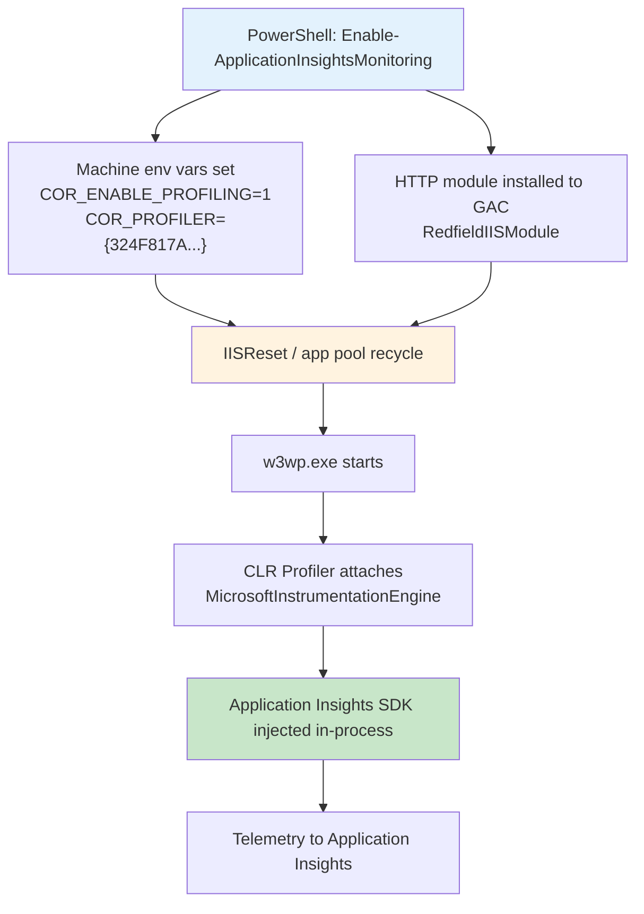

Because the profiler only attaches when a worker process **starts**, and the injected SDK only initializes once the application **receives its first request**, both enablement and troubleshooting depend on process lifecycle events.

> **Strategic recommendation**: The codeless Agent (v1.x) is intentionally limited — it does not expose advanced SDK configuration and does not instrument some IIS topologies (see below). For new or actively maintained applications, migrate to the **[Azure Monitor OpenTelemetry Distro](#opentelemetry-instrumentation-recommended)**, which gives you full control over sampling, filtering, and dependency collection. The classic Application Insights SDK is now legacy (superseded by OpenTelemetry) and should be treated only as a short-term bridge, not a strategic target. Use the Agent primarily for legacy apps you cannot recompile.

---

### Q1. Why does the agent lose heartbeat / show intermittent stability?

**Heartbeat** is a periodic property (surfaced as a custom metric/dimension) emitted by the injected `WindowsServer` telemetry module. Losing heartbeat almost always means the **worker process stopped emitting telemetry**, not that the network dropped. The most common causes on IIS are:

| Cause | Explanation | Mitigation |
|-------|-------------|------------|
| **App pool idle time-out** | IIS stops the worker process after inactivity (**default 20 minutes**). No process = no heartbeat until the next request restarts it. | Set the app pool **Idle Time-out** to `0` and **Start Mode** to `AlwaysRunning`; use Application Initialization / preload. |
| **App pool recycling** | Scheduled recycles (default every 29 hours) or memory-limit recycles restart `w3wp.exe`, briefly interrupting telemetry. | Align recycle schedule with low-traffic windows; expect short gaps. |
| **Profiler failed to re-attach** | After a recycle, the CLR profiler must re-attach. A DLL conflict or missing env var can leave the new process uninstrumented (see [Q3](#q3-why-do-some-servers-report-no-data-dll-loading-problem)). | Run `Get-ApplicationInsightsMonitoringStatus -InspectProcess` after a recycle. |
| **Multiple instances / load balancing** | Heartbeat is per role instance. One quiet instance can look like "lost heartbeat" when it is simply idle. | Filter heartbeat queries by `AppRoleInstance` (the `App*` Log Analytics tables use `AppRoleInstance`; the classic schema uses `cloud_RoleInstance`). |

> **Important**: Heartbeat is **not affected by sampling** — sampling drops requests/dependencies/traces, but the heartbeat metric is preserved. If heartbeat disappears, investigate the process lifecycle, not sampling.

**Diagnostic query** (gaps per instance):

```kusto
AppMetrics
| where TimeGenerated > ago(6h)
| where Name == "HeartbeatState"
| summarize LastSeen = max(TimeGenerated) by AppRoleInstance
| extend MinutesSinceHeartbeat = datetime_diff('minute', now(), LastSeen)
| order by MinutesSinceHeartbeat desc
```

If a truly stable, always-on signal is required regardless of app pool state, complement the agent with an external **[availability test](#availability-tests)** rather than relying on heartbeat.

---

### Q2. How do I enable/disable the agent, and what is the impact of an IIS restart?

Enablement and disablement are performed with the `Az.ApplicationMonitor` cmdlets from an **elevated PowerShell 5.1** session:

```powershell
# Install the module (once per server)
Install-Module -Name Az.ApplicationMonitor -AllowPrerelease -AcceptLicense

# Enable monitoring for all IIS apps on the server
Enable-ApplicationInsightsMonitoring -ConnectionString "InstrumentationKey=xxx;IngestionEndpoint=https://xxx.in.applicationinsights.azure.com/"

# Check status (per process)
Get-ApplicationInsightsMonitoringStatus -InspectProcess

# Disable monitoring
Disable-ApplicationInsightsMonitoring
```

**Impact of IIS restart:**

| Action | Requires restart? | Why |
|--------|-------------------|-----|
| **Enabling** the agent | Yes — an `iisreset` (or app pool recycle) is needed | The CLR profiler only attaches when `w3wp.exe` **starts**; machine-level environment variables are read at process start. |
| **Disabling** the agent | Yes — recycle to fully detach | The profiler stays attached in already-running processes until they restart. |
| **Changing connection string** | Yes | Re-read at process start. |
| **Application redeploy** | No extra restart needed | The agent re-attaches automatically to the new process (codeless — no app change). |

**Key points for the customer:**

- Enabling/disabling is **codeless**: no application redeploy, no `web.config` change in your project.
- Every enable/disable/config change implies a **brief interruption** during the `iisreset` or app pool recycle — schedule it in a maintenance window.
- Use a **rolling approach** in a web farm: recycle one node at a time to avoid a full outage.
- `Enable-InstrumentationEngine` (see [Q4](#q4-why-is-sql-query-information-collected-in-some-cases-but-not-others)) also requires a restart to take effect.

---

### Q3. Why do some servers report no data (DLL loading problem)?

When one server sends telemetry and an identically configured server does not, the profiler on the failing server is being **blocked from attaching or injecting the HTTP module**. The documented root causes are:

| Root cause | Symptom | Fix |
|------------|---------|-----|
| **Conflicting DLLs in the app's `bin` folder** | ETW log shows `Found 'System.Diagnostics.DiagnosticSource...' assembly, skipping attaching redfield binaries`. | Remove `Microsoft.ApplicationInsights.dll`, `Microsoft.AspNet.TelemetryCorrelation.dll`, and `System.Diagnostics.DiagnosticSource.dll` if the app doesn't actually use them (they ship in some Visual Studio templates). If the app *does* use the SDK, don't also use codeless attach. |
| **IIS shared configuration** | HTTP module cannot be injected across the shared config; no request telemetry. | Run `Enable-ApplicationInsightsMonitoring` on **each** web server (installs the DLL into each server's GAC), then add the `ManagedHttpModuleHelper` module to `ApplicationHost.config`. |
| **IIS nested applications** | Child/nested apps not instrumented (Agent v1.0 limitation). | Restructure or instrument with the SDK/OpenTelemetry. |
| **Classic pipeline mode app pool** | Apps in **Classic** managed pipeline mode are not instrumented. | Switch the app pool to **Integrated** pipeline mode. |
| **PowerShell 6/7 used** | Module fails or behaves unexpectedly. | Use **PowerShell 5.1** — the module is not compatible with PowerShell 6/7. |
| **App never received a request** | Runtime status never initializes. | Browse the app to warm it up, then re-check status. |

**Verification workflow on a "no data" server:**

```powershell
# 1. Confirm the profiler DLLs are loaded (expect at least 12 DLLs when healthy)
Get-ApplicationInsightsMonitoringStatus -InspectProcess

# 2. Confirm the profiler environment variables are set on the worker process
(Get-Process -Id <w3wp-pid>).StartInfo.EnvironmentVariables
# Expect: COR_ENABLE_PROFILING=1, COR_PROFILER={324F817A-7420-4E6D-B3C1-143FBED6D855}, etc.
```

You can also use Sysinternals (`Handle.exe`, `ListDLLs.exe`) or collect ETW logs with **PerfView** (do an `iisreset /stop`, start collection, `iisreset /start`, load the app, stop collection) to confirm whether the redfield binaries attached.

---

### Q4. Why is SQL query information collected in some cases but not others?

This is expected behavior driven by **two independent settings**:

1. **Server and database name are *always* collected** for SQL dependencies — this is the dependency `target` and `name`.
2. **The full SQL command text is *not* collected by default.** Capturing the actual query text requires the **Instrumentation Engine** to be enabled:

```powershell
# Enable full SQL command text capture for the codeless agent
Enable-InstrumentationEngine
# Requires an IISReset / app pool recycle to take effect
```

So the pattern the customer observes — *"sometimes the SQL query shows, sometimes it doesn't"* — usually comes down to:

| Factor | Query text captured? |
|--------|----------------------|
| Instrumentation Engine enabled | Yes — full command text in the dependency `data` field |
| Instrumentation Engine **not** enabled | No — only server + database name |
| Client is `System.Data.SqlClient` / `Microsoft.Data.SqlClient` | Supported |
| Other data-access stacks (some ORMs, non-SQL-Server providers) | May not surface full text |
| Stored procedure calls | Procedure **name** captured; parameter values are not |

> **Security note**: Full SQL text can contain sensitive data embedded in queries. Enable it deliberately, and avoid it where PII/PHI could appear inline. For code-based instrumentation, the equivalent switch is `enableSqlCommandTextInstrumentation` (OpenTelemetry / SDK / Azure Functions `host.json`).

**Check what you're actually capturing:**

```kusto
AppDependencies
| where TimeGenerated > ago(1h)
| where DependencyType == "SQL"
| project TimeGenerated, Target, Name, Data, Success, ResultCode
| take 50
```

If `Data` only shows a server/database and `Name` a table or procedure — but never the full statement — the Instrumentation Engine is not enabled.

---

### Q5. How do I manage sampling with IIS auto-instrumentation?

The injected .NET Framework SDK enables **adaptive sampling by default**. The default target is approximately five telemetry items per second per IIS worker process. The retained percentage changes with load and is calculated independently on each server instance, so different `cloud_RoleInstance` values can show different retention rates.

The classic ASP.NET SDK defaults used by the injected agent are approximately:

| Setting | Default |
|---------|---------|
| Initial sampling percentage | 100% |
| Maximum telemetry items per second | 5 |
| Evaluation interval | 15 seconds |
| Minimum sampling percentage | 0.1% |
| Maximum sampling percentage | 100% |
| Sampling percentage decrease timeout | 2 minutes |
| Sampling percentage increase timeout | 15 minutes |
| Moving average ratio | 0.25 |

Exact behavior can vary with the agent and injected SDK version. Recent SDK configurations can use separate adaptive processors for event telemetry and other sampled telemetry types. Metrics, custom metrics, and performance counters are not sampled.

> [!IMPORTANT]
> Setting **Data Sampling** to 100% under **Usage and estimated costs** controls ingestion sampling only. It does not disable adaptive sampling in the injected SDK. If the ingestion endpoint receives telemetry already marked as sampled, it does not sample that telemetry a second time. The portal can therefore show 100% while Search still displays a sampling warning.

Use `itemCount` to verify the effective sampling rate. A retained item with `itemCount > 1` represents multiple original telemetry items. This query identifies differences by role instance, telemetry type, and SDK version:

```kusto
union requests, dependencies, pageViews, browserTimings, exceptions, traces
| where timestamp > ago(1d)
| where isnotempty(cloud_RoleInstance)
| summarize
  StoredRecords = count(),
  EstimatedRecords = sum(itemCount),
  SampledRecords = countif(itemCount > 1),
  RetainedPercentage = round(100.0 * count() / sum(itemCount), 2)
  by cloud_RoleInstance, itemType, sdkVersion
| where RetainedPercentage < 99
| order by RetainedPercentage asc
```

Variation between instances or over time is characteristic of adaptive sampling. A stable configured percentage across sources is more characteristic of fixed-rate or ingestion sampling, although `itemCount` alone does not identify which layer sampled the telemetry.

The codeless Agent v1.x does not expose the injected SDK's `ApplicationInsights.config`, so it does not provide a supported switch to disable or retune this adaptive sampler.

Your options, in order of preference:

| Option | Where it runs | Notes |
|--------|---------------|-------|
| Keep the codeless adaptive default | In-process | Reduces source traffic automatically, but provides no supported tuning control through the agent. |
| Configure ingestion sampling | Application Insights service | Applies only to telemetry not already sampled by the SDK. It cannot restore telemetry dropped by adaptive sampling. |
| Set a daily cap | Application Insights service | Safety net against cost spikes; causes data loss when hit (see [Cost Optimization](#cost-optimization)). |
| Move to OpenTelemetry or code-based SDK instrumentation | In-process | Provides explicit, trace-consistent sampling control. See [Sampling Strategies](#sampling-strategies). |

> [!TIP]
> If you require 100% retention, per-endpoint exclusions, or a deterministic rate, migrate the workload to the Azure Monitor OpenTelemetry Distro and configure sampling explicitly. Ingestion sampling cannot override source-side adaptive sampling.

Refer to the main [Sampling Strategies](#sampling-strategies) section for the full sampling model, decision matrix, and code samples.

---

### Q6. What is the relationship between the "error content" and an encountered error (e.g., HTTP 500)?

An HTTP 500 seen by the user maps to **two correlated but distinct telemetry items**:

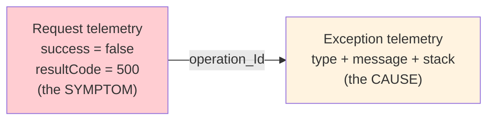

| Telemetry | Table | Represents |
|-----------|-------|------------|
| **Request** with `resultCode = 500`, `success = false` | `AppRequests` | The *symptom* — the failed HTTP response the client received. |
| **Exception** (type, message, stack trace) | `AppExceptions` | The *cause* — the unhandled exception, if one was thrown. |

They are joined by the **operation ID** (`OperationId` in the `App*` Log Analytics tables; `operation_Id` in the classic Application Insights schema and portal transaction view). In the portal, open the **Failures** view → select the failing operation → drill into a sample → the end-to-end transaction shows the linked exception and stack.

**Important caveats the customer should understand:**

- **Not every HTTP 500 has an exception.** If the application returns `500` explicitly (e.g., a controller sets the status code) or **catches and swallows** the exception, there is a failed request but **no** correlated `AppExceptions` record. In that case, the "error content" must come from your own trace/log statements (`AppTraces`), not from auto-collected exceptions.
- The codeless agent auto-collects **unhandled** exceptions. First-chance/handled exceptions need code-level instrumentation or **[Snapshot Debugger](#snapshot-debugger)**.
- `resultCode` is the HTTP status; the exception `type`/`message`/stack is the diagnostic detail.

**Join symptom to cause with KQL:**

```kusto
AppRequests
| where TimeGenerated > ago(1h) and ResultCode == "500"
| join kind=leftouter (
    AppExceptions
    | where TimeGenerated > ago(1h)
    | project OperationId, ExceptionType, OuterMessage, ProblemId
) on $left.OperationId == $right.OperationId
| project TimeGenerated, Name, ResultCode, ExceptionType, OuterMessage, OperationId
| order by TimeGenerated desc
```

Rows with a null `ExceptionType` are the "500 without a captured exception" case — investigate application logging for those.

---

### Q7. What does the "Usage" pane show, and why is it sometimes empty?

The **Usage** experiences answer *"how are people using the application?"* rather than *"is it healthy?"*:

| Usage experience | Answers |
|------------------|---------|
| **Users / Sessions / Events** | How many unique users and sessions, and which events fire |
| **Funnels** | Where users drop off in a multi-step flow |
| **User Flows** | What users do before/after a given event |
| **Retention** | Do users come back over time |
| **Cohorts** | Reusable groups of users/events for analysis |
| **Impact** | How load times/dimensions affect conversion |

**Why Usage is often empty for IIS server-only monitoring:** the Usage pane is built primarily from **page views** and **custom events**, and from the **anonymous user ID / session ID** that the **[JavaScript (Browser) SDK](#instrumentation-methods)** sets client-side. Codeless IIS auto-instrumentation only collects **server-side** telemetry (requests, dependencies, exceptions) — it does **not** produce page views, users, or sessions. As a result:

| Setup | Usage pane data |
|-------|-----------------|
| Server-side auto-instrumentation only | Sparse — no users/sessions/page views |
| + JavaScript SDK on the browser pages | Full Usage analytics (users, sessions, funnels, flows) |
| + `TrackEvent` custom events (server or client) | Business events appear in Users/Events/Funnels |

**To light up Usage:** add the **Application Insights JavaScript SDK** to your web pages (or enable client-side monitoring), and instrument meaningful business actions with **custom events**. For a purely server-side workload with no browser front end, Usage is not the right tool — use the **Performance**, **Failures**, and **Metrics** experiences instead.

---

### Q8. Agent vs. SDK vs. OpenTelemetry — which should we use on IIS?

| Approach | Code change | Sampling control | Full SQL text | Best for |
|----------|-------------|------------------|---------------|----------|
| **Application Insights Agent** (codeless) | None | Adaptive sampling is on by default; ingestion sampling is configurable, but the adaptive sampler is not | Requires `Enable-InstrumentationEngine` | Legacy apps you can't recompile; quick coverage |
| **Classic Application Insights SDK** | Moderate | Full (in `ApplicationInsights.config`) | Configurable | **Legacy** — interim option only; plan OpenTelemetry migration |
| **Azure Monitor OpenTelemetry Distro** | Minimal | Full (fixed/rate-limited/overrides) | Configurable | New development; strategic, vendor-neutral standard |

> **Direction of travel**: OpenTelemetry is the recommended long-term standard for Azure Monitor. The classic Application Insights SDK is superseded by OpenTelemetry and is on a retirement path — see the [migration guide](https://learn.microsoft.com/azure/azure-monitor/app/migrate-to-opentelemetry). Treat both the codeless Agent and the classic SDK as bridges for legacy IIS workloads, and plan migration of actively developed apps to the OpenTelemetry Distro to gain sampling control, richer configuration, and future support.

---

### Q9. How do I verify that the monitoring agents (Azure Monitor Agent and the IIS auto-instrumentation agent) are healthy?

These are **two independent agents** verified in different ways — one can be healthy while the other is not.

**Azure Monitor Agent (AMA)** — the OS-level agent that collects performance counters, event logs, and syslog into a Log Analytics workspace. Each connected machine sends a periodic record to the **`Heartbeat`** table:

```kusto
// Latest heartbeat per machine (OS / AMA agent health)
Heartbeat
| where TimeGenerated > ago(1h)
| summarize LastHeartbeat = max(TimeGenerated) by Computer, _ResourceId
| extend MinutesSince = datetime_diff('minute', now(), LastHeartbeat)
| order by MinutesSince desc
```

You can also check the agent from the portal (**VM → Monitoring → Agents**, or the Arc agent for hybrid servers). Allow for **ingestion latency** — heartbeat records can arrive a few minutes late.

**Application Insights IIS agent** — verified both on the server and in telemetry:

```powershell
# On the server: are the profiler DLLs loaded and env vars set? (expect >=12 DLLs)
Get-ApplicationInsightsMonitoringStatus -InspectProcess
```

```kusto
// In telemetry: is each role instance still sending heartbeat?
AppMetrics
| where TimeGenerated > ago(1h) and Name == "HeartbeatState"
| summarize LastSeen = max(TimeGenerated) by AppRoleInstance
| extend MinutesSince = datetime_diff('minute', now(), LastSeen)
| order by MinutesSince desc
```

| Agent | Health signal | Where to check |
|-------|---------------|----------------|
| Azure Monitor Agent | `Heartbeat` table (`Computer`) | Log Analytics / VM Agents blade |
| App Insights IIS agent | `Get-ApplicationInsightsMonitoringStatus`; request + `HeartbeatState` telemetry | Server (PowerShell) + Application Insights logs |

---

### Q10. Which scenarios cause telemetry gaps, and how do I tell them apart from an agent failure?

Most "lost heartbeat" reports are **expected lifecycle events**, not failures:

| Scenario | Effect on telemetry | Expected? |
|----------|---------------------|-----------|
| App pool idle time-out (default 20 min) | Worker process stops; no telemetry until next request | Yes — set idle time-out `0` / AlwaysRunning |
| App pool / scheduled recycle | Brief gap while `w3wp.exe` restarts | Yes |
| Load-balancer draining / rolling deployment | One node quiesced while others serve | Yes — filter by role instance |
| Autoscale in (scale-down) | Instance removed; its `AppRoleInstance` / `Computer` stops | Yes |
| OS patching / maintenance reboot | Whole server offline for the reboot window | Yes — schedule and expect the gap |
| VM deallocation / failover | Instance disappears or moves | Yes |
| High load / CPU pressure | Telemetry channel buffers can drop items; possible throttling | Partial loss under stress |
| Profiler failed to re-attach after restart | No telemetry from the new process | **No — investigate (see [Q3](#q3-why-do-some-servers-report-no-data-dll-loading-problem))** |

**How to tell them apart:** correlate the gap with the machine's power/agent state. A gap that lines up with a reboot, recycle, scale-in, or deployment is benign; a gap while the process is up and serving traffic is a real agent problem.

```kusto
// Machine heartbeat over time — line gaps up against your app telemetry gaps
Heartbeat
| where TimeGenerated > ago(6h)
| summarize Heartbeats = count() by bin(TimeGenerated, 5m), Computer
```

---

### Q11. How do I alert when a server or agent stops sending a heartbeat for more than 30 minutes?

**Machine / AMA agent — no heartbeat for 30 minutes** (log search alert on the `Heartbeat` table):

```kusto
Heartbeat
| where TimeGenerated > ago(1h)
| summarize LastHeartbeat = max(TimeGenerated) by Computer, _ResourceId
| where LastHeartbeat < ago(30m)
```

Configure the rule with an evaluation frequency of 5–10 minutes, firing when the query returns rows, and **split by `Computer`** (and `_ResourceId`) so each machine alerts independently.

**Application Insights IIS agent — role instance stopped:**

```kusto
AppMetrics
| where TimeGenerated > ago(1h) and Name == "HeartbeatState"
| summarize LastSeen = max(TimeGenerated) by AppRoleInstance
| where LastSeen < ago(30m)
```

Best practices:

- **Metric vs. log alert**: the workspace also exposes a near-real-time **Heartbeat metric**. Metric alerts are stateful and better at detecting the *absence* of data; log alerts are more flexible (KQL) but more latent. For missing-heartbeat detection, prefer the metric alert or size the log-alert window to absorb ingestion latency.
- To detect specifically whether an **Azure VM is running** (not just the agent), use the platform **VM availability** metric — it isn't subject to agent or ingestion latency.
- Set the evaluation window comfortably above your normal heartbeat interval + ingestion latency to avoid false positives.

---

### Q12. The agent stopped reporting entirely — how do I do a clean uninstall and reinstall?

Occasionally the IIS agent reaches a state where a restart doesn't recover it and a clean reinstall is required. Do this in a maintenance window (it recycles IIS):

```powershell
# 1. Disable monitoring (detaches the profiler / removes the HTTP module)
Disable-ApplicationInsightsMonitoring

# 2. Recycle so running worker processes drop the profiler
iisreset

# 3. Remove the module
Uninstall-Module -Name Az.ApplicationMonitor -AllVersions
```

Then clear leftovers before reinstalling:

- **Residual machine-level profiler environment variables** (for example `COR_ENABLE_PROFILING`, `COR_PROFILER`, `MicrosoftInstrumentationEngine_*`). These are stored in the registry as service `Environment` entries (for the `W3SVC` / `WAS` services) and/or machine environment — remove any that remain, then re-check the worker process:

  ```powershell
  Get-ApplicationInsightsMonitoringStatus -InspectProcess
  ```

- **Leave the agent's GAC module in place.** `Disable-ApplicationInsightsMonitoring` intentionally does **not** remove it, because removing the module from the GAC can cause IIS instabilities — a reinstall reuses it safely.
- If a web farm **shared configuration** was used, remove the `ManagedHttpModuleHelper` entry previously added to `ApplicationHost.config`.

Reinstall cleanly and verify:

```powershell
Install-Module -Name Az.ApplicationMonitor -AllowPrerelease -AcceptLicense
Enable-ApplicationInsightsMonitoring -ConnectionString "<your-connection-string>"
iisreset
Get-ApplicationInsightsMonitoringStatus -InspectProcess   # expect >=12 DLLs loaded
```

> **Reboot as a last resort**: if profiler environment variables or locked DLLs persist, a full server reboot guarantees no worker process is still holding the old binaries before you re-enable. In a web farm, roll through one node at a time.

---

### Q13. Why do I sometimes see a low-level TCP dependency instead of the SQL query, and how do I identify the data-access technology?

This extends [Q4](#q4-why-is-sql-query-information-collected-in-some-cases-but-not-others). The dependency **`DependencyType`** field tells you *how* the call was captured:

| What you see | Meaning |
|--------------|---------|
| `DependencyType == "SQL"` with a `Data` value | Captured through the SQL client (`System.Data.SqlClient` / `Microsoft.Data.SqlClient`, or JDBC on Java) — full command text when the Instrumentation Engine / `enableSqlCommandTextInstrumentation` is on |
| `DependencyType == "SQL"` but `Data` empty (only `Target` / `Name`) | SQL client recognized, but full text not enabled — server/database only |
| A generic `tcp` (or HTTP) dependency to a database host:port | The specific driver wasn't recognized by the instrumentation, so the call was captured at the socket level — you get the target host/port, not the query |
| No dependency at all | The data-access library isn't auto-instrumented |

**Why "sometimes the query, sometimes just TCP":** Entity Framework Core, EF6, Dapper, and raw ADO.NET all sit on top of SqlClient, so they normally surface as `SQL` dependencies. Calls that bypass the recognized client (some ORMs, non-SQL-Server providers, or custom drivers) fall back to a lower-level `tcp` dependency with only the endpoint.

**Identifying the ORM/technology:** the telemetry records the **underlying database client** (SqlClient / JDBC), **not** the ORM — Application Insights does not label a dependency as "Entity Framework" vs "Dapper" vs "Hibernate." To determine which layer issued the call:

- Inspect the **call stack** via **[Snapshot Debugger](#snapshot-debugger)** or the **[.NET Profiler](#net-profiler)** on a sample.
- Correlate the dependency with its parent **operation/request** and the code path.
- On Java, a `SQL` dependency captured via JDBC sits beneath Hibernate/JPA.

```kusto
// See how each database call was captured
AppDependencies
| where TimeGenerated > ago(1h)
| extend HasCommandText = isnotempty(Data)
| summarize calls = count() by DependencyType, HasCommandText
| order by calls desc
```

---

### Q14. How do I collapse similar log rows in Log Analytics to reduce noise?

Sampling reduces what is *ingested*; when you're *analyzing* high-volume telemetry, group similar rows with KQL instead of scrolling thousands of near-duplicates:

```kusto
// Group exceptions to see patterns instead of individual rows
AppExceptions
| where TimeGenerated > ago(24h)
| summarize Count = count() by ProblemId, ExceptionType, OuterMessage
| order by Count desc
```

```kusto
// Normalize noisy messages that differ only by an ID, then group
AppTraces
| where TimeGenerated > ago(24h)
| extend Normalized = replace_regex(Message, @"\d+", "N")
| summarize Count = count() by Normalized
| order by Count desc
```

- Use `summarize count() by ...` on low-cardinality fields (`ProblemId`, `OperationName`, `ResultCode`, `AppRoleName`).
- Use `replace_regex()` (or `parse`) to strip IDs/GUIDs out of messages so near-duplicates group together.
- The **Failures** view already groups by `ProblemId` automatically — start there before writing KQL.

---

### Q15. How do I target specific servers or roles in Search and Logs (Cloud Role Name / Role Instance)?

Every telemetry item carries the **Cloud Role Name** (the service/component) and **Cloud Role Instance** (the specific server/pod). Use them to narrow an investigation to one component or one server.

Do not use Azure Monitor Agent (AMA) configuration to change these values. AMA is the operating system telemetry agent. The codeless IIS Application Insights Agent is a separate APM agent, and its documented site-routing configuration selects the destination Application Insights resource rather than a Cloud Role Name. See [Cloud Role Name Configuration](#cloud-role-name-configuration) for the supported alternatives and the IIS codeless limitation.

| Concept | App Insights field | `App*` Log Analytics column |
|---------|-------------------|-----------------------------|
| Component / service | `cloud_RoleName` | `AppRoleName` |
| Server / instance | `cloud_RoleInstance` | `AppRoleInstance` |

**In the Search / Transaction search UI**: add a filter on **Cloud role name** or **Cloud role instance** (or type the server name in the search box).

**In Logs (KQL):**

```kusto
// All failures from a single component on a single server
AppRequests
| where TimeGenerated > ago(1h)
| where AppRoleName == "orders-api" and AppRoleInstance == "web01"
| where Success == false
| project TimeGenerated, Name, ResultCode, OperationId, AppRoleInstance
```

```kusto
// Compare request volume and health across instances of one role
AppRequests
| where TimeGenerated > ago(1h) and AppRoleName == "orders-api"
| summarize Requests = count(), Failures = countif(Success == false) by AppRoleInstance
| order by Failures desc
```

Use this inventory query to confirm the role values currently arriving in the workspace:

```kusto
union AppRequests, AppDependencies, AppExceptions, AppTraces
| where TimeGenerated > ago(1h)
| summarize TelemetryItems = count() by AppRoleName, AppRoleInstance
| order by TelemetryItems desc
```

Set a distinct **Cloud Role Name** per service where the instrumentation method supports it. Without distinct role names, components that share an Application Insights resource can collapse into one Application Map node.

---

## References

### Official Microsoft Documentation

- [Application Insights Overview](https://learn.microsoft.com/en-us/azure/azure-monitor/app/app-insights-overview)
- [Well-Architected Framework - Application Insights](https://learn.microsoft.com/en-us/azure/well-architected/service-guides/application-insights)
- [OpenTelemetry Configuration](https://learn.microsoft.com/en-us/azure/azure-monitor/app/opentelemetry-configuration)
- [Sampling in Application Insights](https://learn.microsoft.com/en-us/azure/azure-monitor/app/opentelemetry-sampling)
- [Sampling in Application Insights (classic API)](https://learn.microsoft.com/en-us/azure/azure-monitor/app/sampling-classic-api)
- [Azure Monitor Pricing](https://azure.microsoft.com/pricing/details/monitor/)
- [Application Insights Service Limits](https://learn.microsoft.com/en-us/azure/azure-monitor/fundamentals/service-limits#application-insights)

### IIS Auto-Instrumentation (Application Insights Agent)

- [Deploy Azure Monitor Application Insights Agent for on-premises servers](https://learn.microsoft.com/en-us/azure/azure-monitor/app/application-insights-asp-net-agent)
- [Troubleshoot the Application Insights Agent (formerly Status Monitor v2)](https://learn.microsoft.com/troubleshoot/azure/azure-monitor/app-insights/agent/status-monitor-v2-troubleshoot)
- [Application Insights Agent API reference](https://learn.microsoft.com/en-us/azure/azure-monitor/app/status-monitor-v2-api-reference)
- [Troubleshoot Application Insights autoinstrumentation](https://learn.microsoft.com/troubleshoot/azure/azure-monitor/app-insights/telemetry/auto-instrumentation-troubleshoot)
- [Dependency tracking and advanced SQL tracking](https://learn.microsoft.com/en-us/azure/azure-monitor/app/asp-net-dependencies#advanced-sql-tracking-to-get-full-sql-query)
- [Usage analysis with Application Insights](https://learn.microsoft.com/en-us/azure/azure-monitor/app/usage)
- [Application Insights FAQ](https://learn.microsoft.com/azure/azure-monitor/app/application-insights-faq)

### Agent Health, Alerting, and Diagnostics

- [Azure Monitor Agent overview](https://learn.microsoft.com/en-us/azure/azure-monitor/agents/azure-monitor-agent-overview)
- [Queries for the Heartbeat table](https://learn.microsoft.com/en-us/azure/azure-monitor/reference/queries/heartbeat)
- [Monitor virtual machines with Azure Monitor: Alerts (agent heartbeat)](https://learn.microsoft.com/en-us/azure/azure-monitor/vm/monitor-virtual-machine-alerts)
- [Create a log search alert rule](https://learn.microsoft.com/en-us/azure/azure-monitor/alerts/alerts-create-log-alert-rule)
- [Application Insights dependency tracking and telemetry data model](https://learn.microsoft.com/en-us/azure/azure-monitor/app/data-model-complete)

### Client-Side and Autoinstrumentation

- [Application Insights JavaScript SDK (Real User Monitoring)](https://learn.microsoft.com/en-us/azure/azure-monitor/app/javascript-sdk)
- [Click Analytics Auto-Collection plug-in](https://learn.microsoft.com/en-us/azure/azure-monitor/app/javascript-feature-extensions)
- [Autoinstrumentation overview and support matrix](https://learn.microsoft.com/en-us/azure/azure-monitor/app/codeless-overview)

### Containers and Kubernetes

- [Kubernetes monitoring in Azure Monitor](https://learn.microsoft.com/en-us/azure/azure-monitor/containers/kubernetes-monitoring-overview)
- [Best practices for monitoring Kubernetes with Azure Monitor](https://learn.microsoft.com/en-us/azure/azure-monitor/containers/best-practices-containers)
- [Codeless monitoring for AKS with Application Insights](https://learn.microsoft.com/en-us/azure/azure-monitor/app/kubernetes-codeless)
- [Enable monitoring for Kubernetes clusters](https://learn.microsoft.com/en-us/azure/azure-monitor/containers/kubernetes-monitoring-enable)
- [Observability in Azure Container Apps](https://learn.microsoft.com/en-us/azure/container-apps/observability)

### Enterprise Architecture and Workspace Design

- [Azure Monitor enterprise monitoring architecture](https://learn.microsoft.com/en-us/azure/azure-monitor/fundamentals/enterprise-monitoring-architecture)
- [Azure Monitor data platform](https://learn.microsoft.com/en-us/azure/azure-monitor/fundamentals/data-platform)
- [Design a Log Analytics workspace architecture](https://learn.microsoft.com/en-us/azure/azure-monitor/logs/workspace-design)
- [Sample Microsoft Sentinel workspace designs](https://learn.microsoft.com/en-us/azure/sentinel/sample-workspace-designs)

### Cost and Ingestion

- [Troubleshoot high data ingestion in Application Insights](https://learn.microsoft.com/en-us/troubleshoot/azure/azure-monitor/app-insights/telemetry/troubleshoot-high-data-ingestion)

### GitHub Resources

- [Azure Monitor OpenTelemetry Distro for .NET](https://github.com/Azure/azure-sdk-for-net/tree/main/sdk/monitor/Azure.Monitor.OpenTelemetry.AspNetCore)
- [Azure Monitor OpenTelemetry for Node.js](https://github.com/Azure-Samples/azure-monitor-opentelemetry-node.js)
- [Application Insights Java Samples](https://github.com/Azure-Samples/ApplicationInsights-Java-Samples)
- [Azure Monitor OpenTelemetry for Python](https://github.com/Azure/azure-sdk-for-python/tree/main/sdk/monitor/azure-monitor-opentelemetry)

### Related Guides

- [Cost Optimization in Azure Monitor](https://learn.microsoft.com/en-us/azure/azure-monitor/fundamentals/best-practices-cost)
- [Azure Monitor Private Link](https://learn.microsoft.com/en-us/azure/azure-monitor/logs/private-link-security)
- [Distributed Tracing](https://learn.microsoft.com/en-us/azure/azure-monitor/app/distributed-trace-data)
- [.NET Profiler](https://learn.microsoft.com/en-us/azure/azure-monitor/profiler/profiler-overview)
- [Snapshot Debugger](https://learn.microsoft.com/en-us/azure/azure-monitor/snapshot-debugger/snapshot-debugger)
- [Daily Cap Configuration](https://learn.microsoft.com/en-us/azure/azure-monitor/logs/daily-cap)
- [Java Agent Configuration](https://learn.microsoft.com/en-us/azure/azure-monitor/app/java-standalone-config)
- [Smart Detection](https://learn.microsoft.com/en-us/azure/azure-monitor/alerts/proactive-diagnostics)

### Further Learning (Hands-On)

- [Training path: Create cloud-native apps with .NET and ASP.NET Core](https://learn.microsoft.com/en-us/training/paths/create-microservices-with-dotnet/)
- [Training module: Implement observability in a .NET cloud-native app with OpenTelemetry](https://learn.microsoft.com/en-us/training/modules/implement-observability-cloud-native-app-with-opentelemetry/)
- [Sample: eShopLite `dotnet-observability` (OpenTelemetry + Application Insights)](https://github.com/CalinL/mslearn-dotnet-cloudnative/tree/main/dotnet-observability/finished-files/eShopLite)
- [Sample: eShopOnAzure (eShop variant using Azure services)](https://github.com/Azure-Samples/eShopOnAzure)
