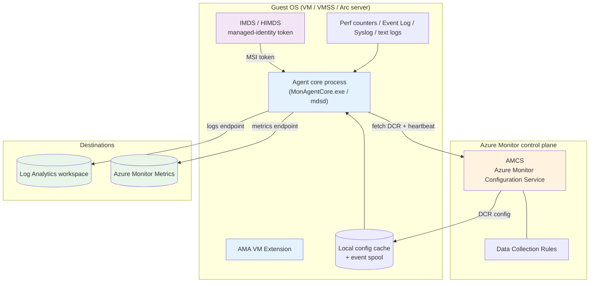
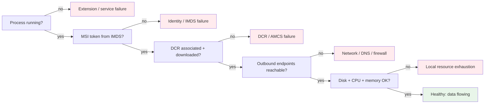
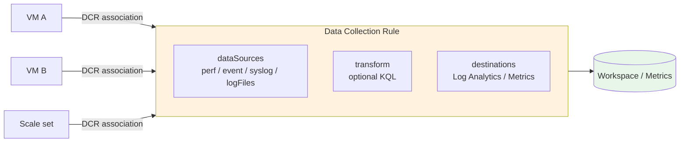
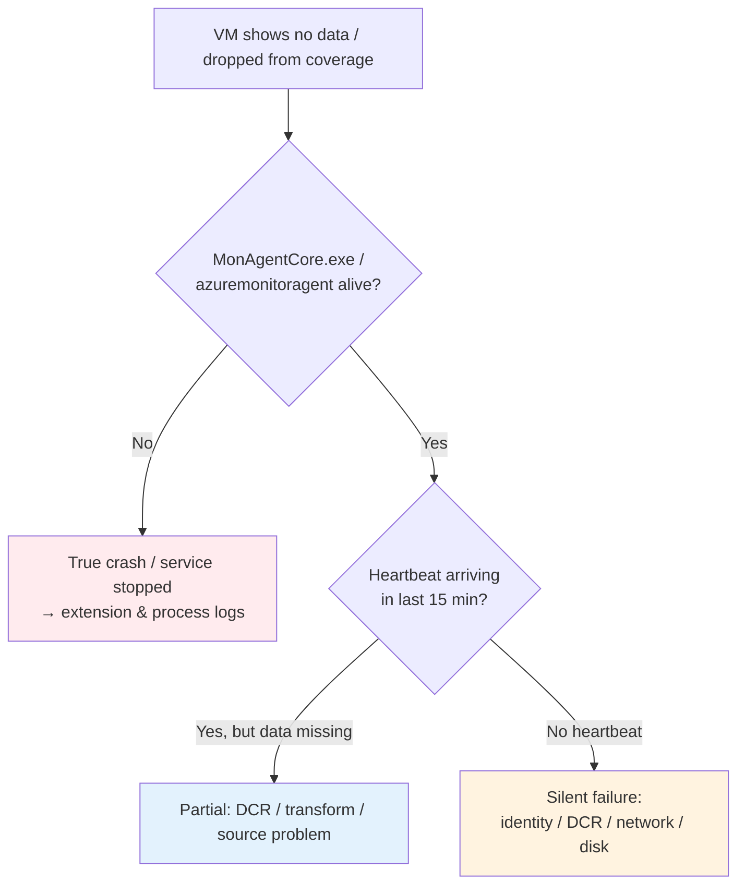

# Azure Monitor Agent (AMA) Comprehensive Guide

> **Level**: L300-400 Deep Dive | **Last Updated**: September 2026

## Table of Contents

1. [Overview](#overview)
2. [Where AMA Fits in Azure Monitor](#where-ama-fits-in-azure-monitor)
3. [Architecture and Data Flow](#architecture-and-data-flow)
4. [Agent Process Model](#agent-process-model)
5. [Data Collection Rules (DCR)](#data-collection-rules-dcr)
6. [Identity and Authentication](#identity-and-authentication)
7. [Installation and Lifecycle Management](#installation-and-lifecycle-management)
8. [Why AMA Stops Sending Data or Crashes](#why-ama-stops-sending-data-or-crashes)
9. [Failure Taxonomy and Root Causes](#failure-taxonomy-and-root-causes)
10. [Diagnostics: Windows](#diagnostics-windows)
11. [Diagnostics: Linux](#diagnostics-linux)
12. [Remediation Playbooks](#remediation-playbooks)
13. [Detecting Silent Failures and Telemetry Gaps](#detecting-silent-failures-and-telemetry-gaps)
14. [Health Monitoring and Alerting](#health-monitoring-and-alerting)
15. [Clean Uninstall and Reinstall](#clean-uninstall-and-reinstall)
16. [Well-Architected Framework Alignment](#well-architected-framework-alignment)
17. [Production Readiness Checklist](#production-readiness-checklist)
18. [FAQ: Agent Stops Reporting](#faq-agent-stops-reporting)
19. [References](#references)

---

## Overview

The **Azure Monitor Agent (AMA)** collects monitoring data from the **guest operating system** of Azure virtual machines, Virtual Machine Scale Sets, and hybrid machines (via Azure Arc), and delivers it to Azure Monitor. It is the single, supported successor to the legacy **Log Analytics agent (MMA/OMS)** and Telegraf/Diagnostics agents, which are retired.

Unlike Application Insights — which instruments *inside* your application process (APM) — AMA runs as an **OS-level extension** and has no visibility into application call stacks. The two are complementary: AMA answers "is the machine and OS healthy and reachable?" while Application Insights answers "is the application behaving correctly?"

### Key Capabilities

| Capability | Description |
|------------|-------------|
| **Guest OS telemetry** | Performance counters, Windows Event Logs, Linux Syslog, and text/JSON file logs |
| **Centralized configuration** | Collection is driven by **Data Collection Rules (DCRs)** — no per-machine config files to maintain |
| **Multi-destination routing** | Send the same source to multiple Log Analytics workspaces and/or Azure Monitor Metrics |
| **Ingestion-time transformations** | Filter, drop, or reshape data with KQL transforms in the DCR before it is billed |
| **Feature enablement** | Underpins VM Insights, Microsoft Sentinel, Microsoft Defender for Cloud, Change Tracking, and SQL Best Practices Assessment |
| **Hybrid reach** | Same agent and DCR model across Azure, other clouds, and on-premises via Azure Arc |

> **Tip**: There is **no charge for the agent itself**. You pay only for data ingestion and retention in the destination (Log Analytics workspace or Azure Monitor Metrics). Use ingestion-time transformations in the DCR to drop noise *before* it is billed.

---

## Where AMA Fits in Azure Monitor

AMA is one of several **data collection** methods feeding the broader Azure Monitor platform. It is specifically the collector for the **guest OS layer** of infrastructure telemetry.

| Layer | Typical collector | Store |
|-------|-------------------|-------|
| **Application (APM / traces)** | Application Insights SDK / autoinstrumentation | Log Analytics (`App*` tables) |
| **Guest OS (in-VM)** | **Azure Monitor Agent** | Log Analytics (`Perf`, `Event`, `Syslog`, `Heartbeat`, custom tables) + Azure Monitor Metrics |
| **Host / platform** | Azure platform (agentless) | Azure Monitor Metrics / Activity Log |
| **Container / Kubernetes** | AMA-based Container Insights + Managed Prometheus | Log Analytics + Azure Monitor workspace |

> **Key distinction**: AMA populates the `Heartbeat` table (`Category == "Azure Monitor Agent"`) — the single most important signal for answering *"is this VM still being monitored?"*. Application-layer heartbeats (App Insights `HeartbeatState`) are separate and can be healthy while the OS agent is dead, or vice versa.

---

## Architecture and Data Flow

AMA is deployed as a **VM extension** that pulls its configuration (DCRs) from a regional Azure control-plane service and then streams collected data to one or more destinations. Authentication to the control plane relies on the machine's **managed identity**, obtained through the **Instance Metadata Service (IMDS)** on Azure VMs or the **Hybrid IMDS (HIMDS)** on Arc-enabled servers.



### The Five Dependencies Every Healthy Agent Needs

For AMA to keep sending data, **all five** of the following must hold continuously. A break in any one produces a telemetry gap — and most "the agent crashed" reports are actually a break in one of dependencies 2–5, not the agent binary itself.

1. **Agent process running** — `MonAgentCore.exe` (Windows) / `azuremonitoragent` service (Linux) is alive.
2. **Managed identity token** — the agent can reach IMDS/HIMDS to obtain a Microsoft Entra token.
3. **DCR association + download** — the VM is associated with at least one DCR, and the agent can reach **AMCS** to download it.
4. **Outbound network path** — TLS 1.2+ to the AMCS control endpoint (`global.handler.control.monitor.azure.com`), the **logs ingestion endpoint** (`<workspace-id>.ods.opinsights.azure.com`, or the DCE `*.ingest.monitor.azure.com` under Private Link), and the metrics endpoint.
5. **Local resources** — enough disk for the config cache and event spool, and enough CPU/memory to process and upload.



---

## Agent Process Model

Understanding which processes must be alive is essential for diagnosing a "stopped" agent.

### Windows

| Component | What it is | Where |
|-----------|------------|-------|
| `AzureMonitorWindowsAgent` extension | Installs/updates binaries; reports provisioning status | **VM → Extensions + applications** |
| `MonAgentCore.exe` | Core agent process that collects and uploads | Task Manager / Services |
| `MetricsExtension.Native.exe` | Uploads guest metrics to Azure Monitor Metrics (Custom Metrics destination) | Task Manager |
| Data store | Config cache, tables, spool | `C:\WindowsAzure\Resources\AMADataStore.<vm-name>\` |
| Extension logs | Install/update diagnostics | `C:\WindowsAzure\Logs\Plugins\Microsoft.Azure.Monitor.AzureMonitorWindowsAgent\` |

> **Important**: An extension status of **"Provisioning succeeded"** means only that the package was downloaded and registered with the platform. It does **not** confirm that `MonAgentCore.exe` is running or healthy. Always verify the process **and** the `Heartbeat` table, not just the extension status.

### Linux

| Component | What it is | Where |
|-----------|------------|-------|
| `AzureMonitorLinuxAgent` extension | Installs/updates binaries; reports provisioning status | **VM → Extensions + applications** |
| `azuremonitoragent` service | systemd service running the `mdsd` core process | `systemctl status azuremonitoragent` |
| Config cache | Downloaded DCR chunks | `/etc/opt/microsoft/azuremonitoragent/config-cache/configchunks/` |
| Core logs | `mdsd.err`, `mdsd.warn`, `mdsd.info` | `/var/opt/microsoft/azuremonitoragent/log/` |
| Extension logs | Install/update diagnostics | `/var/log/azure/Microsoft.Azure.Monitor.AzureMonitorLinuxAgent/` |
| QoS file | 15-minute ingestion aggregations (drop tracking) | `/var/opt/microsoft/azuremonitoragent/log/mdsd.qos` |

On Linux, AMA runs its services under **local service accounts** (for example the `syslog` user for Syslog capture). Missing or misconfigured group membership — especially the `himds` group on Arc servers — is a common silent-failure cause (see [Failure Taxonomy](#failure-taxonomy-and-root-causes)).

---

## Data Collection Rules (DCR)

A **DCR** declares *what* to collect, *how* to transform it, and *where* to send it. The agent fetches associated DCRs from AMCS, caches them locally, and periodically checks for updates. **No DCR association = no data**, even with a perfectly healthy agent.



Design guidance:

- **Region alignment** — when the destination is a Log Analytics workspace, the DCR **should** be created in the **same region** as the workspace for data-residency and latency reasons. Cross-region DCRs do function, but co-location is the recommended default and avoids a potential source of confusion when data doesn't land.
- **Separate DCRs by concern** — split by data type (perf vs. security events vs. syslog) and by environment so you can associate the right subset per machine and change one without disturbing others.
- **Transform at ingestion** — drop verbose or sensitive rows in the DCR `transform` to cut cost and reduce PII before it is billed.
- **Association limits** — a single machine can be associated with multiple DCRs; the agent merges them. Keep the count reasonable and documented.

---

## Identity and Authentication

AMA authenticates to Azure using the machine's **managed identity**. This is the dependency most often responsible for an agent that "just stops."

| Environment | Identity source | Token service |
|-------------|-----------------|---------------|
| Azure VM / VMSS | System-assigned or user-assigned managed identity | **IMDS** (`169.254.169.254`) |
| Arc-enabled server | Arc-managed identity | **HIMDS** |

Failure modes tied to identity:

- **Managed identity disabled or removed** on the VM → the agent cannot mint a token → DCR download and uploads stop.
- **IMDS unreachable** — a local firewall rule, a misconfigured proxy that captures `169.254.169.254`, or a custom route table that blackholes the link-local address blocks token acquisition.
- **Arc `himds` group membership missing** (Linux) — produces `Failed to get MSI token from IMDS endpoint` in `mdsd.err`; add the `syslog` user to the `himds` group.
- **User-assigned identity with `built-in` settings mismatch** — for VMSS and some templates the identity must be explicitly referenced.

> **Tip**: On Azure VMs, `169.254.169.254` (IMDS) must remain directly reachable. Do **not** route link-local traffic through a proxy or NVA. This single misconfiguration silently kills AMA, VM Insights, and any other MSI-dependent extension.

---

## Installation and Lifecycle Management

Install and keep AMA current at scale using:

| Method | Best for |
|--------|----------|
| **Azure Policy** (DINE / built-in initiatives) | Fleet-wide enforcement with auto-remediation and DCR association |
| **VM extension** (CLI/PowerShell/ARM/Bicep/Terraform) | Individual machines or IaC pipelines |
| **VM Insights / Sentinel / Defender onboarding** | Enabled implicitly when you turn on those features |
| **Windows MSI client installer** | Air-gapped clouds and client OS where the extension isn't supported |

### Automatic Extension Upgrade

Enable **automatic extension upgrade** so patch/bug-fix releases roll out without manual work:

```azurecli
az vm extension set \
  --resource-group <rg> --vm-name <vm> \
  --name AzureMonitorWindowsAgent \
  --publisher Microsoft.Azure.Monitor \
  --enable-auto-upgrade true
```

> **Scale-set caveat**: On a VMSS with a **Manual** upgrade policy, enabling auto-upgrade updates the *model* but does not reach existing instances until you **apply the latest model** (`az vmss update-instances --instance-ids "*"`). Switch the policy to **Rolling** so future changes propagate automatically. Instances with *instance protection* set will not update until protection is cleared. Leaving instances pinned to an old, buggy agent build is a common cause of recurring crashes that "come back" after a fix was released.

---

## Why AMA Stops Sending Data or Crashes

This is the scenario most operators hit: a VM that was reporting suddenly shows **no heartbeat**, disappears from VM Insights/Sentinel/Defender coverage, and looks "unmonitored" — sometimes because the agent process genuinely crashed, but far more often because one of its runtime dependencies broke while the process kept running.

The critical insight: **"no data" and "agent crashed" are not the same thing.** Distinguish three states:



- **True crash** — the core process exited (out-of-memory kill, unhandled fault, a known agent version bug, disk full preventing startup). The extension may still report "Provisioning succeeded."
- **Silent failure** — the process is alive but cannot obtain a token, download a DCR, or reach the upload endpoint, so **nothing** (not even heartbeat) is sent. This is the most common "the VM is not monitored" case.
- **Partial failure** — heartbeat flows but a specific stream (perf, syslog, a custom log) is missing due to a DCR, transform, disk-full spool, or source-configuration issue.

---

## Failure Taxonomy and Root Causes

| # | Root cause | Symptom | Where it breaks | Primary evidence |
|---|-----------|---------|-----------------|------------------|
| 1 | **Managed identity disabled / removed** | Total silence, no heartbeat | Identity | `Failed to get MSI token`; missing `AuthToken-MSI.json` |
| 2 | **IMDS/HIMDS unreachable** (proxy captures `169.254.169.254`, route table, NSG, host firewall) | Total silence | Identity/network | IMDS errors in `MAEventTable.tsf` / `mdsd.err` |
| 3 | **No DCR association** | Agent healthy, no data | Configuration | Empty `configchunks`; missing `mcsconfig.latest.xml` |
| 4 | **DCR in wrong region** vs. workspace | No data lands despite healthy agent | Configuration | DCR/workspace region mismatch |
| 5 | **AMCS control endpoint blocked** (firewall/DNS/Private Link gap) | Cannot download DCR; stale config | Network | TLS failure to `global.handler.control.monitor.azure.com` |
| 6 | **Logs ingestion endpoint blocked** (`*.ods.opinsights.azure.com` / DCE `*.ingest.monitor.azure.com`, Private Link/AMPLS misconfig) | Heartbeat may flow while other tables stay empty; data not uploaded | Network | Upload errors in QoS / `mdsd.err`; AMCS reachable but no rows land |
| 7 | **Log Analytics workspace daily cap reached** | Heartbeat present (small volume), Perf/Event/Syslog dropped | Destination | Portal data-cap warning; `Usage` table flat-lines after cap |
| 8 | **Disk full** (event spool / config cache / OS disk) | Agent stops uploading or fails to start; empty/malformed config files | Local resource | Full-disk errors; syslog queue overflow |
| 9 | **High CPU / memory pressure** | Agent throttled, killed, or restarts in a loop | Local resource | OOM-killer in `dmesg`; agent restarts |
| 10 | **Antivirus / EDR interference** | Crash-on-start after upgrade, or silent upload failure with no agent-log evidence | Process/network | Binary quarantine, file lock on data store, or SSL-inspection blocking `MonAgentCore.exe`/`mdsd` |
| 11 | **Agent version bug / stuck after upgrade** | Recurring crash, transitioning extension state | Process | Crash in extension logs; fixed in a later build |
| 12 | **Extension provisioning stuck / failed** | "Transitioning" or "Failed" extension status | Process | Extension status + plugin logs |
| 13 | **Clock skew / TLS 1.2 not enabled (Windows Server 2012/2012R2) / expired root CA** | Token or TLS handshake rejected | Identity/network | TLS/cert errors in logs |
| 14 | **Proxy / NVA not allowing AMA egress** | Intermittent or total upload failure | Network | Connection resets to control/logs endpoints |
| 15 | **Linux `syslog` user not in `himds` group** (Arc) | No token, no data | Identity | `Failed to get MSI token from IMDS endpoint` |
| 16 | **rsyslog/syslog-ng misconfig or nondefault ruleset** | Syslog missing, other data fine | Source | `mdsd.qos` shows zero syslog rows |
| 17 | **Dual agents (MMA + AMA multi-homing)** during migration | Duplicate rows, inflated cost | Config | Same data twice in the workspace |
| 18 | **Expected lifecycle event** (reboot, patch, scale-in, deallocation, app-pool recycle) | Benign gap | — | Gap aligns with power/agent-state change |

> **Rule of thumb**: If **heartbeat is completely absent**, suspect identity (1–2, 15), DCR/AMCS (3–5), disk (8), or a true crash (9–12). If **heartbeat flows but a stream is missing**, suspect the logs ingestion endpoint or daily cap (6–7), DCR/region/transform (3–4), or a source misconfig (16). Note the asymmetry: heartbeat is tiny and reaches the workspace even when a **daily cap** or a **partially blocked ingestion path** is dropping everything else. Always rule out benign lifecycle events (18) first by correlating the gap with the machine's power state.

---

## Diagnostics: Windows

Work the five dependencies in order.

**1. Extension provisioned?**

```azurecli
az vm extension list -g <rg> --vm-name <vm> -o table
# AzureMonitorWindowsAgent should show provisioningState = Succeeded
```

**2. Core process running?**

```powershell
Get-Process MonAgentCore -ErrorAction SilentlyContinue
Get-Service AzureMonitorAgent -ErrorAction SilentlyContinue
```

If absent, review extension logs:
`C:\WindowsAzure\Logs\Plugins\Microsoft.Azure.Monitor.AzureMonitorWindowsAgent\`

**3. Heartbeat arriving?** (run in Logs)

```kusto
Heartbeat
| where Category == "Azure Monitor Agent" and Computer == "<vm-name>"
| top 10 by TimeGenerated desc
```

**4. Managed identity / IMDS healthy?**

Check for the token file and IMDS errors:

- `C:\WindowsAzure\Resources\AMADataStore.<vm-name>\mcs\AuthToken-MSI.json` should exist.
- IMDS errors surface in `...\Tables\MAEventTable.tsf`.

```powershell
# Verify IMDS is reachable from the guest
Invoke-RestMethod -Headers @{Metadata="true"} -Method GET `
  -Uri "http://169.254.169.254/metadata/instance?api-version=2021-02-01"
```

**5. DCR downloaded?**

- `C:\WindowsAzure\Resources\AMADataStore.<vm-name>\mcs\mcsconfig.latest.xml` should exist.
- Config chunks under `...\mcs\configchunks` should be present and non-empty.
- If empty: the VM isn't associated with a DCR, managed identity is off, or IMDS/AMCS is unreachable. **If the association was just created, allow 5–15 minutes** for AMCS to propagate and the agent to refresh its cache before concluding it failed.

**6. Metrics destination (if used):**

```powershell
Get-CimInstance Win32_Process -Filter "name = 'MetricsExtension.Native.exe'" |
  Select-Object Name, ExecutablePath, CommandLine | Format-List
# CommandLine should contain: -TokenSource MSI
```

**7. Logs actually landing?** A healthy agent with a blocked **ingestion** endpoint (or a workspace daily cap) sends heartbeat but no other data. Confirm the ingestion path, not just the control plane:

```powershell
# Control plane (AMCS) and ingestion endpoint are DIFFERENT paths
Invoke-WebRequest -UseBasicParsing -Uri "https://global.handler.control.monitor.azure.com" | Out-Null
# Replace <workspace-id> with the workspace GUID
Invoke-WebRequest -UseBasicParsing -Uri "https://<workspace-id>.ods.opinsights.azure.com/" | Out-Null
```

---

## Diagnostics: Linux

**1. Extension provisioned?** — `AzureMonitorLinuxAgent` shows *Provisioning succeeded* under **Extensions + applications**. Extension logs: `/var/log/azure/Microsoft.Azure.Monitor.AzureMonitorLinuxAgent/`.

**2. Service running?**

```bash
systemctl status azuremonitoragent
```

**3. Heartbeat arriving?**

```kusto
Heartbeat
| where Category == "Azure Monitor Agent" and Computer == "<vm-name>"
| top 10 by TimeGenerated desc
```

**4. Core logs for token / config errors:**

```bash
sudo tail -n 100 /var/opt/microsoft/azuremonitoragent/log/mdsd.err
# Look for: "Failed to get MSI token from IMDS endpoint"
```

If present on an **Arc** server, add the `syslog` user to the `himds` group, then restart:

```bash
sudo usermod -aG himds syslog
sudo systemctl restart azuremonitoragent
```

**5. DCR downloaded?**

```bash
ls -l /etc/opt/microsoft/azuremonitoragent/config-cache/configchunks/
# Empty or missing => not associated with a DCR, or AMCS/network/identity failure
```

**6. Control-plane reachability:**

```bash
curl -v https://global.handler.control.monitor.azure.com
# A successful TLS handshake confirms the VM can reach AMCS
```

**6b. Ingestion-endpoint reachability:** AMCS (control) and the logs ingestion endpoint are **separate paths** — a firewall can allow one and block the other, giving heartbeat but no data. Test both:

```bash
# Replace <workspace-id> with the workspace GUID (and DCE FQDN if using Private Link)
curl -v https://<workspace-id>.ods.opinsights.azure.com/
```

**7. Ingestion drops (Syslog):** inspect the QoS file for zero success counts.

```bash
tail -n 40 /var/opt/microsoft/azuremonitoragent/log/mdsd.qos
```

**8. Disk pressure:** a full disk stalls the spool and syslog queue — a very common silent cause.

```bash
df -h /var /etc
sudo dmesg | grep -i -E "oom|killed process"   # OOM kills of mdsd
```

---

## Remediation Playbooks

| Root cause | Fix |
|-----------|-----|
| Managed identity off | Enable system-assigned (or attach user-assigned) identity on the VM/VMSS; restart the agent |
| IMDS/HIMDS blocked | Remove proxy/route/NSG/host-firewall rules that capture `169.254.169.254`; never proxy link-local |
| No DCR association | Associate the VM with the correct DCR(s) (**DCR → Resources → Add**); allow 5–15 min to propagate |
| DCR region mismatch | Prefer recreating the DCR in the **same region** as the destination workspace |
| AMCS/logs endpoint blocked | Allow AMA egress FQDNs — `global.handler.control.monitor.azure.com` (control) **and** `<workspace-id>.ods.opinsights.azure.com` (ingestion); if using Private Link, complete the **AMPLS / Data Collection Endpoint** wiring |
| Workspace daily cap reached | Raise or remove the cap; route high-volume data to Basic/Auxiliary tables or filter it in the DCR transform |
| Antivirus / EDR interference | Exclude the agent data-store paths and `MonAgentCore.exe`/`mdsd` from AV/EDR file-lock and SSL-inspection policies |
| Disk full | Reclaim space on the OS/spool volume; size disks so the spool cannot fill during outages |
| CPU/memory pressure | Right-size the VM; reduce collection volume via DCR filtering/transforms; investigate OOM kills |
| Buggy/old agent build | Enable **automatic extension upgrade**; on VMSS apply the latest model / use Rolling policy |
| Extension stuck | Wait 10–15 min for transitioning; if still failed, **uninstall and reinstall** the extension |
| Arc `himds` group | Add `syslog` to `himds`; restart the agent |
| Syslog missing | Verify `/etc/rsyslog.d/10-azuremonitoragent.conf` (or syslog-ng equivalent); avoid nondefault rulesets; ensure the socket exists |
| Clock skew / TLS | Fix NTP time sync; update root CA trust store |

> **Prevention over reaction**: the durable fixes are (1) enforce identity + DCR association + auto-upgrade via **Azure Policy**, (2) allow AMA egress (or complete Private Link) in the network baseline, (3) size disks so the spool survives an upstream outage, and (4) alert on **missing heartbeat** so a silent failure is caught in minutes, not at the next incident.

---

## Detecting Silent Failures and Telemetry Gaps

The `Heartbeat` table is the authoritative "is this machine still monitored?" signal. AMA writes it with `Category == "Azure Monitor Agent"`.

```kusto
// Latest AMA heartbeat per machine
Heartbeat
| where TimeGenerated > ago(1h)
| where Category == "Azure Monitor Agent"
| summarize LastHeartbeat = max(TimeGenerated) by Computer, _ResourceId, OSType, Version
| extend MinutesSince = datetime_diff('minute', now(), LastHeartbeat)
| order by MinutesSince desc
```

```kusto
// Machines that were reporting yesterday but are silent now (dropped coverage)
let recent = Heartbeat
    | where TimeGenerated > ago(30m) and Category == "Azure Monitor Agent"
    | distinct Computer;
Heartbeat
| where TimeGenerated between (ago(2d) .. ago(30m)) and Category == "Azure Monitor Agent"
| distinct Computer
| where Computer !in (recent)
```

```kusto
// Agent version spread — find machines pinned to an old, crash-prone build
Heartbeat
| where TimeGenerated > ago(1h) and Category == "Azure Monitor Agent"
| distinct Computer, Version, OSType
| summarize Machines = count() by Version, OSType
| order by Version asc
```

```kusto
// Daily cap / ingestion-path check: heartbeat present but other tables flat?
// A sudden drop across non-Heartbeat data types points to a workspace daily cap
// or a blocked ingestion endpoint rather than an agent fault.
Usage
| where TimeGenerated > ago(2d)
| where DataType != "Heartbeat"
| summarize GB = sum(Quantity) / 1000 by bin(TimeGenerated, 1h), DataType
| order by TimeGenerated desc
```

Distinguish **failure from benign lifecycle events** by correlating the gap with power/agent state:

| Scenario | Effect | Expected? |
|----------|--------|-----------|
| OS patching / maintenance reboot | Whole machine offline for the window | Yes — schedule and expect it |
| VMSS scale-in | Instance removed; its `Computer` stops | Yes |
| VM deallocation / failover | Instance disappears or moves | Yes |
| Planned agent upgrade | Brief restart of the core process | Yes |
| Disk full / OOM kill | Agent stops mid-run while VM is up | **No — investigate** |
| Identity/DCR/network break | No heartbeat while VM is up and serving | **No — investigate** |

> **Tip**: To confirm whether the **VM itself is running** (versus just the agent), use the platform **VM availability** metric — it is agentless and not subject to agent or ingestion latency, so it cleanly separates "machine down" from "agent down."

---

## Health Monitoring and Alerting

**Missing-heartbeat log-search alert** — fire when any AMA machine has not sent a heartbeat for 30 minutes:

```kusto
Heartbeat
| where TimeGenerated > ago(1h) and Category == "Azure Monitor Agent"
| summarize LastHeartbeat = max(TimeGenerated) by Computer, _ResourceId
| where LastHeartbeat < ago(30m)
```

Configure the rule to evaluate every 5–10 minutes, fire when rows are returned, and **split by `Computer`** (and `_ResourceId`) so each machine alerts independently.

Best practices:

- **Prefer the Heartbeat *metric* for absence detection.** Metric alerts are stateful and better at detecting *missing* data; size any log-alert window above your heartbeat interval + ingestion latency to avoid false positives.
- **Separate "machine down" from "agent down"** using the platform **VM availability** metric alongside the heartbeat alert.
- **Alert on agent version drift** so a fleet doesn't silently accumulate machines on a known-bad build.
- **Use VM Insights** for a prebuilt health and performance experience across the fleet, layered on the same AMA + DCR foundation.
- **Suppress expected gaps** with maintenance-window / alert-processing rules during scheduled patching and scaling.

---

## Clean Uninstall and Reinstall

When an agent is wedged (stuck extension state, corrupt data store, repeated crash), a clean reinstall is often faster than deep forensics.

```azurecli
# Windows
az vm extension delete -g <rg> --vm-name <vm> --name AzureMonitorWindowsAgent
az vm extension set -g <rg> --vm-name <vm> \
  --name AzureMonitorWindowsAgent --publisher Microsoft.Azure.Monitor \
  --enable-auto-upgrade true

# Linux
az vm extension delete -g <rg> --vm-name <vm> --name AzureMonitorLinuxAgent
az vm extension set -g <rg> --vm-name <vm> \
  --name AzureMonitorLinuxAgent --publisher Microsoft.Azure.Monitor \
  --enable-auto-upgrade true
```

After reinstall:

1. Confirm **managed identity** is enabled on the VM.
2. Confirm the VM is **associated with the correct DCR(s)**.
3. Verify **heartbeat** returns within ~15 minutes (allow for ingestion latency).

> **Tip**: If a reinstall fixes it but the failure recurs, the reinstall masked a systemic cause — almost always network egress, disk sizing, or a pinned old agent version. Fix the underlying dependency, don't re-image on a schedule.

---

## Well-Architected Framework Alignment

### Reliability

| Recommendation | Benefit |
|----------------|---------|
| Alert on **missing heartbeat** (metric + log) split by machine | Silent failures caught in minutes, not at the next incident |
| Enforce DCR association via **Azure Policy** | New/rebuilt machines are never left uncollected |
| Size OS/spool disks to survive an upstream outage | Local spool buffers instead of dropping during transient breaks |
| Enable **automatic extension upgrade** | Bug-fix releases roll out without manual toil |
| Correlate gaps with VM availability metric | Cleanly separates "machine down" from "agent down" |

### Security

| Recommendation | Benefit |
|----------------|---------|
| Use **managed identity** (system- or user-assigned) | No stored credentials; token-based auth to the control plane |
| Keep **IMDS/HIMDS** directly reachable (never proxied) | Preserves token acquisition for all MSI-dependent extensions |
| Use **Private Link / AMPLS + Data Collection Endpoints** where required | Network-isolated collection without public egress |
| Filter/redact PII with **DCR transforms** at ingestion | Reduces sensitive data before it is stored and billed |

### Cost Optimization

| Recommendation | Benefit |
|----------------|---------|
| Collect only needed counters/events per DCR | Avoids paying to ingest noise |
| Apply **ingestion-time transformations** to drop rows | Cuts billed volume at the source |
| Route high-volume, low-query data to Basic/Auxiliary logs | Lower per-GB cost for rarely queried tables |
| Consolidate DCRs and workspaces | Simpler governance, fewer cross-region transfers |

### Operational Excellence

| Recommendation | Benefit |
|----------------|---------|
| Manage DCRs and associations as **Infrastructure as Code** | Reproducible, reviewable collection config |
| Standardize DCRs by data type and environment | Change one concern without disturbing others |
| Track **agent version** across the fleet | Detect and remediate pinned old builds |
| Document a reinstall runbook | Fast, consistent recovery for wedged agents |

### Performance Efficiency

| Recommendation | Benefit |
|----------------|---------|
| Right-size VMs carrying heavy collection | Avoids CPU/memory pressure that throttles or kills the agent |
| Tune counter sample rates and log volume | Lower agent overhead on the guest |
| Keep DCRs and workspaces region-aligned | Reduces upload latency and cross-region risk |

### Governance (Azure Policy and Advisor)

| Control | Benefit |
|---------|---------|
| **Azure Policy** — deploy AMA + associate DCR (DINE) | Fleet-wide, self-healing coverage |
| **Azure Policy** — require managed identity on VMs | Prevents the most common silent-failure cause |
| **Azure Policy** — audit auto-upgrade enabled | Keeps agents patched |
| **Azure Advisor** / VM Insights health | Surfaces unhealthy or uncovered machines |

---

## Production Readiness Checklist

### Infrastructure Setup
- [ ] AMA extension deployed (Azure Policy or IaC), auto-upgrade enabled
- [ ] Managed identity enabled on every monitored VM/VMSS
- [ ] Log Analytics workspace provisioned; DCR created in the **same region**
- [ ] Data Collection Endpoint / AMPLS configured (if Private Link required)
- [ ] Network baseline allows AMA egress (control, logs, metrics) or completes Private Link

### Data Collection
- [ ] DCR(s) authored per data type (perf / events / syslog / custom logs)
- [ ] Every machine associated with the correct DCR(s)
- [ ] Ingestion-time transformations applied to drop noise / redact PII
- [ ] Multi-destination routing validated (workspace and/or Metrics)

### Identity & Network
- [ ] IMDS/HIMDS reachable from the guest (not proxied)
- [ ] Arc servers: `syslog` user in `himds` group (Linux)
- [ ] Time sync (NTP) healthy; root CA trust current

### Health & Alerting
- [ ] Missing-heartbeat alert (30 min) split by `Computer`
- [ ] VM availability metric alert (machine-down vs. agent-down)
- [ ] Agent version-drift query/alert
- [ ] Maintenance-window suppression for planned patching/scaling

### Operational Readiness
- [ ] Heartbeat gap correlated with lifecycle events before paging
- [ ] Reinstall runbook documented and tested
- [ ] VM Insights enabled for fleet health visibility
- [ ] Dashboards/workbooks for agent coverage and version spread

---

## FAQ: Agent Stops Reporting

### Q1. Our VM suddenly disappeared from monitoring. Did the agent crash?

Usually not. Check the core process first (`MonAgentCore.exe` / `systemctl status azuremonitoragent`). If it is **running** but there is no heartbeat, this is a **silent failure** — almost always managed identity, DCR association, AMCS/network reachability, or a full disk — not a binary crash. Work the [five dependencies](#the-five-dependencies-every-healthy-agent-needs) in order.

### Q2. The extension shows "Provisioning succeeded" but no data arrives. Why?

"Provisioning succeeded" only confirms the package was installed and registered — not that the agent is collecting. Verify the process is alive, that a DCR is associated and downloaded (`configchunks` non-empty / `mcsconfig.latest.xml` present), and that heartbeat appears in the `Heartbeat` table.

### Q3. The agent stops sending logs after a while, then sometimes recovers. What causes intermittent loss?

Intermittent loss points to a **resource or network** cause: a disk that periodically fills the event spool, CPU/memory pressure that throttles or OOM-kills the core process, or a proxy/NVA that resets long-lived upload connections. Check `df -h`, `dmesg | grep -i oom`, and the QoS file for drop counts; on Windows check the data-store volume and endpoint reachability.

### Q4. We fixed a crashing agent, but the crash came back on some machines. Why?

Those machines are likely **pinned to an old agent build**. On a VMSS with a Manual upgrade policy, enabling auto-upgrade updates the model but not existing instances — apply the latest model or switch to Rolling. Also clear any *instance protection* that blocks updates.

### Q5. How do I prove it is the network and not the agent?

From the guest, test the control plane (`curl -v https://global.handler.control.monitor.azure.com` on Linux; `Invoke-WebRequest` on Windows) and IMDS (`http://169.254.169.254/metadata/instance`). A TLS failure to AMCS or an IMDS timeout confirms a network/identity break rather than an agent defect.

### Q6. How do I alert before an incident so a silent failure doesn't go unnoticed?

Create a **missing-heartbeat alert** on the `Heartbeat` table (30-minute threshold, split by `Computer`), and pair it with the platform **VM availability** metric alert. Suppress expected gaps during maintenance windows so the signal stays trustworthy.

### Q7. Heartbeat is flowing but Perf/Event/Syslog tables are empty. What now?

Heartbeat volume is tiny, so it survives conditions that drop everything else. Two prime suspects: (1) the **workspace daily cap** has been hit — check the `Usage` table and the portal data-cap warning; and (2) the **logs ingestion endpoint** (`<workspace-id>.ods.opinsights.azure.com` or the DCE under Private Link) is blocked while the AMCS control endpoint is allowed. Test both paths separately — passing the AMCS test alone does not prove data can be uploaded.

### Q8. The agent crashes immediately after every automatic upgrade. Could it be our security tooling?

Yes. Antivirus/EDR can **quarantine the freshly dropped agent binary** before it runs, **lock files** in the agent data store so the spool can't be written, or **block outbound connections** from `MonAgentCore.exe`/`mdsd` via SSL inspection — often leaving no trace in the agent's own logs. Exclude the AMA data-store paths and the core process from AV/EDR file-lock and inspection policies, then retry the upgrade.

### Q9. On Windows Server 2012/2012 R2 the agent won't connect at all. Why?

AMA requires **TLS 1.2 as a minimum**, which is not enabled by default on Windows Server 2012 / 2012 R2. Enable TLS 1.2 via the Schannel registry settings (or the equivalent Easy Fix) and restart the agent.

---

## References

### Azure Monitor Agent — Core

- [Azure Monitor Agent overview](https://learn.microsoft.com/en-us/azure/azure-monitor/agents/azure-monitor-agent-overview)
- [Install and manage the Azure Monitor Agent](https://learn.microsoft.com/en-us/azure/azure-monitor/agents/azure-monitor-agent-manage)
- [Collect data with the Azure Monitor Agent](https://learn.microsoft.com/en-us/azure/azure-monitor/vm/data-collection)
- [Migrate to the Azure Monitor Agent from the Log Analytics agent](https://learn.microsoft.com/en-us/azure/azure-monitor/agents/azure-monitor-agent-migration)
- [Azure Monitor Agent for Windows client OS (MSI installer)](https://learn.microsoft.com/en-us/azure/azure-monitor/agents/azure-monitor-agent-windows-client)

### Troubleshooting

- [Troubleshoot the Azure Monitor Agent on Windows VMs and scale sets](https://learn.microsoft.com/en-us/azure/azure-monitor/agents/azure-monitor-agent-troubleshoot-windows-vm)
- [Troubleshoot the Azure Monitor Agent on Linux VMs and scale sets](https://learn.microsoft.com/en-us/azure/azure-monitor/agents/azure-monitor-agent-troubleshoot-linux-vm)
- [Troubleshoot rsyslog data not uploaded (full disk) on AMA Linux](https://learn.microsoft.com/en-us/azure/azure-monitor/agents/azure-monitor-agent-troubleshoot-linux-vm-rsyslog)
- [Azure Arc-enabled server managed identity authentication](https://learn.microsoft.com/en-us/azure/azure-arc/servers/managed-identity-authentication)

### Data Collection Rules

- [Data collection rules (DCRs) in Azure Monitor](https://learn.microsoft.com/en-us/azure/azure-monitor/essentials/data-collection-rule-overview)
- [Best practices for DCR creation and management](https://learn.microsoft.com/en-us/azure/azure-monitor/essentials/data-collection-rule-best-practices)
- [Sample DCR for the Azure Monitor Agent](https://learn.microsoft.com/en-us/azure/azure-monitor/agents/data-collection-rule-sample-agent)
- [Data collection endpoints in Azure Monitor](https://learn.microsoft.com/en-us/azure/azure-monitor/essentials/data-collection-endpoint-overview)

### Health, Alerting, and VM Monitoring

- [Queries for the Heartbeat table](https://learn.microsoft.com/en-us/azure/azure-monitor/reference/queries/heartbeat)
- [Monitor virtual machines with Azure Monitor: Alerts (agent heartbeat)](https://learn.microsoft.com/en-us/azure/azure-monitor/vm/monitor-virtual-machine-alerts)
- [Create a log search alert rule](https://learn.microsoft.com/en-us/azure/azure-monitor/alerts/alerts-create-log-alert-rule)
- [VM Insights overview](https://learn.microsoft.com/en-us/azure/azure-monitor/vm/vminsights-overview)
- [Instance Metadata Service (IMDS)](https://learn.microsoft.com/en-us/azure/virtual-machines/instance-metadata-service)

### Related Guidance

- [Application Insights Comprehensive Guide](application-insights-comprehensive-guide.md) — application-layer (APM) monitoring that complements AMA's guest-OS collection
